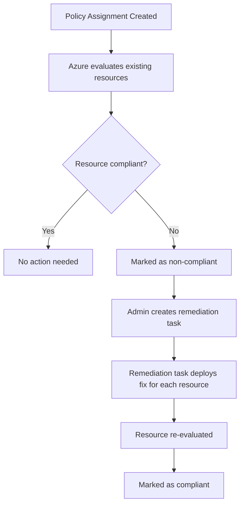

# How to Create Azure Policy Remediation Tasks to Fix Non-Compliant Resources Automatically

Author: [nawazdhandala](https://www.github.com/nawazdhandala)

Tags: Azure Policy, Remediation, Compliance, Governance, Cloud Security, Infrastructure as Code, Azure

Description: Learn how to create and manage Azure Policy remediation tasks that automatically fix non-compliant resources using DeployIfNotExists and Modify effects.

---

Azure Policy is excellent at flagging resources that do not comply with your organization's standards. But flagging is only half the battle. The real power comes when you combine policy evaluation with automated remediation, where Azure not only tells you something is wrong but fixes it for you.

Remediation tasks are the mechanism that makes this happen. They work with policies that use the `DeployIfNotExists` or `Modify` effect to bring existing non-compliant resources back into compliance without any manual intervention.

In this guide, I will cover how remediation tasks work, how to create them through the portal and CLI, and how to troubleshoot the issues you are most likely to run into.

## How Remediation Works Under the Hood

When you assign a policy with a `DeployIfNotExists` or `Modify` effect, Azure Policy evaluates existing resources and marks non-compliant ones. However, it does not automatically fix them. This is by design - you might not want remediation to run immediately across hundreds of resources without review.

Instead, you create a remediation task that targets the non-compliant resources identified by a specific policy assignment. The remediation task then triggers a deployment (for `DeployIfNotExists`) or a direct modification (for `Modify`) on each non-compliant resource.



One important detail: policies with `DeployIfNotExists` already handle new resources automatically. When a new resource is created that triggers the policy, Azure will deploy the required configuration within about 15 minutes. Remediation tasks are specifically for fixing resources that already existed before the policy was assigned.

## Prerequisites

To create remediation tasks, you need:

- **Owner** or **Resource Policy Contributor** role on the scope where the policy is assigned
- A policy assignment that uses `DeployIfNotExists` or `Modify` effect
- The policy assignment must have a managed identity (created automatically when using these effects)

## Step 1: Verify the Policy Assignment Has a Managed Identity

Remediation tasks use a managed identity to authenticate when making changes to resources. If your policy assignment does not have one, remediation will fail.

Check the assignment through the CLI.

```bash
# List policy assignments and check for managed identity
az policy assignment show \
  --name "require-diagnostics-settings" \
  --scope "/subscriptions/YOUR_SUBSCRIPTION_ID" \
  --query '{name: name, identity: identity}'
```

If the identity block is null, you need to update the assignment to include one.

```bash
# Update the policy assignment to include a system-assigned managed identity
az policy assignment identity assign \
  --name "require-diagnostics-settings" \
  --scope "/subscriptions/YOUR_SUBSCRIPTION_ID" \
  --system-assigned \
  --identity-scope "/subscriptions/YOUR_SUBSCRIPTION_ID" \
  --role "Contributor"
```

The `--role` parameter grants the managed identity the permissions it needs to make changes. Use the least-privilege role that the remediation requires. For most `DeployIfNotExists` policies, `Contributor` works, but some only need a specific role like `Monitoring Contributor`.

## Step 2: View Non-Compliant Resources

Before creating a remediation task, check how many resources need fixing.

```bash
# List non-compliant resources for a specific policy assignment
az policy state list \
  --filter "policyAssignmentName eq 'require-diagnostics-settings' and complianceState eq 'NonCompliant'" \
  --query '[].{resource: resourceId, compliance: complianceState}' \
  --output table
```

This gives you a clear picture of the scope of remediation. If there are thousands of non-compliant resources, you might want to remediate in batches by targeting specific resource groups.

## Step 3: Create a Remediation Task via Azure CLI

Here is how to create a remediation task using the CLI.

```bash
# Create a remediation task for a policy assignment at the subscription level
az policy remediation create \
  --name "fix-diagnostics-$(date +%Y%m%d)" \
  --policy-assignment "require-diagnostics-settings" \
  --resource-group "" \
  --definition-reference-id "" \
  --resource-discovery-mode ReEvaluateCompliance
```

The `--resource-discovery-mode` flag is important. It has two options:

- `ExistingNonCompliant` - only remediates resources that are already marked as non-compliant in the latest evaluation
- `ReEvaluateCompliance` - re-evaluates all resources before deciding which ones to remediate, catching any that might have drifted since the last evaluation

I recommend `ReEvaluateCompliance` for most cases because it ensures you are working with fresh data.

## Step 4: Create a Remediation Task via the Portal

If you prefer the portal:

1. Navigate to **Azure Policy** > **Compliance**
2. Click on the policy assignment that has non-compliant resources
3. Click the **Create Remediation Task** button at the top
4. Review the settings:
   - The policy assignment is pre-selected
   - Choose the scope (subscription, resource group, or specific resource)
   - Select whether to re-evaluate compliance before remediating
5. Click **Remediate**

The portal also shows a real-time progress bar as resources are remediated.

## Step 5: Monitor Remediation Progress

Remediation tasks are asynchronous. You can check their status with the following command.

```bash
# Check the status of a specific remediation task
az policy remediation show \
  --name "fix-diagnostics-20260216" \
  --query '{status: provisioningState, summary: deploymentStatus}' \
  --output json
```

The output includes a deployment summary showing how many resources were successfully remediated, how many failed, and how many are still in progress.

```bash
# List all remediation tasks and their statuses
az policy remediation list \
  --query '[].{name: name, status: provisioningState, succeeded: deploymentStatus.totalDeployments}' \
  --output table
```

## Handling Failed Remediations

Not every remediation succeeds on the first try. Common failure reasons include:

**Insufficient permissions**: The managed identity does not have the right role to make the required changes. Check the activity log for authorization errors.

```bash
# View failed deployment details for a remediation task
az policy remediation deployment list \
  --name "fix-diagnostics-20260216" \
  --query '[?status==`Failed`].{resource: remediatedResourceId, error: error}' \
  --output json
```

**Resource locks**: If a resource has a delete or read-only lock, the remediation deployment may fail. You will need to temporarily remove the lock or exclude the resource from remediation.

**Template errors**: For `DeployIfNotExists` policies, the remediation runs an ARM template. If the template has errors or references parameters that are not available, the deployment will fail. Check the deployment details in the resource group's deployment history.

## Automating Remediation on a Schedule

For ongoing compliance, you probably do not want to manually create remediation tasks every time new non-compliant resources appear. Here are two approaches to automate this.

**Approach 1: Azure Automation Runbook**

Create a runbook that runs on a schedule and creates remediation tasks for all non-compliant policy assignments.

```powershell
# PowerShell runbook to auto-remediate non-compliant policy assignments
$subscriptionId = "YOUR_SUBSCRIPTION_ID"
Set-AzContext -SubscriptionId $subscriptionId

# Get all policy assignments with DeployIfNotExists or Modify effect
$assignments = Get-AzPolicyAssignment

foreach ($assignment in $assignments) {
    # Check if there are non-compliant resources
    $states = Get-AzPolicyState -PolicyAssignmentName $assignment.Name `
        -Filter "complianceState eq 'NonCompliant'" -Top 1

    if ($states.Count -gt 0) {
        $taskName = "auto-remediate-$($assignment.Name)-$(Get-Date -Format 'yyyyMMdd-HHmm')"

        # Create a remediation task for each non-compliant assignment
        Start-AzPolicyRemediation `
            -Name $taskName `
            -PolicyAssignmentId $assignment.PolicyAssignmentId `
            -ResourceDiscoveryMode ReEvaluateCompliance

        Write-Output "Created remediation task: $taskName"
    }
}
```

**Approach 2: Event-driven with Azure Event Grid**

You can subscribe to policy state change events through Event Grid and trigger a Logic App or Function that creates remediation tasks automatically when non-compliance is detected.

## Scoping Remediation Tasks

You do not always want to remediate everything at once. Azure Policy remediation supports scoping at several levels.

```bash
# Remediate only resources in a specific resource group
az policy remediation create \
  --name "fix-rg-diagnostics" \
  --policy-assignment "require-diagnostics-settings" \
  --resource-group "production-rg" \
  --resource-discovery-mode ReEvaluateCompliance

# Remediate a single specific resource
az policy remediation create \
  --name "fix-single-vm" \
  --policy-assignment "require-diagnostics-settings" \
  --namespace "Microsoft.Compute" \
  --resource-type "virtualMachines" \
  --resource "my-production-vm" \
  --resource-group "production-rg"
```

Starting with a single resource group is a good practice when you are testing a new policy. Once you confirm that the remediation produces the expected result, expand to the full subscription.

## Best Practices

1. **Test with a small scope first**. Create the remediation task targeting a single resource group or even a single resource before rolling it out to the full subscription.

2. **Use re-evaluate mode**. The `ReEvaluateCompliance` discovery mode costs a bit more time but ensures you are remediating based on current state, not stale evaluation data.

3. **Monitor managed identity permissions**. If you change the policy definition or the required remediation changes, the managed identity might need additional role assignments.

4. **Set up alerts for failed remediations**. Use Azure Monitor to create alerts when remediation task deployments fail, so you can investigate quickly.

5. **Keep remediation task names meaningful**. Include the date and policy name so you can track them over time. Old remediation tasks are kept in history and a good naming convention makes auditing easier.

## Wrapping Up

Azure Policy remediation tasks close the gap between detecting non-compliance and actually fixing it. By combining `DeployIfNotExists` or `Modify` policies with scheduled or on-demand remediation tasks, you can maintain continuous compliance across your Azure environment with minimal manual effort. Start with a single policy, verify the remediation works as expected, and then expand your automation to cover your full governance requirements.
