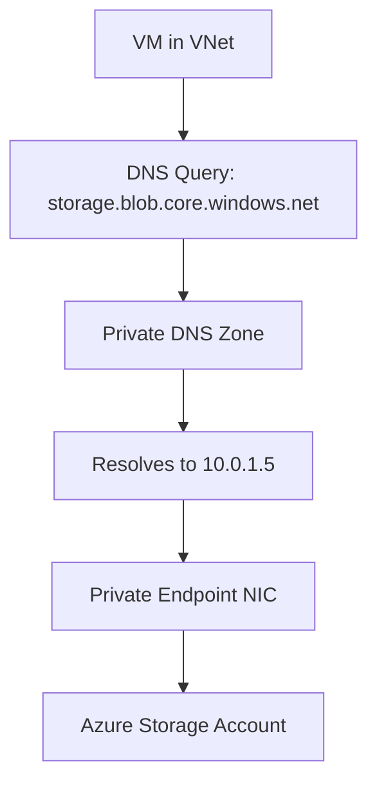

# How to Create Azure Private Endpoints for PaaS Services with Terraform

Author: [nawazdhandala](https://www.github.com/nawazdhandala)

Tags: Terraform, Azure, Private Endpoints, Networking, Security, IaC, PaaS

Description: Learn how to create Azure Private Endpoints for PaaS services like Storage, SQL, and Key Vault using Terraform for secure network access.

---

Azure PaaS services like Storage Accounts, SQL Databases, and Key Vaults are publicly accessible by default. They have public endpoints that anyone on the internet can reach. Even with firewalls and access keys, that public surface area makes security teams nervous. Private Endpoints solve this by giving PaaS services a private IP address inside your VNet, so traffic never leaves the Microsoft backbone network.

Setting up Private Endpoints involves a few resources: the endpoint itself, the private DNS zone, the DNS zone link to your VNet, and optionally disabling public access on the target service. This post shows you how to wire all of that up with Terraform in a way that scales across multiple services.

## How Private Endpoints Work

When you create a Private Endpoint for a PaaS service, Azure provisions a network interface in your subnet with a private IP. Traffic to the service's FQDN (like `mystorageaccount.blob.core.windows.net`) gets resolved to that private IP instead of the public one, thanks to a Private DNS Zone.

The flow looks like this:



Without Private DNS Zones, clients inside your VNet would still resolve the public IP and traffic would route through the internet. The DNS piece is just as important as the endpoint itself.

## Setting Up the Foundation

First, let us define the VNet and subnet that will host our Private Endpoints. Private Endpoints need a dedicated subnet, and that subnet must have the `privateEndpointNetworkPolicies` setting configured.

```hcl
# Resource group for all our resources
resource "azurerm_resource_group" "main" {
  name     = "rg-private-endpoints-demo"
  location = "eastus"
}

# Virtual network with a subnet for private endpoints
resource "azurerm_virtual_network" "main" {
  name                = "vnet-main"
  address_space       = ["10.0.0.0/16"]
  location            = azurerm_resource_group.main.location
  resource_group_name = azurerm_resource_group.main.name
}

# Subnet dedicated to private endpoints
resource "azurerm_subnet" "private_endpoints" {
  name                              = "snet-private-endpoints"
  resource_group_name               = azurerm_resource_group.main.name
  virtual_network_name              = azurerm_virtual_network.main.name
  address_prefixes                  = ["10.0.1.0/24"]
  private_endpoint_network_policies = "Enabled"
}
```

## Private Endpoint for Azure Storage

Let us start with a Storage Account. We will create the account, disable public access, set up the Private Endpoint, and configure DNS.

```hcl
# Storage account with public access disabled
resource "azurerm_storage_account" "main" {
  name                          = "stprivatedemo001"
  resource_group_name           = azurerm_resource_group.main.name
  location                      = azurerm_resource_group.main.location
  account_tier                  = "Standard"
  account_replication_type      = "LRS"
  public_network_access_enabled = false
}

# Private DNS zone for blob storage
resource "azurerm_private_dns_zone" "blob" {
  name                = "privatelink.blob.core.windows.net"
  resource_group_name = azurerm_resource_group.main.name
}

# Link the DNS zone to our VNet so VMs can resolve the private names
resource "azurerm_private_dns_zone_virtual_network_link" "blob" {
  name                  = "link-blob-vnet"
  resource_group_name   = azurerm_resource_group.main.name
  private_dns_zone_name = azurerm_private_dns_zone.blob.name
  virtual_network_id    = azurerm_virtual_network.main.id
  registration_enabled  = false
}

# The private endpoint for blob storage
resource "azurerm_private_endpoint" "storage_blob" {
  name                = "pe-storage-blob"
  location            = azurerm_resource_group.main.location
  resource_group_name = azurerm_resource_group.main.name
  subnet_id           = azurerm_subnet.private_endpoints.id

  # Connect to the storage account's blob sub-resource
  private_service_connection {
    name                           = "psc-storage-blob"
    private_connection_resource_id = azurerm_storage_account.main.id
    is_manual_connection           = false
    subresource_names              = ["blob"]
  }

  # Automatically create DNS records in our private zone
  private_dns_zone_group {
    name                 = "default"
    private_dns_zone_ids = [azurerm_private_dns_zone.blob.id]
  }
}
```

The `subresource_names` field is important. Storage accounts have multiple sub-resources: `blob`, `file`, `queue`, `table`, `web`, and `dfs`. Each needs its own Private Endpoint if you want private access to that specific service.

## Private Endpoint for Azure SQL Database

SQL Database follows the same pattern, but with a different DNS zone and sub-resource name.

```hcl
# SQL Server
resource "azurerm_mssql_server" "main" {
  name                          = "sql-private-demo"
  resource_group_name           = azurerm_resource_group.main.name
  location                      = azurerm_resource_group.main.location
  version                       = "12.0"
  administrator_login           = "sqladmin"
  administrator_login_password  = var.sql_admin_password
  public_network_access_enabled = false
}

# Private DNS zone for SQL
resource "azurerm_private_dns_zone" "sql" {
  name                = "privatelink.database.windows.net"
  resource_group_name = azurerm_resource_group.main.name
}

resource "azurerm_private_dns_zone_virtual_network_link" "sql" {
  name                  = "link-sql-vnet"
  resource_group_name   = azurerm_resource_group.main.name
  private_dns_zone_name = azurerm_private_dns_zone.sql.name
  virtual_network_id    = azurerm_virtual_network.main.id
  registration_enabled  = false
}

# Private endpoint for SQL Server
resource "azurerm_private_endpoint" "sql" {
  name                = "pe-sql"
  location            = azurerm_resource_group.main.location
  resource_group_name = azurerm_resource_group.main.name
  subnet_id           = azurerm_subnet.private_endpoints.id

  private_service_connection {
    name                           = "psc-sql"
    private_connection_resource_id = azurerm_mssql_server.main.id
    is_manual_connection           = false
    subresource_names              = ["sqlServer"]
  }

  private_dns_zone_group {
    name                 = "default"
    private_dns_zone_ids = [azurerm_private_dns_zone.sql.id]
  }
}
```

## Private Endpoint for Key Vault

Key Vault is another common target. The DNS zone is `privatelink.vaultcore.azure.net` and the sub-resource is `vault`.

```hcl
data "azurerm_client_config" "current" {}

# Key Vault with public access disabled
resource "azurerm_key_vault" "main" {
  name                          = "kv-private-demo"
  location                      = azurerm_resource_group.main.location
  resource_group_name           = azurerm_resource_group.main.name
  tenant_id                     = data.azurerm_client_config.current.tenant_id
  sku_name                      = "standard"
  public_network_access_enabled = false
  purge_protection_enabled      = true
}

# Private DNS zone for Key Vault
resource "azurerm_private_dns_zone" "vault" {
  name                = "privatelink.vaultcore.azure.net"
  resource_group_name = azurerm_resource_group.main.name
}

resource "azurerm_private_dns_zone_virtual_network_link" "vault" {
  name                  = "link-vault-vnet"
  resource_group_name   = azurerm_resource_group.main.name
  private_dns_zone_name = azurerm_private_dns_zone.vault.name
  virtual_network_id    = azurerm_virtual_network.main.id
  registration_enabled  = false
}

resource "azurerm_private_endpoint" "vault" {
  name                = "pe-vault"
  location            = azurerm_resource_group.main.location
  resource_group_name = azurerm_resource_group.main.name
  subnet_id           = azurerm_subnet.private_endpoints.id

  private_service_connection {
    name                           = "psc-vault"
    private_connection_resource_id = azurerm_key_vault.main.id
    is_manual_connection           = false
    subresource_names              = ["vault"]
  }

  private_dns_zone_group {
    name                 = "default"
    private_dns_zone_ids = [azurerm_private_dns_zone.vault.id]
  }
}
```

## Making It Reusable with a Module

If you are setting up Private Endpoints for many services, a reusable module saves you from repeating the same pattern. Here is a module that handles the endpoint, DNS zone, and VNet link.

```hcl
# modules/private-endpoint/variables.tf
variable "name" {
  description = "Name of the private endpoint"
  type        = string
}

variable "location" {
  type = string
}

variable "resource_group_name" {
  type = string
}

variable "subnet_id" {
  type = string
}

variable "private_connection_resource_id" {
  type = string
}

variable "subresource_names" {
  type = list(string)
}

variable "private_dns_zone_name" {
  type = string
}

variable "virtual_network_id" {
  type = string
}
```

```hcl
# modules/private-endpoint/main.tf
resource "azurerm_private_dns_zone" "this" {
  name                = var.private_dns_zone_name
  resource_group_name = var.resource_group_name
}

resource "azurerm_private_dns_zone_virtual_network_link" "this" {
  name                  = "link-${var.name}"
  resource_group_name   = var.resource_group_name
  private_dns_zone_name = azurerm_private_dns_zone.this.name
  virtual_network_id    = var.virtual_network_id
  registration_enabled  = false
}

resource "azurerm_private_endpoint" "this" {
  name                = var.name
  location            = var.location
  resource_group_name = var.resource_group_name
  subnet_id           = var.subnet_id

  private_service_connection {
    name                           = "psc-${var.name}"
    private_connection_resource_id = var.private_connection_resource_id
    is_manual_connection           = false
    subresource_names              = var.subresource_names
  }

  private_dns_zone_group {
    name                 = "default"
    private_dns_zone_ids = [azurerm_private_dns_zone.this.id]
  }
}
```

Now you can call this module for each service with just a few lines.

## Troubleshooting Tips

If DNS resolution is not working after creating Private Endpoints, check these things. First, verify the Private DNS Zone is linked to the correct VNet. Second, make sure the VNet link has `registration_enabled` set to `false` (auto-registration is for VM DNS records, not Private Endpoints). Third, check that the DNS zone name matches exactly what Azure expects for that service type.

If you can reach the service from a VM in the VNet but not from on-premises, you need to configure your on-premises DNS to forward queries for the `privatelink.*` zones to a DNS forwarder in Azure, or use Azure Private DNS Resolver.

## Conclusion

Private Endpoints are table stakes for secure Azure deployments. With the Terraform patterns shown here, you can systematically lock down your PaaS services so they are only accessible through your private network. The module approach keeps your code DRY as you roll this out across storage accounts, databases, Key Vaults, and any other service that supports Private Link.
