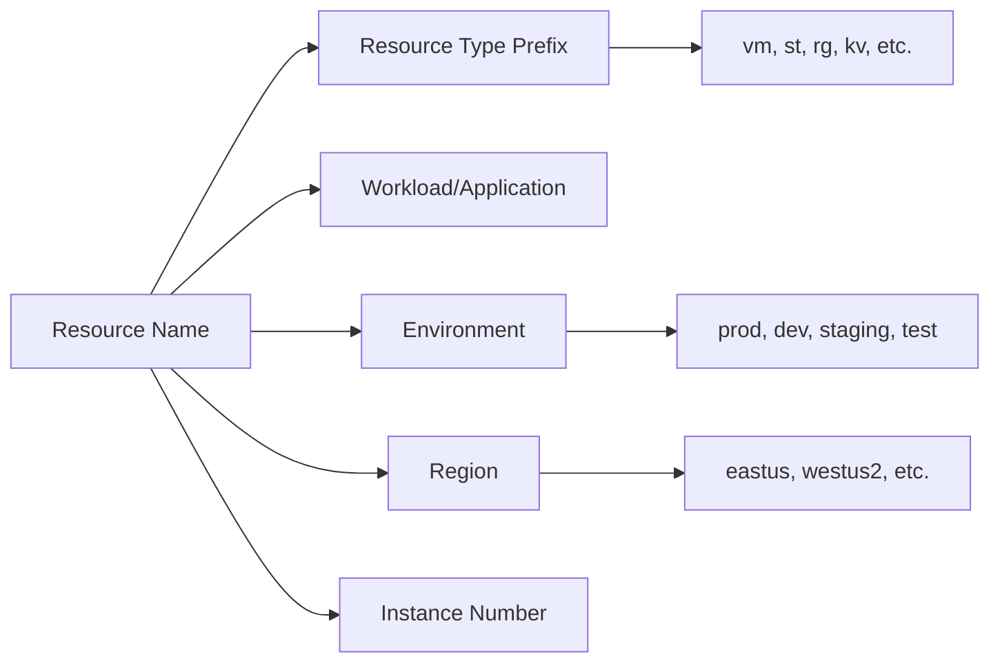

# How to Create Custom Azure Policy Definitions to Enforce Naming Conventions on Resources

Author: [nawazdhandala](https://www.github.com/nawazdhandala)

Tags: Azure, Azure Policy, Naming Conventions, Governance, Infrastructure as Code, Compliance, Resource Management

Description: Step-by-step instructions for creating custom Azure Policy definitions that enforce consistent naming conventions across your Azure resources.

---

Naming conventions in Azure might seem like a minor concern until you are staring at a resource group full of resources like "vm1," "storageacct," and "test-app" with no idea which team owns them or what environment they belong to. Consistent naming makes resources discoverable, reduces operational confusion, and helps with cost allocation. Azure Policy lets you enforce naming conventions automatically, so resources that do not follow the pattern are either denied at creation time or flagged for remediation.

In this post, I will show you how to build custom Azure Policy definitions that enforce naming patterns tailored to your organization.

## Why Azure Policy for Naming Conventions

You could document naming conventions in a wiki and hope everyone follows them. In practice, that never works. Azure Policy enforces conventions at the platform level, which means:

- Resources that violate the policy cannot be created (in Deny mode)
- Non-compliant existing resources are flagged for remediation (in Audit mode)
- The enforcement is consistent regardless of whether resources are created through the portal, CLI, PowerShell, Terraform, or ARM templates

## Common Naming Convention Patterns

Before writing policies, define your naming convention. A common pattern for Azure resources is:

```
{resource-type}-{workload}-{environment}-{region}-{instance}
```

For example:
- vm-webapp-prod-eastus-001 (a production VM for the web app)
- st-datalake-dev-westus2-001 (a development storage account for the data lake)
- rg-networking-prod-eastus (a resource group for production networking)



## Prerequisites

You need:

- Azure subscription
- Owner or Policy Contributor role
- Understanding of Azure Policy definition structure and JSON
- A defined naming convention for your organization

## Step 1: Create a Simple Naming Convention Policy

Let us start with a policy that requires all resource groups to follow a naming pattern. Resource groups must start with "rg-" followed by a workload name, a hyphen, and an environment label.

Here is the policy definition in JSON:

```json
{
    "mode": "All",
    "policyRule": {
        "if": {
            "allOf": [
                {
                    "field": "type",
                    "equals": "Microsoft.Resources/subscriptions/resourceGroups"
                },
                {
                    "not": {
                        "field": "name",
                        "match": "rg-??*-??*"
                    }
                }
            ]
        },
        "then": {
            "effect": "deny"
        }
    },
    "parameters": {}
}
```

The `match` condition uses a pattern where `?` matches any single character and `*` matches zero or more characters. So `rg-??*-??*` requires the name to start with "rg-" followed by at least two characters, a hyphen, and at least two more characters.

## Step 2: Create a More Flexible Policy with Parameters

Hard-coding patterns into the policy is limiting. A better approach uses parameters so the same policy can be reused with different patterns:

```json
{
    "mode": "All",
    "parameters": {
        "namePattern": {
            "type": "String",
            "metadata": {
                "displayName": "Required Name Pattern",
                "description": "The naming pattern that resources must match. Use # for digits, ? for letters, and * for wildcards."
            }
        },
        "resourceType": {
            "type": "String",
            "metadata": {
                "displayName": "Resource Type",
                "description": "The full resource type to apply the naming policy to (e.g., Microsoft.Compute/virtualMachines)."
            }
        },
        "effect": {
            "type": "String",
            "metadata": {
                "displayName": "Policy Effect",
                "description": "The effect of the policy - Audit or Deny."
            },
            "allowedValues": [
                "Audit",
                "Deny"
            ],
            "defaultValue": "Audit"
        }
    },
    "policyRule": {
        "if": {
            "allOf": [
                {
                    "field": "type",
                    "equals": "[parameters('resourceType')]"
                },
                {
                    "not": {
                        "field": "name",
                        "match": "[parameters('namePattern')]"
                    }
                }
            ]
        },
        "then": {
            "effect": "[parameters('effect')]"
        }
    }
}
```

This single policy definition can be assigned multiple times with different parameters for different resource types.

## Step 3: Deploy the Policy Using PowerShell

Save the policy definition JSON to a file and deploy it:

```powershell
# Define the custom policy at the subscription level
# The policy enforces naming conventions with configurable patterns
$definition = New-AzPolicyDefinition `
    -Name "enforce-naming-convention" `
    -DisplayName "Enforce Resource Naming Convention" `
    -Description "Ensures resources follow the organization naming convention pattern." `
    -Policy "naming-policy.json" `
    -Mode "All"

Write-Host "Policy definition created: $($definition.Name)"

# Assign the policy to enforce VM naming
# VMs must start with "vm-" followed by workload and environment
$vmAssignment = New-AzPolicyAssignment `
    -Name "enforce-vm-naming" `
    -DisplayName "Enforce VM Naming Convention" `
    -PolicyDefinition $definition `
    -Scope "/subscriptions/YOUR_SUBSCRIPTION_ID" `
    -PolicyParameterObject @{
        namePattern = "vm-??*-??*"
        resourceType = "Microsoft.Compute/virtualMachines"
        effect = "Deny"
    }

Write-Host "VM naming policy assigned."

# Assign the same policy for storage accounts
# Storage accounts must start with "st" (no hyphens allowed in storage names)
$storageAssignment = New-AzPolicyAssignment `
    -Name "enforce-storage-naming" `
    -DisplayName "Enforce Storage Account Naming Convention" `
    -PolicyDefinition $definition `
    -Scope "/subscriptions/YOUR_SUBSCRIPTION_ID" `
    -PolicyParameterObject @{
        namePattern = "st??*??*"
        resourceType = "Microsoft.Storage/storageAccounts"
        effect = "Deny"
    }

Write-Host "Storage account naming policy assigned."
```

## Step 4: Handle Resource-Specific Naming Constraints

Different Azure resources have different naming constraints. Storage accounts, for example, can only contain lowercase letters and numbers (no hyphens). Key vaults have a maximum length of 24 characters. Your naming convention needs to account for these differences.

Here is a table of common constraints:

| Resource Type | Max Length | Allowed Characters |
|---|---|---|
| Resource Group | 90 | Alphanumeric, hyphens, underscores, periods |
| Virtual Machine | 64 (Linux), 15 (Windows) | Alphanumeric, hyphens |
| Storage Account | 24 | Lowercase letters and numbers only |
| Key Vault | 24 | Alphanumeric, hyphens |
| SQL Server | 63 | Lowercase letters, numbers, hyphens |

For storage accounts, you might use a compressed naming convention like `st{workload}{env}{instance}` without hyphens:

```json
{
    "mode": "All",
    "policyRule": {
        "if": {
            "allOf": [
                {
                    "field": "type",
                    "equals": "Microsoft.Storage/storageAccounts"
                },
                {
                    "not": {
                        "field": "name",
                        "match": "st??*"
                    }
                }
            ]
        },
        "then": {
            "effect": "deny"
        }
    }
}
```

## Step 5: Create a Policy with Regular Expression-Like Matching

The `match` condition is limited. For more complex patterns, you can use the `like` condition, which supports wildcards:

```json
{
    "mode": "All",
    "policyRule": {
        "if": {
            "allOf": [
                {
                    "field": "type",
                    "equals": "Microsoft.Compute/virtualMachines"
                },
                {
                    "not": {
                        "anyOf": [
                            {
                                "field": "name",
                                "like": "vm-*-prod-*"
                            },
                            {
                                "field": "name",
                                "like": "vm-*-dev-*"
                            },
                            {
                                "field": "name",
                                "like": "vm-*-staging-*"
                            },
                            {
                                "field": "name",
                                "like": "vm-*-test-*"
                            }
                        ]
                    }
                }
            ]
        },
        "then": {
            "effect": "deny"
        }
    }
}
```

This policy requires VM names to contain one of the recognized environment identifiers (prod, dev, staging, test).

## Step 6: Apply the Policy in Audit Mode First

I always recommend deploying naming convention policies in Audit mode before switching to Deny:

1. Assign the policy with `effect` set to `Audit`.
2. Wait 24 to 48 hours for the compliance scan to complete.
3. Review the compliance results in the Azure portal under Policy, then Compliance.
4. Identify existing resources that do not comply and decide whether to rename them or exempt them.
5. Once you are comfortable with the results, change the effect to `Deny`.

```powershell
# Check compliance status for a policy assignment
# This shows which resources are non-compliant
$compliance = Get-AzPolicyState `
    -PolicyAssignmentName "enforce-vm-naming" `
    -Filter "ComplianceState eq 'NonCompliant'"

foreach ($state in $compliance) {
    Write-Host "Non-compliant: $($state.ResourceId) - $($state.ResourceType)"
}

Write-Host "Total non-compliant resources: $($compliance.Count)"
```

## Step 7: Create Exemptions for Existing Resources

Resources created before the policy was applied will show as non-compliant. If renaming them is not practical, create exemptions:

```powershell
# Create a policy exemption for a specific resource group with legacy names
New-AzPolicyExemption `
    -Name "legacy-vm-naming-exemption" `
    -PolicyAssignment (Get-AzPolicyAssignment -Name "enforce-vm-naming") `
    -Scope "/subscriptions/SUB_ID/resourceGroups/legacy-resources" `
    -ExemptionCategory "Waiver" `
    -Description "Legacy resource group created before naming policy. Will be migrated by Q3 2026." `
    -ExpiresOn (Get-Date).AddMonths(6)
```

Always set an expiration date on exemptions so they do not become permanent exceptions.

## Step 8: Combine into a Policy Initiative

If you have multiple naming policies (one per resource type), group them into an initiative (policy set) for easier management:

```powershell
# Create a policy initiative that groups all naming convention policies
$policySets = @(
    @{
        policyDefinitionId = "/subscriptions/SUB_ID/providers/Microsoft.Authorization/policyDefinitions/enforce-vm-naming-def"
        parameters = @{
            namePattern = @{ value = "vm-??*-??*" }
            effect = @{ value = "Deny" }
        }
    },
    @{
        policyDefinitionId = "/subscriptions/SUB_ID/providers/Microsoft.Authorization/policyDefinitions/enforce-storage-naming-def"
        parameters = @{
            namePattern = @{ value = "st??*" }
            effect = @{ value = "Deny" }
        }
    }
)

# Create the initiative definition
$initiative = New-AzPolicySetDefinition `
    -Name "naming-conventions-initiative" `
    -DisplayName "Organization Naming Conventions" `
    -Description "Enforces naming conventions across all resource types." `
    -PolicyDefinition ($policySets | ConvertTo-Json -Depth 10)

Write-Host "Policy initiative created."
```

## Conclusion

Custom Azure Policy definitions for naming conventions give you automated enforcement that no amount of documentation can match. Start by defining a clear naming convention that accounts for resource-specific constraints, build parameterized policies for reusability, deploy in Audit mode first, and graduate to Deny once you are confident in the patterns. Group your policies into initiatives for manageable governance, and always plan for exemptions to handle legacy resources gracefully. With these policies in place, your Azure environment stays organized and discoverable as it scales.
