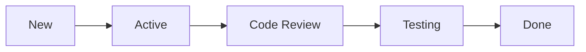

# How to Create Custom Dashboard Widgets in Azure Boards for Team Metrics

Author: [nawazdhandala](https://www.github.com/nawazdhandala)

Tags: Azure Boards, Dashboards, Team Metrics, Azure DevOps, Agile, Sprint Metrics, Project Management

Description: Build custom dashboard widgets in Azure Boards to visualize team metrics, sprint progress, and project health at a glance.

---

Every team standup and sprint review involves someone pulling up Azure DevOps and navigating through multiple pages to answer basic questions. How many bugs are open? What is our sprint velocity? Who is overloaded? Dashboards solve this by putting all of those answers on a single page.

Azure Boards comes with built-in widgets, but the real power is in customizing them to show exactly what your team needs. In this post, I will walk through creating dashboards with widgets that answer the most common team questions, plus some techniques for building truly custom visualizations.

## Creating a Team Dashboard

Navigate to **Overview > Dashboards** in your Azure DevOps project. Click **+ Add a dashboard**. Give it a name like "Sprint Dashboard" or "Team Health."

You can create multiple dashboards for different purposes:

- **Sprint Dashboard**: Daily standup and sprint tracking
- **Release Dashboard**: Deployment status and release readiness
- **Quality Dashboard**: Bug trends, test pass rates, code coverage
- **Management Dashboard**: Cross-team velocity and capacity

## Essential Widgets for Sprint Tracking

### Burndown Chart

The burndown chart is the most important sprint widget. It shows how much work remains versus the ideal trend line.

Add the **Sprint Burndown** widget:

1. Click **Edit** on your dashboard
2. Click **+ Add widget**
3. Search for "Sprint Burndown"
4. Configure it to track by Story Points (or whatever your team uses for estimation)
5. Set the team and iteration

The chart automatically updates as work items are completed, giving you a real-time view of whether you are on track to finish the sprint.

### Velocity Chart

The velocity widget shows how many story points your team completed in each of the last several sprints. This is crucial for sprint planning because it tells you how much work to commit to.

Add the **Velocity** widget and configure:

- Team: Your team
- Number of iterations: 6-8 sprints gives a good trend

A healthy velocity chart shows a relatively stable line. Large swings indicate unpredictable capacity, which might mean the team is not estimating well or has too many interruptions.

### Cumulative Flow Diagram

The CFD shows how work items flow through your board columns over time. It is one of the best tools for spotting bottlenecks.



If the "Code Review" band keeps growing while "Testing" stays thin, you have a review bottleneck. The visual makes these problems obvious in a way that numbers alone cannot.

Add the **Cumulative Flow Diagram** widget and configure it for your team's backlog level (usually "Stories" or "Requirements").

## Query-Based Widgets

The most flexible widgets are built on work item queries. Any saved query can become a chart on your dashboard.

### Bug Trend Chart

First, create a query that finds all bugs created in the current sprint.

```
Work Item Type = Bug
AND Created Date >= @StartOfIteration
```

Save this query as "Sprint Bugs - Created" in Shared Queries. Then:

1. On your dashboard, add the **Chart for Work Items** widget
2. Select your saved query
3. Choose "Stacked Area" chart type
4. Group by "Created Date" (by day)
5. Stack by "Priority"

This gives you a chart showing how many bugs are being found each day, broken down by priority.

### Work Distribution by Assignee

Create a query for active sprint work.

```
Iteration Path = @CurrentIteration
AND State NOT IN (Done, Closed, Removed)
AND Work Item Type IN (User Story, Bug, Task)
```

Add a **Chart for Work Items** widget:
- Chart type: Bar
- Group by: Assigned To
- Aggregation: Sum of Story Points

This instantly shows if work is evenly distributed or if someone is overloaded.

### Aging Work Items

Items that have been "In Progress" for too long are a red flag. Create a query:

```
State = Active
AND Changed Date < @Today - 7
AND Work Item Type IN (User Story, Bug)
```

Display this as a **Query Results** widget on the dashboard. It shows a table of items that have been active for more than a week without progress.

## Custom Query Tiles

Query tiles are simple count widgets that show how many items match a query. They are great for key numbers that should be visible at a glance.

Create tiles for:

- **Open Bugs**: Query for `Work Item Type = Bug AND State NOT IN (Done, Closed)` - shows total open bug count
- **Sprint Progress**: Query for `Iteration Path = @CurrentIteration AND State = Done` - shows how many items are done
- **Blocked Items**: Query for items tagged "blocked" - anything above 0 needs attention
- **Unestimated Stories**: Query for stories with 0 story points - these need grooming

Configure the tile color to change based on thresholds. For example, the open bugs tile could show green when under 10, yellow when 10-20, and red when above 20.

## Build and Release Widgets

Dashboards are not just for work items. You can add CI/CD widgets too.

### Build History

The **Build History** widget shows recent builds with their pass/fail status. Configure it to show your main CI pipeline. A streak of red builds demands immediate attention.

### Deployment Status

The **Deployment Status** widget shows the latest deployment to each environment. At a glance, you can see:

- What version is in production
- Whether the staging deployment succeeded
- When the last deployment happened

### Test Results Trend

If your pipeline publishes test results, the **Test Results Trend** widget shows pass rates over time. A declining trend indicates accumulating technical debt.

## Building a Dashboard Layout

A good dashboard has a clear information hierarchy. Here is a layout that works well for sprint dashboards.

```
+----------------------------------+----------------------------------+
|         Sprint Burndown          |        Velocity (6 sprints)      |
|         (large widget)           |        (large widget)            |
+----------------------------------+----------------------------------+
| Open Bugs | Blocked | Unassigned |    Cumulative Flow Diagram       |
|   (tile)  | (tile)  |   (tile)   |    (medium widget)               |
+----------------------------------+----------------------------------+
|    Work by Assignee (bar chart)  |    Build History                 |
|    (medium widget)               |    (medium widget)               |
+----------------------------------+----------------------------------+
|    Aging Items (query results)   |    Bug Trend (area chart)        |
|    (medium widget)               |    (medium widget)               |
+----------------------------------+----------------------------------+
```

## Using the REST API for Custom Metrics

For metrics that the built-in widgets cannot provide, you can use the Azure DevOps REST API to build custom widgets or feed data to external dashboards.

The following script calculates cycle time for completed items.

```bash
#!/bin/bash
# calculate-cycle-time.sh - Fetch completed items and calculate average cycle time

# Set your organization and project
ORG="myorg"
PROJECT="myproject"
PAT="your-pat-token"

# Query for items completed in the current sprint
QUERY='{"query": "SELECT [System.Id], [System.Title], [Microsoft.VSTS.Common.ActivatedDate], [Microsoft.VSTS.Common.ClosedDate] FROM WorkItems WHERE [System.IterationPath] = @CurrentIteration AND [System.State] = \"Closed\" AND [System.WorkItemType] = \"User Story\""}'

# Execute the query
RESULT=$(curl -s -u ":$PAT" \
  "https://dev.azure.com/$ORG/$PROJECT/_apis/wit/wiql?api-version=7.0" \
  -H "Content-Type: application/json" \
  -d "$QUERY")

# Extract work item IDs
IDS=$(echo $RESULT | jq -r '.workItems[].id' | tr '\n' ',' | sed 's/,$//')

# Fetch details for each item
if [ -n "$IDS" ]; then
  DETAILS=$(curl -s -u ":$PAT" \
    "https://dev.azure.com/$ORG/$PROJECT/_apis/wit/workitems?ids=$IDS&fields=System.Title,Microsoft.VSTS.Common.ActivatedDate,Microsoft.VSTS.Common.ClosedDate&api-version=7.0")

  echo "Completed Items and Cycle Times:"
  echo "$DETAILS" | jq -r '.value[] | "\(.fields."System.Title") - Activated: \(.fields."Microsoft.VSTS.Common.ActivatedDate") Closed: \(.fields."Microsoft.VSTS.Common.ClosedDate")"'
fi
```

## Widget Extensions from the Marketplace

The Azure DevOps Marketplace has dozens of free and paid dashboard widgets that extend the built-in options:

- **Team Calendar**: Shows team member availability, holidays, and sprint dates on a calendar
- **Work Item Details**: Displays a single work item's details on the dashboard (useful for tracking a critical issue)
- **DORA Metrics**: Calculates deployment frequency, lead time, change failure rate, and mean time to recovery
- **Custom Charts**: Allows more advanced chart types than the built-in options

To install marketplace widgets, go to the Marketplace (marketplace.visualstudio.com), find the extension, and install it for your organization.

## Dashboard Best Practices

**Keep it focused.** Each dashboard should serve one purpose. A dashboard that tries to show everything shows nothing effectively.

**Put the most important information at the top.** Eyes start at the top-left corner. Put your burndown chart and critical metrics there.

**Use color thresholds.** Green, yellow, and red make it easy to spot problems at a glance without reading numbers.

**Review and update regularly.** Every few sprints, ask your team: "Is this dashboard still useful? What is missing? What can we remove?" Dashboards that do not evolve become wallpaper that nobody looks at.

**Create role-specific dashboards.** Developers need different metrics than project managers. A developer dashboard might focus on build status and code review queue, while a management dashboard shows velocity and budget burn rate.

## Wrapping Up

Dashboards transform raw Azure DevOps data into actionable information. Start with the essential sprint widgets - burndown, velocity, and a few query tiles for open bugs and blocked items. Then add more widgets based on what questions your team keeps asking. A well-crafted dashboard should make your standup shorter and your sprint reviews more data-driven. The time you invest in setting one up pays for itself within the first few sprints.
