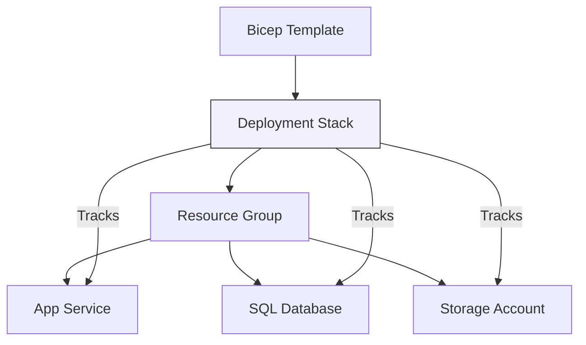

# How to Create Deployment Stacks in Azure Bicep to Manage Resource Lifecycle as a Unit

Author: [nawazdhandala](https://www.github.com/nawazdhandala)

Tags: Azure Bicep, Deployment Stacks, Infrastructure as Code, Azure Resource Manager, DevOps, Cloud Infrastructure

Description: Learn how to use Azure deployment stacks with Bicep to manage groups of resources as a single unit with lifecycle controls and deny settings.

---

One of the persistent challenges with Infrastructure as Code in Azure is managing the full lifecycle of resources. You can deploy resources easily enough with Bicep or ARM templates, but what happens when you remove a resource from your template? By default, nothing. The resource stays in Azure, orphaned and potentially costing you money. Deployment stacks solve this problem by treating a collection of resources as a managed unit, giving you control over what happens when resources are added, updated, or removed from your template.

## What Are Deployment Stacks?

A deployment stack is an Azure resource that manages a group of other resources. When you create or update a deployment stack, Azure keeps track of which resources belong to it. If you remove a resource from your Bicep template and redeploy the stack, Azure can automatically delete that resource, detach it from the stack, or leave it alone - depending on your configuration.

Think of it as a declarative state manager for your Azure resources.



## Why Deployment Stacks Matter

Before deployment stacks, if you managed infrastructure with Bicep and removed a resource definition from your template, the resource would remain in Azure after redeployment. You had two choices: manually delete it or use a complete deployment mode, which is risky because it deletes everything not in the template, including resources managed by other processes.

Deployment stacks give you a middle ground. They track exactly which resources they manage and let you define specific behavior for resources that are no longer in the template.

## Prerequisites

You need:

- Azure CLI version 2.61.0 or later (deployment stacks support was added relatively recently)
- A Bicep file defining your resources
- Appropriate permissions (Contributor or Owner at the scope where you are creating the stack)

Check your CLI version:

```bash
# Verify Azure CLI version supports deployment stacks
az version --output table
```

## Creating Your First Deployment Stack

Let me start with a simple Bicep template and then deploy it as a stack.

Here is a Bicep file that defines a storage account and an app service plan:

```bicep
// main.bicep - defines the resources managed by our deployment stack
param location string = resourceGroup().location
param environmentName string = 'dev'

// Storage account for application data
resource storageAccount 'Microsoft.Storage/storageAccounts@2023-01-01' = {
  name: 'st${uniqueString(resourceGroup().id)}${environmentName}'
  location: location
  sku: {
    name: 'Standard_LRS'
  }
  kind: 'StorageV2'
  properties: {
    minimumTlsVersion: 'TLS1_2'
    supportsHttpsTrafficOnly: true
  }
}

// App service plan for hosting web applications
resource appServicePlan 'Microsoft.Web/serverfarms@2023-01-01' = {
  name: 'asp-${environmentName}-001'
  location: location
  sku: {
    name: 'B1'
    tier: 'Basic'
  }
  properties: {
    reserved: true // Linux plan
  }
}

// Web app running on the app service plan
resource webApp 'Microsoft.Web/sites@2023-01-01' = {
  name: 'app-${environmentName}-${uniqueString(resourceGroup().id)}'
  location: location
  properties: {
    serverFarmId: appServicePlan.id
    httpsOnly: true
    siteConfig: {
      linuxFxVersion: 'NODE|20-lts'
      minTlsVersion: '1.2'
    }
  }
}

output storageAccountName string = storageAccount.name
output webAppName string = webApp.name
```

Now deploy it as a deployment stack:

```bash
# Create a deployment stack at the resource group level
az stack group create \
  --name "my-app-stack" \
  --resource-group "rg-myapp-dev" \
  --template-file "main.bicep" \
  --parameters environmentName=dev \
  --action-on-unmanage "deleteResources" \
  --deny-settings-mode "denyWriteAndDelete"
```

Let me break down the important flags:

- `--action-on-unmanage "deleteResources"` tells Azure to delete resources that are removed from the template on the next update. Other options are `detachAll` (keep the resources but stop tracking them) and `deleteAll` (delete resources and resource groups).
- `--deny-settings-mode "denyWriteAndDelete"` prevents anyone from modifying or deleting the managed resources outside of the stack. This is powerful for governance.

## Understanding Deny Settings

Deny settings are one of the most useful features of deployment stacks. They act as a lock on all resources managed by the stack, preventing out-of-band changes.

There are three modes:

- `none` - No restrictions. Anyone with permissions can modify the resources.
- `denyDelete` - Resources cannot be deleted outside the stack, but they can be modified.
- `denyWriteAndDelete` - Resources cannot be modified or deleted outside the stack.

You can also exclude specific principals from the deny settings, which is useful for break-glass scenarios:

```bash
# Create a stack with deny settings that exclude specific users
az stack group create \
  --name "my-app-stack" \
  --resource-group "rg-myapp-dev" \
  --template-file "main.bicep" \
  --parameters environmentName=dev \
  --action-on-unmanage "deleteResources" \
  --deny-settings-mode "denyWriteAndDelete" \
  --deny-settings-excluded-principals "user-object-id-1 user-object-id-2"
```

## Updating a Deployment Stack

When you need to add or remove resources, update the Bicep template and run the update command. Suppose we want to add a Redis cache and remove the storage account.

Update the Bicep file to remove the storage account and add Redis, then redeploy:

```bash
# Update the existing deployment stack with the modified template
az stack group create \
  --name "my-app-stack" \
  --resource-group "rg-myapp-dev" \
  --template-file "main.bicep" \
  --parameters environmentName=dev \
  --action-on-unmanage "deleteResources" \
  --deny-settings-mode "denyWriteAndDelete"
```

Because we set `--action-on-unmanage "deleteResources"`, Azure will delete the storage account that is no longer in the template. The new Redis cache will be created and tracked by the stack.

## Listing and Inspecting Stacks

You can view all stacks in a resource group and inspect their managed resources:

```bash
# List all deployment stacks in a resource group
az stack group list --resource-group "rg-myapp-dev" --output table

# Show details of a specific stack, including managed resources
az stack group show \
  --name "my-app-stack" \
  --resource-group "rg-myapp-dev" \
  --output json
```

The show command returns a list of all resources managed by the stack, their provisioning state, and whether deny settings are applied.

## Deployment Stacks at Different Scopes

Deployment stacks can be created at three scopes:

1. **Resource group scope** - manages resources within a single resource group
2. **Subscription scope** - can manage resource groups and their contents
3. **Management group scope** - can manage subscriptions and their resource groups

For subscription-level stacks:

```bash
# Create a stack at the subscription level that manages resource groups
az stack sub create \
  --name "platform-stack" \
  --location "eastus" \
  --template-file "platform.bicep" \
  --action-on-unmanage "detachAll" \
  --deny-settings-mode "denyDelete"
```

This is particularly useful for platform teams that manage the resource group structure and shared resources, while application teams manage resources within their own groups.

## Using Deployment Stacks in CI/CD

Here is an Azure Pipelines YAML snippet that deploys a stack as part of a release pipeline:

```yaml
# Deploy infrastructure using a deployment stack
- task: AzureCLI@2
  inputs:
    azureSubscription: 'Production-ServiceConnection'
    scriptType: 'bash'
    scriptLocation: 'inlineScript'
    inlineScript: |
      # Create or update the deployment stack
      az stack group create \
        --name "$(stackName)" \
        --resource-group "$(resourceGroup)" \
        --template-file "infra/main.bicep" \
        --parameters "infra/parameters.$(environment).json" \
        --action-on-unmanage "deleteResources" \
        --deny-settings-mode "denyWriteAndDelete" \
        --yes
  displayName: 'Deploy infrastructure stack'
```

The `--yes` flag skips the confirmation prompt, which is necessary in automated pipelines.

## Deleting a Deployment Stack

When you want to tear down everything, deleting the stack gives you control over what happens to the managed resources:

```bash
# Delete the stack and all its managed resources
az stack group delete \
  --name "my-app-stack" \
  --resource-group "rg-myapp-dev" \
  --action-on-unmanage "deleteResources" \
  --yes

# Or delete the stack but keep the resources
az stack group delete \
  --name "my-app-stack" \
  --resource-group "rg-myapp-dev" \
  --action-on-unmanage "detachAll" \
  --yes
```

## Best Practices

1. **Start with `detachAll` in production.** Until you are confident in your workflow, use `detachAll` instead of `deleteResources` for production stacks. This prevents accidental deletion if someone mistakenly removes a resource from a template.

2. **Use deny settings for shared infrastructure.** If multiple teams depend on a set of resources, `denyWriteAndDelete` prevents someone from accidentally breaking shared infrastructure.

3. **One stack per logical application.** Do not put everything in a single stack. Group resources by application or service boundary so that updates are scoped and manageable.

4. **Version your Bicep templates.** Since deployment stacks track what is in the template, you want a clear audit trail of what changed between deployments.

## Wrapping Up

Deployment stacks fill a real gap in Azure resource management. Before them, keeping your deployed infrastructure in sync with your Bicep templates required careful manual work or risky complete-mode deployments. With stacks, you get proper lifecycle management - resources that leave the template can be automatically cleaned up, and deny settings protect against accidental changes. If you are already using Bicep for infrastructure as code, deployment stacks are a natural next step that makes your deployments more predictable and your infrastructure easier to maintain.
