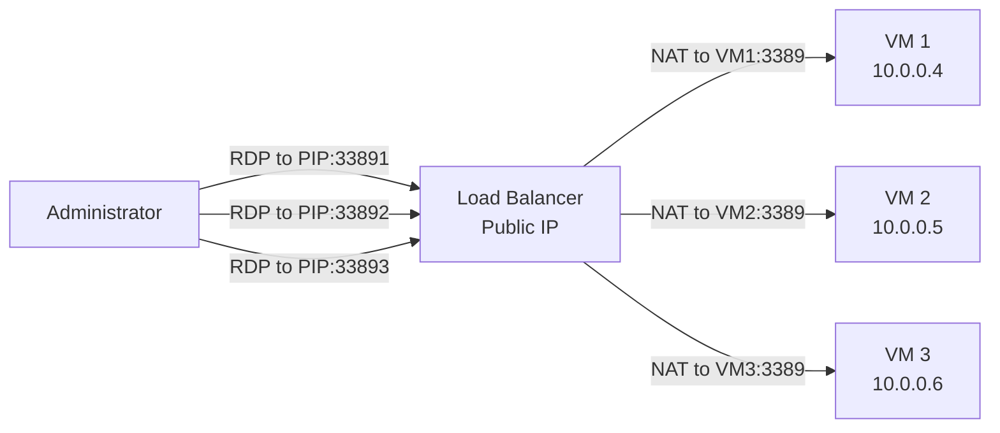

# How to Create Inbound NAT Rules on Azure Load Balancer for RDP Access

Author: [nawazdhandala](https://www.github.com/nawazdhandala)

Tags: Azure, Load Balancer, Inbound NAT, RDP, Remote Access, Azure Networking

Description: Step-by-step guide to creating inbound NAT rules on Azure Load Balancer to enable RDP access to individual backend virtual machines.

---

When you have multiple Windows VMs behind an Azure Load Balancer and none of them have public IPs, you cannot directly RDP into them. The load balancer distributes traffic across the backend pool, so connecting to the load balancer's public IP on port 3389 would hit a random VM - and that only works if you have a load balancing rule for RDP, which you probably should not.

Inbound NAT rules solve this by mapping specific ports on the load balancer's public IP to specific ports on individual backend VMs. You connect to port 33891 on the load balancer, and it forwards to port 3389 on VM1. Port 33892 goes to VM2. Each VM gets its own unique entry point through the load balancer.

## How Inbound NAT Rules Work



The key difference from load balancing rules is that NAT rules target a specific backend VM rather than distributing across the pool. Load balancing rules are one-to-many; NAT rules are one-to-one.

## Prerequisites

- An Azure subscription
- A Standard Load Balancer with backend VMs (or we will create them)
- Azure CLI installed
- Windows VMs in the backend pool (or Linux VMs if you want SSH instead of RDP)

## Step 1: Set Up the Infrastructure

Let us create a load balancer with backend Windows VMs.

```bash
# Create a resource group
az group create --name rg-nat-rules-demo --location eastus

# Create a VNet
az network vnet create \
  --resource-group rg-nat-rules-demo \
  --name vnet-demo \
  --location eastus \
  --address-prefixes 10.0.0.0/16 \
  --subnet-name subnet-vms \
  --subnet-prefixes 10.0.0.0/24

# Create a public IP for the load balancer
az network public-ip create \
  --resource-group rg-nat-rules-demo \
  --name pip-lb \
  --sku Standard \
  --allocation-method Static

# Create the load balancer
az network lb create \
  --resource-group rg-nat-rules-demo \
  --name lb-demo \
  --sku Standard \
  --public-ip-address pip-lb \
  --frontend-ip-name fe-default \
  --backend-pool-name bp-vms
```

## Step 2: Create Backend VMs

Create Windows VMs without public IPs.

```bash
# Create Windows VMs (no public IP)
for i in 1 2 3; do
  az vm create \
    --resource-group rg-nat-rules-demo \
    --name vm-win-$i \
    --image Win2022Datacenter \
    --vnet-name vnet-demo \
    --subnet subnet-vms \
    --admin-username azureadmin \
    --admin-password "P@ssw0rd2026!" \
    --public-ip-address "" \
    --size Standard_B2s \
    --no-wait
done
```

After the VMs are provisioned, add them to the backend pool:

```bash
# Add each VM's NIC to the backend pool
for i in 1 2 3; do
  az network nic ip-config address-pool add \
    --resource-group rg-nat-rules-demo \
    --nic-name vm-win-${i}VMNic \
    --ip-config-name ipconfig1 \
    --lb-name lb-demo \
    --address-pool bp-vms
done
```

## Step 3: Create Individual Inbound NAT Rules

Now create NAT rules that map unique frontend ports to RDP port 3389 on each backend VM.

```bash
# NAT rule for VM 1: frontend port 33891 -> backend port 3389
az network lb inbound-nat-rule create \
  --resource-group rg-nat-rules-demo \
  --lb-name lb-demo \
  --name nat-rdp-vm1 \
  --frontend-ip-name fe-default \
  --protocol Tcp \
  --frontend-port 33891 \
  --backend-port 3389

# NAT rule for VM 2: frontend port 33892 -> backend port 3389
az network lb inbound-nat-rule create \
  --resource-group rg-nat-rules-demo \
  --lb-name lb-demo \
  --name nat-rdp-vm2 \
  --frontend-ip-name fe-default \
  --protocol Tcp \
  --frontend-port 33892 \
  --backend-port 3389

# NAT rule for VM 3: frontend port 33893 -> backend port 3389
az network lb inbound-nat-rule create \
  --resource-group rg-nat-rules-demo \
  --lb-name lb-demo \
  --name nat-rdp-vm3 \
  --frontend-ip-name fe-default \
  --protocol Tcp \
  --frontend-port 33893 \
  --backend-port 3389
```

## Step 4: Associate NAT Rules with VM NICs

Each NAT rule needs to be associated with a specific VM's network interface.

```bash
# Associate NAT rule with VM 1's NIC
az network nic ip-config inbound-nat-rule add \
  --resource-group rg-nat-rules-demo \
  --nic-name vm-win-1VMNic \
  --ip-config-name ipconfig1 \
  --lb-name lb-demo \
  --inbound-nat-rule nat-rdp-vm1

# Associate NAT rule with VM 2's NIC
az network nic ip-config inbound-nat-rule add \
  --resource-group rg-nat-rules-demo \
  --nic-name vm-win-2VMNic \
  --ip-config-name ipconfig1 \
  --lb-name lb-demo \
  --inbound-nat-rule nat-rdp-vm2

# Associate NAT rule with VM 3's NIC
az network nic ip-config inbound-nat-rule add \
  --resource-group rg-nat-rules-demo \
  --nic-name vm-win-3VMNic \
  --ip-config-name ipconfig1 \
  --lb-name lb-demo \
  --inbound-nat-rule nat-rdp-vm3
```

## Step 5: Configure NSG Rules

The VMs' NSG needs to allow RDP traffic from the load balancer.

```bash
# Get the NSG name (auto-created with VMs)
NSG_NAME=$(az network nsg list --resource-group rg-nat-rules-demo --query "[0].name" -o tsv)

# Allow RDP traffic
az network nsg rule create \
  --resource-group rg-nat-rules-demo \
  --nsg-name $NSG_NAME \
  --name AllowRDP \
  --priority 100 \
  --direction Inbound \
  --access Allow \
  --protocol Tcp \
  --source-address-prefixes '203.0.113.0/24' \
  --destination-port-ranges 3389
```

Replace `203.0.113.0/24` with your actual IP range. Never open RDP to the entire internet.

## Step 6: Connect via RDP

Get the load balancer's public IP and connect.

```bash
# Get the public IP address
az network public-ip show \
  --resource-group rg-nat-rules-demo \
  --name pip-lb \
  --query ipAddress --output tsv
```

Now open your RDP client:

- To connect to VM 1: `mstsc /v:<PUBLIC_IP>:33891`
- To connect to VM 2: `mstsc /v:<PUBLIC_IP>:33892`
- To connect to VM 3: `mstsc /v:<PUBLIC_IP>:33893`

Each port takes you to a specific VM.

## Using Inbound NAT Pools (For Scale Sets)

If you are using VM Scale Sets (VMSS), individual NAT rules do not scale. Instead, use inbound NAT pools that automatically assign frontend ports to new instances.

```bash
# Create an inbound NAT pool for a VMSS
az network lb inbound-nat-pool create \
  --resource-group rg-nat-rules-demo \
  --lb-name lb-demo \
  --name nat-pool-rdp \
  --frontend-ip-name fe-default \
  --protocol Tcp \
  --frontend-port-range-start 50000 \
  --frontend-port-range-end 50100 \
  --backend-port 3389
```

This maps frontend ports 50000-50100 to port 3389 on VMSS instances. The first instance gets 50000, the second gets 50001, and so on.

## SSH NAT Rules for Linux VMs

The same approach works for SSH access to Linux VMs. Just change the backend port.

```bash
# NAT rule for SSH to a Linux VM
az network lb inbound-nat-rule create \
  --resource-group rg-nat-rules-demo \
  --lb-name lb-demo \
  --name nat-ssh-vm1 \
  --frontend-ip-name fe-default \
  --protocol Tcp \
  --frontend-port 22001 \
  --backend-port 22
```

Connect with: `ssh azureuser@<PUBLIC_IP> -p 22001`

## Verifying NAT Rules

List all inbound NAT rules and their associations.

```bash
# List all inbound NAT rules
az network lb inbound-nat-rule list \
  --resource-group rg-nat-rules-demo \
  --lb-name lb-demo \
  --output table

# Show details of a specific rule
az network lb inbound-nat-rule show \
  --resource-group rg-nat-rules-demo \
  --lb-name lb-demo \
  --name nat-rdp-vm1
```

## Security Considerations

Inbound NAT rules expose management ports through the load balancer's public IP. Keep these security practices in mind:

**Restrict source IPs.** Always use NSG rules to limit who can reach the NAT rule ports. Never leave RDP or SSH open to the internet.

**Use non-standard ports.** Using ports like 33891 instead of 3389 provides minimal security through obscurity, but it reduces automated scanning noise.

**Consider Azure Bastion instead.** For production environments, Azure Bastion is the recommended approach for VM management access. It removes the need for public IP exposure entirely. Use NAT rules mainly for development and testing environments where Bastion's cost is not justified.

**Enable Just-in-Time VM access.** Azure Defender offers JIT access that opens NSG rules only when needed and closes them automatically after a timeout.

**Monitor connections.** Enable NSG flow logs on the subnet to track who connects through the NAT rules.

## Troubleshooting

**Cannot connect via RDP.** Check the NSG rules allow traffic on port 3389 from the load balancer. Verify the NAT rule is associated with the correct NIC. Make sure the VM's Windows Firewall allows RDP.

**Connection timeout.** The load balancer might be sending traffic to the wrong NIC. Verify the NIC association in the NAT rule.

**Port already in use.** Frontend ports must be unique across all NAT rules and load balancing rules on the same frontend IP.

## Cleanup

```bash
# Delete all resources
az group delete --name rg-nat-rules-demo --yes --no-wait
```

## Wrapping Up

Inbound NAT rules on Azure Load Balancer provide a straightforward way to reach individual backend VMs when they do not have public IPs. Map unique frontend ports to management ports on each VM, lock down access with NSG rules, and you have targeted access to each machine in your backend pool. For scale sets, use NAT pools that auto-assign ports. And for production environments, seriously consider Azure Bastion as a more secure alternative to exposing management ports through NAT rules.
