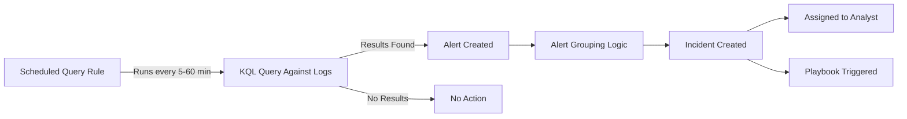

# How to Create Microsoft Sentinel Analytics Rules to Detect Suspicious Sign-In Patterns

Author: [nawazdhandala](https://www.github.com/nawazdhandala)

Tags: Azure, Microsoft Sentinel, Analytics Rules, Sign-In Detection, KQL, Security Operations, Threat Detection

Description: Step-by-step guide to creating scheduled analytics rules in Microsoft Sentinel that detect suspicious sign-in patterns like impossible travel and anomalous locations.

---

Microsoft Sentinel analytics rules are the engine that turns raw log data into actionable security incidents. While Microsoft provides many built-in detection rules, the most valuable detections are often custom rules tailored to your organization's specific patterns and risk profile. Sign-in logs are one of the richest data sources for detecting account compromise, and building custom analytics rules around them gives you detections that the built-in rules might miss.

In this guide, I will show you how to create several analytics rules that detect common suspicious sign-in patterns, from impossible travel to anomalous time-of-day access.

## How Analytics Rules Work in Sentinel

Sentinel analytics rules are scheduled KQL queries that run at regular intervals. When a query returns results, Sentinel creates an alert and groups related alerts into incidents for investigation.



Each rule has:
- A KQL query that defines the detection logic
- A schedule (how often to run and how far back to look)
- Entity mappings (linking alerts to specific accounts, IPs, or hosts)
- Alert grouping settings
- Optional automated response (playbooks)

## Prerequisites

You need:
- Microsoft Sentinel workspace with Microsoft Entra ID sign-in logs connected
- Security Contributor or Sentinel Contributor role
- Familiarity with KQL basics

## Rule 1: Impossible Travel Detection

Impossible travel occurs when a user signs in from two geographically distant locations in a time period that makes physical travel impossible. For example, a sign-in from New York followed by one from Tokyo 30 minutes later.

```kusto
// Detect impossible travel - sign-ins from distant locations within a short time
// This is a custom version that gives you more control than the built-in rule
let timeWindow = 1h;           // Look at sign-ins within this window
let impossibleSpeedKmh = 900;  // Maximum realistic travel speed (commercial flight)
SigninLogs
| where TimeGenerated > ago(timeWindow)
| where ResultType == "0"  // Only successful sign-ins
| where isnotempty(LocationDetails.city)
| extend
    Latitude = toreal(LocationDetails.geoCoordinates.latitude),
    Longitude = toreal(LocationDetails.geoCoordinates.longitude),
    City = tostring(LocationDetails.city),
    Country = tostring(LocationDetails.countryOrRegion)
| project TimeGenerated, UserPrincipalName, IPAddress, Latitude, Longitude, City, Country, AppDisplayName
| sort by UserPrincipalName asc, TimeGenerated asc
// Compare each sign-in with the previous one for the same user
| extend
    PrevTime = prev(TimeGenerated),
    PrevLat = prev(Latitude),
    PrevLong = prev(Longitude),
    PrevCity = prev(City),
    PrevCountry = prev(Country),
    PrevIP = prev(IPAddress),
    PrevUser = prev(UserPrincipalName)
// Only compare sign-ins from the same user
| where UserPrincipalName == PrevUser
// Calculate time difference in hours
| extend TimeDiffHours = datetime_diff('second', TimeGenerated, PrevTime) / 3600.0
// Calculate distance using the haversine formula approximation
| extend DistanceKm = 2 * 6371 * asin(sqrt(
    pow(sin(radians(Latitude - PrevLat) / 2), 2) +
    cos(radians(PrevLat)) * cos(radians(Latitude)) *
    pow(sin(radians(Longitude - PrevLong) / 2), 2)
  ))
// Calculate required speed
| extend RequiredSpeedKmh = iff(TimeDiffHours > 0, DistanceKm / TimeDiffHours, 0)
// Flag as impossible if speed exceeds realistic travel
| where RequiredSpeedKmh > impossibleSpeedKmh
| where DistanceKm > 100  // Ignore small distances (VPN/proxy can cause these)
| project
    TimeGenerated,
    UserPrincipalName,
    CurrentLocation = strcat(City, ", ", Country),
    CurrentIP = IPAddress,
    PreviousLocation = strcat(PrevCity, ", ", PrevCountry),
    PreviousIP = PrevIP,
    DistanceKm = round(DistanceKm, 0),
    TimeDiffMinutes = round(TimeDiffHours * 60, 0),
    RequiredSpeedKmh = round(RequiredSpeedKmh, 0)
```

To create this as a scheduled rule:

1. In Sentinel, go to Analytics, then click Create, then Scheduled query rule.
2. On the General tab:
   - Name: "Impossible Travel Detected"
   - Description: "Detects sign-ins from geographically distant locations in a timeframe that makes physical travel impossible."
   - Severity: High
   - MITRE ATT&CK tactics: Initial Access
3. On the Set rule logic tab, paste the KQL query above.
4. Set:
   - Run query every: 15 minutes
   - Lookup data from the last: 1 hour
5. Configure entity mapping:
   - Account: UserPrincipalName
   - IP: CurrentIP
6. On Alert grouping, group alerts by UserPrincipalName within a 24-hour window.
7. Review and create.

## Rule 2: Sign-Ins Outside Business Hours

Many organizations have users who should only sign in during business hours. Logins at 3 AM may indicate a compromised account:

```kusto
// Detect sign-ins outside normal business hours
// Customize the hours and timezone for your organization
let businessStartHour = 7;    // 7 AM
let businessEndHour = 19;     // 7 PM
let timezone = "US/Eastern";  // Adjust to your timezone
SigninLogs
| where TimeGenerated > ago(1h)
| where ResultType == "0"  // Successful sign-ins
| extend LocalTime = datetime_utc_to_local(TimeGenerated, timezone)
| extend HourOfDay = hourofday(LocalTime)
| extend DayOfWeek = dayofweek(LocalTime) / 1d  // 0=Sun, 6=Sat
// Flag sign-ins outside business hours or on weekends
| where HourOfDay < businessStartHour
    or HourOfDay >= businessEndHour
    or DayOfWeek == 0  // Sunday
    or DayOfWeek == 6  // Saturday
| project
    TimeGenerated,
    LocalTime,
    UserPrincipalName,
    IPAddress,
    AppDisplayName,
    HourOfDay,
    DayName = case(
        DayOfWeek == 0, "Sunday",
        DayOfWeek == 1, "Monday",
        DayOfWeek == 2, "Tuesday",
        DayOfWeek == 3, "Wednesday",
        DayOfWeek == 4, "Thursday",
        DayOfWeek == 5, "Friday",
        DayOfWeek == 6, "Saturday",
        "Unknown"
    ),
    City = tostring(LocationDetails.city),
    Country = tostring(LocationDetails.countryOrRegion)
// Exclude service accounts and known automation users
| where UserPrincipalName !has "svc-"
| where UserPrincipalName !has "automation"
```

Set this rule to medium severity since after-hours work is sometimes legitimate. Analysts should check if the user was known to be working late or traveling.

## Rule 3: First-Time Country Sign-In

When a user signs in from a country they have never signed in from before, it deserves attention:

```kusto
// Detect sign-ins from a country the user has never used before
// Uses a 30-day baseline to establish normal countries per user
let baselinePeriod = 30d;
let detectionPeriod = 1h;
// Build baseline of known countries per user
let knownCountries =
    SigninLogs
    | where TimeGenerated between (ago(baselinePeriod) .. ago(detectionPeriod))
    | where ResultType == "0"
    | extend Country = tostring(LocationDetails.countryOrRegion)
    | where isnotempty(Country)
    | distinct UserPrincipalName, Country;
// Find recent sign-ins from new countries
SigninLogs
| where TimeGenerated > ago(detectionPeriod)
| where ResultType == "0"
| extend Country = tostring(LocationDetails.countryOrRegion)
| where isnotempty(Country)
| join kind=leftanti knownCountries on UserPrincipalName, Country
| project
    TimeGenerated,
    UserPrincipalName,
    NewCountry = Country,
    City = tostring(LocationDetails.city),
    IPAddress,
    AppDisplayName,
    UserAgent = tostring(DeviceDetail.browser)
```

## Rule 4: Multiple Failed Sign-Ins Followed by Success from Different IP

This pattern suggests an attacker who found the password and then signed in from their own infrastructure:

```kusto
// Detect accounts where failed sign-ins from one IP are followed by
// a successful sign-in from a different IP within 1 hour
let lookback = 1h;
let failThreshold = 5;
// Find accounts with multiple failures
let failedAccounts =
    SigninLogs
    | where TimeGenerated > ago(lookback)
    | where ResultType == "50126"  // Bad password
    | summarize
        FailCount = count(),
        FailIPs = make_set(IPAddress),
        FirstFail = min(TimeGenerated),
        LastFail = max(TimeGenerated)
        by UserPrincipalName
    | where FailCount >= failThreshold;
// Find successful sign-ins for those accounts
SigninLogs
| where TimeGenerated > ago(lookback)
| where ResultType == "0"
| join kind=inner failedAccounts on UserPrincipalName
// Success came from a different IP than the failures
| where IPAddress !in (FailIPs)
// Success came after the failures
| where TimeGenerated > LastFail
| project
    UserPrincipalName,
    FailedAttempts = FailCount,
    FailedFromIPs = FailIPs,
    SuccessTime = TimeGenerated,
    SuccessIP = IPAddress,
    SuccessApp = AppDisplayName,
    SuccessLocation = strcat(tostring(LocationDetails.city), ", ", tostring(LocationDetails.countryOrRegion))
```

This is a high-severity detection. If the successful IP is different from the failed IPs, it strongly suggests the attacker obtained the password through other means and then used it from their own infrastructure.

## Rule 5: Multiple Users Signing In from Same Unusual IP

When many users suddenly sign in from the same IP that is not a known office or VPN IP, it could indicate a phishing campaign where stolen credentials are being used from the attacker's infrastructure:

```kusto
// Detect a single IP being used by multiple different users
// Exclude known corporate IPs (VPN, office, etc.)
let knownCorporateIPs = dynamic(["203.0.113.1", "198.51.100.0/24"]);
SigninLogs
| where TimeGenerated > ago(1h)
| where ResultType == "0"
| where not(ipv4_is_in_any_range(IPAddress, knownCorporateIPs))
| summarize
    UniqueUsers = dcount(UserPrincipalName),
    UserList = make_set(UserPrincipalName, 20),
    SignInCount = count(),
    AppList = make_set(AppDisplayName, 5)
    by IPAddress
| where UniqueUsers >= 5  // 5 or more users from same non-corporate IP
| project
    IPAddress,
    UniqueUsers,
    UserList,
    SignInCount,
    Applications = AppList
```

## Configuring Entity Mappings

Entity mappings are critical for effective investigation. They tell Sentinel which fields in your query results correspond to specific entity types:

For sign-in detections, always map:
- **Account entity**: Map `UserPrincipalName` to the Account entity
- **IP entity**: Map `IPAddress` to the IP entity
- **Host entity**: Map the device name if available

These mappings enable the investigation graph, allow playbooks to take action on specific entities, and link related incidents together.

## Alert Grouping Best Practices

Configure alert grouping to prevent alert fatigue:

- Group alerts by the UserPrincipalName field so that all detections for the same user become a single incident.
- Set a grouping window of 24 hours for most detections.
- For high-severity detections (like impossible travel), you might want shorter grouping windows to ensure quick response.

## Testing Your Rules

Before putting rules into production:

1. Run the KQL query manually in the Logs blade to verify it returns meaningful results.
2. Adjust thresholds based on your environment's baseline (what is normal for your organization).
3. Start with the rule in a disabled state, run it manually a few times, and review the results.
4. Enable the rule and monitor for false positives over a week.
5. Tune thresholds and exclusions based on the false positive rate.

## Conclusion

Custom analytics rules for sign-in patterns give you detections that are tuned to your environment rather than generic one-size-fits-all rules. The five rules in this guide cover the most impactful sign-in anomalies - impossible travel, after-hours access, new country access, credential compromise patterns, and shared attacker infrastructure. Start with these rules, adjust the thresholds to match your organization's normal patterns, and expand from there. The key to good detection is continuous tuning: review your incidents regularly, mark false positives, and refine your queries to improve signal-to-noise ratio over time.
