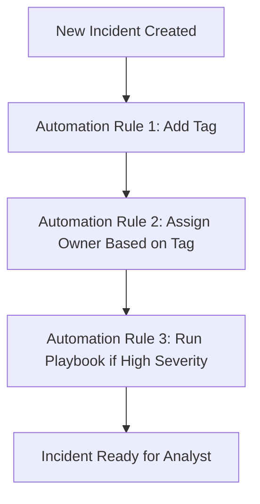

# How to Create Microsoft Sentinel Automation Rules to Auto-Assign and Auto-Close Incidents

Author: [nawazdhandala](https://www.github.com/nawazdhandala)

Tags: Azure, Microsoft Sentinel, Automation, SIEM, Incident Response, Security Operations, SOAR

Description: Learn how to create Microsoft Sentinel automation rules that automatically assign incidents to analysts and close low-priority incidents based on conditions.

---

When your security operations center handles hundreds or thousands of incidents daily, manually triaging each one is not sustainable. Microsoft Sentinel automation rules let you build logic that runs every time an incident is created or updated, performing actions like assigning owners, changing severity, or closing incidents that match known benign patterns.

In this guide, I will walk through creating automation rules that handle two common scenarios: auto-assigning incidents based on analytic rule names and auto-closing incidents that match false positive patterns.

## Why Automation Rules Matter

Before Sentinel automation rules existed, the only way to automate incident handling was through Logic Apps playbooks. While playbooks are powerful, they require more setup and cost money per execution. Automation rules are lightweight, run at no additional cost, and execute before playbooks in the processing pipeline. They are ideal for simple triage operations like:

- Assigning incidents to specific team members or groups based on the alert source
- Changing severity levels based on entity attributes
- Adding tags for categorization
- Closing incidents that match known false positive signatures
- Triggering playbooks with pre-filtered conditions

The processing order matters here. Automation rules run first, in the order you define, and then any playbook triggers fire. This means you can use automation rules to enrich an incident with tags before a playbook picks it up.

## Prerequisites

You need a few things in place before creating automation rules:

- An active Microsoft Sentinel workspace connected to a Log Analytics workspace
- Microsoft Sentinel Contributor or higher role on the resource group
- At least one analytics rule generating incidents (so you can test your automation)
- If you plan to auto-assign, know the Azure AD object IDs of your analysts

## Creating an Auto-Assignment Automation Rule

Let us start with a rule that assigns all incidents from a specific analytics rule to a particular analyst. Navigate to Microsoft Sentinel in the Azure portal, then go to Automation under the Configuration section.

Click "Create" and select "Automation rule." You will see a form with several sections.

Here is how to fill it out:

**Name:** Give it something descriptive like "Auto-assign firewall alerts to Network Team."

**Trigger:** Select "When incident is created." This fires the rule every time a new incident appears.

**Conditions:** This is where you filter which incidents this rule applies to. Click "Add condition" and select "Analytic rule name." Then choose "Contains" and type the name fragment of your analytics rule. For example, if your rule is called "Suspicious Firewall Deny Patterns," you might filter on "Firewall."

You can stack multiple conditions with AND/OR logic. For instance, you might want to match incidents where the analytic rule name contains "Firewall" AND the severity is "High."

**Actions:** Select "Assign owner" and enter the email or pick the user from the directory. You can also set the status to "Active" so the analyst knows it is ready for review.

Here is the equivalent if you want to create automation rules through the Sentinel REST API. This uses an ARM template approach:

```json
{
  // ARM template for Sentinel automation rule
  // This rule auto-assigns firewall-related incidents
  "type": "Microsoft.SecurityInsights/automationRules",
  "apiVersion": "2023-02-01",
  "name": "auto-assign-firewall-incidents",
  "properties": {
    "displayName": "Auto-assign firewall alerts to Network Team",
    "order": 1,
    // Trigger on new incident creation
    "triggeringLogic": {
      "isEnabled": true,
      "triggersOn": "Incidents",
      "triggersWhen": "Created",
      "conditions": [
        {
          "conditionType": "Property",
          "conditionProperties": {
            "propertyName": "IncidentRelatedAnalyticRuleIds",
            // Replace with your actual analytics rule resource ID
            "propertyValues": [
              "/subscriptions/{sub-id}/resourceGroups/{rg}/providers/Microsoft.SecurityInsights/alertRules/{rule-id}"
            ],
            "operator": "Contains"
          }
        }
      ]
    },
    "actions": [
      {
        "actionType": "ModifyProperties",
        "actionConfiguration": {
          "owner": {
            // Azure AD object ID of the assigned analyst
            "objectId": "xxxxxxxx-xxxx-xxxx-xxxx-xxxxxxxxxxxx"
          },
          "status": "Active"
        },
        "order": 1
      }
    ]
  }
}
```

## Creating an Auto-Close Automation Rule

Auto-closing incidents is useful when you have analytics rules that occasionally generate known false positives. Maybe you have a rule that detects logins from unusual countries, but your company has a team in a specific region that always triggers it.

Create another automation rule with these settings:

**Name:** "Auto-close known VPN exit node alerts"

**Trigger:** "When incident is created"

**Conditions:** Set the analytic rule name to match your rule, then add another condition. You can use "Incident title" contains a specific pattern, or use entity-based conditions if entities are mapped.

**Actions:**
1. Change status to "Closed"
2. Set classification to "False Positive" or "Benign Positive - Confirmed Benign Activity"
3. Add a comment explaining why this was auto-closed

The classification reason is important. When you auto-close incidents, auditors and team leads need to understand why. Sentinel tracks closure classifications in its metrics, so setting the right one keeps your dashboards accurate.

Here is a PowerShell script that creates an auto-close rule using the Az.SecurityInsights module:

```powershell
# Install the module if you haven't already
# Install-Module -Name Az.SecurityInsights -Force

# Connect to Azure (interactive login)
Connect-AzAccount

# Define the automation rule parameters
$workspaceName = "your-sentinel-workspace"
$resourceGroup = "your-resource-group"

# Create the condition - match incidents with specific title pattern
$condition = @{
    ConditionType = "Property"
    ConditionProperties = @{
        PropertyName = "IncidentTitle"
        Operator = "Contains"
        PropertyValues = @("VPN Exit Node - Known Region")
    }
}

# Create the close action with classification
$action = @{
    ActionType = "ModifyProperties"
    ActionConfiguration = @{
        Status = "Closed"
        Classification = "BenignPositive"
        ClassificationReason = "ConfirmedBenign"
        # Comment explains the auto-closure for audit trail
        ClassificationComment = "Auto-closed: Known VPN exit node from approved region"
    }
    Order = 1
}

# Create the automation rule
New-AzSentinelAutomationRule `
    -WorkspaceName $workspaceName `
    -ResourceGroupName $resourceGroup `
    -DisplayName "Auto-close known VPN exit node alerts" `
    -Order 2 `
    -TriggerOn "Incidents" `
    -TriggerWhen "Created" `
    -Condition $condition `
    -Action $action
```

## Rule Ordering and Execution Flow

Automation rules execute in the order you specify (the "Order" field). This matters because earlier rules modify the incident before later rules see it. Consider this flow:



If Rule 1 adds a tag and Rule 2 checks for that tag to determine the owner, the order must be correct. Drag rules into the right sequence in the Sentinel Automation blade, or set the Order property explicitly in code.

## Setting Up Auto-Assignment by Severity

A common pattern is routing incidents by severity to different tiers of your SOC team. Here is how you might structure that:

- Order 1: Critical severity incidents go to the senior analyst
- Order 2: High severity incidents go to the Tier 2 team
- Order 3: Medium and Low severity incidents go to the Tier 1 queue

For each rule, use the severity condition. Select "Incident severity" as the condition property, choose "Equals," and select the severity level. Then set the owner in the action.

You can also assign to a group instead of an individual. Use the Azure AD group object ID in the owner field, and Sentinel will show the group as the owner. Note that Sentinel does not do round-robin assignment natively within a group - it just labels the group as the owner.

## Handling Updates with Automation Rules

Beyond creation triggers, automation rules can fire when incidents are updated. This opens up patterns like:

- When an incident severity is escalated, notify a Slack channel via playbook
- When an incident is reopened, reassign it to the original owner
- When new alerts are added to an existing incident, change the severity

Use the "When incident is updated" trigger for these. Be careful with update triggers because they can create loops. If Rule A updates a property that triggers Rule B, and Rule B updates something that triggers Rule A again, you will have a problem. Sentinel has some built-in protections, but it is best to design your rules to avoid circular updates.

## Testing Your Automation Rules

After creating your rules, test them by generating a test incident. You can do this by running a manual query or creating a scheduled analytics rule with a short interval that matches test data in your workspace.

Check the automation rule health by going to the Automation blade and looking at the "Last run" column. If a rule is not firing, verify that:

1. The rule is enabled
2. The conditions actually match the incidents being generated
3. The rule order is not causing a previous rule to change the incident in a way that prevents your rule from matching
4. You have not hit the maximum actions limit (automation rules support up to 20 rules per workspace)

## Best Practices

Keep these guidelines in mind when building your automation rule set:

- Document every auto-close rule and review them quarterly. What was a valid false positive pattern last month might not be this month.
- Use descriptive names that make it obvious what the rule does without opening it.
- Start with conservative conditions. It is better to manually triage a few extra incidents than to auto-close something that was actually malicious.
- Use the "Add comment" action alongside auto-close to leave an audit trail.
- Monitor your auto-close rate. If it is too high, your analytics rules might need tuning instead of relying on automation to suppress noise.

## Wrapping Up

Microsoft Sentinel automation rules give you a lightweight, no-code way to handle routine incident triage. By combining auto-assignment with auto-close patterns, you can cut down on the manual work your SOC team does every day and let them focus on the incidents that actually need human analysis. Start with one or two rules, measure their impact, and expand from there.
