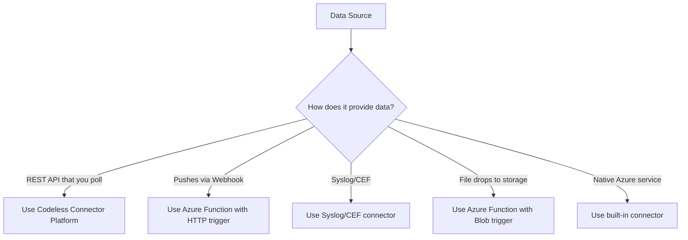

# How to Create Microsoft Sentinel Custom Connectors Using the Codeless Connector Platform

Author: [nawazdhandala](https://www.github.com/nawazdhandala)

Tags: Azure, Microsoft Sentinel, Custom Connectors, Codeless Connector Platform, SIEM, Data Ingestion, Security

Description: A step-by-step guide to building custom data connectors for Microsoft Sentinel using the Codeless Connector Platform without writing backend code.

---

Microsoft Sentinel has built-in connectors for dozens of data sources, but sooner or later you will need to pull in data from a system that does not have one. Maybe it is a niche security appliance, a custom internal application, or a SaaS product with a REST API but no Sentinel connector. In the past, building a custom connector meant writing and deploying an Azure Function, managing authentication, handling pagination, and dealing with all the plumbing that comes with data ingestion. The Codeless Connector Platform (CCP) simplifies this dramatically. You define your connector's behavior in a JSON configuration file, and Sentinel handles the rest.

In this post, I will walk through building a custom connector from scratch using CCP, covering everything from the data connector definition to polling configuration and deployment.

## What Is the Codeless Connector Platform?

CCP is a framework that lets you create Sentinel data connectors by writing a JSON (or ARM template) definition rather than code. You describe how to authenticate with the data source, what API endpoints to call, how to handle pagination, and how to map the response data to a Log Analytics table. Sentinel takes that definition and runs the polling infrastructure for you.

The platform supports:

- REST API data sources with various authentication methods (OAuth2, API key, Basic auth)
- Configurable polling intervals
- Pagination handling (link header, next page token, offset-based)
- Response parsing and field mapping
- Built-in retry logic and error handling

## When to Use CCP vs. Other Methods

CCP is ideal when your data source has a REST API that returns JSON data. If the data source pushes events via webhook, syslog, or file drops, CCP is not the right tool - you would use a different connector type or an Azure Function.

Here is a quick decision guide:



## Step 1: Understand the Target API

Before writing any connector definition, you need to understand the API you are connecting to. For this walkthrough, let us imagine we are connecting to a fictional security tool called "SecurityAuditPro" that has a REST API with these characteristics:

- Base URL: `https://api.securityauditpro.com/v2`
- Authentication: OAuth2 client credentials
- Events endpoint: `GET /events` with parameters for `start_time`, `end_time`, and `page_token`
- Response format: JSON with an `events` array and a `next_page_token` field
- Rate limit: 100 requests per minute

## Step 2: Define the Data Connector Resource

The CCP connector is defined as an ARM template resource of type `Microsoft.SecurityInsights/dataConnectorDefinitions` paired with a `Microsoft.SecurityInsights/dataConnectors` resource.

Let us build the definition. First, the connector definition that appears in the Sentinel UI.

This is the connector definition that controls how the connector appears in the Sentinel data connectors gallery:

```json
{
    "$schema": "https://schema.management.azure.com/schemas/2019-04-01/deploymentTemplate.json#",
    "contentVersion": "1.0.0.0",
    "parameters": {
        "workspace": {
            "type": "string",
            "metadata": {
                "description": "The Log Analytics workspace name"
            }
        }
    },
    "resources": [
        {
            "type": "Microsoft.SecurityInsights/dataConnectorDefinitions",
            "apiVersion": "2022-09-01-preview",
            "name": "SecurityAuditProDefinition",
            "location": "[resourceGroup().location]",
            "kind": "Customizable",
            "scope": "[concat('Microsoft.OperationalInsights/workspaces/', parameters('workspace'))]",
            "properties": {
                "connectorUiConfig": {
                    "id": "SecurityAuditProConnector",
                    "title": "SecurityAuditPro Events",
                    "publisher": "YourCompany",
                    "descriptionMarkdown": "This connector pulls security audit events from SecurityAuditPro into Microsoft Sentinel.",
                    "graphQueriesTableName": "SecurityAuditPro_CL",
                    "graphQueries": [
                        {
                            "metricName": "Total events received",
                            "legend": "SecurityAuditPro Events",
                            "baseQuery": "SecurityAuditPro_CL"
                        }
                    ],
                    "dataTypes": [
                        {
                            "name": "SecurityAuditPro_CL",
                            "lastDataReceivedQuery": "SecurityAuditPro_CL | summarize Time = max(TimeGenerated) | where isnotempty(Time)"
                        }
                    ],
                    "connectivityCriteria": [
                        {
                            "type": "HasDataConnectors"
                        }
                    ],
                    "availability": {
                        "status": 1,
                        "isPreview": true
                    },
                    "permissions": {
                        "resourceProvider": [
                            {
                                "provider": "Microsoft.OperationalInsights/workspaces",
                                "permissionsDisplayText": "Read and write permissions on the Log Analytics workspace.",
                                "providerDisplayName": "Workspace",
                                "scope": "Workspace",
                                "requiredPermissions": {
                                    "write": true,
                                    "read": true,
                                    "delete": true
                                }
                            }
                        ]
                    },
                    "instructionSteps": [
                        {
                            "title": "Connect SecurityAuditPro",
                            "description": "Enter your SecurityAuditPro API credentials below.",
                            "instructions": [
                                {
                                    "type": "Textbox",
                                    "parameters": {
                                        "label": "Client ID",
                                        "placeholder": "Enter your OAuth2 Client ID",
                                        "type": "text",
                                        "name": "clientId"
                                    }
                                },
                                {
                                    "type": "Textbox",
                                    "parameters": {
                                        "label": "Client Secret",
                                        "placeholder": "Enter your OAuth2 Client Secret",
                                        "type": "password",
                                        "name": "clientSecret"
                                    }
                                }
                            ]
                        }
                    ]
                }
            }
        }
    ]
}
```

## Step 3: Define the Polling Configuration

The polling configuration is the heart of the CCP connector. It tells Sentinel how to call the API, authenticate, handle pagination, and parse responses.

This resource definition configures the actual data polling behavior:

```json
{
    "type": "Microsoft.SecurityInsights/dataConnectors",
    "apiVersion": "2022-09-01-preview",
    "name": "SecurityAuditProPoller",
    "location": "[resourceGroup().location]",
    "kind": "APIPolling",
    "scope": "[concat('Microsoft.OperationalInsights/workspaces/', parameters('workspace'))]",
    "properties": {
        "connectorDefinitionName": "SecurityAuditProDefinition",
        "dcrConfig": {
            "dataCollectionEndpoint": "[parameters('dceUri')]",
            "dataCollectionRuleImmutableId": "[parameters('dcrImmutableId')]",
            "streamName": "Custom-SecurityAuditPro_CL"
        },
        "dataType": "SecurityAuditPro_CL",
        "response": {
            "eventsJsonPaths": ["$.events"],
            "format": "json"
        },
        "paging": {
            "pagingType": "NextPageToken",
            "nextPageTokenJsonPath": "$.next_page_token",
            "nextPageParaName": "page_token"
        },
        "auth": {
            "type": "OAuth2",
            "tokenEndpoint": "https://api.securityauditpro.com/oauth/token",
            "authorizationEndpoint": "https://api.securityauditpro.com/oauth/token",
            "authorizationEndpointQueryParameters": {},
            "tokenEndpointHeaders": {
                "Content-Type": "application/x-www-form-urlencoded"
            },
            "tokenEndpointQueryParameters": {},
            "grantType": "client_credentials",
            "clientId": "[[parameters('clientId')]",
            "clientSecret": "[[parameters('clientSecret')]",
            "scope": "events:read"
        },
        "request": {
            "apiEndpoint": "https://api.securityauditpro.com/v2/events",
            "httpMethod": "GET",
            "queryParameters": {
                "start_time": "{datetime:yyyy-MM-ddTHH:mm:ssZ}",
                "end_time": "{now:yyyy-MM-ddTHH:mm:ssZ}"
            },
            "queryTimeFormat": "yyyy-MM-ddTHH:mm:ssZ",
            "queryWindowInMin": 5,
            "rateLimitQps": 1,
            "retryCount": 3,
            "headers": {
                "Accept": "application/json"
            }
        }
    }
}
```

Let me break down the key sections:

**auth** - Defines how to authenticate. CCP supports OAuth2 (client credentials, authorization code), API key (header or query parameter), and Basic authentication. In this example, we use OAuth2 client credentials flow.

**request** - Defines the API endpoint, HTTP method, query parameters, and polling window. The `queryWindowInMin` parameter controls how frequently Sentinel polls for new data. The `{datetime}` and `{now}` placeholders are replaced with the appropriate timestamps at runtime.

**response** - Tells CCP where to find the event data in the API response. `eventsJsonPaths` uses JSONPath syntax to locate the array of events.

**paging** - Configures how to handle paginated responses. CCP supports several pagination types including `NextPageToken`, `LinkHeader`, and `Offset`.

## Step 4: Create the Data Collection Rule

CCP connectors use Data Collection Rules (DCRs) to define how data is transformed and ingested into the Log Analytics workspace. You need to create a DCR and a custom table.

This creates the custom table and DCR for the connector:

```bash
# Create a custom table in Log Analytics for the connector data
az monitor log-analytics workspace table create \
  --resource-group rg-sentinel \
  --workspace-name law-sentinel-prod \
  --name SecurityAuditPro_CL \
  --columns \
    TimeGenerated=datetime \
    EventId=string \
    EventType=string \
    Severity=string \
    SourceIP=string \
    DestinationIP=string \
    UserName=string \
    Description=string \
    RawEvent=dynamic

# Create a data collection endpoint
az monitor data-collection endpoint create \
  --name dce-sentinel-ccp \
  --resource-group rg-sentinel \
  --location eastus \
  --public-network-access Enabled
```

## Step 5: Deploy the Connector

Package everything into a single ARM template and deploy it to your Sentinel workspace.

This deploys the complete connector definition:

```bash
# Deploy the connector ARM template to your resource group
az deployment group create \
  --resource-group rg-sentinel \
  --template-file connector-template.json \
  --parameters \
    workspace=law-sentinel-prod \
    dceUri="https://dce-sentinel-ccp-xxxx.eastus.ingest.monitor.azure.com" \
    dcrImmutableId="dcr-xxxxxxxxxxxxxxx"
```

After deployment, the connector will appear in Sentinel's Data connectors gallery. Navigate there, find your connector, and click "Open connector page" to configure it with the API credentials.

## Step 6: Validate Data Ingestion

Once the connector is configured and running, verify that data is flowing into your workspace.

This KQL query checks for recently ingested events from the custom connector:

```kusto
// Check if data is flowing from the custom connector
SecurityAuditPro_CL
| where TimeGenerated > ago(1h)
| summarize EventCount = count() by bin(TimeGenerated, 5m)
| order by TimeGenerated desc
| render timechart
```

If you do not see data after 15-20 minutes, check the connector health status in the Sentinel portal and review the data connector logs for error messages.

## Troubleshooting Common Issues

**Authentication failures** - Double-check the OAuth2 credentials and token endpoint URL. Test the API manually with curl or Postman first to confirm the credentials work.

**No data appearing** - Verify the `eventsJsonPaths` matches the actual API response structure. A common mistake is pointing to the wrong JSON path.

**Pagination not working** - Test the pagination manually by calling the API and following the page tokens. Make sure the `nextPageTokenJsonPath` correctly points to the pagination field.

**Rate limiting errors** - Lower the `rateLimitQps` value in the request configuration. If the API returns 429 responses, the built-in retry logic should handle it, but reducing the polling rate helps prevent it in the first place.

## Best Practices

1. **Start with a small polling window.** Use 5-minute intervals initially and adjust based on the volume of data and API rate limits.
2. **Test the API thoroughly first.** Before building the connector, make sure you understand the API's authentication, pagination, response format, and rate limits.
3. **Use DCR transformations for data normalization.** Map the source data fields to the Advanced Security Information Model (ASIM) schema when possible. This makes your data compatible with Sentinel's built-in analytics rules.
4. **Version your connector templates.** Store the ARM templates in source control and use versioned deployments so you can roll back if needed.

## Wrapping Up

The Codeless Connector Platform significantly lowers the barrier to integrating custom data sources with Microsoft Sentinel. Instead of writing and maintaining Azure Functions, you describe the integration in JSON and let Sentinel handle the infrastructure. For any REST API-based data source, CCP should be your first choice. It handles authentication, polling, pagination, and retry logic out of the box, letting you focus on what matters - getting the security data into Sentinel so you can write detection rules and investigate incidents.
