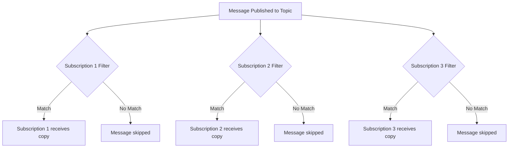

# How to Create Subscription Filters in Azure Service Bus Topics

Author: [nawazdhandala](https://www.github.com/nawazdhandala)

Tags: Azure Service Bus, Subscription Filters, Topics, Message Routing, Azure, Pub-Sub, Messaging

Description: Configure SQL and correlation filters on Azure Service Bus topic subscriptions to route messages to the right consumers based on properties and content.

---

Azure Service Bus topics implement the publish-subscribe pattern. Publishers send messages to a topic, and subscribers receive copies of those messages through subscriptions. But you rarely want every subscriber to receive every message. A billing service only cares about payment events. A notification service needs customer-facing events but not internal system events. A regional processor only wants messages for its region.

Subscription filters solve this by letting you define rules on each subscription that determine which messages it receives. In this post, I will cover the three types of filters available, how to configure them, and practical patterns for message routing.

## Filter Types

Azure Service Bus supports three types of subscription filters.

**Boolean filter**: The simplest type. `TrueFilter` matches all messages (this is the default on new subscriptions). `FalseFilter` matches nothing.

**SQL filter**: Evaluates a SQL-like expression against the message's system properties, user-defined properties, and body. This is the most flexible filter type.

**Correlation filter**: Matches against specific property values. Faster and cheaper than SQL filters because Service Bus can use hash-based lookups instead of expression evaluation.



## Setting Up SQL Filters

SQL filters use a subset of SQL-92 syntax to evaluate conditions against message properties.

```bash
# Create a topic
az servicebus topic create \
  --name order-events \
  --namespace-name my-servicebus \
  --resource-group my-rg

# Create subscriptions with SQL filters
# Subscription for high-value orders only
az servicebus topic subscription create \
  --name high-value-orders \
  --topic-name order-events \
  --namespace-name my-servicebus \
  --resource-group my-rg

# Remove the default "match all" rule
az servicebus topic subscription rule delete \
  --name '$Default' \
  --subscription-name high-value-orders \
  --topic-name order-events \
  --namespace-name my-servicebus \
  --resource-group my-rg

# Add a SQL filter rule for orders over $500
az servicebus topic subscription rule create \
  --name HighValueFilter \
  --subscription-name high-value-orders \
  --topic-name order-events \
  --namespace-name my-servicebus \
  --resource-group my-rg \
  --filter-sql-expression "OrderAmount > 500"
```

You can create complex filter expressions using standard SQL operators.

```bash
# Filter for specific event types in a specific region
az servicebus topic subscription rule create \
  --name RegionalFilter \
  --subscription-name us-east-processor \
  --topic-name order-events \
  --namespace-name my-servicebus \
  --resource-group my-rg \
  --filter-sql-expression "Region = 'us-east' AND EventType IN ('OrderCreated', 'OrderUpdated')"

# Filter using LIKE for pattern matching
az servicebus topic subscription rule create \
  --name PremiumCustomerFilter \
  --subscription-name premium-notifications \
  --topic-name order-events \
  --namespace-name my-servicebus \
  --resource-group my-rg \
  --filter-sql-expression "CustomerTier LIKE 'Premium%' AND EventType != 'InternalAudit'"

# Filter with IS NULL / IS NOT NULL
az servicebus topic subscription rule create \
  --name UrgentFilter \
  --subscription-name urgent-queue \
  --topic-name order-events \
  --namespace-name my-servicebus \
  --resource-group my-rg \
  --filter-sql-expression "Priority IS NOT NULL AND Priority = 'Urgent'"
```

## Setting Up Correlation Filters

Correlation filters are more performant than SQL filters because they use exact property matching with hash lookups. Use them when you need simple equality checks.

```csharp
using Azure.Messaging.ServiceBus.Administration;

public class FilterSetup
{
    private readonly ServiceBusAdministrationClient _adminClient;

    public FilterSetup(ServiceBusAdministrationClient adminClient)
    {
        _adminClient = adminClient;
    }

    public async Task ConfigureCorrelationFiltersAsync()
    {
        var topicName = "order-events";

        // Create a subscription with a correlation filter
        // This is faster than SQL for simple property matching
        await _adminClient.CreateSubscriptionAsync(
            new CreateSubscriptionOptions(topicName, "payment-events")
            {
                MaxDeliveryCount = 10,
                LockDuration = TimeSpan.FromMinutes(2)
            });

        // Remove default rule
        await _adminClient.DeleteRuleAsync(topicName, "payment-events", "$Default");

        // Add correlation filter matching on Subject property
        await _adminClient.CreateRuleAsync(topicName, "payment-events",
            new CreateRuleOptions("PaymentFilter", new CorrelationRuleFilter
            {
                Subject = "PaymentProcessed"
            }));

        // Correlation filter matching on multiple properties
        await _adminClient.CreateSubscriptionAsync(
            new CreateSubscriptionOptions(topicName, "us-premium-orders"));

        await _adminClient.DeleteRuleAsync(topicName, "us-premium-orders", "$Default");

        // Match messages where Region=us-east AND CustomerTier=Premium
        await _adminClient.CreateRuleAsync(topicName, "us-premium-orders",
            new CreateRuleOptions("RegionTierFilter", new CorrelationRuleFilter
            {
                ApplicationProperties =
                {
                    ["Region"] = "us-east",
                    ["CustomerTier"] = "Premium"
                }
            }));

        // Correlation filter on system properties
        await _adminClient.CreateSubscriptionAsync(
            new CreateSubscriptionOptions(topicName, "json-messages"));

        await _adminClient.DeleteRuleAsync(topicName, "json-messages", "$Default");

        await _adminClient.CreateRuleAsync(topicName, "json-messages",
            new CreateRuleOptions("JsonFilter", new CorrelationRuleFilter
            {
                ContentType = "application/json"
            }));
    }
}
```

## Sending Messages with Filterable Properties

For filters to work, you need to set the appropriate properties on your messages when publishing.

```csharp
public class EventPublisher
{
    private readonly ServiceBusSender _sender;

    public EventPublisher(ServiceBusClient client)
    {
        _sender = client.CreateSender("order-events");
    }

    // Publish an order event with properties that filters can match on
    public async Task PublishOrderEventAsync(OrderEvent orderEvent)
    {
        var message = new ServiceBusMessage(
            BinaryData.FromObjectAsJson(orderEvent))
        {
            ContentType = "application/json",
            // System properties that correlation filters can match
            Subject = orderEvent.EventType,
            CorrelationId = orderEvent.OrderId,
        };

        // User-defined properties that both SQL and correlation filters can match
        message.ApplicationProperties["EventType"] = orderEvent.EventType;
        message.ApplicationProperties["Region"] = orderEvent.Region;
        message.ApplicationProperties["CustomerTier"] = orderEvent.CustomerTier;
        message.ApplicationProperties["OrderAmount"] = orderEvent.Amount;
        message.ApplicationProperties["Currency"] = orderEvent.Currency;
        message.ApplicationProperties["Priority"] = orderEvent.Priority;

        await _sender.SendMessageAsync(message);
    }
}
```

Note that SQL filters can only access message properties (system properties and application properties), not the message body. If you need to filter on data that is in the body, you must also add it as an application property.

## Filter Actions

SQL filter rules can include an action that modifies the message when it matches. This is useful for enriching messages or setting properties for downstream consumers.

```csharp
// Create a rule with a filter and an action
await _adminClient.CreateRuleAsync(topicName, "enriched-subscription",
    new CreateRuleOptions
    {
        Name = "EnrichmentRule",
        // Filter: match high-value orders
        Filter = new SqlRuleFilter("OrderAmount > 1000"),
        // Action: add a property to flag these messages
        Action = new SqlRuleAction(
            "SET sys.Label = 'HighValue'; SET Priority = 'High';")
    });

// Another example: calculate a derived property
await _adminClient.CreateRuleAsync(topicName, "with-discount-tier",
    new CreateRuleOptions
    {
        Name = "DiscountTierRule",
        Filter = new SqlRuleFilter("CustomerTier IS NOT NULL"),
        Action = new SqlRuleAction(@"
            SET DiscountPercent =
                CASE CustomerTier
                    WHEN 'Premium' THEN 20
                    WHEN 'Gold' THEN 10
                    WHEN 'Silver' THEN 5
                    ELSE 0
                END")
    });
```

## Multiple Rules on One Subscription

A subscription can have multiple rules. A message matches the subscription if it matches ANY of the rules (OR logic). If you need AND logic, combine conditions in a single SQL filter expression.

```csharp
// Multiple rules - message matches if it matches ANY rule
// Rule 1: High-value orders
await _adminClient.CreateRuleAsync(topicName, "priority-handling",
    new CreateRuleOptions("HighValueRule",
        new SqlRuleFilter("OrderAmount > 1000")));

// Rule 2: Urgent priority
await _adminClient.CreateRuleAsync(topicName, "priority-handling",
    new CreateRuleOptions("UrgentRule",
        new SqlRuleFilter("Priority = 'Urgent'")));

// Rule 3: Premium customers
await _adminClient.CreateRuleAsync(topicName, "priority-handling",
    new CreateRuleOptions("PremiumRule",
        new SqlRuleFilter("CustomerTier = 'Premium'")));

// A message will be delivered to this subscription if it matches
// any of these three rules
```

## Listing and Managing Filters

You can inspect the current filters on a subscription programmatically.

```csharp
// List all rules (filters) on a subscription
public async Task ListFiltersAsync(string topicName, string subscriptionName)
{
    await foreach (var rule in _adminClient.GetRulesAsync(topicName, subscriptionName))
    {
        Console.WriteLine($"Rule: {rule.Name}");

        if (rule.Filter is SqlRuleFilter sqlFilter)
        {
            Console.WriteLine($"  Type: SQL Filter");
            Console.WriteLine($"  Expression: {sqlFilter.SqlExpression}");
        }
        else if (rule.Filter is CorrelationRuleFilter corrFilter)
        {
            Console.WriteLine($"  Type: Correlation Filter");
            Console.WriteLine($"  Subject: {corrFilter.Subject}");
            Console.WriteLine($"  Content Type: {corrFilter.ContentType}");
            foreach (var prop in corrFilter.ApplicationProperties)
            {
                Console.WriteLine($"  Property: {prop.Key} = {prop.Value}");
            }
        }
        else if (rule.Filter is TrueRuleFilter)
        {
            Console.WriteLine($"  Type: True Filter (matches all)");
        }

        if (rule.Action is SqlRuleAction action)
        {
            Console.WriteLine($"  Action: {action.SqlExpression}");
        }
    }
}
```

## Performance Considerations

Correlation filters are evaluated using hash table lookups, making them O(1) regardless of how many filters exist. SQL filters require expression evaluation for each message, which is O(n) where n is the number of SQL filter rules across all subscriptions.

For high-throughput topics, prefer correlation filters whenever possible. Use SQL filters only when you need operators like `>`, `<`, `LIKE`, `IN`, `IS NULL`, or other expressions that correlation filters cannot express.

Service Bus evaluates filters in the broker, not in your application. This means filtered-out messages never count against your consumer's throughput or processing capacity.

## Summary

Subscription filters are the routing engine of Azure Service Bus topics. They let you direct messages to the right consumers based on message properties without any application-level routing code. Use correlation filters for simple equality matching (they are faster), SQL filters for complex conditions with operators and pattern matching, and filter actions to enrich messages as they are routed. Always set filterable properties on your messages when publishing, and remember that filters evaluate against properties, not the message body. Well-designed filters keep your messaging architecture clean and let each consumer focus on only the messages it cares about.
