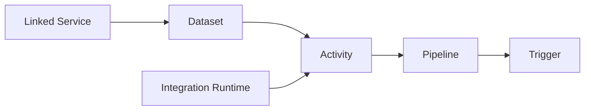

# How to Create Your First Data Pipeline in Azure Data Factory

Author: [nawazdhandala](https://www.github.com/nawazdhandala)

Tags: Azure Data Factory, Data Pipeline, ETL, Azure, Data Engineering, Cloud

Description: A beginner-friendly walkthrough for creating your first data pipeline in Azure Data Factory to move and transform data in the cloud.

---

Azure Data Factory (ADF) is Microsoft's cloud-based data integration service. It lets you create data pipelines that move and transform data between various sources and destinations - think of it as the plumbing for your data architecture. Whether you need to copy data from an on-premises SQL Server to Azure Blob Storage, run a Databricks notebook on a schedule, or orchestrate a complex multi-step ETL workflow, ADF handles it.

In this post, I will walk through creating your first data pipeline from scratch. We will build a simple pipeline that copies data from Azure Blob Storage to Azure SQL Database, which is one of the most common use cases.

## Key Concepts

Before diving into the steps, let me clarify the core concepts in Azure Data Factory:

- **Pipeline** - a logical grouping of activities that together perform a task. Think of it as a workflow.
- **Activity** - a single step within a pipeline. Examples include Copy Data, Execute Stored Procedure, Run Databricks Notebook, or Web Activity.
- **Linked Service** - a connection definition for a data store or compute resource. Similar to a connection string.
- **Dataset** - a named view of data that points to the data you want to use in your activities. It references a linked service and specifies the exact data (table, file, container, etc.).
- **Trigger** - defines when a pipeline should run (schedule, tumbling window, event-based, or manual).
- **Integration Runtime** - the compute infrastructure that ADF uses to execute activities. It can be Azure-hosted, self-hosted (for on-premises data), or Azure-SSIS.



## Prerequisites

1. An Azure subscription
2. An Azure Data Factory instance (create one from the Azure portal)
3. An Azure Blob Storage account with some sample data (CSV file)
4. An Azure SQL Database with a target table

## Step 1: Create the Data Factory

If you have not already created a Data Factory instance, do so from the Azure portal.

1. Go to the Azure portal and search for "Data Factory"
2. Click "Create"
3. Fill in the basics: subscription, resource group, region, and a name for your data factory
4. Under Git configuration, you can choose "Configure Git later" for now
5. Review and create

Once provisioned, click "Launch Studio" to open the ADF authoring experience in your browser.

## Step 2: Create Linked Services

Linked services define the connections to your data stores. We need two: one for the source (Blob Storage) and one for the sink (SQL Database).

### Blob Storage Linked Service

1. In ADF Studio, go to **Manage** (the toolbox icon on the left)
2. Click **Linked services** > **New**
3. Search for and select "Azure Blob Storage"
4. Give it a name like `ls_blob_storage`
5. Choose your authentication method (Account key is simplest for getting started)
6. Select your storage account
7. Test the connection and click Create

### SQL Database Linked Service

1. Click **New** again
2. Search for and select "Azure SQL Database"
3. Name it `ls_sql_database`
4. Enter the server name, database name, and authentication details
5. Test the connection and click Create

## Step 3: Create Datasets

Datasets point to the specific data within your linked services.

### Source Dataset (CSV in Blob Storage)

1. Go to **Author** (the pencil icon)
2. Click the **+** button > **Dataset**
3. Select "Azure Blob Storage" and then "DelimitedText" (CSV)
4. Name it `ds_source_csv`
5. Select the `ls_blob_storage` linked service
6. Browse to your CSV file or specify the container and file path
7. Check "First row as header" if your CSV has headers
8. Click OK

### Sink Dataset (SQL Table)

1. Click **+** > **Dataset** again
2. Select "Azure SQL Database"
3. Name it `ds_sink_sql`
4. Select the `ls_sql_database` linked service
5. Select the target table from the dropdown
6. Click OK

## Step 4: Create the Pipeline

Now we build the actual pipeline.

1. Click **+** > **Pipeline** > **Pipeline**
2. Name it `pl_copy_blob_to_sql`
3. From the Activities pane on the left, expand **Move & transform** and drag a **Copy data** activity onto the canvas
4. Name the activity `CopyCSVtoSQL`

### Configure the Source

1. Click on the Copy data activity and go to the **Source** tab
2. Select `ds_source_csv` as the source dataset
3. Leave the default settings (or adjust column delimiters, encoding, etc.)

### Configure the Sink

1. Go to the **Sink** tab
2. Select `ds_sink_sql` as the sink dataset
3. For write behavior, choose "Insert" (or "Upsert" if your table has a key and you want to update existing rows)
4. Optionally enable "Auto create table" if the table does not exist yet

### Configure Column Mapping

1. Go to the **Mapping** tab
2. Click "Import schemas" to automatically map source columns to sink columns
3. Review the mappings and adjust if column names differ between source and sink

## Step 5: Validate and Debug

Before publishing, validate your pipeline.

1. Click **Validate** in the toolbar - this checks for configuration errors
2. Click **Debug** to run the pipeline immediately in debug mode
3. Watch the output pane at the bottom to see the pipeline execution status

The debug run will show you:
- How many rows were read and written
- Duration of the activity
- Any errors that occurred
- Data throughput

If you see errors, common issues include:
- Column type mismatches between CSV and SQL table
- Missing permissions on the storage account or database
- Network connectivity issues (especially with private endpoints)

## Step 6: Publish

Once your debug run succeeds, publish the pipeline to save it to the ADF service.

1. Click **Publish all** in the toolbar
2. Review the changes
3. Click **Publish**

This saves your pipeline, datasets, and linked services to the live ADF service. Published pipelines can be triggered manually or on a schedule.

## Step 7: Add a Trigger

To run the pipeline automatically, create a trigger.

1. Click on your pipeline
2. Click **Add trigger** > **New/Edit**
3. Click **New**
4. Choose a trigger type:
   - **Schedule** - run at fixed intervals (every day at midnight, every hour, etc.)
   - **Tumbling window** - run for fixed time periods with dependencies
   - **Storage event** - run when a file is created or deleted in blob storage
   - **Custom event** - run based on Event Grid events

For a daily copy job, use a schedule trigger.

```json
// Example schedule trigger configuration
{
  "name": "daily_midnight_trigger",
  "type": "ScheduleTrigger",
  "typeProperties": {
    "recurrence": {
      "frequency": "Day",
      "interval": 1,
      "startTime": "2026-02-16T00:00:00Z",
      "timeZone": "UTC"
    }
  }
}
```

5. Publish again to activate the trigger

## Step 8: Monitor Pipeline Runs

After triggering (manually or on schedule), monitor your pipeline runs.

1. Go to **Monitor** (the gauge icon)
2. Click **Pipeline runs**
3. You will see a list of all runs with their status, duration, and start time
4. Click on a run to see activity-level details
5. Click on an activity to see detailed input/output and error messages

## Adding More Activities

A real pipeline usually has more than just a copy activity. Here are common patterns:

### Sequential Activities

Drag additional activities onto the canvas and connect them by dragging the green arrow from one activity to the next. This creates a dependency - the second activity runs only after the first succeeds.

### Conditional Logic

Use the **If Condition** activity to branch your pipeline based on a boolean expression. For example, only load data if the source file has rows.

### Error Handling

Connect activities using the red arrow (failure path) to handle errors. You might send an email notification or write to a log table when something fails.

### Parameterization

Pipelines can accept parameters, making them reusable. Instead of hardcoding file paths, you can pass them as parameters at runtime. I will cover this in detail in a separate post.

## Infrastructure as Code

If you prefer defining your pipelines in code rather than the UI, ADF supports ARM templates and Terraform. You can also use Git integration to version control your pipeline definitions.

```json
// Simplified ARM template for a copy pipeline
{
  "name": "pl_copy_blob_to_sql",
  "type": "Microsoft.DataFactory/factories/pipelines",
  "properties": {
    "activities": [
      {
        "name": "CopyCSVtoSQL",
        "type": "Copy",
        "inputs": [{ "referenceName": "ds_source_csv", "type": "DatasetReference" }],
        "outputs": [{ "referenceName": "ds_sink_sql", "type": "DatasetReference" }],
        "typeProperties": {
          "source": { "type": "DelimitedTextSource" },
          "sink": { "type": "AzureSqlSink", "writeBehavior": "insert" }
        }
      }
    ]
  }
}
```

## Wrapping Up

You now have a working data pipeline in Azure Data Factory that copies data from Blob Storage to SQL Database. This is the foundation for building more complex data workflows. From here, you can add transformations, conditional logic, error handling, and scheduling. ADF handles the infrastructure and scaling, so you can focus on the data logic. As your pipelines grow more complex, consider using Git integration and ARM templates to manage them as code - it makes collaboration and deployment much smoother.
