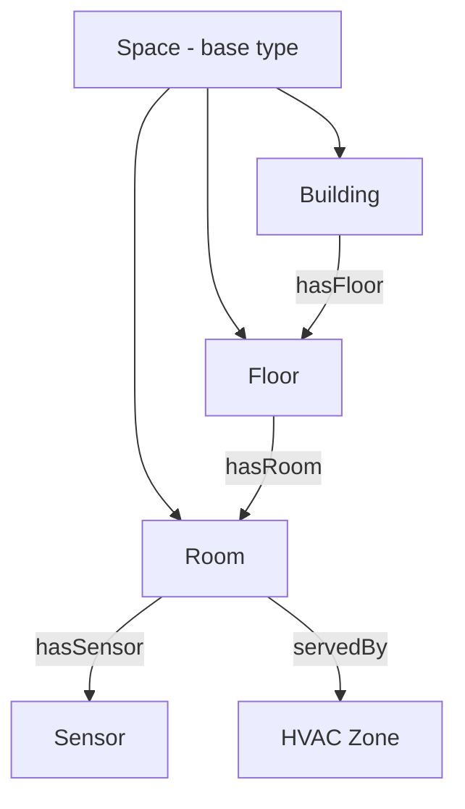

# How to Define Ontology-Based Models Using DTDL in Azure Digital Twins

Author: [nawazdhandala](https://www.github.com/nawazdhandala)

Tags: Azure Digital Twins, DTDL, Ontology, Digital Twin Modeling, IoT Architecture, Smart Buildings, Twin Graph

Description: Learn how to define ontology-based models using the Digital Twins Definition Language (DTDL) in Azure Digital Twins for structured domain modeling.

---

Azure Digital Twins lets you create a virtual representation of real-world environments - buildings, factories, cities, energy grids. But before you can create any twins, you need models that define what types of things exist in your environment and how they relate to each other. This is where the Digital Twins Definition Language (DTDL) comes in. DTDL is a JSON-LD based schema language that lets you define interfaces describing the properties, telemetry, commands, and relationships of your digital twins.

When you go beyond simple device models and start modeling entire environments, you need ontologies - structured hierarchies of concepts that reflect how your domain actually works. This guide covers how to design and implement ontology-based DTDL models for Azure Digital Twins.

## What is an Ontology in This Context

An ontology is a formal representation of knowledge within a domain. In the context of digital twins, it defines the types of things (buildings, floors, rooms, sensors, HVAC systems) and the relationships between them (a room is on a floor, a sensor is in a room, an HVAC system serves a zone).

Microsoft provides several open-source ontologies for common domains:

- **RealEstateCore** - For smart buildings and real estate
- **Smart Cities** - Based on ETSI NGSI-LD standards
- **Energy Grid** - For power distribution modeling

You can use these as starting points and extend them, or build your own from scratch for specialized domains.

## DTDL Fundamentals

Before diving into ontologies, let us cover the building blocks of DTDL. Every model is an Interface with a unique identifier and a set of contents.

```json
{
  "@id": "dtmi:com:example:Room;1",
  "@type": "Interface",
  "@context": "dtmi:dtdl:context;2",
  "displayName": "Room",
  "description": "A room within a building",
  "contents": []
}
```

The `@id` follows the DTMI (Digital Twin Model Identifier) format: `dtmi:<domain>:<path>;<version>`. The version number is mandatory and must be a positive integer.

Contents can include four types of elements:

1. **Property** - State values that are stored (e.g., room capacity, floor number)
2. **Telemetry** - Time-series data that flows through (e.g., temperature reading)
3. **Command** - Actions that can be invoked (e.g., turn on lights)
4. **Relationship** - Connections to other twins (e.g., room contains sensors)

## Designing a Building Ontology

Let us build a practical ontology for a smart building. We will define a hierarchy of spaces and the systems within them.

Start with the base concept - a generic space.

```json
{
  "@id": "dtmi:com:example:Space;1",
  "@type": "Interface",
  "@context": "dtmi:dtdl:context;2",
  "displayName": "Space",
  "description": "Base type for all spatial elements",
  "contents": [
    {
      "@type": "Property",
      "name": "name",
      "displayName": "Name",
      "schema": "string"
    },
    {
      "@type": "Property",
      "name": "area",
      "displayName": "Area (sq meters)",
      "schema": "double"
    },
    {
      "@type": "Property",
      "name": "status",
      "displayName": "Status",
      "schema": {
        "@type": "Enum",
        "valueSchema": "string",
        "enumValues": [
          { "name": "active", "enumValue": "active" },
          { "name": "maintenance", "enumValue": "maintenance" },
          { "name": "decommissioned", "enumValue": "decommissioned" }
        ]
      }
    }
  ]
}
```

Now define specific space types that extend the base. DTDL supports inheritance through the `extends` keyword.

```json
{
  "@id": "dtmi:com:example:Building;1",
  "@type": "Interface",
  "@context": "dtmi:dtdl:context;2",
  "displayName": "Building",
  "extends": "dtmi:com:example:Space;1",
  "contents": [
    {
      "@type": "Property",
      "name": "address",
      "schema": {
        "@type": "Object",
        "fields": [
          { "name": "street", "schema": "string" },
          { "name": "city", "schema": "string" },
          { "name": "state", "schema": "string" },
          { "name": "zip", "schema": "string" },
          { "name": "country", "schema": "string" }
        ]
      }
    },
    {
      "@type": "Property",
      "name": "yearBuilt",
      "schema": "integer"
    },
    {
      "@type": "Relationship",
      "name": "hasFloor",
      "displayName": "Has Floor",
      "target": "dtmi:com:example:Floor;1"
    }
  ]
}
```

```json
{
  "@id": "dtmi:com:example:Floor;1",
  "@type": "Interface",
  "@context": "dtmi:dtdl:context;2",
  "displayName": "Floor",
  "extends": "dtmi:com:example:Space;1",
  "contents": [
    {
      "@type": "Property",
      "name": "floorNumber",
      "schema": "integer"
    },
    {
      "@type": "Relationship",
      "name": "hasRoom",
      "displayName": "Has Room",
      "target": "dtmi:com:example:Room;1"
    }
  ]
}
```

```json
{
  "@id": "dtmi:com:example:Room;1",
  "@type": "Interface",
  "@context": "dtmi:dtdl:context;2",
  "displayName": "Room",
  "extends": "dtmi:com:example:Space;1",
  "contents": [
    {
      "@type": "Property",
      "name": "capacity",
      "schema": "integer",
      "description": "Maximum occupancy"
    },
    {
      "@type": "Property",
      "name": "roomType",
      "schema": {
        "@type": "Enum",
        "valueSchema": "string",
        "enumValues": [
          { "name": "office", "enumValue": "office" },
          { "name": "conference", "enumValue": "conference" },
          { "name": "lobby", "enumValue": "lobby" },
          { "name": "restroom", "enumValue": "restroom" },
          { "name": "server_room", "enumValue": "server_room" }
        ]
      }
    },
    {
      "@type": ["Telemetry", "Temperature"],
      "name": "temperature",
      "schema": "double",
      "unit": "degreeCelsius"
    },
    {
      "@type": "Telemetry",
      "name": "occupancy",
      "schema": "integer"
    },
    {
      "@type": "Relationship",
      "name": "hasSensor",
      "displayName": "Has Sensor",
      "target": "dtmi:com:example:Sensor;1"
    },
    {
      "@type": "Relationship",
      "name": "servedBy",
      "displayName": "Served By HVAC Zone",
      "target": "dtmi:com:example:HVACZone;1"
    }
  ]
}
```

## Adding Equipment Models

Now add models for the systems that serve the spaces.

```json
{
  "@id": "dtmi:com:example:Sensor;1",
  "@type": "Interface",
  "@context": "dtmi:dtdl:context;2",
  "displayName": "Sensor",
  "contents": [
    {
      "@type": "Property",
      "name": "manufacturer",
      "schema": "string"
    },
    {
      "@type": "Property",
      "name": "model",
      "schema": "string"
    },
    {
      "@type": "Property",
      "name": "installDate",
      "schema": "date"
    },
    {
      "@type": "Property",
      "name": "sensorType",
      "schema": {
        "@type": "Enum",
        "valueSchema": "string",
        "enumValues": [
          { "name": "temperature", "enumValue": "temperature" },
          { "name": "humidity", "enumValue": "humidity" },
          { "name": "occupancy", "enumValue": "occupancy" },
          { "name": "co2", "enumValue": "co2" },
          { "name": "light", "enumValue": "light" }
        ]
      }
    },
    {
      "@type": "Telemetry",
      "name": "reading",
      "schema": "double"
    },
    {
      "@type": "Telemetry",
      "name": "batteryLevel",
      "schema": "double"
    }
  ]
}
```

```json
{
  "@id": "dtmi:com:example:HVACZone;1",
  "@type": "Interface",
  "@context": "dtmi:dtdl:context;2",
  "displayName": "HVAC Zone",
  "contents": [
    {
      "@type": "Property",
      "name": "setpointTemperature",
      "schema": "double",
      "writable": true
    },
    {
      "@type": "Property",
      "name": "mode",
      "schema": {
        "@type": "Enum",
        "valueSchema": "string",
        "enumValues": [
          { "name": "heating", "enumValue": "heating" },
          { "name": "cooling", "enumValue": "cooling" },
          { "name": "auto", "enumValue": "auto" },
          { "name": "off", "enumValue": "off" }
        ]
      },
      "writable": true
    },
    {
      "@type": "Telemetry",
      "name": "supplyAirTemperature",
      "schema": "double"
    },
    {
      "@type": "Telemetry",
      "name": "energyConsumption",
      "schema": "double"
    }
  ]
}
```

## The Ontology Hierarchy

Here is the complete model hierarchy we have defined.



## Uploading Models to Azure Digital Twins

Use the Azure CLI or SDK to upload the models to your Azure Digital Twins instance. Models must be uploaded in dependency order - base types before derived types.

```bash
# Upload all models at once (the service resolves dependencies)
az dt model create \
  --dt-name my-digital-twins \
  --models '[
    <Space model JSON>,
    <Building model JSON>,
    <Floor model JSON>,
    <Room model JSON>,
    <Sensor model JSON>,
    <HVACZone model JSON>
  ]'
```

Or using the Python SDK for programmatic uploads.

```python
# upload_models.py - Upload DTDL models to Azure Digital Twins
from azure.digitaltwins.core import DigitalTwinsClient
from azure.identity import DefaultAzureCredential
import json
import glob

# Connect to the Azure Digital Twins instance
credential = DefaultAzureCredential()
client = DigitalTwinsClient("https://my-digital-twins.api.eus.digitaltwins.azure.net", credential)

# Load all model files from a directory
model_files = glob.glob("models/*.json")
models = []
for f in model_files:
    with open(f, 'r') as file:
        models.append(json.load(file))

# Upload all models - the service handles dependency resolution
created_models = client.create_models(models)
for model in created_models:
    print(f"Created model: {model.id}")
```

## Extending Industry Ontologies

Rather than building from scratch, you can start with an existing industry ontology and extend it. The RealEstateCore ontology, for example, defines hundreds of building-related concepts.

To extend it, create models that inherit from the ontology's interfaces.

```json
{
  "@id": "dtmi:com:example:SmartConferenceRoom;1",
  "@type": "Interface",
  "@context": "dtmi:dtdl:context;2",
  "displayName": "Smart Conference Room",
  "extends": "dtmi:digitaltwins:rec_3_3:asset:Room;1",
  "contents": [
    {
      "@type": "Telemetry",
      "name": "noiseLevel",
      "schema": "double",
      "comment": "Custom extension - ambient noise in decibels"
    },
    {
      "@type": "Property",
      "name": "hasVideoConferencing",
      "schema": "boolean"
    },
    {
      "@type": "Property",
      "name": "bookingSystemId",
      "schema": "string",
      "comment": "Integration ID for the room booking system"
    }
  ]
}
```

## Best Practices for Ontology Design

Through several digital twin projects, I have found these guidelines helpful:

- Keep models focused. Each interface should represent one concept. Do not create a "super model" that tries to describe everything.
- Use inheritance for shared properties. If all spaces have a name and area, put those in the base Space model.
- Design relationships carefully. Every relationship should represent a real-world connection. Avoid creating relationships just because you can.
- Version models intentionally. Once a model is in use, changing it requires creating a new version and migrating existing twins.
- Document your ontology. Add `description` and `comment` fields to models and properties. Future you will thank present you.

## Wrapping Up

DTDL ontologies are the foundation of any Azure Digital Twins solution. A well-designed ontology makes the twin graph intuitive to navigate, queries straightforward to write, and the system easy to extend as requirements evolve. Start with an industry ontology if one exists for your domain, extend it where needed, and invest the time to model relationships correctly. The ontology is the hardest part to change later, so getting it right early pays dividends throughout the life of your digital twin deployment.
