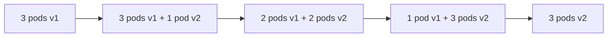

# How to Deploy a Containerized Application to Azure Kubernetes Service Using Azure Pipelines

Author: [nawazdhandala](https://www.github.com/nawazdhandala)

Tags: Azure Kubernetes Service, Azure Pipelines, Docker, Kubernetes, CI/CD, Containers, Azure DevOps

Description: Build a complete CI/CD pipeline that builds Docker images and deploys them to Azure Kubernetes Service using Azure Pipelines.

---

Deploying to Kubernetes through a CI/CD pipeline is one of those things that sounds complicated but follows a predictable pattern once you have done it once. The pipeline builds a Docker image, pushes it to a container registry, and updates the Kubernetes deployment to use the new image. The details of each step matter, though, and getting them wrong leads to broken deployments and frustrated engineers.

In this post, I will build a complete pipeline that takes a .NET application from source code to running in AKS, covering image tagging, manifest management, and the deployment strategies that keep your users happy during updates.

## Prerequisites

Before building the pipeline, you need a few things in place:

- An Azure Kubernetes Service (AKS) cluster
- An Azure Container Registry (ACR)
- The AKS cluster configured to pull images from ACR
- A service connection in Azure DevOps to your Azure subscription
- A Dockerfile for your application

If your AKS cluster does not have pull access to ACR, run this command.

```bash
# Attach ACR to AKS for seamless image pulling
az aks update \
  --resource-group my-rg \
  --name my-aks-cluster \
  --attach-acr myregistry
```

## The Application Dockerfile

Here is a multi-stage Dockerfile for a .NET application. Multi-stage builds keep the final image small by separating the build environment from the runtime environment.

```dockerfile
# Stage 1: Build the application
FROM mcr.microsoft.com/dotnet/sdk:8.0 AS build
WORKDIR /src

# Copy project file and restore dependencies first (better layer caching)
COPY src/MyApp/MyApp.csproj ./MyApp/
RUN dotnet restore MyApp/MyApp.csproj

# Copy the rest of the source code and build
COPY src/MyApp/ ./MyApp/
RUN dotnet publish MyApp/MyApp.csproj -c Release -o /app/publish

# Stage 2: Create the runtime image
FROM mcr.microsoft.com/dotnet/aspnet:8.0 AS runtime
WORKDIR /app

# Copy published output from the build stage
COPY --from=build /app/publish .

# Run as non-root user for security
USER app
EXPOSE 8080
ENTRYPOINT ["dotnet", "MyApp.dll"]
```

## Kubernetes Manifests

You need Kubernetes manifests that describe how your application should run. Create these in a `k8s` directory in your repository.

The deployment manifest defines the pods and their configuration.

```yaml
# k8s/deployment.yaml - Kubernetes Deployment for the application
apiVersion: apps/v1
kind: Deployment
metadata:
  name: myapp
  labels:
    app: myapp
spec:
  replicas: 3
  selector:
    matchLabels:
      app: myapp
  template:
    metadata:
      labels:
        app: myapp
    spec:
      containers:
        - name: myapp
          # Image tag will be replaced by the pipeline
          image: myregistry.azurecr.io/myapp:latest
          ports:
            - containerPort: 8080
          resources:
            requests:
              cpu: "100m"
              memory: "128Mi"
            limits:
              cpu: "500m"
              memory: "512Mi"
          # Health checks
          livenessProbe:
            httpGet:
              path: /health
              port: 8080
            initialDelaySeconds: 10
            periodSeconds: 30
          readinessProbe:
            httpGet:
              path: /ready
              port: 8080
            initialDelaySeconds: 5
            periodSeconds: 10
          env:
            - name: ASPNETCORE_ENVIRONMENT
              value: "Production"
```

The service manifest exposes the deployment within the cluster.

```yaml
# k8s/service.yaml - Kubernetes Service to expose the application
apiVersion: v1
kind: Service
metadata:
  name: myapp-service
spec:
  selector:
    app: myapp
  ports:
    - protocol: TCP
      port: 80
      targetPort: 8080
  type: ClusterIP
```

## The Complete Pipeline

Now let us build the pipeline that ties everything together. This is a multi-stage pipeline with Build and Deploy stages.

```yaml
# azure-pipelines.yml - Build and deploy to AKS
trigger:
  branches:
    include:
      - main
  paths:
    include:
      - src/**
      - k8s/**
      - Dockerfile

variables:
  # Container registry settings
  registryName: 'myregistry'
  registryUrl: 'myregistry.azurecr.io'
  imageName: 'myapp'
  # Use build ID for unique, traceable image tags
  imageTag: '$(Build.BuildId)'
  # Kubernetes settings
  aksClusterName: 'my-aks-cluster'
  aksResourceGroup: 'my-rg'
  kubeNamespace: 'default'

stages:
  # Stage 1: Build and push the Docker image
  - stage: Build
    displayName: 'Build and Push Image'
    jobs:
      - job: BuildImage
        pool:
          vmImage: 'ubuntu-latest'
        steps:
          # Check out the source code
          - checkout: self

          # Build the Docker image
          - task: Docker@2
            displayName: 'Build Docker image'
            inputs:
              containerRegistry: '$(registryName)'
              repository: '$(imageName)'
              command: 'build'
              Dockerfile: 'Dockerfile'
              tags: |
                $(imageTag)
                latest

          # Push the image to ACR
          - task: Docker@2
            displayName: 'Push to ACR'
            inputs:
              containerRegistry: '$(registryName)'
              repository: '$(imageName)'
              command: 'push'
              tags: |
                $(imageTag)
                latest

          # Copy Kubernetes manifests to staging directory
          - task: CopyFiles@2
            displayName: 'Copy K8s manifests'
            inputs:
              sourceFolder: 'k8s'
              contents: '**/*.yaml'
              targetFolder: '$(Build.ArtifactStagingDirectory)/k8s'

          # Publish manifests as pipeline artifact
          - task: PublishBuildArtifacts@1
            displayName: 'Publish manifests'
            inputs:
              pathToPublish: '$(Build.ArtifactStagingDirectory)'
              artifactName: 'manifests'

  # Stage 2: Deploy to AKS
  - stage: Deploy
    displayName: 'Deploy to AKS'
    dependsOn: Build
    jobs:
      - deployment: DeployToAKS
        pool:
          vmImage: 'ubuntu-latest'
        environment: 'aks-production'
        strategy:
          runOnce:
            deploy:
              steps:
                # Replace the image tag in the deployment manifest
                - task: Bash@3
                  displayName: 'Update image tag in manifest'
                  inputs:
                    targetType: 'inline'
                    script: |
                      # Replace the image reference with the specific build tag
                      sed -i 's|myregistry.azurecr.io/myapp:latest|$(registryUrl)/$(imageName):$(imageTag)|g' \
                        $(Pipeline.Workspace)/manifests/k8s/deployment.yaml

                # Deploy to AKS using kubectl
                - task: KubernetesManifest@1
                  displayName: 'Deploy to AKS'
                  inputs:
                    action: 'deploy'
                    connectionType: 'azureResourceManager'
                    azureSubscriptionConnection: 'my-azure-connection'
                    azureResourceGroup: '$(aksResourceGroup)'
                    kubernetesCluster: '$(aksClusterName)'
                    namespace: '$(kubeNamespace)'
                    manifests: |
                      $(Pipeline.Workspace)/manifests/k8s/deployment.yaml
                      $(Pipeline.Workspace)/manifests/k8s/service.yaml
                    containers: |
                      $(registryUrl)/$(imageName):$(imageTag)
```

## Image Tagging Strategy

Using `latest` as your only tag is asking for trouble. You cannot tell which version is running, and Kubernetes might not pull a new image if the tag has not changed (depending on your `imagePullPolicy`).

I use this tagging approach:

- **Build ID tag** (`$(Build.BuildId)`): Unique per build, great for traceability
- **Git commit SHA** (`$(Build.SourceVersion)`): Links the image directly to the code
- **Semantic version**: When your project uses versioning

```yaml
# Multiple tags for different use cases
- task: Docker@2
  displayName: 'Build with multiple tags'
  inputs:
    containerRegistry: '$(registryName)'
    repository: '$(imageName)'
    command: 'build'
    Dockerfile: 'Dockerfile'
    tags: |
      $(Build.BuildId)
      $(Build.SourceVersion)
      latest
```

## Rolling Deployments

The default Kubernetes deployment strategy is a rolling update, which gradually replaces old pods with new ones. You can control how this happens.

```yaml
# k8s/deployment.yaml - Rolling update configuration
spec:
  replicas: 3
  strategy:
    type: RollingUpdate
    rollingUpdate:
      maxSurge: 1        # Create at most 1 extra pod during update
      maxUnavailable: 0   # Keep all existing pods running until new ones are ready
```

With `maxUnavailable: 0` and `maxSurge: 1`, Kubernetes creates a new pod, waits for it to pass its readiness probe, then terminates an old pod. This continues until all pods are updated. Zero downtime, assuming your readiness probe is configured correctly.



## Handling Configuration and Secrets

Do not bake configuration into your Docker image. Use Kubernetes ConfigMaps and Secrets instead.

```yaml
# k8s/configmap.yaml - Application configuration
apiVersion: v1
kind: ConfigMap
metadata:
  name: myapp-config
data:
  ASPNETCORE_ENVIRONMENT: "Production"
  LOG_LEVEL: "Information"
  FEATURE_FLAG_NEW_UI: "true"
```

Reference the ConfigMap in your deployment.

```yaml
# In the deployment spec, reference the ConfigMap
envFrom:
  - configMapRef:
      name: myapp-config
```

For secrets, use Kubernetes Secrets or better yet, integrate with Azure Key Vault using the Secrets Store CSI Driver.

## Verifying Deployments

After deploying, it is good practice to verify that the deployment succeeded. Add a verification step to your pipeline.

```yaml
# Verify the deployment rolled out successfully
- task: Kubernetes@1
  displayName: 'Verify deployment'
  inputs:
    connectionType: 'azureResourceManager'
    azureSubscriptionEndpoint: 'my-azure-connection'
    azureResourceGroup: '$(aksResourceGroup)'
    kubernetesCluster: '$(aksClusterName)'
    namespace: '$(kubeNamespace)'
    command: 'rollout'
    arguments: 'status deployment/myapp --timeout=300s'
```

This command waits up to 5 minutes for the deployment to complete. If the rollout gets stuck (for example, the new pods are crash-looping), the step fails and the pipeline reports the failure.

## Wrapping Up

Deploying to AKS through Azure Pipelines follows a clear pattern: build the image, push to ACR, update the manifest with the new image tag, and apply the manifest to the cluster. The key to doing this well is in the details - proper image tagging for traceability, rolling updates for zero downtime, health probes for reliability, and verification steps for confidence. Start with a simple pipeline that deploys to a single namespace, then add complexity as your needs grow.
