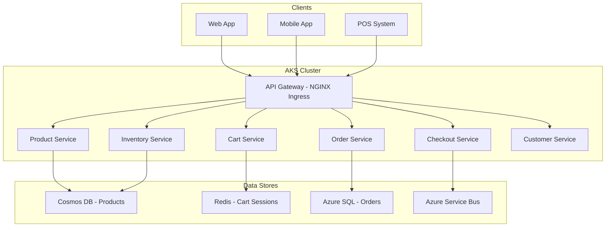

# How to Deploy a Headless Commerce Backend on Azure Kubernetes Service

Author: [nawazdhandala](https://www.github.com/nawazdhandala)

Tags: Azure Kubernetes Service, Headless Commerce, E-Commerce, Microservices, AKS, Retail, Container Orchestration

Description: Deploy a headless commerce backend on Azure Kubernetes Service with microservices for catalog, cart, checkout, and order management.

---

Headless commerce separates the frontend presentation layer from the backend business logic. Your storefront could be a React app, a mobile app, a voice assistant, or even a smart fridge. The backend provides APIs for products, carts, orders, and payments without caring about how they are displayed.

Running a headless commerce backend on Kubernetes gives you the flexibility to scale individual services independently. During a flash sale, your cart and checkout services might need ten times more capacity while the product catalog stays stable. AKS handles this scaling without you re-architecting anything.

## Architecture

A headless commerce backend breaks down into several microservices.



Each service owns its data and communicates with others through the API gateway or asynchronous messaging via Service Bus.

## Step 1 - Create the AKS Cluster

For e-commerce workloads, you want a cluster that can handle traffic spikes. Use the cluster autoscaler to add nodes automatically during peak periods.

```bash
# Create the AKS cluster with autoscaling enabled
az aks create \
  --name commerce-aks \
  --resource-group commerce-rg \
  --node-count 3 \
  --min-count 3 \
  --max-count 20 \
  --enable-cluster-autoscaler \
  --node-vm-size Standard_D4s_v3 \
  --network-plugin azure \
  --enable-managed-identity \
  --enable-addons monitoring \
  --generate-ssh-keys \
  --location eastus

# Get credentials for kubectl
az aks get-credentials --resource-group commerce-rg --name commerce-aks
```

The D4s_v3 nodes give you 4 vCPUs and 16 GB RAM each, which is a good balance for web services. The autoscaler will add up to 20 nodes during peak traffic and scale back down when things calm down.

## Step 2 - Set Up the Ingress Controller

NGINX Ingress Controller routes external traffic to the correct service based on the URL path.

```bash
# Install NGINX Ingress Controller via Helm
helm repo add ingress-nginx https://kubernetes.github.io/ingress-nginx
helm repo update

helm install ingress-nginx ingress-nginx/ingress-nginx \
  --namespace ingress-system \
  --create-namespace \
  --set controller.replicaCount=2 \
  --set controller.service.annotations."service\.beta\.kubernetes\.io/azure-load-balancer-health-probe-request-path"=/healthz
```

Now create the ingress resource that maps paths to services.

```yaml
# ingress.yaml - Route API requests to the appropriate microservice
apiVersion: networking.k8s.io/v1
kind: Ingress
metadata:
  name: commerce-ingress
  namespace: commerce
  annotations:
    nginx.ingress.kubernetes.io/rewrite-target: /
    nginx.ingress.kubernetes.io/rate-limit: "100"
    nginx.ingress.kubernetes.io/ssl-redirect: "true"
spec:
  ingressClassName: nginx
  tls:
    - hosts:
        - api.mystore.com
      secretName: commerce-tls
  rules:
    - host: api.mystore.com
      http:
        paths:
          - path: /api/products
            pathType: Prefix
            backend:
              service:
                name: product-service
                port:
                  number: 80
          - path: /api/cart
            pathType: Prefix
            backend:
              service:
                name: cart-service
                port:
                  number: 80
          - path: /api/checkout
            pathType: Prefix
            backend:
              service:
                name: checkout-service
                port:
                  number: 80
          - path: /api/orders
            pathType: Prefix
            backend:
              service:
                name: order-service
                port:
                  number: 80
```

## Step 3 - Deploy the Product Service

The product service handles CRUD operations on the product catalog. Here is the Kubernetes deployment manifest.

```yaml
# product-service-deployment.yaml
apiVersion: apps/v1
kind: Deployment
metadata:
  name: product-service
  namespace: commerce
spec:
  replicas: 3
  selector:
    matchLabels:
      app: product-service
  template:
    metadata:
      labels:
        app: product-service
    spec:
      containers:
        - name: product-service
          image: myregistry.azurecr.io/product-service:1.2.0
          ports:
            - containerPort: 8080
          resources:
            requests:
              cpu: "250m"
              memory: "256Mi"
            limits:
              cpu: "500m"
              memory: "512Mi"
          env:
            - name: COSMOS_ENDPOINT
              valueFrom:
                secretKeyRef:
                  name: cosmos-secrets
                  key: endpoint
            - name: COSMOS_KEY
              valueFrom:
                secretKeyRef:
                  name: cosmos-secrets
                  key: key
          readinessProbe:
            httpGet:
              path: /health
              port: 8080
            initialDelaySeconds: 10
            periodSeconds: 5
          livenessProbe:
            httpGet:
              path: /health
              port: 8080
            initialDelaySeconds: 30
            periodSeconds: 10
---
apiVersion: v1
kind: Service
metadata:
  name: product-service
  namespace: commerce
spec:
  selector:
    app: product-service
  ports:
    - port: 80
      targetPort: 8080
  type: ClusterIP
---
# Horizontal Pod Autoscaler for the product service
apiVersion: autoscaling/v2
kind: HorizontalPodAutoscaler
metadata:
  name: product-service-hpa
  namespace: commerce
spec:
  scaleTargetRef:
    apiVersion: apps/v1
    kind: Deployment
    name: product-service
  minReplicas: 3
  maxReplicas: 30
  metrics:
    - type: Resource
      resource:
        name: cpu
        target:
          type: Utilization
          averageUtilization: 70
```

The HorizontalPodAutoscaler adds pods when average CPU utilization exceeds 70%. During a sale, when requests pour in, Kubernetes scales the product service from 3 pods to as many as 30. When traffic drops, it scales back down.

## Step 4 - Deploy the Cart Service with Redis

Shopping carts are session-based and need fast reads and writes. Redis is the natural choice. Deploy Azure Cache for Redis and connect the cart service to it.

```bash
# Create Azure Cache for Redis
az redis create \
  --name commerce-cart-cache \
  --resource-group commerce-rg \
  --location eastus \
  --sku Premium \
  --vm-size P1 \
  --enable-non-ssl-port false
```

The cart service deployment is similar to the product service but connects to Redis instead of Cosmos DB.

```yaml
# cart-service-deployment.yaml
apiVersion: apps/v1
kind: Deployment
metadata:
  name: cart-service
  namespace: commerce
spec:
  replicas: 3
  selector:
    matchLabels:
      app: cart-service
  template:
    metadata:
      labels:
        app: cart-service
    spec:
      containers:
        - name: cart-service
          image: myregistry.azurecr.io/cart-service:1.1.0
          ports:
            - containerPort: 8080
          resources:
            requests:
              cpu: "250m"
              memory: "256Mi"
            limits:
              cpu: "500m"
              memory: "512Mi"
          env:
            - name: REDIS_HOST
              valueFrom:
                secretKeyRef:
                  name: redis-secrets
                  key: host
            - name: REDIS_PASSWORD
              valueFrom:
                secretKeyRef:
                  name: redis-secrets
                  key: password
            - name: CART_TTL_HOURS
              value: "72"
          readinessProbe:
            httpGet:
              path: /health
              port: 8080
            initialDelaySeconds: 5
            periodSeconds: 5
```

## Step 5 - Deploy the Checkout Service with Event-Driven Processing

Checkout is the most critical path. It needs to validate inventory, process payment, and create an order. Using Service Bus for asynchronous processing makes the system more resilient.

```yaml
# checkout-service-deployment.yaml
apiVersion: apps/v1
kind: Deployment
metadata:
  name: checkout-service
  namespace: commerce
spec:
  replicas: 3
  selector:
    matchLabels:
      app: checkout-service
  template:
    metadata:
      labels:
        app: checkout-service
    spec:
      containers:
        - name: checkout-service
          image: myregistry.azurecr.io/checkout-service:1.0.5
          ports:
            - containerPort: 8080
          resources:
            requests:
              cpu: "500m"
              memory: "512Mi"
            limits:
              cpu: "1"
              memory: "1Gi"
          env:
            - name: SERVICE_BUS_CONNECTION
              valueFrom:
                secretKeyRef:
                  name: servicebus-secrets
                  key: connection-string
            - name: PAYMENT_GATEWAY_URL
              value: "https://api.stripe.com/v1"
            - name: PAYMENT_GATEWAY_KEY
              valueFrom:
                secretKeyRef:
                  name: payment-secrets
                  key: api-key
```

The checkout flow works like this: the client submits a checkout request, the service validates the cart and inventory synchronously, processes payment, then publishes an OrderCreated event to Service Bus. The order service picks up the event asynchronously to create the order record, send confirmation emails, and update inventory.

## Step 6 - Manage Secrets with Azure Key Vault

Never hardcode secrets in your manifests. Use the Azure Key Vault provider for the Secrets Store CSI driver.

```bash
# Enable the CSI driver addon
az aks enable-addons \
  --addons azure-keyvault-secrets-provider \
  --name commerce-aks \
  --resource-group commerce-rg

# Create a Key Vault
az keyvault create \
  --name commerce-kv \
  --resource-group commerce-rg \
  --location eastus
```

Then create a SecretProviderClass that maps Key Vault secrets to Kubernetes secrets.

```yaml
# secret-provider.yaml
apiVersion: secrets-store.csi.x-k8s.io/v1
kind: SecretProviderClass
metadata:
  name: commerce-secrets
  namespace: commerce
spec:
  provider: azure
  parameters:
    usePodIdentity: "false"
    useVMManagedIdentity: "true"
    userAssignedIdentityID: "<managed-identity-client-id>"
    keyvaultName: "commerce-kv"
    objects: |
      array:
        - |
          objectName: cosmos-endpoint
          objectType: secret
        - |
          objectName: cosmos-key
          objectType: secret
        - |
          objectName: redis-connection
          objectType: secret
    tenantId: "<tenant-id>"
```

## Monitoring and Observability

Deploy Prometheus and Grafana for metrics, and use Azure Monitor Container Insights for log aggregation. Create alerts for key e-commerce metrics:

- Cart abandonment rate spikes
- Checkout error rate exceeding 1%
- P99 response time on the product API exceeding 500ms
- Pod restart loops on any service

These alerts catch issues before they turn into lost revenue.

## Wrapping Up

A headless commerce backend on AKS gives you the scalability and flexibility that monolithic e-commerce platforms struggle with. Each service scales independently based on demand. The Kubernetes ecosystem provides robust tooling for deployment, secret management, and monitoring. Start with the core services - product catalog, cart, checkout, and orders - and add capabilities like recommendations and search as separate services. The headless approach means your backend serves any frontend, from web to mobile to IoT, through the same API layer.
