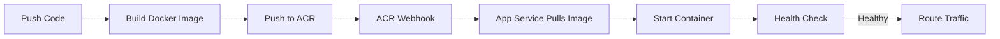

# How to Deploy a NestJS Application to Azure App Service with Docker

Author: [nawazdhandala](https://www.github.com/nawazdhandala)

Tags: NestJS, Azure App Service, Docker, Node.js, TypeScript, Containerization, Deployment

Description: Learn how to containerize a NestJS application with Docker and deploy it to Azure App Service for production-ready hosting with automatic scaling.

---

NestJS is a framework for building scalable server-side applications with TypeScript. It brings structure and patterns from Angular to the backend, with dependency injection, modules, and decorators. When you containerize a NestJS app with Docker, you get a portable, reproducible deployment artifact. Azure App Service for Containers lets you run that container on managed infrastructure with auto-scaling, custom domains, and deployment slots.

In this post, we will build a NestJS application, create an optimized Docker image, push it to Azure Container Registry, and deploy it to Azure App Service.

## Creating the NestJS Application

Scaffold a new NestJS project.

```bash
# Install the NestJS CLI
npm install -g @nestjs/cli

# Create a new project
nest new task-manager
cd task-manager

# Install additional dependencies
npm install @nestjs/config class-validator class-transformer
```

## Building the API

Create a task module with a controller, service, and DTO.

```typescript
// src/tasks/dto/create-task.dto.ts
import { IsNotEmpty, IsOptional, IsString, MinLength } from "class-validator";

// Data transfer object for creating tasks
export class CreateTaskDto {
    @IsNotEmpty()
    @IsString()
    @MinLength(3)
    title: string;

    @IsOptional()
    @IsString()
    description?: string;
}
```

```typescript
// src/tasks/dto/update-task.dto.ts
import { IsBoolean, IsOptional, IsString } from "class-validator";

// Data transfer object for updating tasks
export class UpdateTaskDto {
    @IsOptional()
    @IsString()
    title?: string;

    @IsOptional()
    @IsString()
    description?: string;

    @IsOptional()
    @IsBoolean()
    completed?: boolean;
}
```

```typescript
// src/tasks/task.interface.ts
// Defines the shape of a task object
export interface Task {
    id: string;
    title: string;
    description: string;
    completed: boolean;
    createdAt: Date;
    updatedAt: Date;
}
```

```typescript
// src/tasks/tasks.service.ts
import { Injectable, NotFoundException } from "@nestjs/common";
import { Task } from "./task.interface";
import { CreateTaskDto } from "./dto/create-task.dto";
import { UpdateTaskDto } from "./dto/update-task.dto";
import { v4 as uuidv4 } from "uuid";

@Injectable()
export class TasksService {
    // In-memory store (use a database in production)
    private tasks: Task[] = [];

    findAll(completed?: boolean): Task[] {
        if (completed !== undefined) {
            return this.tasks.filter(t => t.completed === completed);
        }
        return this.tasks;
    }

    findOne(id: string): Task {
        const task = this.tasks.find(t => t.id === id);
        if (!task) {
            throw new NotFoundException(`Task with ID ${id} not found`);
        }
        return task;
    }

    create(dto: CreateTaskDto): Task {
        const task: Task = {
            id: uuidv4(),
            title: dto.title,
            description: dto.description || "",
            completed: false,
            createdAt: new Date(),
            updatedAt: new Date(),
        };
        this.tasks.push(task);
        return task;
    }

    update(id: string, dto: UpdateTaskDto): Task {
        const task = this.findOne(id);

        if (dto.title !== undefined) task.title = dto.title;
        if (dto.description !== undefined) task.description = dto.description;
        if (dto.completed !== undefined) task.completed = dto.completed;
        task.updatedAt = new Date();

        return task;
    }

    remove(id: string): void {
        const index = this.tasks.findIndex(t => t.id === id);
        if (index === -1) {
            throw new NotFoundException(`Task with ID ${id} not found`);
        }
        this.tasks.splice(index, 1);
    }
}
```

```typescript
// src/tasks/tasks.controller.ts
import {
    Controller, Get, Post, Put, Delete,
    Body, Param, Query, HttpCode, HttpStatus
} from "@nestjs/common";
import { TasksService } from "./tasks.service";
import { CreateTaskDto } from "./dto/create-task.dto";
import { UpdateTaskDto } from "./dto/update-task.dto";
import { Task } from "./task.interface";

@Controller("api/tasks")
export class TasksController {
    constructor(private readonly tasksService: TasksService) {}

    @Get()
    findAll(@Query("completed") completed?: string): Task[] {
        if (completed !== undefined) {
            return this.tasksService.findAll(completed === "true");
        }
        return this.tasksService.findAll();
    }

    @Get(":id")
    findOne(@Param("id") id: string): Task {
        return this.tasksService.findOne(id);
    }

    @Post()
    @HttpCode(HttpStatus.CREATED)
    create(@Body() dto: CreateTaskDto): Task {
        return this.tasksService.create(dto);
    }

    @Put(":id")
    update(@Param("id") id: string, @Body() dto: UpdateTaskDto): Task {
        return this.tasksService.update(id, dto);
    }

    @Delete(":id")
    @HttpCode(HttpStatus.NO_CONTENT)
    remove(@Param("id") id: string): void {
        this.tasksService.remove(id);
    }
}
```

```typescript
// src/tasks/tasks.module.ts
import { Module } from "@nestjs/common";
import { TasksController } from "./tasks.controller";
import { TasksService } from "./tasks.service";

@Module({
    controllers: [TasksController],
    providers: [TasksService],
})
export class TasksModule {}
```

Add a health check controller.

```typescript
// src/health/health.controller.ts
import { Controller, Get } from "@nestjs/common";

@Controller("health")
export class HealthController {
    @Get()
    check() {
        return {
            status: "healthy",
            uptime: process.uptime(),
            timestamp: new Date().toISOString(),
            environment: process.env.NODE_ENV || "development",
        };
    }
}
```

Update the app module.

```typescript
// src/app.module.ts
import { Module } from "@nestjs/common";
import { ConfigModule } from "@nestjs/config";
import { TasksModule } from "./tasks/tasks.module";
import { HealthController } from "./health/health.controller";

@Module({
    imports: [
        ConfigModule.forRoot({ isGlobal: true }),
        TasksModule,
    ],
    controllers: [HealthController],
})
export class AppModule {}
```

Update the main entry point.

```typescript
// src/main.ts
import { NestFactory } from "@nestjs/core";
import { ValidationPipe } from "@nestjs/common";
import { AppModule } from "./app.module";

async function bootstrap() {
    const app = await NestFactory.create(AppModule);

    // Enable global validation pipe
    app.useGlobalPipes(new ValidationPipe({
        whitelist: true,         // Strip unknown properties
        forbidNonWhitelisted: true, // Reject unknown properties
        transform: true,         // Auto-transform payloads to DTO types
    }));

    // Enable CORS
    app.enableCors();

    // Azure App Service uses the PORT environment variable
    const port = process.env.PORT || 3000;
    await app.listen(port);

    console.log(`Application running on port ${port}`);
}

bootstrap();
```

## Creating the Dockerfile

Build a multi-stage Dockerfile for an optimized production image.

```dockerfile
# Stage 1: Build the application
FROM node:20-alpine AS builder
WORKDIR /app

# Copy package files first for better layer caching
COPY package*.json ./
RUN npm ci

# Copy source code and build
COPY . .
RUN npm run build

# Remove dev dependencies after building
RUN npm prune --production

# Stage 2: Production image
FROM node:20-alpine AS production
WORKDIR /app

# Create a non-root user for security
RUN addgroup -g 1001 -S appgroup && \
    adduser -S appuser -u 1001

# Copy only what we need from the build stage
COPY --from=builder /app/dist ./dist
COPY --from=builder /app/node_modules ./node_modules
COPY --from=builder /app/package.json ./

# Set environment variables
ENV NODE_ENV=production
ENV PORT=8080

# Switch to non-root user
USER appuser

# Expose the port
EXPOSE 8080

# Health check
HEALTHCHECK --interval=30s --timeout=3s --start-period=10s --retries=3 \
    CMD wget --no-verbose --tries=1 --spider http://localhost:8080/health || exit 1

# Start the application
CMD ["node", "dist/main"]
```

Add a `.dockerignore` file to keep the image small.

```
node_modules
dist
.git
.github
*.md
.env
tests
coverage
```

## Building and Testing Locally

```bash
# Build the Docker image
docker build -t task-manager:latest .

# Run the container locally
docker run -p 8080:8080 task-manager:latest

# Test the endpoints
curl http://localhost:8080/health
curl http://localhost:8080/api/tasks
curl -X POST http://localhost:8080/api/tasks \
  -H "Content-Type: application/json" \
  -d '{"title": "Test task", "description": "Created from Docker"}'
```

## Deploying to Azure

Create the Azure resources and deploy the container.

```bash
# Create a resource group
az group create --name nestjs-demo-rg --location eastus

# Create an Azure Container Registry
az acr create --name mynestjsregistry --resource-group nestjs-demo-rg --sku Basic

# Login to the registry
az acr login --name mynestjsregistry

# Build and push the image using ACR Tasks (no local Docker needed)
az acr build --registry mynestjsregistry --image task-manager:v1 .

# Create an App Service plan for containers
az appservice plan create \
  --name nestjs-plan \
  --resource-group nestjs-demo-rg \
  --is-linux \
  --sku B1

# Create the web app with the container image
az webapp create \
  --name my-nestjs-app \
  --resource-group nestjs-demo-rg \
  --plan nestjs-plan \
  --deployment-container-image-name mynestjsregistry.azurecr.io/task-manager:v1

# Configure the registry credentials
az webapp config container set \
  --name my-nestjs-app \
  --resource-group nestjs-demo-rg \
  --container-image-name mynestjsregistry.azurecr.io/task-manager:v1 \
  --container-registry-url https://mynestjsregistry.azurecr.io

# Enable continuous deployment from ACR
az webapp deployment container config \
  --name my-nestjs-app \
  --resource-group nestjs-demo-rg \
  --enable-cd true

# Set environment variables
az webapp config appsettings set \
  --name my-nestjs-app \
  --resource-group nestjs-demo-rg \
  --settings NODE_ENV=production WEBSITES_PORT=8080
```

The `WEBSITES_PORT` setting tells App Service which port your container listens on. This must match the `EXPOSE` in your Dockerfile.

## The Deployment Architecture



## Setting Up CI/CD with GitHub Actions

Automate the build and deployment process.

```yaml
# .github/workflows/deploy.yml
name: Build and Deploy NestJS

on:
  push:
    branches: [main]

env:
  ACR_NAME: mynestjsregistry
  APP_NAME: my-nestjs-app
  RESOURCE_GROUP: nestjs-demo-rg

jobs:
  build-and-deploy:
    runs-on: ubuntu-latest

    steps:
      - uses: actions/checkout@v4

      - name: Login to Azure
        uses: azure/login@v1
        with:
          creds: ${{ secrets.AZURE_CREDENTIALS }}

      - name: Login to ACR
        run: az acr login --name ${{ env.ACR_NAME }}

      - name: Build and push image
        run: |
          docker build -t ${{ env.ACR_NAME }}.azurecr.io/task-manager:${{ github.sha }} .
          docker push ${{ env.ACR_NAME }}.azurecr.io/task-manager:${{ github.sha }}

      - name: Deploy to App Service
        run: |
          az webapp config container set \
            --name ${{ env.APP_NAME }} \
            --resource-group ${{ env.RESOURCE_GROUP }} \
            --container-image-name ${{ env.ACR_NAME }}.azurecr.io/task-manager:${{ github.sha }}

      - name: Verify deployment
        run: |
          sleep 60
          curl -f https://${{ env.APP_NAME }}.azurewebsites.net/health
```

## Performance Tuning

For production NestJS deployments, consider these optimizations:

1. Use the `--max-old-space-size` flag to control Node.js memory limits
2. Enable gzip compression in NestJS
3. Use the Fastify adapter instead of Express for better performance

```typescript
// Use Fastify for better performance
import { NestFactory } from "@nestjs/core";
import { FastifyAdapter, NestFastifyApplication } from "@nestjs/platform-fastify";
import { AppModule } from "./app.module";

async function bootstrap() {
    const app = await NestFactory.create<NestFastifyApplication>(
        AppModule,
        new FastifyAdapter()
    );

    await app.listen(process.env.PORT || 3000, "0.0.0.0");
}
```

## Wrapping Up

Containerizing a NestJS application with Docker and deploying it to Azure App Service gives you a production-ready setup with minimal effort. The multi-stage Dockerfile keeps your image small, the health check ensures App Service knows when your container is ready, and continuous deployment from ACR means every image push triggers a new deployment. Use deployment slots for zero-downtime releases and auto-scaling rules for handling traffic spikes.
