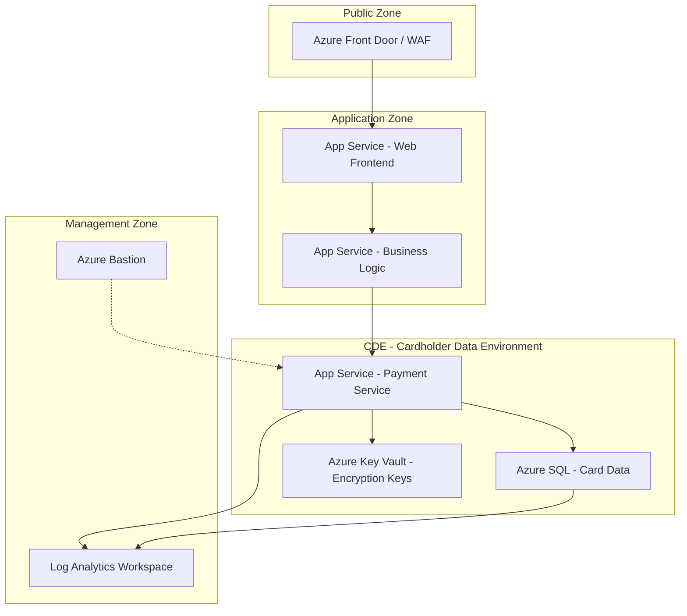

# How to Deploy a PCI DSS Compliant Payment Processing Architecture on Azure

Author: [nawazdhandala](https://www.github.com/nawazdhandala)

Tags: PCI DSS, Azure, Payment Processing, Cloud Security, Compliance, Financial Services, Network Security

Description: Deploy a PCI DSS compliant payment processing architecture on Azure with network segmentation, encryption, and audit logging.

---

If you process, store, or transmit credit card data, you must comply with PCI DSS. There is no way around it. The Payment Card Industry Data Security Standard has 12 requirements spread across six categories, and failing an audit can mean fines, higher processing fees, or losing your ability to accept cards entirely.

Azure provides the infrastructure to meet PCI DSS requirements, but it does not make you compliant automatically. You still need to architect your solution correctly, configure security controls, and maintain them. This guide covers how to build a payment processing architecture on Azure that satisfies PCI DSS requirements.

## Understanding the Shared Responsibility Model

Azure is a PCI DSS Level 1 Service Provider, meaning Microsoft maintains compliance for the underlying infrastructure. But that only covers the physical data centers, hypervisors, and core network infrastructure. Everything you deploy on top of that - your virtual machines, databases, applications, and configurations - is your responsibility.

Think of it this way: Azure gives you compliant building blocks, but you are responsible for assembling them correctly.

## Architecture Overview

The architecture separates the cardholder data environment (CDE) from everything else. Only the components that directly handle card data live in the CDE. All other systems sit outside it.



The CDE is the smallest possible footprint. The web frontend never sees card numbers. The business logic layer handles orders but passes payment details directly to the payment service, which is the only component in scope.

## Step 1 - Network Segmentation

PCI DSS Requirement 1 mandates firewall and network segmentation. On Azure, this means Virtual Networks, Network Security Groups (NSGs), and private endpoints.

```bash
# Create the main VNet with separate subnets for each zone
az network vnet create \
  --name payment-vnet \
  --resource-group payment-rg \
  --address-prefix 10.0.0.0/16 \
  --location eastus

# Public-facing subnet
az network vnet subnet create \
  --vnet-name payment-vnet \
  --resource-group payment-rg \
  --name public-subnet \
  --address-prefix 10.0.1.0/24

# Application subnet (non-CDE)
az network vnet subnet create \
  --vnet-name payment-vnet \
  --resource-group payment-rg \
  --name app-subnet \
  --address-prefix 10.0.2.0/24

# CDE subnet - tightly locked down
az network vnet subnet create \
  --vnet-name payment-vnet \
  --resource-group payment-rg \
  --name cde-subnet \
  --address-prefix 10.0.3.0/24

# Management subnet for bastion access
az network vnet subnet create \
  --vnet-name payment-vnet \
  --resource-group payment-rg \
  --name AzureBastionSubnet \
  --address-prefix 10.0.4.0/27
```

Now lock down the CDE subnet with an NSG that only allows traffic from the application subnet on specific ports.

```bash
# Create NSG for the CDE subnet
az network nsg create \
  --name cde-nsg \
  --resource-group payment-rg

# Allow HTTPS from application subnet only
az network nsg rule create \
  --nsg-name cde-nsg \
  --resource-group payment-rg \
  --name allow-app-to-cde \
  --priority 100 \
  --source-address-prefixes 10.0.2.0/24 \
  --destination-port-ranges 443 \
  --direction Inbound \
  --access Allow \
  --protocol Tcp

# Deny all other inbound traffic
az network nsg rule create \
  --nsg-name cde-nsg \
  --resource-group payment-rg \
  --name deny-all-inbound \
  --priority 4096 \
  --source-address-prefixes "*" \
  --destination-port-ranges "*" \
  --direction Inbound \
  --access Deny \
  --protocol "*"

# Associate NSG with CDE subnet
az network vnet subnet update \
  --vnet-name payment-vnet \
  --resource-group payment-rg \
  --name cde-subnet \
  --network-security-group cde-nsg
```

## Step 2 - Encrypt Cardholder Data

PCI DSS Requirement 3 requires that stored cardholder data is encrypted. Requirement 4 requires encryption in transit. Azure gives you both.

For data in transit, enforce TLS 1.2 or higher on all connections. For data at rest, use Azure SQL Transparent Data Encryption (TDE) with customer-managed keys stored in Azure Key Vault.

```bash
# Create a Key Vault for encryption keys with HSM-backed keys
az keyvault create \
  --name payment-keyvault \
  --resource-group payment-rg \
  --location eastus \
  --sku premium \
  --enable-purge-protection true \
  --enable-soft-delete true

# Create a customer-managed key for SQL TDE
az keyvault key create \
  --vault-name payment-keyvault \
  --name sql-tde-key \
  --kty RSA \
  --size 2048

# Configure Azure SQL to use the customer-managed key
az sql server tde-key set \
  --server-name payment-sql-server \
  --resource-group payment-rg \
  --server-key-type AzureKeyVault \
  --kid "https://payment-keyvault.vault.azure.net/keys/sql-tde-key/<version>"
```

Using customer-managed keys means you control the encryption key lifecycle. If you need to revoke access, you can disable the key in Key Vault and the database becomes unreadable. This is a strong control that auditors appreciate.

## Step 3 - Implement Access Controls

PCI DSS Requirements 7 and 8 deal with access control. You need to restrict access to cardholder data on a need-to-know basis and assign unique IDs to each person with access.

Use Azure Active Directory with role-based access control (RBAC). Create custom roles that give the minimum necessary permissions.

```bash
# Create a custom role for payment service operators
az role definition create --role-definition '{
  "Name": "Payment CDE Operator",
  "Description": "Limited access to CDE resources for payment operations",
  "Actions": [
    "Microsoft.Sql/servers/databases/read",
    "Microsoft.Web/sites/read",
    "Microsoft.Web/sites/restart/action",
    "Microsoft.KeyVault/vaults/secrets/read"
  ],
  "NotActions": [
    "Microsoft.Sql/servers/databases/delete",
    "Microsoft.Sql/servers/delete"
  ],
  "AssignableScopes": [
    "/subscriptions/<sub-id>/resourceGroups/payment-rg"
  ]
}'

# Require MFA for all CDE access via Conditional Access
# This is configured in Azure AD portal or via Graph API
```

Enforce multi-factor authentication for anyone accessing CDE resources. PCI DSS 3.2.1 requires MFA for all remote access to the CDE.

## Step 4 - Enable Comprehensive Logging

PCI DSS Requirement 10 requires tracking all access to network resources and cardholder data. Azure Monitor and Log Analytics provide centralized logging.

```bash
# Create a Log Analytics workspace for PCI audit logs
az monitor log-analytics workspace create \
  --workspace-name pci-audit-logs \
  --resource-group payment-rg \
  --location eastus \
  --retention-time 365

# Enable diagnostic logging on the SQL server
az monitor diagnostic-settings create \
  --name sql-diagnostics \
  --resource "/subscriptions/<sub-id>/resourceGroups/payment-rg/providers/Microsoft.Sql/servers/payment-sql-server/databases/payment-db" \
  --workspace pci-audit-logs \
  --logs '[{"category": "SQLSecurityAuditEvents", "enabled": true}, {"category": "SQLInsights", "enabled": true}]' \
  --metrics '[{"category": "AllMetrics", "enabled": true}]'

# Enable Key Vault audit logging
az monitor diagnostic-settings create \
  --name kv-diagnostics \
  --resource "/subscriptions/<sub-id>/resourceGroups/payment-rg/providers/Microsoft.KeyVault/vaults/payment-keyvault" \
  --workspace pci-audit-logs \
  --logs '[{"category": "AuditEvent", "enabled": true}]'
```

Set the retention to 365 days minimum. PCI DSS requires at least one year of audit log retention, with the most recent three months immediately available for analysis.

## Step 5 - Deploy a Web Application Firewall

PCI DSS Requirement 6.6 requires either a web application firewall or regular code reviews for public-facing applications. A WAF is more practical for ongoing protection.

```bash
# Create Azure Front Door with WAF policy
az network front-door waf-policy create \
  --name payment-waf-policy \
  --resource-group payment-rg \
  --mode Prevention

# Enable the OWASP managed rule set
az network front-door waf-policy managed-rules add \
  --policy-name payment-waf-policy \
  --resource-group payment-rg \
  --type DefaultRuleSet \
  --version 1.0 \
  --action Block

# Add rate limiting rule to prevent brute force attacks
az network front-door waf-policy rule create \
  --name rate-limit-rule \
  --policy-name payment-waf-policy \
  --resource-group payment-rg \
  --rule-type RateLimitRule \
  --rate-limit-threshold 100 \
  --rate-limit-duration-in-minutes 1 \
  --action Block \
  --priority 1
```

## Step 6 - Vulnerability Scanning

PCI DSS Requirement 11 requires regular vulnerability scanning. Use Microsoft Defender for Cloud to continuously assess your Azure resources.

```bash
# Enable Defender for Cloud on the subscription
az security pricing create \
  --name VirtualMachines \
  --tier Standard

az security pricing create \
  --name SqlServers \
  --tier Standard

az security pricing create \
  --name AppServices \
  --tier Standard

az security pricing create \
  --name KeyVaults \
  --tier Standard
```

Defender for Cloud provides vulnerability assessments, security recommendations, and alerts for suspicious activity. It maps findings to PCI DSS requirements, which makes filling out your Self-Assessment Questionnaire much easier.

## Tokenization Strategy

A proven way to reduce PCI scope is tokenization. Instead of storing actual card numbers, store tokens that reference the real data held by a payment processor. This way, most of your system never touches cardholder data.

Your payment flow should look like this: the customer enters their card details in a payment form hosted by your processor (like Stripe Elements or Adyen Drop-in). The processor returns a token. Your system stores the token and uses it for subsequent transactions. The actual card number never touches your servers.

This approach dramatically reduces your CDE footprint and simplifies compliance. You still need some controls in place, but the scope of your PCI assessment is much smaller.

## Wrapping Up

PCI DSS compliance on Azure is achievable but requires deliberate architecture decisions. Segment your network so the CDE is the smallest possible surface. Encrypt everything in transit and at rest with customer-managed keys. Lock down access with RBAC and MFA. Log everything and keep those logs for at least a year. Deploy a WAF in front of your public endpoints and run continuous vulnerability assessments. Where possible, use tokenization to avoid handling card data at all. These are not optional nice-to-haves. They are the baseline for processing payments securely.
