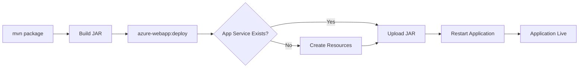

# How to Deploy a Spring Boot Application to Azure App Service with Maven Plugin

Author: [nawazdhandala](https://www.github.com/nawazdhandala)

Tags: Spring Boot, Azure App Service, Maven Plugin, Java, Deployment, Cloud, Azure Web Apps

Description: Learn how to deploy a Spring Boot application to Azure App Service using the Azure Maven Plugin for streamlined cloud deployments.

---

Deploying a Spring Boot application to Azure App Service does not require Docker containers, custom scripts, or complicated CI/CD pipelines. The Azure Maven Plugin lets you deploy directly from your Maven project with a single command. It handles creating the App Service resource, configuring the Java runtime, and uploading your application - all from the command line.

In this post, we will take a Spring Boot application, configure the Azure Maven Plugin, and deploy it to Azure App Service. We will also cover environment configuration, deployment slots, and some lessons learned from running Spring Boot in production on App Service.

## Why Azure App Service?

Azure App Service is a fully managed platform for hosting web applications. You do not manage VMs, operating systems, or middleware. You give it your application, and it runs it. For Java applications, App Service provides built-in support for Java 8, 11, 17, and 21 with both Tomcat and Java SE (embedded server) options.

The advantages over running containers on something like Azure Container Apps or AKS are simplicity and speed. You trade flexibility for convenience. If your Spring Boot app uses an embedded Tomcat server and does not need special OS-level dependencies, App Service is the fastest path to production.

## Creating the Spring Boot Application

Let's start with a simple Spring Boot REST API.

```xml
<!-- pom.xml -->
<parent>
    <groupId>org.springframework.boot</groupId>
    <artifactId>spring-boot-starter-parent</artifactId>
    <version>3.2.0</version>
</parent>

<dependencies>
    <dependency>
        <groupId>org.springframework.boot</groupId>
        <artifactId>spring-boot-starter-web</artifactId>
    </dependency>
    <dependency>
        <groupId>org.springframework.boot</groupId>
        <artifactId>spring-boot-starter-actuator</artifactId>
    </dependency>
</dependencies>
```

Create a basic controller and a health endpoint.

```java
import org.springframework.web.bind.annotation.GetMapping;
import org.springframework.web.bind.annotation.RestController;

import java.time.Instant;
import java.util.Map;

@RestController
public class HelloController {

    // Simple health check endpoint
    @GetMapping("/")
    public Map<String, String> hello() {
        return Map.of(
            "message", "Hello from Azure App Service",
            "timestamp", Instant.now().toString(),
            "java.version", System.getProperty("java.version")
        );
    }

    // Status endpoint for monitoring
    @GetMapping("/status")
    public Map<String, Object> status() {
        Runtime runtime = Runtime.getRuntime();
        return Map.of(
            "status", "healthy",
            "freeMemory", runtime.freeMemory() / 1024 / 1024 + " MB",
            "totalMemory", runtime.totalMemory() / 1024 / 1024 + " MB",
            "maxMemory", runtime.maxMemory() / 1024 / 1024 + " MB",
            "availableProcessors", runtime.availableProcessors()
        );
    }
}
```

## Adding the Azure Maven Plugin

Add the Azure Web App Maven plugin to your `pom.xml`.

```xml
<build>
    <plugins>
        <!-- Spring Boot Maven Plugin for building the JAR -->
        <plugin>
            <groupId>org.springframework.boot</groupId>
            <artifactId>spring-boot-maven-plugin</artifactId>
        </plugin>

        <!-- Azure Web App Maven Plugin for deployment -->
        <plugin>
            <groupId>com.microsoft.azure</groupId>
            <artifactId>azure-webapp-maven-plugin</artifactId>
            <version>2.12.0</version>
            <configuration>
                <!-- Subscription ID (optional if you only have one) -->
                <subscriptionId>your-subscription-id</subscriptionId>

                <!-- Resource group - created automatically if it does not exist -->
                <resourceGroup>spring-boot-demo-rg</resourceGroup>

                <!-- App Service name - must be globally unique -->
                <appName>my-spring-boot-app</appName>

                <!-- Region for the App Service -->
                <region>eastus</region>

                <!-- Pricing tier: B1 (Basic), S1 (Standard), P1v2 (Premium) -->
                <pricingTier>B1</pricingTier>

                <!-- Java runtime configuration -->
                <runtime>
                    <os>Linux</os>
                    <javaVersion>Java 17</javaVersion>
                    <webContainer>Java SE</webContainer>
                </runtime>

                <!-- App settings (environment variables) -->
                <appSettings>
                    <property>
                        <name>SPRING_PROFILES_ACTIVE</name>
                        <value>azure</value>
                    </property>
                    <property>
                        <name>JAVA_OPTS</name>
                        <value>-Xms512m -Xmx1024m</value>
                    </property>
                </appSettings>

                <!-- Deployment configuration -->
                <deployment>
                    <resources>
                        <resource>
                            <directory>${project.basedir}/target</directory>
                            <includes>
                                <include>*.jar</include>
                            </includes>
                        </resource>
                    </resources>
                </deployment>
            </configuration>
        </plugin>
    </plugins>
</build>
```

## Authenticating with Azure

Before deploying, you need to authenticate. The simplest way is through the Azure CLI.

```bash
# Login to Azure
az login

# Verify your subscription
az account show
```

The Maven plugin picks up your Azure CLI credentials automatically. For CI/CD pipelines, you can use a service principal instead.

```bash
# Create a service principal for CI/CD
az ad sp create-for-rbac --name "spring-boot-deployer" --role contributor \
  --scopes /subscriptions/your-subscription-id/resourceGroups/spring-boot-demo-rg
```

Store the credentials in your Maven settings.xml or as environment variables.

## Deploying the Application

Build and deploy in one step.

```bash
# Build the JAR and deploy to Azure App Service
mvn clean package azure-webapp:deploy
```

The first time you run this, the plugin will:
1. Create the resource group if it does not exist
2. Create the App Service Plan
3. Create the App Service
4. Upload your JAR file
5. Start the application

Subsequent deployments only upload the new JAR and restart the app.

The deployment flow looks like this:



## Configuring Application Properties for Azure

Create an Azure-specific profile for your application settings.

```properties
# application-azure.properties
# Server configuration
server.port=80

# Logging - write to console, App Service captures it
logging.level.root=INFO
logging.level.com.example=DEBUG

# Actuator endpoints for health checks
management.endpoints.web.exposure.include=health,info,metrics
management.endpoint.health.show-details=when-authorized

# Database connection (use App Service connection strings)
spring.datasource.url=${AZURE_MYSQL_CONNECTIONSTRING:jdbc:mysql://localhost:3306/mydb}
```

## Using Deployment Slots

Deployment slots let you deploy to a staging environment, verify everything works, and then swap the staging slot into production with zero downtime.

```xml
<!-- Add deployment slot configuration to the Maven plugin -->
<configuration>
    <!-- ... existing config ... -->
    <deploymentSlotSetting>
        <name>staging</name>
    </deploymentSlotSetting>
</configuration>
```

Deploy to the staging slot.

```bash
# Deploy to the staging slot
mvn clean package azure-webapp:deploy
```

Then swap the staging slot to production through the Azure CLI.

```bash
# Swap staging to production
az webapp deployment slot swap \
  --name my-spring-boot-app \
  --resource-group spring-boot-demo-rg \
  --slot staging \
  --target-slot production
```

## Configuring Custom Startup Commands

Sometimes Spring Boot needs custom JVM options or startup commands. Configure this in your App Service.

```bash
# Set a custom startup command
az webapp config set \
  --name my-spring-boot-app \
  --resource-group spring-boot-demo-rg \
  --startup-file "java -jar /home/site/wwwroot/app.jar --server.port=80 -Xms512m -Xmx1024m"
```

## Enabling Application Insights

Azure Application Insights provides monitoring, logging, and performance tracking for your Spring Boot application.

```xml
<!-- Add Application Insights dependency -->
<dependency>
    <groupId>com.microsoft.azure</groupId>
    <artifactId>applicationinsights-spring-boot-starter</artifactId>
    <version>2.6.4</version>
</dependency>
```

```properties
# application-azure.properties
# Application Insights configuration
azure.application-insights.instrumentation-key=${APPINSIGHTS_INSTRUMENTATIONKEY}
azure.application-insights.enabled=true
```

Enable Application Insights on the App Service through the Portal or CLI, and the instrumentation key is injected automatically as an environment variable.

## Scaling Configuration

App Service supports both manual and automatic scaling.

```bash
# Scale up (change the pricing tier for more CPU/memory)
az appservice plan update \
  --name my-spring-boot-app-plan \
  --resource-group spring-boot-demo-rg \
  --sku P1v2

# Scale out (add more instances)
az webapp update \
  --name my-spring-boot-app \
  --resource-group spring-boot-demo-rg \
  --set siteConfig.numberOfWorkers=3

# Configure auto-scaling rules
az monitor autoscale create \
  --resource-group spring-boot-demo-rg \
  --resource my-spring-boot-app-plan \
  --resource-type Microsoft.Web/serverfarms \
  --name auto-scale-rule \
  --min-count 1 \
  --max-count 10 \
  --count 2
```

## Troubleshooting Deployments

When things go wrong, here is how to debug.

```bash
# View application logs in real time
az webapp log tail \
  --name my-spring-boot-app \
  --resource-group spring-boot-demo-rg

# Enable detailed logging
az webapp log config \
  --name my-spring-boot-app \
  --resource-group spring-boot-demo-rg \
  --application-logging filesystem \
  --level verbose

# SSH into the App Service container for debugging
az webapp ssh \
  --name my-spring-boot-app \
  --resource-group spring-boot-demo-rg
```

Common issues include:

- **Port mismatch**: App Service expects your app to listen on the port specified by the `PORT` environment variable or port 80
- **Memory limits**: The B1 tier has 1.75 GB of RAM. If your Spring Boot app needs more, scale up
- **Startup timeout**: App Service has a configurable startup timeout (default 230 seconds). Spring Boot apps with many dependencies might need more time
- **Java version mismatch**: Make sure your local Java version matches the one configured in App Service

## Wrapping Up

The Azure Maven Plugin makes deploying Spring Boot applications to Azure App Service as simple as running a Maven command. You get managed infrastructure, built-in SSL, custom domains, deployment slots for zero-downtime deployments, and auto-scaling. For most Spring Boot web applications, App Service is the fastest path from development to production. Start with a Basic tier for development, move to Standard or Premium for production workloads, and use deployment slots for safe releases.
