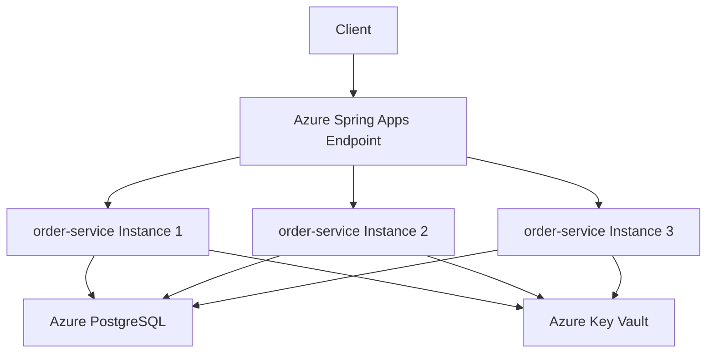

# How to Deploy a Spring Boot Application to Azure Spring Apps

Author: [nawazdhandala](https://www.github.com/nawazdhandala)

Tags: Azure, Spring Apps, Spring Boot, Java, Cloud Deployment, Microservices, DevOps

Description: A practical guide to deploying a Spring Boot application to Azure Spring Apps with build configuration, environment setup, and production-ready settings.

---

Azure Spring Apps (formerly Azure Spring Cloud) is a fully managed platform for running Spring Boot applications. It handles the infrastructure, builds, scaling, and networking so you can focus on your Java code. If you are used to deploying Spring Boot apps to VMs or Kubernetes, Azure Spring Apps removes a lot of the operational overhead. This post walks through deploying a Spring Boot application from scratch, covering the service creation, deployment configuration, and production-ready settings.

## Prerequisites

Before you start, make sure you have:

- An Azure subscription
- Azure CLI installed with the spring extension
- A Spring Boot application (2.7+ or 3.0+)
- Java 17 or later installed locally
- Maven or Gradle for building

Install the Azure Spring Apps CLI extension if you have not already.

```bash
# Install the Azure Spring Apps extension
az extension add --name spring --upgrade
```

## Step 1: Create the Azure Spring Apps Instance

Create the service instance that will host your applications.

```bash
# Create a resource group
az group create --name spring-rg --location eastus

# Create the Azure Spring Apps instance
az spring create \
  --name my-spring-service \
  --resource-group spring-rg \
  --location eastus \
  --sku Standard
```

The `Standard` SKU includes features like custom domains, scaling, and VNet injection. The `Basic` SKU is cheaper but more limited. For production workloads, use Standard or Enterprise.

## Step 2: Create an Application

In Azure Spring Apps, an "application" is a deployment slot for your Spring Boot service. You create the application first, then deploy code to it.

```bash
# Create an application within the Spring Apps instance
az spring app create \
  --name order-service \
  --service my-spring-service \
  --resource-group spring-rg \
  --runtime-version Java_17 \
  --assign-endpoint true \
  --memory 2Gi \
  --cpu 1
```

The `--assign-endpoint true` flag gives the application a public URL. Without it, the app is only accessible from within the service instance.

## Step 3: Deploy from Source Code

Azure Spring Apps can build your application from source code. You do not need to build a JAR locally.

```bash
# Deploy from source code (Maven project)
az spring app deploy \
  --name order-service \
  --service my-spring-service \
  --resource-group spring-rg \
  --source-path ./order-service
```

Azure Spring Apps detects the build system (Maven or Gradle), builds the application, and deploys it. The build happens on Azure, so you do not need to push a large JAR.

## Step 4: Deploy a Pre-Built JAR

If you prefer to build locally or in a CI pipeline, deploy a pre-built JAR.

```bash
# Build the JAR locally first
cd order-service
./mvnw clean package -DskipTests

# Deploy the JAR file
az spring app deploy \
  --name order-service \
  --service my-spring-service \
  --resource-group spring-rg \
  --artifact-path target/order-service-0.0.1-SNAPSHOT.jar
```

## Step 5: Configure Application Properties

Spring Boot applications are configured through properties. In Azure Spring Apps, you set these as environment variables or through config server.

```bash
# Set environment variables for the application
az spring app update \
  --name order-service \
  --service my-spring-service \
  --resource-group spring-rg \
  --env "SPRING_PROFILES_ACTIVE=production" \
    "DATABASE_URL=jdbc:postgresql://mydb.postgres.database.azure.com:5432/orders" \
    "SPRING_DATASOURCE_USERNAME=dbadmin"
```

For sensitive values like database passwords, use Azure Key Vault integration.

```bash
# Enable Key Vault integration
az spring app update \
  --name order-service \
  --service my-spring-service \
  --resource-group spring-rg \
  --env "SPRING_CLOUD_AZURE_KEYVAULT_SECRET_PROPERTY_SOURCES_0_ENDPOINT=https://my-keyvault.vault.azure.net"
```

In your Spring Boot application, reference Key Vault secrets as properties.

```yaml
# application-production.yml
spring:
  datasource:
    url: ${DATABASE_URL}
    username: ${SPRING_DATASOURCE_USERNAME}
    password: ${db-password}  # Resolved from Key Vault
  jpa:
    hibernate:
      ddl-auto: validate
    show-sql: false

server:
  port: 8080

management:
  endpoints:
    web:
      exposure:
        include: health,info,metrics
```

## Step 6: Configure JVM Options

Tune the JVM for your workload by setting JVM options.

```bash
# Set JVM options for memory and garbage collection
az spring app update \
  --name order-service \
  --service my-spring-service \
  --resource-group spring-rg \
  --jvm-options "-Xms512m -Xmx1536m -XX:+UseG1GC -XX:MaxGCPauseMillis=200"
```

For a 2Gi memory allocation, leaving some headroom for non-heap memory is important. Setting `-Xmx` to 75% of total memory (1536m out of 2048m) is a good starting point.

## Step 7: Check Deployment Status

Verify that the deployment succeeded and the application is running.

```bash
# Check application status
az spring app show \
  --name order-service \
  --service my-spring-service \
  --resource-group spring-rg \
  --query "{status:properties.provisioningState, url:properties.url, instances:properties.activeDeployment.properties.instances}"

# View application logs
az spring app logs \
  --name order-service \
  --service my-spring-service \
  --resource-group spring-rg \
  --follow
```

The logs stream the stdout/stderr from your Spring Boot application, including the familiar Spring Boot startup banner.

## Step 8: Scale the Application

Adjust the number of instances and resource allocation.

```bash
# Scale to 3 instances
az spring app scale \
  --name order-service \
  --service my-spring-service \
  --resource-group spring-rg \
  --instance-count 3

# Or change the CPU and memory
az spring app scale \
  --name order-service \
  --service my-spring-service \
  --resource-group spring-rg \
  --cpu 2 \
  --memory 4Gi \
  --instance-count 3
```

## Step 9: Set Up CI/CD with GitHub Actions

Automate deployments with a GitHub Actions workflow.

```yaml
# .github/workflows/deploy.yml
name: Deploy to Azure Spring Apps
on:
  push:
    branches: [main]

jobs:
  deploy:
    runs-on: ubuntu-latest
    steps:
      - uses: actions/checkout@v4

      - name: Set up JDK 17
        uses: actions/setup-java@v3
        with:
          java-version: '17'
          distribution: 'temurin'

      - name: Build with Maven
        run: ./mvnw clean package -DskipTests

      - name: Login to Azure
        uses: azure/login@v1
        with:
          creds: ${{ secrets.AZURE_CREDENTIALS }}

      - name: Deploy to Azure Spring Apps
        uses: azure/spring-apps-deploy@v1
        with:
          azure-subscription: ${{ secrets.AZURE_SUBSCRIPTION_ID }}
          action: deploy
          service-name: my-spring-service
          app-name: order-service
          use-staging-deployment: false
          package: target/order-service-0.0.1-SNAPSHOT.jar
```

## Application Architecture

Here is a typical deployment architecture for a Spring Boot microservice on Azure Spring Apps.



## Step 10: Configure Health Endpoints

Spring Boot Actuator provides health endpoints that Azure Spring Apps uses for health probing.

Make sure your `pom.xml` includes the Actuator dependency.

```xml
<!-- Spring Boot Actuator for health endpoints -->
<dependency>
    <groupId>org.springframework.boot</groupId>
    <artifactId>spring-boot-starter-actuator</artifactId>
</dependency>
```

Azure Spring Apps automatically configures health probes to use the `/actuator/health` endpoint.

## Troubleshooting Deployment Issues

**Deployment fails during build:** Check the build logs. Common issues include missing dependencies, wrong Java version, or test failures (use `-DskipTests` if tests need a running database).

**Application starts but cannot connect to database:** Verify the connection string and that the database allows connections from Azure Spring Apps. If using VNet integration, ensure proper network routing.

**Out of memory errors:** Increase the memory allocation with `az spring app scale`. Also check JVM options - make sure heap size is not set too close to the container memory limit.

**Slow startup:** Spring Boot applications can take 30-60 seconds to start. This is normal. If it takes longer, check for slow database connections or heavy initialization logic.

## Summary

Azure Spring Apps simplifies deploying Spring Boot applications by managing the infrastructure, builds, and scaling for you. Deploy from source code or pre-built JARs, configure properties through environment variables and Key Vault integration, and scale with a single CLI command. For production workloads, set up CI/CD pipelines, tune JVM options, and use the Standard SKU for features like custom domains and VNet integration. The platform handles the operational complexity so you can focus on building your application.
