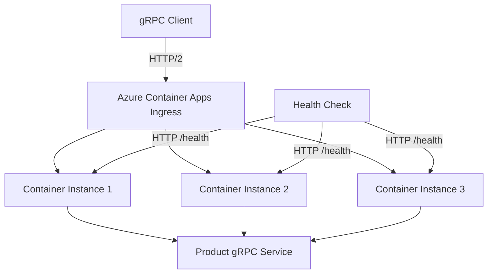

# How to Deploy a Spring Boot gRPC Service to Azure Container Apps

Author: [nawazdhandala](https://www.github.com/nawazdhandala)

Tags: Spring Boot, gRPC, Azure Container Apps, Java, Docker, Microservices, Containerization

Description: Learn how to build a Spring Boot gRPC service and deploy it to Azure Container Apps for scalable, containerized microservice communication.

---

gRPC is a high-performance RPC framework that uses Protocol Buffers for serialization and HTTP/2 for transport. It is faster than REST for service-to-service communication, supports streaming, and generates client and server code from a shared contract. Azure Container Apps provides a serverless container platform that scales automatically, making it a solid choice for hosting gRPC services without managing Kubernetes.

In this post, we will build a Spring Boot application that exposes a gRPC service, containerize it with Docker, and deploy it to Azure Container Apps.

## Why gRPC Over REST?

REST is great for external-facing APIs where you need broad client compatibility. But for internal service-to-service communication, gRPC has clear advantages:

- Binary serialization with Protocol Buffers is 3-10x faster than JSON
- HTTP/2 multiplexing reduces connection overhead
- Strongly typed contracts prevent integration issues
- Bidirectional streaming for real-time data flows
- Automatic code generation for clients in multiple languages

## Setting Up the Project

Create a Spring Boot project with gRPC dependencies.

```xml
<!-- pom.xml -->
<parent>
    <groupId>org.springframework.boot</groupId>
    <artifactId>spring-boot-starter-parent</artifactId>
    <version>3.2.0</version>
</parent>

<dependencies>
    <dependency>
        <groupId>org.springframework.boot</groupId>
        <artifactId>spring-boot-starter</artifactId>
    </dependency>

    <!-- gRPC Spring Boot Starter -->
    <dependency>
        <groupId>net.devh</groupId>
        <artifactId>grpc-server-spring-boot-starter</artifactId>
        <version>3.0.0.RELEASE</version>
    </dependency>

    <!-- Protobuf runtime -->
    <dependency>
        <groupId>com.google.protobuf</groupId>
        <artifactId>protobuf-java</artifactId>
        <version>3.25.1</version>
    </dependency>
</dependencies>

<build>
    <extensions>
        <!-- OS detection for protoc plugin -->
        <extension>
            <groupId>kr.motd.maven</groupId>
            <artifactId>os-maven-plugin</artifactId>
            <version>1.7.1</version>
        </extension>
    </extensions>

    <plugins>
        <!-- Protobuf compiler plugin -->
        <plugin>
            <groupId>org.xolstice.maven.plugins</groupId>
            <artifactId>protobuf-maven-plugin</artifactId>
            <version>0.6.1</version>
            <configuration>
                <protocArtifact>com.google.protobuf:protoc:3.25.1:exe:${os.detected.classifier}</protocArtifact>
                <pluginId>grpc-java</pluginId>
                <pluginArtifact>io.grpc:protoc-gen-grpc-java:1.60.0:exe:${os.detected.classifier}</pluginArtifact>
            </configuration>
            <executions>
                <execution>
                    <goals>
                        <goal>compile</goal>
                        <goal>compile-custom</goal>
                    </goals>
                </execution>
            </executions>
        </plugin>
    </plugins>
</build>
```

## Defining the Protocol Buffer Contract

Create the .proto file that defines your service interface.

```protobuf
// src/main/proto/product_service.proto
syntax = "proto3";

package product;

// Java package for generated classes
option java_package = "com.example.grpc.product";
option java_multiple_files = true;

// The product service definition
service ProductService {
    // Get a single product by ID
    rpc GetProduct (GetProductRequest) returns (ProductResponse);

    // List all products with optional filtering
    rpc ListProducts (ListProductsRequest) returns (ListProductsResponse);

    // Create a new product
    rpc CreateProduct (CreateProductRequest) returns (ProductResponse);

    // Server-side streaming - get product updates in real time
    rpc StreamProductUpdates (StreamRequest) returns (stream ProductResponse);
}

// Request to get a single product
message GetProductRequest {
    string product_id = 1;
}

// Request to list products with optional category filter
message ListProductsRequest {
    string category = 1;
    int32 page_size = 2;
    int32 page_number = 3;
}

// Request to create a new product
message CreateProductRequest {
    string name = 1;
    string category = 2;
    string description = 3;
    double price = 4;
    int32 stock = 5;
}

// Product response message
message ProductResponse {
    string product_id = 1;
    string name = 2;
    string category = 3;
    string description = 4;
    double price = 5;
    int32 stock = 6;
    int64 created_at = 7;
}

// Response containing a list of products
message ListProductsResponse {
    repeated ProductResponse products = 1;
    int32 total_count = 2;
}

// Request for streaming updates
message StreamRequest {
    string category = 1;
}
```

## Implementing the gRPC Service

After running `mvn compile`, the protobuf plugin generates Java classes. Implement the service by extending the generated base class.

```java
package com.example.grpc.service;

import com.example.grpc.product.*;
import io.grpc.stub.StreamObserver;
import net.devh.boot.grpc.server.service.GrpcService;
import org.slf4j.Logger;
import org.slf4j.LoggerFactory;

import java.util.*;
import java.util.concurrent.ConcurrentHashMap;

@GrpcService  // Registers this as a gRPC service with Spring Boot
public class ProductServiceImpl extends ProductServiceGrpc.ProductServiceImplBase {

    private static final Logger log = LoggerFactory.getLogger(ProductServiceImpl.class);

    // In-memory store for demo purposes
    private final Map<String, ProductResponse> products = new ConcurrentHashMap<>();

    public ProductServiceImpl() {
        // Seed some sample data
        addSampleProduct("Laptop", "Electronics", "High-performance laptop", 999.99, 50);
        addSampleProduct("Headphones", "Electronics", "Noise-cancelling headphones", 249.99, 200);
        addSampleProduct("Coffee Maker", "Kitchen", "Automatic coffee maker", 79.99, 100);
    }

    @Override
    public void getProduct(GetProductRequest request, StreamObserver<ProductResponse> responseObserver) {
        log.info("GetProduct called for ID: {}", request.getProductId());

        ProductResponse product = products.get(request.getProductId());

        if (product != null) {
            responseObserver.onNext(product);
            responseObserver.onCompleted();
        } else {
            responseObserver.onError(
                io.grpc.Status.NOT_FOUND
                    .withDescription("Product not found: " + request.getProductId())
                    .asRuntimeException()
            );
        }
    }

    @Override
    public void listProducts(ListProductsRequest request,
                             StreamObserver<ListProductsResponse> responseObserver) {
        log.info("ListProducts called for category: {}", request.getCategory());

        List<ProductResponse> filtered = products.values().stream()
            .filter(p -> request.getCategory().isEmpty() ||
                         p.getCategory().equalsIgnoreCase(request.getCategory()))
            .toList();

        ListProductsResponse response = ListProductsResponse.newBuilder()
            .addAllProducts(filtered)
            .setTotalCount(filtered.size())
            .build();

        responseObserver.onNext(response);
        responseObserver.onCompleted();
    }

    @Override
    public void createProduct(CreateProductRequest request,
                              StreamObserver<ProductResponse> responseObserver) {
        log.info("CreateProduct called: {}", request.getName());

        String id = UUID.randomUUID().toString();
        ProductResponse product = ProductResponse.newBuilder()
            .setProductId(id)
            .setName(request.getName())
            .setCategory(request.getCategory())
            .setDescription(request.getDescription())
            .setPrice(request.getPrice())
            .setStock(request.getStock())
            .setCreatedAt(System.currentTimeMillis())
            .build();

        products.put(id, product);

        responseObserver.onNext(product);
        responseObserver.onCompleted();
    }

    @Override
    public void streamProductUpdates(StreamRequest request,
                                     StreamObserver<ProductResponse> responseObserver) {
        log.info("StreamProductUpdates started for category: {}", request.getCategory());

        // Stream existing products one by one
        products.values().stream()
            .filter(p -> request.getCategory().isEmpty() ||
                         p.getCategory().equalsIgnoreCase(request.getCategory()))
            .forEach(responseObserver::onNext);

        responseObserver.onCompleted();
    }

    private void addSampleProduct(String name, String category,
                                   String description, double price, int stock) {
        String id = UUID.randomUUID().toString();
        products.put(id, ProductResponse.newBuilder()
            .setProductId(id)
            .setName(name)
            .setCategory(category)
            .setDescription(description)
            .setPrice(price)
            .setStock(stock)
            .setCreatedAt(System.currentTimeMillis())
            .build());
    }
}
```

## Configuring the gRPC Server

Configure the gRPC server port in application.yml.

```yaml
# application.yml
grpc:
  server:
    port: 9090            # gRPC server port
    security:
      enabled: false      # Disable TLS for now (handled by Container Apps ingress)

spring:
  application:
    name: product-grpc-service

# Health check endpoint for Container Apps
server:
  port: 8080              # HTTP port for health checks
```

Add a health check endpoint that Container Apps can use.

```java
import org.springframework.web.bind.annotation.GetMapping;
import org.springframework.web.bind.annotation.RestController;

@RestController
public class HealthController {

    // Health check endpoint for Azure Container Apps probes
    @GetMapping("/health")
    public String health() {
        return "OK";
    }
}
```

## Creating the Dockerfile

Build a multi-stage Dockerfile for an optimized container image.

```dockerfile
# Stage 1: Build the application
FROM maven:3.9-eclipse-temurin-17 AS build
WORKDIR /app
COPY pom.xml .
COPY src ./src

# Build the application JAR
RUN mvn clean package -DskipTests

# Stage 2: Create the runtime image
FROM eclipse-temurin:17-jre-alpine
WORKDIR /app

# Copy the built JAR from the build stage
COPY --from=build /app/target/*.jar app.jar

# Expose both gRPC and HTTP ports
EXPOSE 9090 8080

# Start the application
ENTRYPOINT ["java", "-jar", "app.jar"]
```

## Deploying to Azure Container Apps

First, set up the Azure resources.

```bash
# Create a resource group
az group create --name grpc-demo-rg --location eastus

# Create an Azure Container Registry
az acr create --name mygrpcregistry --resource-group grpc-demo-rg --sku Basic

# Build and push the Docker image
az acr build --registry mygrpcregistry --image product-grpc:v1 .

# Create a Container Apps environment
az containerapp env create \
  --name grpc-env \
  --resource-group grpc-demo-rg \
  --location eastus

# Deploy the container app with gRPC transport
az containerapp create \
  --name product-grpc-service \
  --resource-group grpc-demo-rg \
  --environment grpc-env \
  --image mygrpcregistry.azurecr.io/product-grpc:v1 \
  --registry-server mygrpcregistry.azurecr.io \
  --target-port 9090 \
  --ingress external \
  --transport http2 \
  --min-replicas 1 \
  --max-replicas 10 \
  --cpu 0.5 \
  --memory 1.0Gi
```

The key setting is `--transport http2`. gRPC requires HTTP/2, and you need to explicitly enable it on Azure Container Apps.

## Setting Up Health Probes

Configure health probes so Container Apps knows when your service is healthy.

```bash
# Update the container app with health probes
az containerapp update \
  --name product-grpc-service \
  --resource-group grpc-demo-rg \
  --set-env-vars "SPRING_PROFILES_ACTIVE=prod" \
  --set configuration.ingress.additionalPortMappings[0].external=true \
  --set configuration.ingress.additionalPortMappings[0].targetPort=8080
```

## The Deployment Architecture

Here is the overall architecture of the deployed service.



## Building a gRPC Client

To test your deployed service, build a simple gRPC client.

```java
import com.example.grpc.product.*;
import io.grpc.ManagedChannel;
import io.grpc.ManagedChannelBuilder;

public class ProductClient {
    public static void main(String[] args) {
        // Connect to the deployed service
        ManagedChannel channel = ManagedChannelBuilder
            .forAddress("product-grpc-service.kinddesert-abc123.eastus.azurecontainerapps.io", 443)
            .useTransportSecurity()  // TLS is required for external ingress
            .build();

        // Create a blocking stub for synchronous calls
        ProductServiceGrpc.ProductServiceBlockingStub stub =
            ProductServiceGrpc.newBlockingStub(channel);

        // List all products
        ListProductsResponse products = stub.listProducts(
            ListProductsRequest.newBuilder()
                .setCategory("Electronics")
                .build());

        System.out.println("Found " + products.getTotalCount() + " products:");
        products.getProductsList().forEach(p ->
            System.out.println("  " + p.getName() + " - $" + p.getPrice()));

        // Clean up the channel
        channel.shutdown();
    }
}
```

## Scaling Configuration

Azure Container Apps can scale based on HTTP traffic, KEDA scalers, or custom metrics. For a gRPC service, configure scaling based on concurrent requests.

```bash
# Configure scaling rules
az containerapp update \
  --name product-grpc-service \
  --resource-group grpc-demo-rg \
  --min-replicas 1 \
  --max-replicas 20 \
  --scale-rule-name concurrent-requests \
  --scale-rule-type http \
  --scale-rule-http-concurrency 100
```

This tells Container Apps to add instances when each instance handles more than 100 concurrent requests.

## Wrapping Up

Spring Boot with gRPC gives you high-performance service-to-service communication with strongly typed contracts. Azure Container Apps provides serverless container hosting with automatic scaling and built-in TLS. The key things to remember are: enable HTTP/2 transport on the ingress, expose a health check endpoint on a separate HTTP port, and use multi-stage Docker builds to keep your images small. Start with a simple service, validate gRPC connectivity, and then add streaming and more complex patterns as needed.
