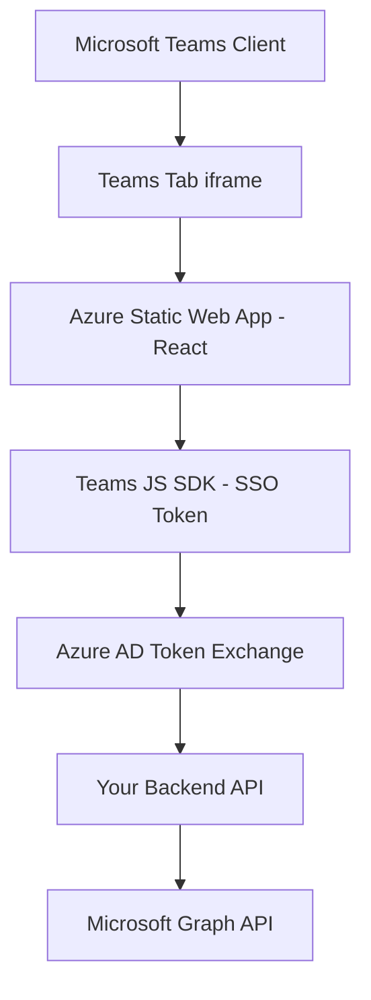

# How to Deploy a Teams Tab Application Hosted on Azure Static Web Apps with SSO

Author: [nawazdhandala](https://www.github.com/nawazdhandala)

Tags: Microsoft Teams, Azure Static Web Apps, SSO, Tab Application, React, Authentication, Azure AD

Description: Deploy a Microsoft Teams tab application on Azure Static Web Apps with single sign-on authentication using the Teams JavaScript SDK and Azure AD.

---

Teams tab applications let you embed your web application directly inside a Microsoft Teams channel, group chat, or personal workspace. Users get your content without leaving Teams, and with single sign-on (SSO), they do not need to log in separately. Their Teams identity flows through to your application automatically.

Azure Static Web Apps is a natural hosting choice for Teams tabs. It is cheap to run, deploys automatically from your GitHub repo, and integrates cleanly with Azure AD for authentication. In this guide, I will walk through building a React-based Teams tab with SSO and deploying it to Azure Static Web Apps.

## Architecture



The Teams client loads your tab in an iframe. Your React app uses the Teams JavaScript SDK to get an SSO token, which it exchanges for an Azure AD access token. That token authenticates API calls to your backend or directly to Microsoft Graph.

## Creating the React Application

Start with a new React app configured for Teams:

```bash
# Create the React app with TypeScript
npx create-react-app teams-tab --template typescript
cd teams-tab

# Install the Teams SDK and MSAL for authentication
npm install @microsoft/teams-js @azure/msal-browser @azure/msal-react
```

## Setting Up the Teams SDK Initialization

The Teams JavaScript SDK needs to be initialized before you can use any of its features. Create a wrapper component:

```typescript
// src/components/TeamsProvider.tsx - Initializes the Teams SDK
import React, { useEffect, useState } from 'react';
import * as microsoftTeams from '@microsoft/teams-js';

interface TeamsContextType {
    context: microsoftTeams.app.Context | null;
    isInTeams: boolean;
    isLoading: boolean;
}

export const TeamsContext = React.createContext<TeamsContextType>({
    context: null,
    isInTeams: false,
    isLoading: true
});

export const TeamsProvider: React.FC<{ children: React.ReactNode }> = ({ children }) => {
    const [context, setContext] = useState<microsoftTeams.app.Context | null>(null);
    const [isInTeams, setIsInTeams] = useState(false);
    const [isLoading, setIsLoading] = useState(true);

    useEffect(() => {
        const initializeTeams = async () => {
            try {
                // Initialize the Teams SDK
                await microsoftTeams.app.initialize();
                setIsInTeams(true);

                // Get the current context (user info, team info, etc.)
                const ctx = await microsoftTeams.app.getContext();
                setContext(ctx);

                // Notify Teams that the tab has loaded successfully
                microsoftTeams.app.notifySuccess();
            } catch (error) {
                // Not running inside Teams - allow standalone usage
                console.log('Not running in Teams context');
                setIsInTeams(false);
            } finally {
                setIsLoading(false);
            }
        };

        initializeTeams();
    }, []);

    return (
        <TeamsContext.Provider value={{ context, isInTeams, isLoading }}>
            {children}
        </TeamsContext.Provider>
    );
};
```

## Implementing SSO Authentication

The SSO flow lets you get a token silently without showing a login popup. Here is the authentication hook:

```typescript
// src/hooks/useTeamsAuth.ts - Hook for Teams SSO authentication
import { useState, useEffect, useContext } from 'react';
import * as microsoftTeams from '@microsoft/teams-js';
import { TeamsContext } from '../components/TeamsProvider';

interface AuthState {
    token: string | null;
    user: UserInfo | null;
    isAuthenticated: boolean;
    isLoading: boolean;
    error: string | null;
}

interface UserInfo {
    name: string;
    email: string;
    userId: string;
    tenantId: string;
}

export function useTeamsAuth(): AuthState {
    const { isInTeams, context } = useContext(TeamsContext);
    const [authState, setAuthState] = useState<AuthState>({
        token: null,
        user: null,
        isAuthenticated: false,
        isLoading: true,
        error: null
    });

    useEffect(() => {
        if (!isInTeams) {
            setAuthState(prev => ({ ...prev, isLoading: false }));
            return;
        }

        const authenticate = async () => {
            try {
                // Request an SSO token from Teams
                // This happens silently without any user interaction
                const ssoToken = await microsoftTeams.authentication.getAuthToken();

                // Decode the token to get user info (without validation - that happens server-side)
                const tokenParts = ssoToken.split('.');
                const payload = JSON.parse(atob(tokenParts[1]));

                const user: UserInfo = {
                    name: payload.name || '',
                    email: payload.preferred_username || payload.upn || '',
                    userId: payload.oid || '',
                    tenantId: payload.tid || ''
                };

                setAuthState({
                    token: ssoToken,
                    user,
                    isAuthenticated: true,
                    isLoading: false,
                    error: null
                });
            } catch (error: any) {
                console.error('SSO authentication failed:', error);

                // If SSO fails, fall back to interactive auth
                if (error.message === 'resourceRequiresConsent') {
                    await handleConsentRequired();
                } else {
                    setAuthState({
                        token: null,
                        user: null,
                        isAuthenticated: false,
                        isLoading: false,
                        error: 'Authentication failed. Please try again.'
                    });
                }
            }
        };

        authenticate();
    }, [isInTeams]);

    const handleConsentRequired = async () => {
        try {
            // Show the consent popup for first-time users
            await microsoftTeams.authentication.authenticate({
                url: `${window.location.origin}/auth-start`,
                width: 600,
                height: 535
            });

            // After consent, retry the SSO token request
            const ssoToken = await microsoftTeams.authentication.getAuthToken();
            const tokenParts = ssoToken.split('.');
            const payload = JSON.parse(atob(tokenParts[1]));

            setAuthState({
                token: ssoToken,
                user: {
                    name: payload.name || '',
                    email: payload.preferred_username || '',
                    userId: payload.oid || '',
                    tenantId: payload.tid || ''
                },
                isAuthenticated: true,
                isLoading: false,
                error: null
            });
        } catch (error) {
            setAuthState({
                token: null,
                user: null,
                isAuthenticated: false,
                isLoading: false,
                error: 'Consent was not granted.'
            });
        }
    };

    return authState;
}
```

## Building the Tab Content

Now build the actual tab content that uses the authenticated context:

```typescript
// src/components/DashboardTab.tsx - Main tab content component
import React, { useEffect, useState } from 'react';
import { useTeamsAuth } from '../hooks/useTeamsAuth';

interface DashboardData {
    taskCount: number;
    completedTasks: number;
    upcomingDeadlines: Array<{ title: string; dueDate: string }>;
    recentActivity: Array<{ description: string; timestamp: string }>;
}

export const DashboardTab: React.FC = () => {
    const { token, user, isAuthenticated, isLoading, error } = useTeamsAuth();
    const [data, setData] = useState<DashboardData | null>(null);
    const [loadingData, setLoadingData] = useState(false);

    useEffect(() => {
        if (isAuthenticated && token) {
            fetchDashboardData();
        }
    }, [isAuthenticated, token]);

    const fetchDashboardData = async () => {
        setLoadingData(true);
        try {
            // Call your backend API with the SSO token
            const response = await fetch('/api/dashboard', {
                headers: {
                    'Authorization': `Bearer ${token}`,
                    'Content-Type': 'application/json'
                }
            });

            if (response.ok) {
                const dashboardData = await response.json();
                setData(dashboardData);
            }
        } catch (err) {
            console.error('Failed to fetch dashboard data:', err);
        } finally {
            setLoadingData(false);
        }
    };

    if (isLoading) {
        return <div className="loading">Authenticating...</div>;
    }

    if (error) {
        return <div className="error">{error}</div>;
    }

    if (!isAuthenticated) {
        return <div className="not-authenticated">Please sign in to view the dashboard.</div>;
    }

    return (
        <div className="dashboard">
            <h1>Welcome, {user?.name}</h1>

            {loadingData && <div className="loading">Loading dashboard...</div>}

            {data && (
                <>
                    <div className="stats-row">
                        <div className="stat-card">
                            <h3>Total Tasks</h3>
                            <p className="stat-value">{data.taskCount}</p>
                        </div>
                        <div className="stat-card">
                            <h3>Completed</h3>
                            <p className="stat-value">{data.completedTasks}</p>
                        </div>
                    </div>

                    <div className="section">
                        <h2>Upcoming Deadlines</h2>
                        <ul>
                            {data.upcomingDeadlines.map((item, i) => (
                                <li key={i}>
                                    <strong>{item.title}</strong>
                                    <span> - Due: {item.dueDate}</span>
                                </li>
                            ))}
                        </ul>
                    </div>

                    <div className="section">
                        <h2>Recent Activity</h2>
                        <ul>
                            {data.recentActivity.map((item, i) => (
                                <li key={i}>
                                    {item.description}
                                    <span className="timestamp"> ({item.timestamp})</span>
                                </li>
                            ))}
                        </ul>
                    </div>
                </>
            )}
        </div>
    );
};
```

## Deploying to Azure Static Web Apps

Create the Static Web App and configure the deployment:

```bash
# Create the Azure Static Web App linked to your GitHub repo
az staticwebapp create \
  --name swa-teams-tab \
  --resource-group rg-teams-tab \
  --source "https://github.com/yourorg/teams-tab" \
  --branch main \
  --app-location "/" \
  --output-location "build" \
  --login-with-github
```

The Static Web Apps configuration file handles routing:

```json
{
    "navigationFallback": {
        "rewrite": "/index.html",
        "exclude": ["/images/*.{png,jpg}", "/static/*"]
    },
    "responseOverrides": {
        "401": {
            "redirect": "/auth-start",
            "statusCode": 302
        }
    }
}
```

## Azure AD App Registration

Register an Azure AD application for SSO. This is what Teams uses to issue tokens for your tab:

```bash
# Create the app registration
az ad app create \
  --display-name "Teams Tab - Dashboard" \
  --sign-in-audience "AzureADMyOrg" \
  --web-redirect-uris "https://your-static-app.azurestaticapps.net/auth-end" \
  --identifier-uris "api://your-static-app.azurestaticapps.net/your-client-id"

# Add the Teams SSO scope
az ad app permission add \
  --id your-client-id \
  --api 00000003-0000-0000-c000-000000000000 \
  --api-permissions e1fe6dd8-ba31-4d61-89e7-88639da4683d=Scope
```

The identifier URI must follow the format `api://{hostname}/{client-id}` for Teams SSO to work correctly.

## Teams App Manifest for the Tab

Configure the tab in your Teams app manifest:

```json
{
    "staticTabs": [
        {
            "entityId": "dashboard",
            "name": "Dashboard",
            "contentUrl": "https://your-static-app.azurestaticapps.net/",
            "websiteUrl": "https://your-static-app.azurestaticapps.net/",
            "scopes": ["personal"]
        }
    ],
    "configurableTabs": [
        {
            "configurationUrl": "https://your-static-app.azurestaticapps.net/config",
            "canUpdateConfiguration": true,
            "scopes": ["team", "groupChat"]
        }
    ],
    "webApplicationInfo": {
        "id": "your-client-id",
        "resource": "api://your-static-app.azurestaticapps.net/your-client-id"
    }
}
```

## Wrapping Up

Deploying a Teams tab on Azure Static Web Apps with SSO gives you a low-cost, auto-scaling hosting solution that integrates cleanly with the Teams authentication model. The SSO token flow is silent for users who have already consented, making the experience feel native. Static Web Apps handles the build and deployment pipeline from GitHub automatically, so pushing an update to your tab is just a git push. The combination of React for the UI, the Teams JavaScript SDK for platform integration, and Azure AD for authentication creates a solid foundation for any Teams tab application.
