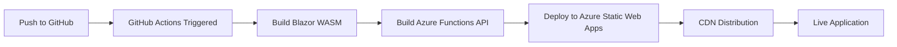

# How to Deploy an ASP.NET Core Blazor WebAssembly App to Azure Static Web Apps

Author: [nawazdhandala](https://www.github.com/nawazdhandala)

Tags: Blazor WebAssembly, Azure Static Web Apps, ASP.NET Core, C#, WebAssembly, Deployment, GitHub Actions

Description: Learn how to build a Blazor WebAssembly application and deploy it to Azure Static Web Apps with automatic CI/CD through GitHub Actions.

---

Blazor WebAssembly lets you build interactive web applications using C# instead of JavaScript. The code runs directly in the browser via WebAssembly, which means you can share models, validation logic, and even entire libraries between your frontend and backend. Azure Static Web Apps is a natural hosting choice for Blazor WASM apps because it serves static files from a global CDN, integrates with GitHub for CI/CD, and optionally provides serverless API backends through Azure Functions.

In this post, we will create a Blazor WebAssembly application from scratch, add an Azure Functions API backend, and deploy the whole thing to Azure Static Web Apps with automated builds and deployments.

## Creating the Blazor WebAssembly Project

Start by setting up a new Blazor WebAssembly project. We will use the hosted template, which gives us a client project, a server project, and a shared project.

```bash
# Create a new Blazor WASM standalone app
dotnet new blazorwasm -n BlazorStaticDemo --no-https
cd BlazorStaticDemo
```

For Azure Static Web Apps, we want a standalone Blazor WASM app (not the hosted template) because Static Web Apps handles the API separately through Azure Functions.

## Adding Some Real Functionality

Let's build a simple weather dashboard that fetches data from an API. First, create a model in the project.

```csharp
// Models/WeatherForecast.cs
// Shared model between the Blazor client and the API
namespace BlazorStaticDemo.Models;

public class WeatherForecast
{
    public DateTime Date { get; set; }
    public int TemperatureC { get; set; }
    public string Summary { get; set; } = string.Empty;

    // Computed property for Fahrenheit conversion
    public int TemperatureF => 32 + (int)(TemperatureC / 0.5556);
}
```

Now update the FetchData page to call our API.

```csharp
// Pages/FetchData.razor
@page "/fetchdata"
@inject HttpClient Http

<h1>Weather Forecast</h1>

@if (forecasts == null)
{
    <p>Loading...</p>
}
else
{
    <table class="table">
        <thead>
            <tr>
                <th>Date</th>
                <th>Temp. (C)</th>
                <th>Temp. (F)</th>
                <th>Summary</th>
            </tr>
        </thead>
        <tbody>
            @foreach (var forecast in forecasts)
            {
                <tr>
                    <td>@forecast.Date.ToShortDateString()</td>
                    <td>@forecast.TemperatureC</td>
                    <td>@forecast.TemperatureF</td>
                    <td>@forecast.Summary</td>
                </tr>
            }
        </tbody>
    </table>
}

@code {
    private WeatherForecast[]? forecasts;

    protected override async Task OnInitializedAsync()
    {
        // This calls the Azure Functions API through the Static Web Apps proxy
        forecasts = await Http.GetFromJsonAsync<WeatherForecast[]>("/api/weatherforecast");
    }
}
```

## Creating the Azure Functions API

Azure Static Web Apps can host an Azure Functions backend alongside your static frontend. Create the API project in a folder called `Api`.

```bash
# Create the Azure Functions project
mkdir Api
cd Api
func init --worker-runtime dotnet-isolated --target-framework net8.0
func new --name WeatherForecast --template "HTTP trigger"
```

Replace the generated function with one that returns weather data.

```csharp
// Api/WeatherForecast.cs
using Microsoft.Azure.Functions.Worker;
using Microsoft.Azure.Functions.Worker.Http;
using System.Net;
using System.Text.Json;

namespace Api;

public class WeatherForecastFunction
{
    // Summaries array for generating random forecasts
    private static readonly string[] Summaries = new[]
    {
        "Freezing", "Bracing", "Chilly", "Cool", "Mild",
        "Warm", "Balmy", "Hot", "Sweltering", "Scorching"
    };

    [Function("weatherforecast")]
    public async Task<HttpResponseData> Run(
        [HttpTrigger(AuthorizationLevel.Anonymous, "get")] HttpRequestData req)
    {
        var random = new Random();

        // Generate 5 days of forecast data
        var forecasts = Enumerable.Range(1, 5).Select(index => new
        {
            Date = DateTime.Now.AddDays(index),
            TemperatureC = random.Next(-20, 55),
            Summary = Summaries[random.Next(Summaries.Length)]
        }).ToArray();

        var response = req.CreateResponse(HttpStatusCode.OK);
        await response.WriteAsJsonAsync(forecasts);
        return response;
    }
}
```

## Project Structure

Your project should look like this:

```
BlazorStaticDemo/
  BlazorStaticDemo/     # Blazor WASM client
    Pages/
    wwwroot/
    Program.cs
  Api/                   # Azure Functions backend
    WeatherForecast.cs
    host.json
    local.settings.json
```

## Configuring Static Web Apps

Create a configuration file at the root of your Blazor project to define routing rules.

```json
{
  "navigationFallback": {
    "rewrite": "/index.html",
    "exclude": ["/css/*", "/js/*", "/api/*", "/_framework/*"]
  },
  "routes": [
    {
      "route": "/api/*",
      "allowedRoles": ["anonymous"]
    }
  ]
}
```

Save this as `staticwebapp.config.json` in the `wwwroot` folder of your Blazor project. The navigation fallback is critical for single-page applications. Without it, refreshing the browser on any route other than the root would return a 404.

## Deploying to Azure Static Web Apps

There are two ways to deploy: through the Azure Portal with GitHub integration, or using the Azure CLI. Let's use the CLI.

```bash
# Install the Static Web Apps CLI for local development and testing
npm install -g @azure/static-web-apps-cli

# Test locally before deploying
swa start http://localhost:5000 --api-location ./Api

# Create the Static Web App resource in Azure
az staticwebapp create \
  --name blazor-demo-app \
  --resource-group myResourceGroup \
  --source https://github.com/your-username/blazor-static-demo \
  --location "eastus2" \
  --branch main \
  --app-location "/BlazorStaticDemo" \
  --api-location "/Api" \
  --output-location "wwwroot"
```

## Setting Up GitHub Actions

When you create the Static Web App through the Azure Portal and connect it to a GitHub repository, Azure automatically generates a GitHub Actions workflow. Here is what that workflow looks like, with some additional customization.

```yaml
# .github/workflows/azure-static-web-apps.yml
name: Azure Static Web Apps CI/CD

on:
  push:
    branches:
      - main
  pull_request:
    types: [opened, synchronize, reopened, closed]
    branches:
      - main

jobs:
  build_and_deploy:
    if: github.event_name == 'push' || (github.event_name == 'pull_request' && github.event.action != 'closed')
    runs-on: ubuntu-latest
    name: Build and Deploy
    steps:
      - uses: actions/checkout@v4

      # Set up .NET for building the Blazor app
      - name: Setup .NET
        uses: actions/setup-dotnet@v4
        with:
          dotnet-version: '8.0.x'

      # Build the Blazor WASM project
      - name: Build Blazor App
        run: dotnet publish BlazorStaticDemo -c Release -o publish

      # Deploy to Azure Static Web Apps
      - name: Deploy
        uses: Azure/static-web-apps-deploy@v1
        with:
          azure_static_web_apps_api_token: ${{ secrets.AZURE_STATIC_WEB_APPS_API_TOKEN }}
          repo_token: ${{ secrets.GITHUB_TOKEN }}
          action: "upload"
          app_location: "/BlazorStaticDemo"
          api_location: "/Api"
          output_location: "wwwroot"

  # Close pull request job handles cleanup of staging environments
  close_pull_request:
    if: github.event_name == 'pull_request' && github.event.action == 'closed'
    runs-on: ubuntu-latest
    name: Close Pull Request
    steps:
      - name: Close Pull Request
        uses: Azure/static-web-apps-deploy@v1
        with:
          azure_static_web_apps_api_token: ${{ secrets.AZURE_STATIC_WEB_APPS_API_TOKEN }}
          action: "close"
```

One of the best features of Azure Static Web Apps is the automatic staging environments for pull requests. Every PR gets its own URL so you can preview changes before merging.

## The Deployment Flow

Here is how the entire process works from code push to production.



## Adding Authentication

Azure Static Web Apps has built-in authentication providers. You do not need to configure anything on the backend. Just use the built-in routes.

```html
<!-- In your Blazor component -->
<a href="/.auth/login/github">Login with GitHub</a>
<a href="/.auth/login/aad">Login with Azure AD</a>
<a href="/.auth/logout">Logout</a>
```

You can then access the authenticated user's information from your API.

```csharp
// In your Azure Function, read the client principal header
[Function("profile")]
public async Task<HttpResponseData> GetProfile(
    [HttpTrigger(AuthorizationLevel.Anonymous, "get")] HttpRequestData req)
{
    // Azure Static Web Apps injects this header with user info
    var clientPrincipal = req.Headers.GetValues("x-ms-client-principal").FirstOrDefault();

    if (string.IsNullOrEmpty(clientPrincipal))
    {
        var unauthorized = req.CreateResponse(HttpStatusCode.Unauthorized);
        return unauthorized;
    }

    // Decode the base64-encoded principal
    var decoded = Convert.FromBase64String(clientPrincipal);
    var json = System.Text.Encoding.UTF8.GetString(decoded);

    var response = req.CreateResponse(HttpStatusCode.OK);
    await response.WriteStringAsync(json);
    return response;
}
```

## Custom Domain and SSL

Azure Static Web Apps provides a free SSL certificate for custom domains. Set it up through the Azure Portal or CLI.

```bash
# Add a custom domain
az staticwebapp hostname set \
  --name blazor-demo-app \
  --hostname www.yourdomain.com
```

You will need to add a CNAME record pointing your domain to the Static Web App's default hostname.

## Performance Considerations

Blazor WebAssembly apps download the .NET runtime and your application DLLs on first load, which can be several megabytes. Here are ways to minimize the impact:

- Enable Brotli compression, which Azure Static Web Apps does by default
- Use lazy loading for assemblies that are not needed on the initial page
- Enable AOT compilation for CPU-intensive operations (though it increases download size)
- Use the `PublishTrimmed` option to remove unused code

```xml
<!-- In your .csproj file -->
<PropertyGroup>
    <PublishTrimmed>true</PublishTrimmed>
    <RunAOTCompilation>false</RunAOTCompilation>
</PropertyGroup>
```

## Wrapping Up

Azure Static Web Apps is a great fit for Blazor WebAssembly applications. You get global CDN distribution, automatic SSL, built-in authentication, staging environments for pull requests, and a serverless API backend through Azure Functions. The GitHub Actions integration means every push triggers a build and deploy, and every pull request gets its own preview environment. For teams building internal tools, dashboards, or any application where C# on the frontend makes sense, this combination is hard to beat.
