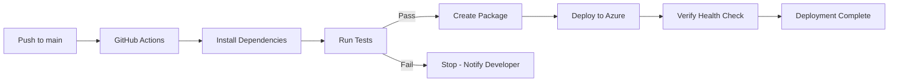

# How to Deploy an Express.js REST API to Azure App Service with GitHub Actions

Author: [nawazdhandala](https://www.github.com/nawazdhandala)

Tags: Express.js, Azure App Service, GitHub Actions, Node.js, CI/CD, Deployment, REST API

Description: Learn how to deploy an Express.js REST API to Azure App Service with automated CI/CD using GitHub Actions for continuous deployment on every push.

---

Deploying a Node.js application to Azure App Service gives you a managed platform with automatic SSL, custom domains, scaling, and deployment slots. Adding GitHub Actions on top gives you continuous deployment - every push to your main branch automatically builds, tests, and deploys your application. No manual steps, no FTP uploads, no SSH sessions.

In this post, we will build an Express.js REST API, create an Azure App Service, and set up a GitHub Actions workflow that deploys on every push.

## Building the Express.js API

Let's start with a straightforward REST API for managing tasks.

```bash
mkdir task-api
cd task-api
npm init -y
npm install express cors helmet morgan
npm install --save-dev jest supertest
```

Create the application structure.

```javascript
// src/app.js
const express = require("express");
const cors = require("cors");
const helmet = require("helmet");
const morgan = require("morgan");

const app = express();

// Middleware
app.use(helmet());           // Security headers
app.use(cors());             // CORS support
app.use(morgan("combined")); // Request logging
app.use(express.json());     // JSON body parsing

// In-memory task store (use a database in production)
let tasks = [
    { id: 1, title: "Set up Azure App Service", completed: true },
    { id: 2, title: "Configure GitHub Actions", completed: false },
    { id: 3, title: "Deploy the application", completed: false }
];
let nextId = 4;

// Health check endpoint - used by App Service for probes
app.get("/health", (req, res) => {
    res.json({
        status: "healthy",
        uptime: process.uptime(),
        timestamp: new Date().toISOString(),
        nodeVersion: process.version
    });
});

// Get all tasks
app.get("/api/tasks", (req, res) => {
    const { completed } = req.query;

    let filtered = tasks;
    if (completed !== undefined) {
        filtered = tasks.filter(t => t.completed === (completed === "true"));
    }

    res.json(filtered);
});

// Get a single task
app.get("/api/tasks/:id", (req, res) => {
    const task = tasks.find(t => t.id === parseInt(req.params.id));
    if (!task) {
        return res.status(404).json({ error: "Task not found" });
    }
    res.json(task);
});

// Create a task
app.post("/api/tasks", (req, res) => {
    const { title } = req.body;
    if (!title || title.trim().length === 0) {
        return res.status(400).json({ error: "Title is required" });
    }

    const task = {
        id: nextId++,
        title: title.trim(),
        completed: false,
        createdAt: new Date().toISOString()
    };

    tasks.push(task);
    res.status(201).json(task);
});

// Update a task
app.put("/api/tasks/:id", (req, res) => {
    const task = tasks.find(t => t.id === parseInt(req.params.id));
    if (!task) {
        return res.status(404).json({ error: "Task not found" });
    }

    if (req.body.title !== undefined) task.title = req.body.title;
    if (req.body.completed !== undefined) task.completed = req.body.completed;

    res.json(task);
});

// Delete a task
app.delete("/api/tasks/:id", (req, res) => {
    const index = tasks.findIndex(t => t.id === parseInt(req.params.id));
    if (index === -1) {
        return res.status(404).json({ error: "Task not found" });
    }

    tasks.splice(index, 1);
    res.status(204).send();
});

module.exports = app;
```

```javascript
// src/server.js
const app = require("./app");

// Azure App Service sets the PORT environment variable
const PORT = process.env.PORT || 3000;

app.listen(PORT, () => {
    console.log(`Task API running on port ${PORT}`);
});
```

## Writing Tests

Add some tests to run in the CI pipeline.

```javascript
// tests/app.test.js
const request = require("supertest");
const app = require("../src/app");

describe("Task API", () => {
    test("GET /health returns healthy status", async () => {
        const res = await request(app).get("/health");
        expect(res.status).toBe(200);
        expect(res.body.status).toBe("healthy");
    });

    test("GET /api/tasks returns all tasks", async () => {
        const res = await request(app).get("/api/tasks");
        expect(res.status).toBe(200);
        expect(Array.isArray(res.body)).toBe(true);
    });

    test("POST /api/tasks creates a new task", async () => {
        const res = await request(app)
            .post("/api/tasks")
            .send({ title: "Test task" });
        expect(res.status).toBe(201);
        expect(res.body.title).toBe("Test task");
        expect(res.body.completed).toBe(false);
    });

    test("POST /api/tasks returns 400 without title", async () => {
        const res = await request(app)
            .post("/api/tasks")
            .send({});
        expect(res.status).toBe(400);
    });

    test("GET /api/tasks/:id returns 404 for missing task", async () => {
        const res = await request(app).get("/api/tasks/9999");
        expect(res.status).toBe(404);
    });
});
```

Update package.json with the test and start scripts.

```json
{
    "name": "task-api",
    "version": "1.0.0",
    "main": "src/server.js",
    "scripts": {
        "start": "node src/server.js",
        "test": "jest --forceExit",
        "dev": "node --watch src/server.js"
    }
}
```

## Creating the Azure App Service

Use the Azure CLI to create the necessary resources.

```bash
# Create a resource group
az group create --name task-api-rg --location eastus

# Create an App Service plan (Linux, Basic tier)
az appservice plan create \
  --name task-api-plan \
  --resource-group task-api-rg \
  --is-linux \
  --sku B1

# Create the web app with Node.js 20 runtime
az webapp create \
  --name my-task-api \
  --resource-group task-api-rg \
  --plan task-api-plan \
  --runtime "NODE:20-lts"

# Set the startup command
az webapp config set \
  --name my-task-api \
  --resource-group task-api-rg \
  --startup-file "npm start"

# Set environment variables
az webapp config appsettings set \
  --name my-task-api \
  --resource-group task-api-rg \
  --settings NODE_ENV=production
```

## Setting Up GitHub Actions

First, get the publish profile from Azure. This contains the credentials GitHub Actions needs to deploy.

```bash
# Download the publish profile
az webapp deployment list-publishing-profiles \
  --name my-task-api \
  --resource-group task-api-rg \
  --xml > publish-profile.xml
```

Add the publish profile as a GitHub secret:
1. Go to your repository on GitHub
2. Navigate to Settings > Secrets and variables > Actions
3. Click "New repository secret"
4. Name it `AZURE_WEBAPP_PUBLISH_PROFILE`
5. Paste the contents of `publish-profile.xml`

Now create the GitHub Actions workflow.

```yaml
# .github/workflows/deploy.yml
name: Build and Deploy to Azure

on:
  push:
    branches: [main]
  pull_request:
    branches: [main]

env:
  AZURE_WEBAPP_NAME: my-task-api
  NODE_VERSION: '20.x'

jobs:
  # Build and test job runs on every push and PR
  build-and-test:
    runs-on: ubuntu-latest

    steps:
      - name: Checkout code
        uses: actions/checkout@v4

      - name: Set up Node.js
        uses: actions/setup-node@v4
        with:
          node-version: ${{ env.NODE_VERSION }}
          cache: 'npm'

      - name: Install dependencies
        run: npm ci

      - name: Run tests
        run: npm test

      - name: Create deployment package
        run: |
          # Remove dev dependencies for a smaller deployment
          npm prune --production
          # Create a zip file for deployment
          zip -r deploy.zip . -x "tests/*" ".github/*" "*.test.js" ".git/*"

      - name: Upload artifact
        uses: actions/upload-artifact@v4
        with:
          name: app-package
          path: deploy.zip

  # Deploy job only runs on push to main (not on PRs)
  deploy:
    runs-on: ubuntu-latest
    needs: build-and-test
    if: github.ref == 'refs/heads/main' && github.event_name == 'push'

    environment:
      name: production
      url: ${{ steps.deploy.outputs.webapp-url }}

    steps:
      - name: Download artifact
        uses: actions/download-artifact@v4
        with:
          name: app-package

      - name: Deploy to Azure Web App
        id: deploy
        uses: azure/webapps-deploy@v3
        with:
          app-name: ${{ env.AZURE_WEBAPP_NAME }}
          publish-profile: ${{ secrets.AZURE_WEBAPP_PUBLISH_PROFILE }}
          package: deploy.zip

      - name: Verify deployment
        run: |
          sleep 30
          curl -f https://${{ env.AZURE_WEBAPP_NAME }}.azurewebsites.net/health || exit 1
          echo "Deployment verified successfully"
```

## The CI/CD Pipeline Flow



## Using Deployment Slots for Zero-Downtime Deployments

For production applications, you want zero-downtime deployments. Deployment slots let you deploy to a staging environment, verify it works, and then swap it into production instantly.

```bash
# Create a staging deployment slot
az webapp deployment slot create \
  --name my-task-api \
  --resource-group task-api-rg \
  --slot staging
```

Update the GitHub Actions workflow to deploy to staging first, then swap.

```yaml
  deploy:
    runs-on: ubuntu-latest
    needs: build-and-test
    if: github.ref == 'refs/heads/main'

    steps:
      - name: Download artifact
        uses: actions/download-artifact@v4
        with:
          name: app-package

      # Deploy to staging slot first
      - name: Deploy to Staging
        uses: azure/webapps-deploy@v3
        with:
          app-name: my-task-api
          publish-profile: ${{ secrets.AZURE_WEBAPP_PUBLISH_PROFILE_STAGING }}
          package: deploy.zip
          slot-name: staging

      # Verify staging works
      - name: Verify Staging
        run: |
          sleep 30
          curl -f https://my-task-api-staging.azurewebsites.net/health

      # Swap staging to production
      - name: Swap to Production
        uses: azure/CLI@v1
        with:
          inlineScript: |
            az webapp deployment slot swap \
              --name my-task-api \
              --resource-group task-api-rg \
              --slot staging \
              --target-slot production
```

## Monitoring the Deployment

After deployment, check your application logs.

```bash
# Stream live logs
az webapp log tail --name my-task-api --resource-group task-api-rg

# View recent logs
az webapp log download --name my-task-api --resource-group task-api-rg --log-file logs.zip
```

## Configuring Custom Domains and SSL

```bash
# Add a custom domain
az webapp config hostname add \
  --webapp-name my-task-api \
  --resource-group task-api-rg \
  --hostname api.yourdomain.com

# Create a free managed SSL certificate
az webapp config ssl create \
  --name my-task-api \
  --resource-group task-api-rg \
  --hostname api.yourdomain.com

# Bind the certificate
az webapp config ssl bind \
  --name my-task-api \
  --resource-group task-api-rg \
  --certificate-thumbprint <thumbprint> \
  --ssl-type SNI
```

## Wrapping Up

Deploying an Express.js API to Azure App Service with GitHub Actions gives you a complete CI/CD pipeline with minimal setup. Tests run on every push, deployments happen automatically when tests pass, and deployment slots provide zero-downtime releases. The publish profile approach is simple to set up, and for more advanced scenarios, you can switch to service principal authentication with OIDC. Start with this setup, add staging slots when you need zero-downtime deployments, and configure auto-scaling when your traffic grows.
