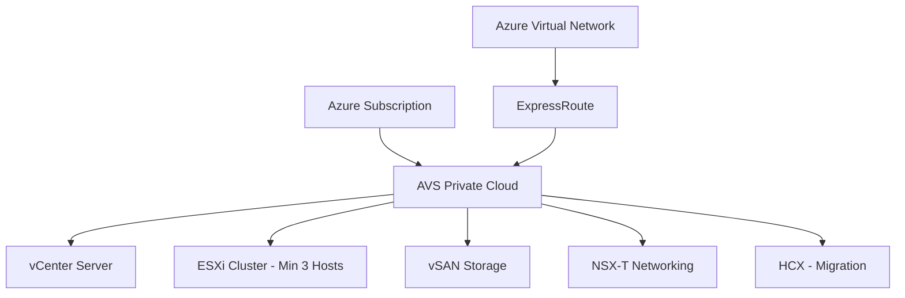

# How to Deploy and Configure Azure VMware Solution Private Cloud in Your Azure Subscription

Author: [nawazdhandala](https://www.github.com/nawazdhandala)

Tags: Azure, VMware, Private Cloud, vSphere, Migration, Hybrid Cloud, Infrastructure

Description: A comprehensive guide to deploying and configuring an Azure VMware Solution private cloud in your Azure subscription for running VMware workloads natively.

---

If your organization runs VMware on-premises and you want to move workloads to the cloud without re-architecting everything, Azure VMware Solution (AVS) is the straightforward path. It gives you a fully managed VMware environment running on dedicated Azure infrastructure - complete with vSphere, vSAN, NSX-T, and HCX. Your existing VMs, templates, and operational procedures carry over with minimal changes.

This guide walks through deploying an AVS private cloud from scratch and configuring it for production use.

## What You Get with Azure VMware Solution

When you deploy an AVS private cloud, Azure provisions:

- **VMware vSphere (ESXi hosts)** - Bare-metal servers running ESXi in a dedicated cluster.
- **VMware vCenter Server** - Centralized management for your virtual infrastructure.
- **VMware vSAN** - Software-defined storage across the ESXi hosts.
- **VMware NSX-T** - Software-defined networking with microsegmentation.
- **VMware HCX** - Hybrid connectivity and workload migration tools.

All of this runs on dedicated hardware. Your workloads are not sharing physical hosts with other Azure customers.



## Prerequisites

Before deploying, you need:

- An Azure subscription with the `Microsoft.AVS` resource provider registered.
- A quota request approved for the number of hosts you need (minimum 3 hosts per cluster).
- A /22 CIDR address block for the private cloud management network (this must not overlap with your on-premises or Azure networks).
- ExpressRoute or VPN connectivity if you plan to connect to on-premises.

The /22 address block is one of the most important planning decisions. It is used for vCenter, ESXi management, vSAN, and NSX-T management interfaces. Once assigned, it cannot be changed without redeploying the private cloud.

## Step 1: Register the Resource Provider

Before you can deploy AVS, register the resource provider in your subscription.

```bash
# Register the Azure VMware Solution resource provider
az provider register --namespace Microsoft.AVS

# Check registration status (wait until it shows 'Registered')
az provider show --namespace Microsoft.AVS --query "registrationState" --output tsv
```

## Step 2: Request Host Quota

AVS requires an explicit quota allocation. Submit a quota request through the Azure portal.

1. Go to Subscriptions in the Azure portal.
2. Select your subscription.
3. Under Settings, click "Usage + quotas."
4. Search for "AVS."
5. Click "Request increase" and specify the region and number of hosts.

Microsoft typically approves quota requests within a few business days. For production deployments, request enough hosts to handle your workload plus growth.

## Step 3: Deploy the Private Cloud

With the provider registered and quota approved, deploy the private cloud using the Azure CLI.

```bash
# Deploy an Azure VMware Solution private cloud
az vmware private-cloud create \
  --resource-group myResourceGroup \
  --name myAVSPrivateCloud \
  --location eastus \
  --sku AV36 \
  --cluster-size 3 \
  --network-block "10.175.0.0/22" \
  --accept-eula
```

Key parameters explained:

- **sku**: `AV36` is the standard host type with 36 cores, 576 GB RAM, and 15.2 TB NVMe storage per host. `AV36P` and `AV52` offer more resources.
- **cluster-size**: Minimum 3 hosts. You can scale up to 16 hosts per cluster later.
- **network-block**: The /22 CIDR block for management. Choose carefully - this cannot be changed.

Deployment takes 3-4 hours. Monitor the progress in the Azure portal or with the CLI.

```bash
# Check the deployment status
az vmware private-cloud show \
  --resource-group myResourceGroup \
  --name myAVSPrivateCloud \
  --query "provisioningState" \
  --output tsv
```

## Step 4: Retrieve Access Credentials

Once the private cloud is deployed, retrieve the vCenter and NSX-T manager credentials.

```bash
# Get the vCenter URL and admin credentials
az vmware private-cloud show \
  --resource-group myResourceGroup \
  --name myAVSPrivateCloud \
  --query "{vcenterUrl: endpoints.vcsa, nsxtUrl: endpoints.nsxtManager}" \
  --output table

# Get the admin password for vCenter
az vmware private-cloud list-admin-credentials \
  --resource-group myResourceGroup \
  --name myAVSPrivateCloud
```

The output includes:

- vCenter URL (typically `https://vcenter-ip/ui`)
- vCenter admin username (`cloudadmin@vsphere.local`)
- vCenter admin password
- NSX-T manager URL
- NSX-T admin credentials

Store these credentials securely. The `cloudadmin` account has limited privileges compared to the root vSphere administrator - this is by design since Microsoft manages the underlying infrastructure.

## Step 5: Set Up Network Connectivity

To access the vCenter and manage VMs, you need network connectivity between your Azure virtual network (or on-premises network) and the AVS private cloud.

### Connect via ExpressRoute

AVS includes a managed ExpressRoute circuit. Connect it to your existing ExpressRoute gateway.

```bash
# Get the ExpressRoute circuit ID from AVS
CIRCUIT_ID=$(az vmware private-cloud show \
  --resource-group myResourceGroup \
  --name myAVSPrivateCloud \
  --query "circuit.expressRouteId" \
  --output tsv)

# Create an authorization key
az vmware authorization create \
  --resource-group myResourceGroup \
  --private-cloud myAVSPrivateCloud \
  --name myAuthKey

# Get the authorization key
AUTH_KEY=$(az vmware authorization show \
  --resource-group myResourceGroup \
  --private-cloud myAVSPrivateCloud \
  --name myAuthKey \
  --query "expressRouteAuthorizationKey" \
  --output tsv)

# Connect the AVS ExpressRoute circuit to your virtual network gateway
az network vpn-connection create \
  --resource-group myNetworkResourceGroup \
  --name AVSConnection \
  --vnet-gateway1 myExpressRouteGateway \
  --express-route-circuit2 "$CIRCUIT_ID" \
  --authorization-key "$AUTH_KEY"
```

After the connection is established, you can access vCenter from machines connected to your Azure virtual network.

## Step 6: Configure NSX-T Networking

NSX-T provides the network segments where your VMs will run. Create at least one network segment through the Azure portal or NSX-T manager.

```bash
# Create a DHCP server for automatic IP assignment
az vmware workload-network dhcp server create \
  --resource-group myResourceGroup \
  --private-cloud myAVSPrivateCloud \
  --dhcp-id myDhcpServer \
  --display-name "Workload DHCP" \
  --server-address "10.180.0.1/24" \
  --lease-time 86400

# Create a network segment for workload VMs
az vmware workload-network segment create \
  --resource-group myResourceGroup \
  --private-cloud myAVSPrivateCloud \
  --segment-id workload-segment-1 \
  --display-name "Workload Segment 1" \
  --connected-gateway "/infra/tier-1s/TNT##-T1" \
  --subnet dhcp-range="10.180.1.10-10.180.1.200" gateway-address="10.180.1.1/24"
```

Plan your network segments based on workload isolation requirements. Each segment can have its own DHCP scope, DNS settings, and firewall rules.

## Step 7: Configure DNS Resolution

Set up DNS forwarding so that VMs in the private cloud can resolve names in your on-premises domain and Azure private DNS zones.

```bash
# Configure DNS forwarder in the private cloud
az vmware workload-network dns-service create \
  --resource-group myResourceGroup \
  --private-cloud myAVSPrivateCloud \
  --dns-service-id myDnsService \
  --display-name "Workload DNS" \
  --default-dns-zone "default" \
  --fqdn-zones "corp.example.com" \
  --dns-service-ip "10.180.0.10" \
  --log-level "INFO"
```

## Step 8: Verify the Deployment

Log in to vCenter using the credentials from Step 4 and verify everything is working.

1. Open a browser and navigate to the vCenter URL.
2. Log in with the `cloudadmin@vsphere.local` account.
3. Verify that the cluster shows the correct number of hosts.
4. Check that vSAN storage is healthy (under Monitor > vSAN).
5. Create a test VM to confirm everything works end to end.

In the vSphere client, you should see:

- A datacenter named after your private cloud.
- A cluster with your ESXi hosts.
- vSAN datastore with capacity proportional to your host count.
- Network segments you created in NSX-T.

## Cost Considerations

AVS pricing is per-host, per-hour. As of writing:

- **AV36**: Approximately $9.50 per host per hour.
- A minimum 3-host cluster costs roughly $20,500 per month.

This is a significant commitment, so right-size your cluster based on actual workload requirements. You can start with 3 hosts and scale up, but you cannot scale below 3.

Azure offers reserved instances (1-year and 3-year) with significant discounts - up to 57% for a 3-year commitment.

## Summary

Deploying Azure VMware Solution follows a predictable pattern: register the provider, request quota, deploy the private cloud, set up networking, and configure workload segments. The deployment itself is largely automated by Azure, but the planning phase is where you need to invest time - particularly around the /22 network block and ExpressRoute connectivity. Once deployed, you get a familiar vSphere environment that your VMware administrators already know how to manage, now running on Azure infrastructure with native integration into Azure services.
