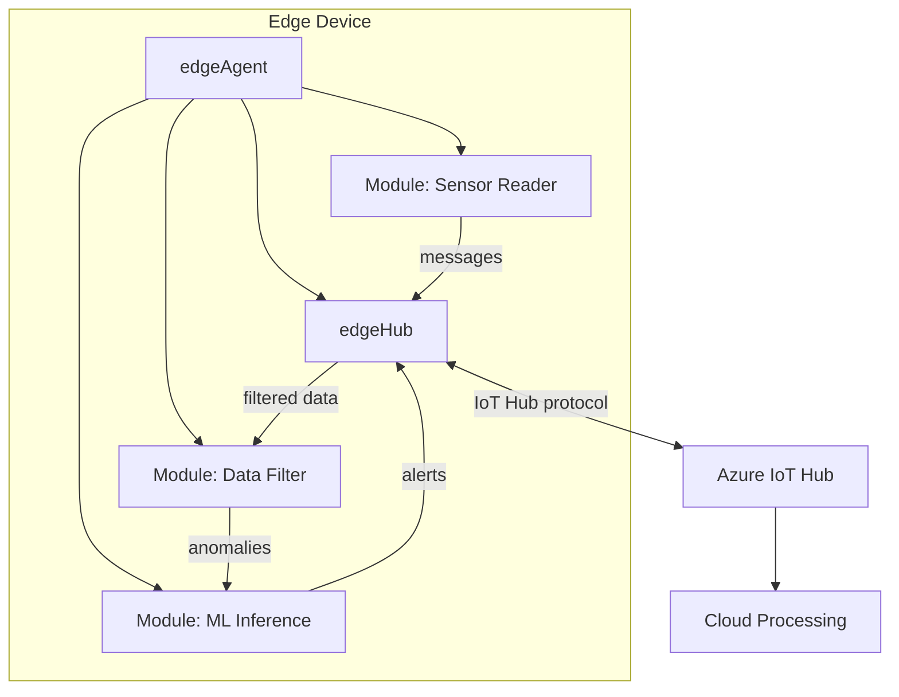

# How to Deploy and Manage IoT Edge Modules on Edge Devices from Azure IoT Hub

Author: [nawazdhandala](https://www.github.com/nawazdhandala)

Tags: Azure IoT Edge, IoT Hub, Edge Modules, Edge Computing, Containers, Deployment Manifests, IoT

Description: Learn how to deploy and manage containerized IoT Edge modules on edge devices from Azure IoT Hub, including deployment manifests, layered deployments, and monitoring.

---

Not everything should go to the cloud. When your IoT devices generate massive amounts of data, need to respond in milliseconds, or must operate during network outages, processing data at the edge makes sense. Azure IoT Edge lets you deploy containerized workloads (called modules) to edge devices and manage them from Azure IoT Hub. You write your processing logic as Docker containers, define a deployment manifest, and push it to your edge devices. IoT Hub handles the orchestration.

This guide covers deploying modules to IoT Edge devices, from setting up the edge runtime to managing deployments at scale.

## How IoT Edge Works

An IoT Edge device runs three components:

**IoT Edge runtime (edgeAgent)** - Manages the lifecycle of modules on the device. It pulls container images, starts/stops modules, and reports status back to IoT Hub.

**IoT Edge hub (edgeHub)** - Handles communication between modules and between the device and IoT Hub. It acts as a local message broker and manages message routing on the device.

**Custom modules** - Your containerized workloads. These can be written in any language and packaged as Docker containers.



## Prerequisites

- An Azure IoT Hub (S1 tier or higher)
- A device registered as an IoT Edge device in the hub
- An edge device (Linux VM, Raspberry Pi, or industrial gateway) with:
  - Docker engine installed
  - Azure IoT Edge runtime installed
  - Network connectivity to Azure (can be intermittent)
- An Azure Container Registry (ACR) to store custom module images

## Step 1: Register an IoT Edge Device

```bash
# Register a device as an IoT Edge device in IoT Hub
az iot hub device-identity create \
    --hub-name iothub-production-001 \
    --device-id edge-gateway-001 \
    --edge-enabled

# Get the device connection string for configuring the edge runtime
az iot hub device-identity connection-string show \
    --hub-name iothub-production-001 \
    --device-id edge-gateway-001 \
    --query connectionString -o tsv
```

## Step 2: Install the IoT Edge Runtime on the Device

On the edge device (Ubuntu 22.04 example):

```bash
# Install the IoT Edge runtime on Ubuntu 22.04
# This sets up the edge agent that manages module deployments

# Add the Microsoft package repository
curl -sSL https://packages.microsoft.com/config/ubuntu/22.04/packages-microsoft-prod.deb -o packages-microsoft-prod.deb
sudo dpkg -i packages-microsoft-prod.deb
rm packages-microsoft-prod.deb

# Install the IoT Edge runtime and Moby container engine
sudo apt-get update
sudo apt-get install -y aziot-edge defender-iot-micro-agent-edge

# Configure the edge runtime with the device connection string
# Replace with your actual connection string from Step 1
sudo iotedge config mp --connection-string "HostName=iothub-production-001.azure-devices.net;DeviceId=edge-gateway-001;SharedAccessKey=..."

# Apply the configuration
sudo iotedge config apply

# Verify the installation
sudo iotedge system status
sudo iotedge list
```

After a few minutes, the edge agent and edge hub modules should be running:

```bash
# Check running modules
sudo iotedge list

# Expected output:
# NAME             STATUS           DESCRIPTION      CONFIG
# edgeAgent        running          Up 2 minutes     mcr.microsoft.com/azureiotedge-agent:1.5
# edgeHub          running          Up 1 minute      mcr.microsoft.com/azureiotedge-hub:1.5
```

## Step 3: Create a Custom Module

Let's create a simple module that reads simulated sensor data and filters it before sending to the cloud. First, the Python code:

```python
# Module: temperature_filter
# Reads temperature data from a sensor module and forwards only
# readings that exceed a configurable threshold

import asyncio
import json
import os
from azure.iot.device.aio import IoTHubModuleClient

# Configuration from module twin or environment variables
TEMPERATURE_THRESHOLD = float(os.getenv("TEMPERATURE_THRESHOLD", "25.0"))
MODULE_NAME = os.getenv("IOTEDGE_MODULEID", "temperatureFilter")

async def main():
    # Create the module client (connects to edgeHub automatically)
    module_client = IoTHubModuleClient.create_from_edge_environment()
    await module_client.connect()

    print(f"Temperature filter module started. Threshold: {TEMPERATURE_THRESHOLD}")

    # Handler for incoming messages from other modules
    async def message_handler(message):
        try:
            body = json.loads(message.data.decode("utf-8"))
            temperature = body.get("temperature", 0)

            if temperature > TEMPERATURE_THRESHOLD:
                # Forward high-temperature readings to the cloud
                alert_message = json.dumps({
                    "temperature": temperature,
                    "alert": True,
                    "threshold": TEMPERATURE_THRESHOLD,
                    "source": body.get("deviceId", "unknown")
                })

                await module_client.send_message_to_output(alert_message, "alertOutput")
                print(f"Alert sent: temperature={temperature}")
            else:
                print(f"Normal reading filtered: temperature={temperature}")

        except Exception as e:
            print(f"Error processing message: {e}")

    # Register the input handler
    module_client.on_message_received = message_handler

    # Handle twin desired property updates
    async def twin_handler(patch):
        nonlocal TEMPERATURE_THRESHOLD
        if "temperatureThreshold" in patch:
            TEMPERATURE_THRESHOLD = patch["temperatureThreshold"]
            print(f"Threshold updated to: {TEMPERATURE_THRESHOLD}")

    module_client.on_twin_desired_properties_patch_received = twin_handler

    # Keep running
    while True:
        await asyncio.sleep(1)

if __name__ == "__main__":
    asyncio.run(main())
```

Package this as a Docker container:

```dockerfile
# Dockerfile for the temperature filter module
FROM python:3.11-slim

# Install the Azure IoT Device SDK
RUN pip install azure-iot-device

# Copy the module code
WORKDIR /app
COPY temperature_filter.py .

# Run the module
CMD ["python", "-u", "temperature_filter.py"]
```

Build and push to Azure Container Registry:

```bash
# Build and push the module image to ACR
az acr build \
    --registry acriotmodules \
    --image temperature-filter:1.0.0 \
    --file Dockerfile \
    .
```

## Step 4: Create a Deployment Manifest

The deployment manifest is a JSON file that tells the edge agent which modules to run and how they should communicate.

```json
{
    "modulesContent": {
        "$edgeAgent": {
            "properties.desired": {
                "schemaVersion": "1.1",
                "runtime": {
                    "type": "docker",
                    "settings": {
                        "minDockerVersion": "v1.25",
                        "loggingOptions": "",
                        "registryCredentials": {
                            "acriotmodules": {
                                "username": "acriotmodules",
                                "password": "<acr-password>",
                                "address": "acriotmodules.azurecr.io"
                            }
                        }
                    }
                },
                "systemModules": {
                    "edgeAgent": {
                        "type": "docker",
                        "settings": {
                            "image": "mcr.microsoft.com/azureiotedge-agent:1.5"
                        }
                    },
                    "edgeHub": {
                        "type": "docker",
                        "settings": {
                            "image": "mcr.microsoft.com/azureiotedge-hub:1.5"
                        },
                        "env": {
                            "OptimizeForPerformance": {"value": "false"}
                        },
                        "status": "running",
                        "restartPolicy": "always"
                    }
                },
                "modules": {
                    "SimulatedTemperatureSensor": {
                        "version": "1.0",
                        "type": "docker",
                        "status": "running",
                        "restartPolicy": "always",
                        "settings": {
                            "image": "mcr.microsoft.com/azureiotedge-simulated-temperature-sensor:1.0"
                        }
                    },
                    "temperatureFilter": {
                        "version": "1.0",
                        "type": "docker",
                        "status": "running",
                        "restartPolicy": "always",
                        "settings": {
                            "image": "acriotmodules.azurecr.io/temperature-filter:1.0.0"
                        },
                        "env": {
                            "TEMPERATURE_THRESHOLD": {"value": "25.0"}
                        }
                    }
                }
            }
        },
        "$edgeHub": {
            "properties.desired": {
                "schemaVersion": "1.1",
                "routes": {
                    "sensorToFilter": "FROM /messages/modules/SimulatedTemperatureSensor/outputs/* INTO BrokeredEndpoint(\"/modules/temperatureFilter/inputs/input1\")",
                    "filterToHub": "FROM /messages/modules/temperatureFilter/outputs/alertOutput INTO $upstream"
                },
                "storeAndForwardConfiguration": {
                    "timeToLiveSecs": 7200
                }
            }
        },
        "temperatureFilter": {
            "properties.desired": {
                "temperatureThreshold": 25.0
            }
        }
    }
}
```

The routes section is critical. It defines the message flow:
1. `sensorToFilter` - Messages from the simulated sensor go to the filter module's input
2. `filterToHub` - Messages from the filter module's alert output go to IoT Hub ($upstream)

The `storeAndForwardConfiguration` tells edgeHub to buffer messages for up to 7200 seconds (2 hours) if the device loses cloud connectivity. Messages are sent when connectivity is restored.

## Step 5: Deploy to a Single Device

```bash
# Apply the deployment manifest to a specific edge device
az iot edge set-modules \
    --hub-name iothub-production-001 \
    --device-id edge-gateway-001 \
    --content ./deployment.manifest.json
```

After deployment, verify on the edge device:

```bash
# Check that all modules are running
sudo iotedge list

# Expected output:
# NAME                          STATUS    DESCRIPTION      CONFIG
# edgeAgent                     running   Up 10 minutes    mcr.microsoft.com/azureiotedge-agent:1.5
# edgeHub                       running   Up 10 minutes    mcr.microsoft.com/azureiotedge-hub:1.5
# SimulatedTemperatureSensor    running   Up 2 minutes     mcr.microsoft.com/...
# temperatureFilter             running   Up 2 minutes     acriotmodules.azurecr.io/temperature-filter:1.0.0

# Check module logs
sudo iotedge logs temperatureFilter --tail 20
```

## Step 6: Deploy at Scale with Layered Deployments

For deploying to many devices, use automatic deployments that target devices based on twin tags:

```bash
# Create an automatic deployment targeting all edge devices in building B1
az iot edge deployment create \
    --hub-name iothub-production-001 \
    --deployment-id "deploy-tempfilter-building-b1" \
    --content ./deployment.manifest.json \
    --target-condition "tags.location.building = 'B1'" \
    --priority 10

# Create a layered deployment that adds an ML module only to gateway devices
az iot edge deployment create \
    --hub-name iothub-production-001 \
    --deployment-id "deploy-ml-gateways" \
    --content ./ml-module-layer.json \
    --target-condition "tags.role = 'gateway'" \
    --priority 20 \
    --layered
```

Layered deployments are additive. They add modules on top of the base deployment without replacing it. Use them for deploying optional modules to subsets of devices.

Priority determines which deployment wins when a device matches multiple deployments. Higher priority takes precedence.

## Step 7: Monitor Edge Deployments

Check deployment status from IoT Hub:

```bash
# Show deployment details and status
az iot edge deployment show \
    --hub-name iothub-production-001 \
    --deployment-id "deploy-tempfilter-building-b1"

# List all deployments
az iot edge deployment list \
    --hub-name iothub-production-001 \
    --output table

# Check the module status for a specific device
az iot hub module-twin show \
    --hub-name iothub-production-001 \
    --device-id edge-gateway-001 \
    --module-id temperatureFilter
```

The deployment status shows:
- **Targeted** - Number of devices matching the target condition
- **Applied** - Number of devices that received the deployment
- **Reporting Success** - Number of devices where all modules are running successfully
- **Reporting Failure** - Number of devices with module failures

## Updating Modules

To update a module, push a new container image version and update the deployment manifest:

```bash
# Build and push a new version of the module
az acr build \
    --registry acriotmodules \
    --image temperature-filter:1.1.0 \
    --file Dockerfile \
    .

# Update the deployment with the new image version
# Edit the manifest to reference temperature-filter:1.1.0, then apply
az iot edge deployment create \
    --hub-name iothub-production-001 \
    --deployment-id "deploy-tempfilter-building-b1-v1.1" \
    --content ./deployment-v1.1.manifest.json \
    --target-condition "tags.location.building = 'B1'" \
    --priority 11
```

Increase the priority so the new deployment supersedes the old one.

## Wrapping Up

Azure IoT Edge brings cloud intelligence to edge devices through containerized modules managed from IoT Hub. Define your processing logic as Docker containers, describe the deployment in a manifest, and push it to individual devices or entire fleets. The edge runtime handles module lifecycle, message routing between modules, and store-and-forward buffering for intermittent connectivity. Combined with layered deployments and automatic targeting, you can manage complex edge computing scenarios across thousands of devices without touching a single device manually.
