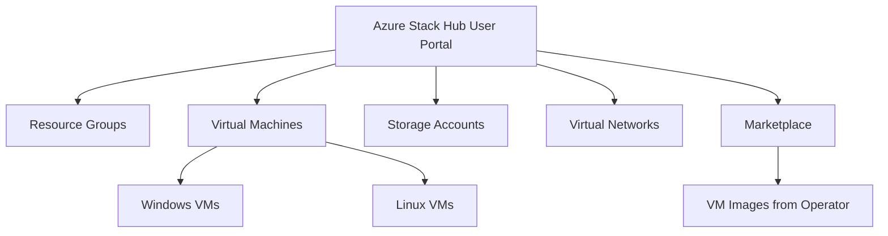

# How to Deploy and Manage VMs on Azure Stack Hub Using the User Portal

Author: [nawazdhandala](https://www.github.com/nawazdhandala)

Tags: Azure, Azure Stack Hub, Virtual Machines, User Portal, Hybrid Cloud, Infrastructure, IaaS

Description: A practical guide to deploying and managing virtual machines on Azure Stack Hub using the user portal for on-premises cloud workloads.

---

Azure Stack Hub brings the Azure portal experience to your on-premises data center. If you know how to create a VM in Azure, you already know most of what you need for Azure Stack Hub. The user portal looks nearly identical, the APIs are compatible, and ARM templates work across both environments. The difference is that everything runs on hardware physically located in your building, which matters for latency-sensitive workloads, data sovereignty requirements, and disconnected scenarios.

This guide covers creating and managing VMs through the Azure Stack Hub user portal, from selecting images to configuring networking and storage.

## Understanding the Azure Stack Hub User Portal

Azure Stack Hub has two portals:

- **Administrator portal** - Used by the cloud operator to manage capacity, offers, plans, and infrastructure. Regular users do not access this.
- **User portal** - Used by tenants (developers, application teams) to deploy and manage their resources. This is what we will focus on.

The user portal URL follows the pattern: `https://portal.<region>.<fqdn>`. Your Azure Stack Hub operator provides this URL along with your credentials.



## Prerequisites

- Access to an Azure Stack Hub user portal with valid credentials.
- A subscription assigned to you by the Azure Stack Hub operator (with a plan that includes compute, network, and storage quotas).
- At least one VM image available in the marketplace (the operator must have downloaded and published images).

## Step 1: Check Available Resources

Before creating a VM, verify what resources are available in your subscription.

1. Log in to the user portal.
2. Click "All services" and navigate to "Subscriptions."
3. Select your subscription and review the quotas under "Usage + quotas."

Check available images by going to "Create a resource" > "Compute." The list shows all VM images your operator has made available. Common images include Windows Server 2019/2022 and Ubuntu 20.04/22.04.

If the image you need is not available, request it from your Azure Stack Hub operator. They need to download it from Azure Marketplace or upload a custom image.

## Step 2: Create a Virtual Network

VMs need a virtual network. If one does not already exist, create it first.

1. Click "Create a resource."
2. Search for "Virtual network" and select it.
3. Configure the settings:
   - **Name**: workload-vnet
   - **Address space**: 10.20.0.0/16
   - **Subscription**: Your subscription
   - **Resource group**: Create new or select existing
   - **Location**: The Azure Stack Hub region
   - **Subnet name**: default
   - **Subnet address range**: 10.20.1.0/24
4. Click "Create."

You can also use Azure Resource Manager templates, which work identically on Azure Stack Hub and public Azure.

```json
{
  "$schema": "https://schema.management.azure.com/schemas/2019-04-01/deploymentTemplate.json#",
  "contentVersion": "1.0.0.0",
  "resources": [
    {
      "type": "Microsoft.Network/virtualNetworks",
      "apiVersion": "2018-11-01",
      "name": "workload-vnet",
      "location": "[resourceGroup().location]",
      "properties": {
        "addressSpace": {
          "addressPrefixes": ["10.20.0.0/16"]
        },
        "subnets": [
          {
            "name": "default",
            "properties": {
              "addressPrefix": "10.20.1.0/24"
            }
          },
          {
            "name": "backend",
            "properties": {
              "addressPrefix": "10.20.2.0/24"
            }
          }
        ]
      }
    }
  ]
}
```

Note the API version. Azure Stack Hub may not support the latest API versions available in public Azure. Check the Azure Stack Hub documentation for supported API versions, or use the versions listed in the portal's template export feature.

## Step 3: Create a Virtual Machine

Now create the VM through the portal.

1. Click "Create a resource" > "Compute."
2. Select your desired image (for example, "Ubuntu Server 22.04 LTS").
3. Fill in the Basics tab:
   - **VM name**: web-server-01
   - **Region**: Your Azure Stack Hub region
   - **Availability options**: Based on what your operator offers
   - **Size**: Select from available sizes (determined by operator quotas)
   - **Authentication**: SSH public key (Linux) or password (Windows)
   - **Username**: azureuser
4. Networking tab:
   - **Virtual network**: workload-vnet
   - **Subnet**: default
   - **Public IP**: Create new (if the VM needs external access)
   - **NIC NSG**: Basic, allow SSH (22) or RDP (3389)
5. Management tab:
   - **Boot diagnostics**: Enable with a managed storage account
   - **Auto-shutdown**: Configure if desired
6. Review + Create, then Create.

VM provisioning usually takes 3-5 minutes on Azure Stack Hub, similar to the public Azure experience.

## Step 4: Connect to Your VM

For Linux VMs, connect via SSH using the public IP or private IP (if you have VPN connectivity to the Azure Stack Hub network).

```bash
# Connect to a Linux VM via SSH
ssh azureuser@10.20.1.4

# Or using the public IP
ssh azureuser@<public-ip-address>
```

For Windows VMs, use Remote Desktop.

```bash
# Download the RDP file from the portal, or connect directly
mstsc /v:<public-ip-address>
```

If you do not have a public IP assigned, set up a VPN connection to the Azure Stack Hub virtual network or use a jump box VM that has a public IP.

## Step 5: Manage VMs from the Portal

The user portal provides standard VM management operations.

### Start, Stop, and Restart

Navigate to your VM in the portal. The top toolbar has buttons for Start, Stop, Restart, and Delete. Stopping a VM deallocates the compute resources and stops billing for the VM's compute hours (storage charges continue).

### Resize the VM

1. Stop (deallocate) the VM.
2. Click "Size" in the left menu.
3. Select a new size from the available options.
4. Click "Resize."
5. Start the VM.

Available sizes depend on what your Azure Stack Hub operator has configured. Not all Azure VM sizes are available on Stack Hub.

### Add Data Disks

1. Navigate to your VM.
2. Click "Disks" in the left menu.
3. Click "Add data disk."
4. Select "Create new disk" or attach an existing one.
5. Choose the size and type (Premium SSD or Standard HDD, depending on operator configuration).
6. Click Save.

Inside the VM, initialize and format the new disk.

```bash
# On a Linux VM: Find the new disk
lsblk

# Create a partition
sudo fdisk /dev/sdc

# Format the partition
sudo mkfs.ext4 /dev/sdc1

# Create a mount point and mount the disk
sudo mkdir /data
sudo mount /dev/sdc1 /data

# Add to fstab for persistence across reboots
echo '/dev/sdc1 /data ext4 defaults 0 2' | sudo tee -a /etc/fstab
```

## Step 6: Use Azure CLI with Azure Stack Hub

The Azure CLI works with Azure Stack Hub by configuring the correct cloud environment.

```bash
# Register the Azure Stack Hub cloud environment
az cloud register \
  --name AzureStackHub \
  --endpoint-resource-manager "https://management.<region>.<fqdn>" \
  --suffix-storage-endpoint "<region>.<fqdn>" \
  --suffix-keyvault-dns ".vault.<region>.<fqdn>"

# Set the active cloud
az cloud set --name AzureStackHub

# Login to Azure Stack Hub
az login --tenant your-tenant-id

# Now use standard Azure CLI commands
az vm list --resource-group myResourceGroup --output table
```

Create a VM through the CLI.

```bash
# Create a VM using Azure CLI on Azure Stack Hub
az vm create \
  --resource-group myResourceGroup \
  --name app-server-01 \
  --image "Ubuntu2204" \
  --size Standard_DS2_v2 \
  --vnet-name workload-vnet \
  --subnet default \
  --admin-username azureuser \
  --ssh-key-values ~/.ssh/id_rsa.pub \
  --nsg-rule SSH
```

## Step 7: Monitor VM Performance

Azure Stack Hub includes basic monitoring capabilities through the portal.

1. Navigate to your VM.
2. Click "Metrics" in the left menu.
3. Select metrics like CPU percentage, disk IOPS, network bytes, and memory percentage.
4. Set the time range and aggregation type.

For more advanced monitoring, deploy the Azure Monitor Agent if your Azure Stack Hub operator has enabled the diagnostic extension.

```bash
# Enable diagnostics on a Linux VM
az vm diagnostics set \
  --resource-group myResourceGroup \
  --vm-name web-server-01 \
  --settings '{"ladCfg": {"diagnosticMonitorConfiguration": {"performanceCounters": {"performanceCounterConfiguration": []}}}}'
```

## Working with VM Extensions

VM extensions let you run post-deployment configuration scripts on your VMs.

```bash
# Run a custom script on a Linux VM
az vm extension set \
  --resource-group myResourceGroup \
  --vm-name web-server-01 \
  --name CustomScript \
  --publisher Microsoft.Azure.Extensions \
  --settings '{
    "commandToExecute": "apt-get update && apt-get install -y nginx"
  }'
```

Common extensions available on Azure Stack Hub:

- **CustomScript** - Run arbitrary scripts during or after deployment.
- **DSC (Desired State Configuration)** - Apply PowerShell DSC configurations to Windows VMs.
- **Docker** - Install and configure Docker on Linux VMs.

Not all Azure extensions are available on Stack Hub. Check with your operator for the supported extension list.

## Tips for Azure Stack Hub Users

**Template compatibility**: ARM templates written for public Azure usually work on Stack Hub with minor changes - mainly API versions. Use the `AzureStack` profile when generating templates.

**Image availability**: Unlike public Azure where you can choose from thousands of images, Stack Hub only has images your operator has provisioned. Plan ahead and communicate image needs to your operator.

**Quota limits**: Each subscription has quotas for vCPUs, memory, storage, and network resources. Check your quotas before planning large deployments.

**Backup**: Azure Stack Hub supports Azure Backup for VMs if the operator has enabled it. Configure backup policies early since recovering from a VM loss without backup is not fun.

## Summary

Deploying VMs on Azure Stack Hub through the user portal is intentionally similar to the public Azure experience. If you can create a VM in Azure, you can do it on Stack Hub. The main differences are the limited image catalog, API version constraints, and quota boundaries set by your operator. For teams running hybrid environments, the consistent tooling across Azure and Azure Stack Hub means you do not need separate operational procedures for cloud and on-premises workloads.
