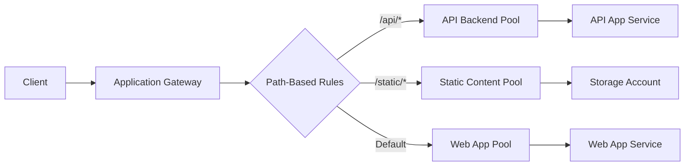

# How to Deploy Azure Application Gateway with Path-Based Routing Using Terraform

Author: [nawazdhandala](https://www.github.com/nawazdhandala)

Tags: Terraform, Azure, Application Gateway, Load Balancing, Networking, IaC, DevOps

Description: Deploy Azure Application Gateway v2 with path-based routing rules using Terraform to route traffic to different backend pools based on URL paths.

---

Azure Application Gateway is a Layer 7 load balancer that lets you route HTTP and HTTPS traffic based on URL paths, hostnames, and other request attributes. Path-based routing is one of its most useful features - you can send `/api/*` requests to your API backend and `/*` to your web frontend, all through a single public IP and SSL certificate.

Deploying Application Gateway through the portal is a maze of blades and dropdowns. Terraform gives you a declarative way to define the whole thing - listeners, backend pools, routing rules, health probes, and path maps - in code that you can review and version.

## Architecture Overview

Here is what we are building:



## The Full Terraform Configuration

Application Gateway has a lot of nested configuration blocks. I will build it up piece by piece.

### Networking Foundation

Application Gateway needs its own dedicated subnet.

```hcl
resource "azurerm_resource_group" "main" {
  name     = "rg-appgw-demo"
  location = "eastus"
}

resource "azurerm_virtual_network" "main" {
  name                = "vnet-appgw"
  resource_group_name = azurerm_resource_group.main.name
  location            = azurerm_resource_group.main.location
  address_space       = ["10.0.0.0/16"]
}

# Dedicated subnet for Application Gateway
resource "azurerm_subnet" "appgw" {
  name                 = "snet-appgw"
  resource_group_name  = azurerm_resource_group.main.name
  virtual_network_name = azurerm_virtual_network.main.name
  address_prefixes     = ["10.0.0.0/24"]
}

# Public IP for the Application Gateway frontend
resource "azurerm_public_ip" "appgw" {
  name                = "pip-appgw"
  resource_group_name = azurerm_resource_group.main.name
  location            = azurerm_resource_group.main.location
  allocation_method   = "Static"
  sku                 = "Standard"
}
```

The subnet should be sized appropriately - each Application Gateway instance needs private IPs, and autoscaling adds more instances. A /24 subnet gives you plenty of room.

### Application Gateway Resource

Now for the main resource. This is a large block, but each section has a clear purpose.

```hcl
resource "azurerm_application_gateway" "main" {
  name                = "appgw-demo"
  resource_group_name = azurerm_resource_group.main.name
  location            = azurerm_resource_group.main.location

  # SKU and capacity settings
  sku {
    name     = "Standard_v2"
    tier     = "Standard_v2"
  }

  autoscale_configuration {
    min_capacity = 1
    max_capacity = 10
  }

  # Gateway IP configuration - ties the gateway to its subnet
  gateway_ip_configuration {
    name      = "gateway-ip-config"
    subnet_id = azurerm_subnet.appgw.id
  }

  # Frontend IP configuration - the public-facing IP
  frontend_ip_configuration {
    name                 = "frontend-ip"
    public_ip_address_id = azurerm_public_ip.appgw.id
  }

  # Frontend port for HTTPS
  frontend_port {
    name = "https-port"
    port = 443
  }

  # Frontend port for HTTP (for redirect)
  frontend_port {
    name = "http-port"
    port = 80
  }

  # SSL certificate (use a Key Vault reference in production)
  ssl_certificate {
    name     = "appgw-cert"
    data     = filebase64("./certs/appgw.pfx")
    password = var.ssl_cert_password
  }

  # ---- Backend Pools ----

  # Backend pool for the API
  backend_address_pool {
    name  = "pool-api"
    fqdns = [var.api_hostname]
  }

  # Backend pool for static content
  backend_address_pool {
    name  = "pool-static"
    fqdns = [var.static_hostname]
  }

  # Backend pool for the web application (default)
  backend_address_pool {
    name  = "pool-web"
    fqdns = [var.web_hostname]
  }

  # ---- Backend HTTP Settings ----

  # HTTP settings for API backend
  backend_http_settings {
    name                  = "settings-api"
    cookie_based_affinity = "Disabled"
    port                  = 443
    protocol              = "Https"
    request_timeout       = 30
    probe_name            = "probe-api"
    # Override the host header with the backend's hostname
    pick_host_name_from_backend_address = true
  }

  # HTTP settings for static content
  backend_http_settings {
    name                  = "settings-static"
    cookie_based_affinity = "Disabled"
    port                  = 443
    protocol              = "Https"
    request_timeout       = 15
    probe_name            = "probe-static"
    pick_host_name_from_backend_address = true
  }

  # HTTP settings for web app
  backend_http_settings {
    name                  = "settings-web"
    cookie_based_affinity = "Disabled"
    port                  = 443
    protocol              = "Https"
    request_timeout       = 30
    probe_name            = "probe-web"
    pick_host_name_from_backend_address = true
  }

  # ---- Health Probes ----

  # Health probe for the API
  probe {
    name                                      = "probe-api"
    protocol                                  = "Https"
    path                                      = "/api/health"
    interval                                  = 30
    timeout                                   = 10
    unhealthy_threshold                       = 3
    pick_host_name_from_backend_http_settings = true
  }

  # Health probe for static content
  probe {
    name                                      = "probe-static"
    protocol                                  = "Https"
    path                                      = "/"
    interval                                  = 60
    timeout                                   = 10
    unhealthy_threshold                       = 3
    pick_host_name_from_backend_http_settings = true
  }

  # Health probe for the web app
  probe {
    name                                      = "probe-web"
    protocol                                  = "Https"
    path                                      = "/health"
    interval                                  = 30
    timeout                                   = 10
    unhealthy_threshold                       = 3
    pick_host_name_from_backend_http_settings = true
  }

  # ---- Listeners ----

  # HTTPS listener
  http_listener {
    name                           = "listener-https"
    frontend_ip_configuration_name = "frontend-ip"
    frontend_port_name             = "https-port"
    protocol                       = "Https"
    ssl_certificate_name           = "appgw-cert"
  }

  # HTTP listener (for redirect to HTTPS)
  http_listener {
    name                           = "listener-http"
    frontend_ip_configuration_name = "frontend-ip"
    frontend_port_name             = "http-port"
    protocol                       = "Http"
  }

  # ---- URL Path Map ----

  # Path-based routing rules
  url_path_map {
    name                               = "path-map"
    default_backend_address_pool_name  = "pool-web"
    default_backend_http_settings_name = "settings-web"

    # Route /api/* to the API backend
    path_rule {
      name                       = "api-path"
      paths                      = ["/api/*"]
      backend_address_pool_name  = "pool-api"
      backend_http_settings_name = "settings-api"
    }

    # Route /static/* to the static content backend
    path_rule {
      name                       = "static-path"
      paths                      = ["/static/*"]
      backend_address_pool_name  = "pool-static"
      backend_http_settings_name = "settings-static"
    }
  }

  # ---- Request Routing Rules ----

  # Main routing rule using path-based routing
  request_routing_rule {
    name               = "rule-path-based"
    priority           = 100
    rule_type          = "PathBasedRouting"
    http_listener_name = "listener-https"
    url_path_map_name  = "path-map"
  }

  # HTTP to HTTPS redirect rule
  request_routing_rule {
    name                        = "rule-http-redirect"
    priority                    = 200
    rule_type                   = "Basic"
    http_listener_name          = "listener-http"
    redirect_configuration_name = "redirect-http-to-https"
  }

  # Redirect configuration
  redirect_configuration {
    name                 = "redirect-http-to-https"
    redirect_type        = "Permanent"
    target_listener_name = "listener-https"
    include_path         = true
    include_query_string = true
  }
}
```

### Variables

```hcl
variable "api_hostname" {
  description = "FQDN of the API backend"
  type        = string
}

variable "static_hostname" {
  description = "FQDN of the static content backend"
  type        = string
}

variable "web_hostname" {
  description = "FQDN of the web application backend"
  type        = string
}

variable "ssl_cert_password" {
  description = "Password for the SSL certificate PFX file"
  type        = string
  sensitive   = true
}
```

## How Path-Based Routing Works

When a request comes into the Application Gateway, the listener receives it. The routing rule references the URL path map. The path map evaluates the request URL against the path rules in order:

1. If the URL matches `/api/*`, traffic goes to the API backend pool using API-specific HTTP settings
2. If the URL matches `/static/*`, traffic goes to the static content pool
3. If no path rule matches, traffic goes to the default backend - the web app pool

Each backend can have its own health probe, timeout settings, and connection properties. This means you can have aggressive timeouts for static content (it should respond fast) and longer timeouts for API calls that might do complex processing.

## Outputs

```hcl
output "appgw_public_ip" {
  value = azurerm_public_ip.appgw.ip_address
}

output "appgw_id" {
  value = azurerm_application_gateway.main.id
}
```

## Adding More Path Rules

Adding a new path rule is straightforward. Just add another `path_rule` block inside the `url_path_map`, create the corresponding backend pool, HTTP settings, and health probe. The pattern is always the same.

## Tips for Production

Use Key Vault certificates instead of PFX files. The Application Gateway can pull certificates directly from Key Vault, which simplifies rotation.

Enable diagnostic logging to Log Analytics. Application Gateway access logs are invaluable for debugging routing issues and analyzing traffic patterns.

Size your subnet appropriately. Application Gateway v2 can scale to many instances, and each instance needs IP addresses from the subnet.

Set the `pick_host_name_from_backend_address` setting to `true` when your backends are App Services. App Services require the correct Host header to route traffic to the right app.

## Conclusion

Azure Application Gateway with path-based routing gives you fine-grained control over how traffic reaches your backends. By defining it all in Terraform - the networking, backend pools, path maps, probes, and routing rules - you get a repeatable and reviewable infrastructure definition. The configuration is verbose, but each section has a clear purpose, and once it is in place, adding new paths and backends is a straightforward extension of the existing pattern.
