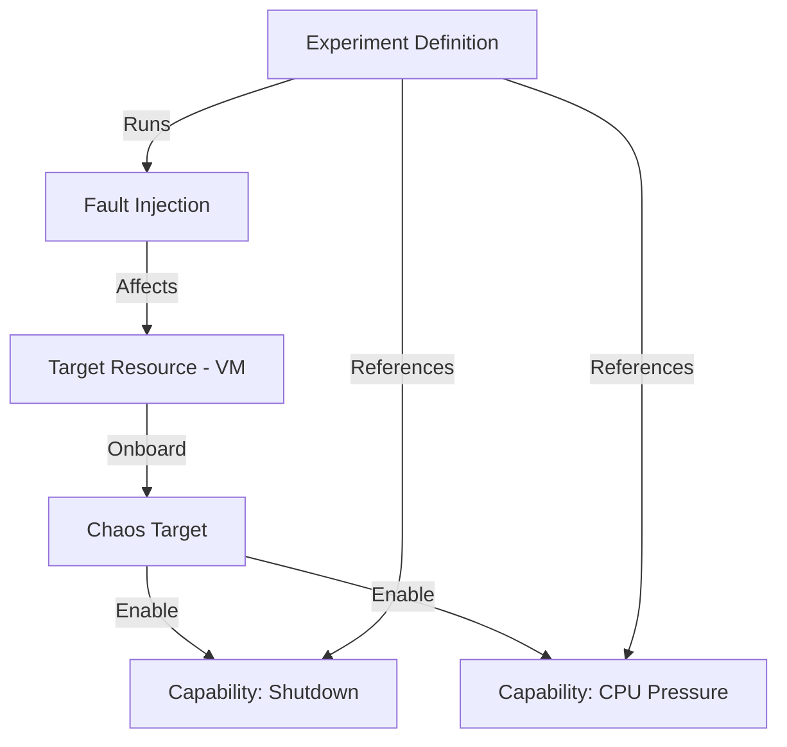

# How to Deploy Azure Chaos Studio Experiments with Target Resources Using Terraform

Author: [nawazdhandala](https://www.github.com/nawazdhandala)

Tags: Azure, Chaos Studio, Terraform, Chaos Engineering, Resilience, Infrastructure as Code, Testing

Description: Learn how to provision Azure Chaos Studio experiments with target resources and fault injection capabilities using Terraform for resilience testing.

---

Chaos engineering is the practice of deliberately injecting failures into your systems to verify they handle them gracefully. Azure Chaos Studio is Microsoft's managed service for running chaos experiments against Azure resources. You can simulate VM shutdowns, network latency, DNS failures, and more, then observe how your application responds.

Setting up Chaos Studio through the portal works for one-off experiments, but when you want chaos testing as a regular part of your development lifecycle - running experiments after every deployment, for instance - managing the configuration through Terraform makes it repeatable and reviewable.

This post covers deploying Chaos Studio experiments with Terraform, including target onboarding, capability registration, and experiment definitions.

## How Chaos Studio Works

Chaos Studio has three main concepts:

1. **Targets** - Azure resources that you want to inject faults into (VMs, AKS clusters, Cosmos DB, etc.)
2. **Capabilities** - Specific faults that can be injected into a target (shutdown, CPU pressure, network disconnect)
3. **Experiments** - Definitions that specify which faults to inject into which targets, in what sequence

Before you can run an experiment, you must onboard the target resources and enable the capabilities you want to use.



## Provider Configuration

```hcl
terraform {
  required_version = ">= 1.5.0"

  required_providers {
    azurerm = {
      source  = "hashicorp/azurerm"
      version = "~> 3.80"
    }
  }
}

provider "azurerm" {
  features {}
}

variable "location" {
  type    = string
  default = "eastus2"
}

variable "environment" {
  type    = string
  default = "staging"
}

locals {
  name_prefix = "chaos-${var.environment}"
  tags = {
    Environment = var.environment
    ManagedBy   = "terraform"
    Purpose     = "chaos-engineering"
  }
}
```

## Infrastructure Under Test

First, create some infrastructure that we will target with chaos experiments. This example uses a VM scale set behind a load balancer, which is a common target for resilience testing.

```hcl
# Resource group
resource "azurerm_resource_group" "chaos" {
  name     = "rg-${local.name_prefix}"
  location = var.location
  tags     = local.tags
}

# Virtual network
resource "azurerm_virtual_network" "main" {
  name                = "vnet-${local.name_prefix}"
  resource_group_name = azurerm_resource_group.chaos.name
  location            = azurerm_resource_group.chaos.location
  address_space       = ["10.0.0.0/16"]
}

resource "azurerm_subnet" "main" {
  name                 = "snet-workload"
  resource_group_name  = azurerm_resource_group.chaos.name
  virtual_network_name = azurerm_virtual_network.main.name
  address_prefixes     = ["10.0.1.0/24"]
}

# VM Scale Set - the target for chaos experiments
resource "azurerm_linux_virtual_machine_scale_set" "target" {
  name                = "vmss-${local.name_prefix}"
  resource_group_name = azurerm_resource_group.chaos.name
  location            = azurerm_resource_group.chaos.location
  sku                 = "Standard_D2s_v5"
  instances           = 3

  admin_username = "azureuser"
  admin_ssh_key {
    username   = "azureuser"
    public_key = file("~/.ssh/id_rsa.pub")
  }

  source_image_reference {
    publisher = "Canonical"
    offer     = "0001-com-ubuntu-server-jammy"
    sku       = "22_04-lts-gen2"
    version   = "latest"
  }

  os_disk {
    storage_account_type = "Premium_LRS"
    caching              = "ReadWrite"
  }

  network_interface {
    name    = "nic"
    primary = true
    ip_configuration {
      name      = "ipconfig"
      primary   = true
      subnet_id = azurerm_subnet.main.id
    }
  }

  identity {
    type = "SystemAssigned"
  }

  tags = local.tags
}
```

## Onboarding Targets

Before Chaos Studio can inject faults into a resource, you need to onboard it as a target. There are two types of targets:

- **Microsoft-managed targets (service-direct)** - Faults are injected through the Azure control plane. No agent needed.
- **Agent-based targets** - Faults are injected through a chaos agent running on the VM. Required for faults like CPU pressure and network latency.

```hcl
# Onboard the VMSS as a service-direct target
# This enables control-plane faults like shutdown and restart
resource "azurerm_chaos_studio_target" "vmss_service_direct" {
  location           = azurerm_resource_group.chaos.location
  target_resource_id = azurerm_linux_virtual_machine_scale_set.target.id
  target_type        = "Microsoft-VirtualMachineScaleSet"

  # Service-direct targets do not require an agent
}

# Enable the Shutdown capability for the VMSS
resource "azurerm_chaos_studio_capability" "vmss_shutdown" {
  chaos_studio_target_id = azurerm_chaos_studio_target.vmss_service_direct.id
  capability_type        = "Shutdown-2.0"
}
```

For agent-based faults, you need to install the Chaos Agent extension on the VMs and onboard them differently.

```hcl
# Install the Chaos Agent on the VMSS
resource "azurerm_virtual_machine_scale_set_extension" "chaos_agent" {
  name                         = "ChaosAgent"
  virtual_machine_scale_set_id = azurerm_linux_virtual_machine_scale_set.target.id
  publisher                    = "Microsoft.Azure.Chaos"
  type                         = "ChaosLinuxAgent"
  type_handler_version         = "1.0"
  auto_upgrade_minor_version   = true

  settings = jsonencode({
    profile = {
      appInsightsKey = ""   # Optional: Application Insights key for agent telemetry
    }
    auth = {
      managedIdentity = {
        enabled    = true
        clientId   = azurerm_linux_virtual_machine_scale_set.target.identity[0].principal_id
      }
    }
  })
}

# Onboard the VMSS as an agent-based target
resource "azurerm_chaos_studio_target" "vmss_agent" {
  location           = azurerm_resource_group.chaos.location
  target_resource_id = azurerm_linux_virtual_machine_scale_set.target.id
  target_type        = "Microsoft-Agent"
}

# Enable CPU pressure capability (agent-based)
resource "azurerm_chaos_studio_capability" "vmss_cpu_pressure" {
  chaos_studio_target_id = azurerm_chaos_studio_target.vmss_agent.id
  capability_type        = "CPUPressure-1.0"
}

# Enable network disconnect capability (agent-based)
resource "azurerm_chaos_studio_capability" "vmss_network_disconnect" {
  chaos_studio_target_id = azurerm_chaos_studio_target.vmss_agent.id
  capability_type        = "NetworkDisconnect-1.0"
}
```

## Creating the Chaos Experiment

The experiment defines the sequence of faults to inject. Experiments are organized into steps, which contain branches, which contain actions. Steps run sequentially, while branches within a step run in parallel.

```hcl
# Chaos Experiment - Resilience test for the application
resource "azurerm_chaos_studio_experiment" "resilience_test" {
  name                = "exp-${local.name_prefix}-resilience"
  resource_group_name = azurerm_resource_group.chaos.name
  location            = azurerm_resource_group.chaos.location

  # Managed identity for the experiment to inject faults
  identity {
    type = "SystemAssigned"
  }

  # Step 1: Test CPU pressure handling
  step {
    name = "cpu-stress-test"
    branch {
      name = "cpu-branch"
      action {
        action_type = "continuous"
        name        = "cpu-pressure-action"
        duration    = "PT10M"    # Run for 10 minutes
        parameters = jsonencode({
          pressureLevel = 80   # 80% CPU utilization
        })
        selector_name = "vmss-targets"
      }
    }
  }

  # Step 2: Test instance shutdown recovery (runs after Step 1)
  step {
    name = "shutdown-recovery-test"
    branch {
      name = "shutdown-branch"
      action {
        action_type = "discrete"
        name        = "vmss-shutdown-action"
        parameters = jsonencode({
          abruptShutdown = "true"   # Simulate a sudden failure
        })
        selector_name = "vmss-targets"
      }
    }
  }

  # Target selector - defines which resources to target
  selectors {
    name = "vmss-targets"
    chaos_studio_target_ids = [
      azurerm_chaos_studio_target.vmss_service_direct.id
    ]
  }

  tags = local.tags
}
```

## RBAC for the Experiment

The experiment's managed identity needs permissions on the target resources to inject faults.

```hcl
# Grant the experiment permission to shut down VMSS instances
resource "azurerm_role_assignment" "experiment_vmss_contributor" {
  scope                = azurerm_linux_virtual_machine_scale_set.target.id
  role_definition_name = "Virtual Machine Contributor"
  principal_id         = azurerm_chaos_studio_experiment.resilience_test.identity[0].principal_id
}
```

## Running the Experiment

After deploying the infrastructure, trigger the experiment.

```bash
# Start the chaos experiment
az chaos experiment start \
  --resource-group rg-chaos-staging \
  --name exp-chaos-staging-resilience

# Check experiment status
az chaos experiment show \
  --resource-group rg-chaos-staging \
  --name exp-chaos-staging-resilience \
  --query "properties.provisioningState"

# List experiment execution history
az chaos experiment execution list \
  --resource-group rg-chaos-staging \
  --experiment-name exp-chaos-staging-resilience \
  --output table
```

## Adding Network Fault Experiments

Network faults are particularly valuable for testing microservice resilience. Here is an experiment that simulates network issues.

```hcl
# Network chaos experiment
resource "azurerm_chaos_studio_experiment" "network_test" {
  name                = "exp-${local.name_prefix}-network"
  resource_group_name = azurerm_resource_group.chaos.name
  location            = azurerm_resource_group.chaos.location

  identity {
    type = "SystemAssigned"
  }

  # Simulate network partition
  step {
    name = "network-disconnect"
    branch {
      name = "disconnect-branch"
      action {
        action_type = "continuous"
        name        = "network-disconnect-action"
        duration    = "PT5M"    # 5 minutes of network disconnection
        parameters = jsonencode({
          destinationAddresses = ["10.0.2.0/24"]   # Block traffic to backend subnet
          direction            = "Outbound"
        })
        selector_name = "web-tier"
      }
    }
  }

  selectors {
    name = "web-tier"
    chaos_studio_target_ids = [
      azurerm_chaos_studio_target.vmss_agent.id
    ]
  }

  tags = local.tags
}
```

## CI/CD Integration

Run chaos experiments as part of your deployment pipeline after staging deployments.

```yaml
# GitHub Actions workflow for automated chaos testing
name: Chaos Test After Deploy
on:
  workflow_run:
    workflows: ["Deploy to Staging"]
    types: [completed]

jobs:
  chaos-test:
    runs-on: ubuntu-latest
    if: ${{ github.event.workflow_run.conclusion == 'success' }}
    steps:
      - name: Azure Login
        uses: azure/login@v2
        with:
          client-id: ${{ secrets.AZURE_CLIENT_ID }}
          tenant-id: ${{ secrets.AZURE_TENANT_ID }}
          subscription-id: ${{ secrets.AZURE_SUBSCRIPTION_ID }}

      - name: Run Chaos Experiment
        run: |
          # Start the experiment
          az chaos experiment start \
            --resource-group rg-chaos-staging \
            --name exp-chaos-staging-resilience

          # Wait and check results
          sleep 900  # Wait for the experiment duration

          STATUS=$(az chaos experiment execution list \
            --resource-group rg-chaos-staging \
            --experiment-name exp-chaos-staging-resilience \
            --query "[0].properties.status" -o tsv)

          if [ "$STATUS" != "Success" ]; then
            echo "Chaos experiment did not complete successfully: $STATUS"
            exit 1
          fi

          echo "Chaos experiment passed"
```

## Wrapping Up

Azure Chaos Studio with Terraform gives you reproducible chaos experiments that you can run as part of your regular testing process. The setup involves onboarding targets, enabling capabilities, defining experiments, and granting permissions. By managing all of this as code, you can version control your chaos experiments, replicate them across environments, and integrate them into CI/CD pipelines. Start with simple shutdown experiments, then progress to CPU pressure, network faults, and multi-step scenarios that simulate real-world failure modes.
