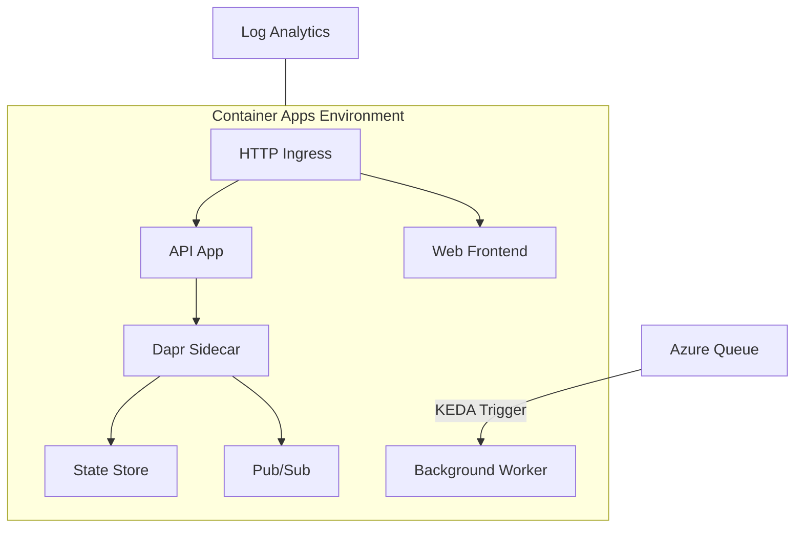

# How to Deploy Azure Container Apps with Pulumi in Python

Author: [nawazdhandala](https://www.github.com/nawazdhandala)

Tags: Pulumi, Azure, Container Apps, Python, Serverless, Infrastructure as Code, Containers

Description: Deploy Azure Container Apps with Pulumi using Python for a fully managed serverless container platform with auto-scaling, ingress, and Dapr integration.

---

Azure Container Apps is Microsoft's answer to a question many teams have been asking: "I want to run containers but I do not want to manage Kubernetes." It gives you a serverless container platform with built-in auto-scaling, HTTP ingress, Dapr integration, and KEDA event-driven scaling - without any cluster management overhead.

Pulumi with Python is an excellent fit for deploying Container Apps. Python is the most popular language in many organizations, and Pulumi's Python SDK gives you type hints, IDE autocompletion, and the ability to use any Python library during deployment. In this post, I will walk through deploying a complete Container Apps environment with Pulumi Python.

## Why Container Apps?

Container Apps sits in a sweet spot between App Service (for simple web apps) and AKS (for full Kubernetes). You get:

- Serverless scaling, including scale to zero
- Built-in HTTP ingress with custom domains
- Revision management for blue-green deployments
- Dapr sidecar support for microservices
- KEDA-based scaling on queues, topics, and custom metrics



## Project Setup

Create a new Pulumi Python project:

```bash
# Create a new Pulumi project with the Azure Native provider
mkdir container-apps && cd container-apps
pulumi new azure-python

# The generated project includes the Azure Native SDK
# Verify by checking requirements.txt
```

Make sure your `requirements.txt` includes:

```
pulumi>=3.0.0,<4.0.0
pulumi-azure-native>=2.0.0,<3.0.0
```

Install dependencies:

```bash
pip install -r requirements.txt
```

## Building the Infrastructure

Here is the complete `__main__.py` that deploys a Container Apps environment with two applications:

```python
# __main__.py - Deploy Azure Container Apps with Pulumi Python

import pulumi
from pulumi_azure_native import resources, operationalinsights, app, containerregistry

# Load configuration
config = pulumi.Config()
environment = config.require("environment")  # dev, staging, prod
location = config.get("location") or "eastus2"
app_name = config.get("appName") or "myapp"

# Naming convention
def name(resource_type: str) -> str:
    """Generate a consistent resource name."""
    return f"{resource_type}-{app_name}-{environment}"

# Create a resource group
resource_group = resources.ResourceGroup(
    name("rg"),
    resource_group_name=name("rg"),
    location=location,
    tags={
        "Environment": environment,
        "ManagedBy": "Pulumi",
    },
)

# Create a Log Analytics workspace for Container Apps monitoring
log_analytics = operationalinsights.Workspace(
    name("law"),
    workspace_name=name("law"),
    resource_group_name=resource_group.name,
    location=resource_group.location,
    sku=operationalinsights.WorkspaceSkuArgs(
        name="PerGB2018",
    ),
    retention_in_days=30 if environment != "prod" else 90,
)

# Get the Log Analytics shared key for the Container Apps environment
log_analytics_keys = pulumi.Output.all(
    resource_group.name, log_analytics.name
).apply(
    lambda args: operationalinsights.get_shared_keys(
        resource_group_name=args[0],
        workspace_name=args[1],
    )
)

# Create an Azure Container Registry for storing images
acr = containerregistry.Registry(
    name("acr").replace("-", ""),  # ACR names cannot contain hyphens
    registry_name=f"acr{app_name.replace('-', '')}{environment}",
    resource_group_name=resource_group.name,
    location=resource_group.location,
    sku=containerregistry.SkuArgs(
        name="Basic",
    ),
    admin_user_enabled=True,  # Enable admin for simple auth
)

# Get ACR credentials for pulling images
acr_credentials = pulumi.Output.all(
    resource_group.name, acr.name
).apply(
    lambda args: containerregistry.list_registry_credentials(
        resource_group_name=args[0],
        registry_name=args[1],
    )
)

# Create the Container Apps Environment
container_env = app.ManagedEnvironment(
    name("cae"),
    environment_name=name("cae"),
    resource_group_name=resource_group.name,
    location=resource_group.location,
    app_logs_configuration=app.AppLogsConfigurationArgs(
        destination="log-analytics",
        log_analytics_configuration=app.LogAnalyticsConfigurationArgs(
            customer_id=log_analytics.customer_id,
            shared_key=log_analytics_keys.apply(lambda keys: keys.primary_shared_key),
        ),
    ),
    # Workload profiles for controlling compute resources
    workload_profiles=[
        app.WorkloadProfileArgs(
            name="Consumption",
            workload_profile_type="Consumption",
        ),
    ],
)
```

## Deploying the API Application

Now deploy a container app for the API:

```python
# API Container App with HTTP ingress and auto-scaling
api_app = app.ContainerApp(
    name("ca-api"),
    container_app_name=name("ca-api"),
    resource_group_name=resource_group.name,
    managed_environment_id=container_env.id,

    configuration=app.ConfigurationArgs(
        # Enable external HTTP ingress
        ingress=app.IngressArgs(
            external=True,
            target_port=8080,
            transport="http",
            # Traffic splitting for blue-green deployments
            traffic=[
                app.TrafficWeightArgs(
                    latest_revision=True,
                    percentage=100,
                ),
            ],
            # CORS settings
            cors_policy=app.CorsPolicyArgs(
                allowed_origins=["https://www.myapp.com"] if environment == "prod" else ["*"],
                allowed_methods=["GET", "POST", "PUT", "DELETE"],
                allowed_headers=["*"],
                max_age=3600,
            ),
        ),
        # Registry credentials for pulling container images
        registries=[
            app.RegistryCredentialsArgs(
                server=acr.login_server,
                username=acr_credentials.apply(lambda c: c.username),
                password_secret_ref="acr-password",
            ),
        ],
        secrets=[
            app.SecretArgs(
                name="acr-password",
                value=acr_credentials.apply(
                    lambda c: c.passwords[0].value if c.passwords else ""
                ),
            ),
        ],
    ),

    template=app.TemplateArgs(
        containers=[
            app.ContainerArgs(
                name="api",
                image=acr.login_server.apply(
                    lambda server: f"{server}/api:latest"
                ),
                resources=app.ContainerResourcesArgs(
                    cpu=0.5,
                    memory="1Gi",
                ),
                # Environment variables for the container
                env=[
                    app.EnvironmentVarArgs(
                        name="ENVIRONMENT",
                        value=environment,
                    ),
                    app.EnvironmentVarArgs(
                        name="PORT",
                        value="8080",
                    ),
                ],
                # Health probes
                probes=[
                    app.ContainerAppProbeArgs(
                        type="Liveness",
                        http_get=app.ContainerAppProbeHttpGetArgs(
                            path="/health",
                            port=8080,
                        ),
                        period_seconds=10,
                    ),
                    app.ContainerAppProbeArgs(
                        type="Readiness",
                        http_get=app.ContainerAppProbeHttpGetArgs(
                            path="/ready",
                            port=8080,
                        ),
                        period_seconds=5,
                    ),
                ],
            ),
        ],
        # Auto-scaling rules
        scale=app.ScaleArgs(
            min_replicas=1 if environment == "prod" else 0,  # Scale to zero in dev
            max_replicas=10 if environment == "prod" else 2,
            rules=[
                app.ScaleRuleArgs(
                    name="http-scaling",
                    http=app.HttpScaleRuleArgs(
                        metadata={
                            "concurrentRequests": "50",  # Scale out at 50 concurrent requests
                        },
                    ),
                ),
            ],
        ),
    ),
)
```

## Deploying a Background Worker

Container Apps also handles background workers that scale on queue depth:

```python
# Background worker that scales based on Azure Queue messages
worker_app = app.ContainerApp(
    name("ca-worker"),
    container_app_name=name("ca-worker"),
    resource_group_name=resource_group.name,
    managed_environment_id=container_env.id,

    configuration=app.ConfigurationArgs(
        # No ingress - this is a background worker
        registries=[
            app.RegistryCredentialsArgs(
                server=acr.login_server,
                username=acr_credentials.apply(lambda c: c.username),
                password_secret_ref="acr-password",
            ),
        ],
        secrets=[
            app.SecretArgs(
                name="acr-password",
                value=acr_credentials.apply(
                    lambda c: c.passwords[0].value if c.passwords else ""
                ),
            ),
            app.SecretArgs(
                name="queue-connection",
                value=config.require_secret("queueConnectionString"),
            ),
        ],
    ),

    template=app.TemplateArgs(
        containers=[
            app.ContainerArgs(
                name="worker",
                image=acr.login_server.apply(
                    lambda server: f"{server}/worker:latest"
                ),
                resources=app.ContainerResourcesArgs(
                    cpu=1.0,
                    memory="2Gi",
                ),
                env=[
                    app.EnvironmentVarArgs(
                        name="QUEUE_CONNECTION",
                        secret_ref="queue-connection",
                    ),
                ],
            ),
        ],
        # Scale based on Azure Queue length
        scale=app.ScaleArgs(
            min_replicas=0,  # Scale to zero when queue is empty
            max_replicas=20,
            rules=[
                app.ScaleRuleArgs(
                    name="queue-scaling",
                    azure_queue=app.QueueScaleRuleArgs(
                        queue_name="work-items",
                        queue_length=10,  # Scale out when queue exceeds 10 messages
                        auth=[
                            app.ScaleRuleAuthArgs(
                                secret_ref="queue-connection",
                                trigger_parameter="connection",
                            ),
                        ],
                    ),
                ),
            ],
        ),
    ),
)
```

## Deploying a Web Frontend

```python
# Web frontend with custom domain support
web_app = app.ContainerApp(
    name("ca-web"),
    container_app_name=name("ca-web"),
    resource_group_name=resource_group.name,
    managed_environment_id=container_env.id,

    configuration=app.ConfigurationArgs(
        ingress=app.IngressArgs(
            external=True,
            target_port=3000,
            transport="http",
            traffic=[
                app.TrafficWeightArgs(
                    latest_revision=True,
                    percentage=100,
                ),
            ],
        ),
        registries=[
            app.RegistryCredentialsArgs(
                server=acr.login_server,
                username=acr_credentials.apply(lambda c: c.username),
                password_secret_ref="acr-password",
            ),
        ],
        secrets=[
            app.SecretArgs(
                name="acr-password",
                value=acr_credentials.apply(
                    lambda c: c.passwords[0].value if c.passwords else ""
                ),
            ),
        ],
    ),

    template=app.TemplateArgs(
        containers=[
            app.ContainerArgs(
                name="web",
                image=acr.login_server.apply(
                    lambda server: f"{server}/web:latest"
                ),
                resources=app.ContainerResourcesArgs(
                    cpu=0.25,
                    memory="0.5Gi",
                ),
                env=[
                    app.EnvironmentVarArgs(
                        name="API_URL",
                        # Reference the API app's ingress FQDN
                        value=api_app.configuration.apply(
                            lambda c: f"https://{c.ingress.fqdn}" if c and c.ingress else ""
                        ),
                    ),
                ],
            ),
        ],
        scale=app.ScaleArgs(
            min_replicas=1,
            max_replicas=5,
        ),
    ),
)
```

## Exporting Outputs

```python
# Export useful values for downstream consumers and debugging
pulumi.export("resource_group", resource_group.name)
pulumi.export("container_environment", container_env.name)
pulumi.export("acr_login_server", acr.login_server)

# Export the app URLs
pulumi.export("api_url", api_app.configuration.apply(
    lambda c: f"https://{c.ingress.fqdn}" if c and c.ingress else "N/A"
))
pulumi.export("web_url", web_app.configuration.apply(
    lambda c: f"https://{c.ingress.fqdn}" if c and c.ingress else "N/A"
))
```

## Deploying

```bash
# Set configuration for the target environment
pulumi config set environment dev
pulumi config set --secret queueConnectionString "DefaultEndpointsProtocol=https;..."

# Preview the deployment
pulumi preview

# Deploy
pulumi up
```

## Revision Management

Container Apps uses revisions for zero-downtime deployments. When you update the container image or configuration, a new revision is created. You can split traffic between revisions for canary deployments:

```python
# Canary deployment - send 90% to stable, 10% to new revision
configuration=app.ConfigurationArgs(
    ingress=app.IngressArgs(
        external=True,
        target_port=8080,
        traffic=[
            app.TrafficWeightArgs(
                revision_name=f"{name('ca-api')}--stable",
                percentage=90,
                label="stable",
            ),
            app.TrafficWeightArgs(
                latest_revision=True,
                percentage=10,
                label="canary",
            ),
        ],
    ),
),
```

## Wrapping Up

Azure Container Apps with Pulumi Python gives you a productive way to deploy serverless containers without Kubernetes complexity. Python's readability makes the infrastructure code accessible to developers who are not infrastructure specialists, and Pulumi's type hints catch configuration errors at development time. The combination of HTTP-triggered apps, event-driven workers, and built-in auto-scaling covers most containerized workload patterns. Start with a single container app, add scaling rules as you understand your traffic patterns, and expand to multi-app environments with Dapr when you need service-to-service communication.
