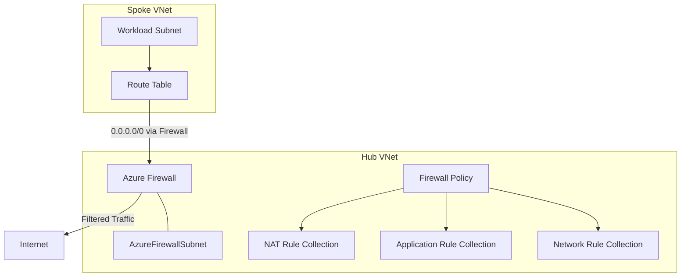

# How to Deploy Azure Firewall with Network Rule Collections Using Bicep

Author: [nawazdhandala](https://www.github.com/nawazdhandala)

Tags: Azure, Bicep, Firewall, Networking, Security, IaC, Infrastructure as Code

Description: Deploy Azure Firewall with network rule collections, application rule collections, and route tables using Bicep for centralized network security.

---

Azure Firewall is a managed, cloud-based network security service that protects your Azure Virtual Network resources. It provides centralized network and application-level filtering with built-in high availability and unrestricted cloud scalability. In a hub-and-spoke network architecture, Azure Firewall sits in the hub VNet and inspects all traffic flowing between spokes and the internet.

Deploying Azure Firewall involves several components: the firewall itself, a public IP, a firewall policy with rule collections, and route tables that direct traffic through the firewall. Bicep handles all of this cleanly, with the dependency graph ensuring resources are created in the right order.

## Architecture Overview



## Parameters and Variables

```bicep
// Parameters for the deployment
@description('Azure region for all resources')
param location string = resourceGroup().location

@description('Environment name')
@allowed(['dev', 'staging', 'prod'])
param environment string = 'prod'

@description('SKU tier for the firewall')
@allowed(['Standard', 'Premium'])
param firewallSkuTier string = 'Standard'

@description('Threat intelligence mode')
@allowed(['Alert', 'Deny', 'Off'])
param threatIntelMode string = 'Deny'

// Naming variables
var firewallName = 'afw-hub-${environment}'
var firewallPolicyName = 'afwp-hub-${environment}'
var publicIpName = 'pip-afw-${environment}'
var vnetName = 'vnet-hub-${environment}'
```

## Hub VNet with Firewall Subnet

Azure Firewall requires a subnet named exactly `AzureFirewallSubnet` with at least a /26 address prefix.

```bicep
// Hub virtual network
resource hubVnet 'Microsoft.Network/virtualNetworks@2024-01-01' = {
  name: vnetName
  location: location
  properties: {
    addressSpace: {
      addressPrefixes: [
        '10.0.0.0/16'
      ]
    }
    subnets: [
      {
        // This name is required by Azure Firewall - cannot be changed
        name: 'AzureFirewallSubnet'
        properties: {
          addressPrefix: '10.0.1.0/26'
        }
      }
      {
        name: 'AzureFirewallManagementSubnet'
        properties: {
          addressPrefix: '10.0.2.0/26'
        }
      }
    ]
  }
}

// Public IP for the firewall
resource firewallPublicIp 'Microsoft.Network/publicIPAddresses@2024-01-01' = {
  name: publicIpName
  location: location
  sku: {
    name: 'Standard'
  }
  properties: {
    publicIPAllocationMethod: 'Static'
    publicIPAddressVersion: 'IPv4'
  }
}
```

## Firewall Policy

The firewall policy is where all rule collections live. Starting with Azure Firewall's policy-based model is recommended over the classic rule-based approach, as policies support inheritance and rule collection groups.

```bicep
// Firewall policy - contains all rule configuration
resource firewallPolicy 'Microsoft.Network/firewallPolicies@2024-01-01' = {
  name: firewallPolicyName
  location: location
  properties: {
    sku: {
      tier: firewallSkuTier
    }
    // Block known malicious IPs and domains
    threatIntelMode: threatIntelMode
    // DNS settings for FQDN-based rules
    dnsSettings: {
      enableProxy: true
    }
    // Insights for logging and analytics
    insights: {
      isEnabled: true
      retentionDays: 30
    }
  }
}
```

## Network Rule Collections

Network rules operate at Layer 3/4 and filter based on source IP, destination IP, port, and protocol.

```bicep
// Rule collection group for network rules
resource networkRuleGroup 'Microsoft.Network/firewallPolicies/ruleCollectionGroups@2024-01-01' = {
  parent: firewallPolicy
  name: 'DefaultNetworkRuleCollectionGroup'
  properties: {
    priority: 200
    ruleCollections: [
      {
        // Allow outbound DNS traffic
        ruleCollectionType: 'FirewallPolicyFilterRuleCollection'
        name: 'rc-network-dns'
        priority: 100
        action: {
          type: 'Allow'
        }
        rules: [
          {
            ruleType: 'NetworkRule'
            name: 'allow-dns'
            description: 'Allow DNS queries to Azure DNS and custom DNS servers'
            ipProtocols: ['UDP', 'TCP']
            sourceAddresses: ['10.0.0.0/8']
            destinationAddresses: ['168.63.129.16', '10.0.0.4']
            destinationPorts: ['53']
          }
        ]
      }
      {
        // Allow NTP for time synchronization
        ruleCollectionType: 'FirewallPolicyFilterRuleCollection'
        name: 'rc-network-ntp'
        priority: 110
        action: {
          type: 'Allow'
        }
        rules: [
          {
            ruleType: 'NetworkRule'
            name: 'allow-ntp'
            description: 'Allow NTP traffic for time sync'
            ipProtocols: ['UDP']
            sourceAddresses: ['10.0.0.0/8']
            destinationAddresses: ['*']
            destinationPorts: ['123']
          }
        ]
      }
      {
        // Allow traffic between spoke VNets
        ruleCollectionType: 'FirewallPolicyFilterRuleCollection'
        name: 'rc-network-spoke-to-spoke'
        priority: 120
        action: {
          type: 'Allow'
        }
        rules: [
          {
            ruleType: 'NetworkRule'
            name: 'allow-spoke-communication'
            description: 'Allow all traffic between spoke networks'
            ipProtocols: ['Any']
            sourceAddresses: ['10.1.0.0/16', '10.2.0.0/16', '10.3.0.0/16']
            destinationAddresses: ['10.1.0.0/16', '10.2.0.0/16', '10.3.0.0/16']
            destinationPorts: ['*']
          }
        ]
      }
      {
        // Allow outbound HTTPS to Azure services
        ruleCollectionType: 'FirewallPolicyFilterRuleCollection'
        name: 'rc-network-azure-services'
        priority: 130
        action: {
          type: 'Allow'
        }
        rules: [
          {
            ruleType: 'NetworkRule'
            name: 'allow-azure-monitor'
            description: 'Allow traffic to Azure Monitor endpoints'
            ipProtocols: ['TCP']
            sourceAddresses: ['10.0.0.0/8']
            destinationAddresses: ['AzureMonitor']
            destinationPorts: ['443']
          }
          {
            ruleType: 'NetworkRule'
            name: 'allow-azure-keyvault'
            description: 'Allow traffic to Key Vault'
            ipProtocols: ['TCP']
            sourceAddresses: ['10.0.0.0/8']
            destinationAddresses: ['AzureKeyVault']
            destinationPorts: ['443']
          }
          {
            ruleType: 'NetworkRule'
            name: 'allow-azure-storage'
            description: 'Allow traffic to Azure Storage'
            ipProtocols: ['TCP']
            sourceAddresses: ['10.0.0.0/8']
            destinationAddresses: ['Storage']
            destinationPorts: ['443']
          }
        ]
      }
    ]
  }
}
```

## Application Rule Collections

Application rules operate at Layer 7 and can filter based on FQDNs and URL patterns.

```bicep
// Rule collection group for application rules
resource applicationRuleGroup 'Microsoft.Network/firewallPolicies/ruleCollectionGroups@2024-01-01' = {
  parent: firewallPolicy
  name: 'DefaultApplicationRuleCollectionGroup'
  dependsOn: [networkRuleGroup]
  properties: {
    priority: 300
    ruleCollections: [
      {
        // Allow access to Microsoft services
        ruleCollectionType: 'FirewallPolicyFilterRuleCollection'
        name: 'rc-app-microsoft'
        priority: 100
        action: {
          type: 'Allow'
        }
        rules: [
          {
            ruleType: 'ApplicationRule'
            name: 'allow-microsoft-updates'
            description: 'Allow Windows Update and Microsoft services'
            sourceAddresses: ['10.0.0.0/8']
            protocols: [
              { protocolType: 'Https', port: 443 }
            ]
            targetFqdns: [
              '*.microsoft.com'
              '*.windowsupdate.com'
              '*.azure.com'
            ]
          }
        ]
      }
      {
        // Allow access to package repositories
        ruleCollectionType: 'FirewallPolicyFilterRuleCollection'
        name: 'rc-app-packages'
        priority: 110
        action: {
          type: 'Allow'
        }
        rules: [
          {
            ruleType: 'ApplicationRule'
            name: 'allow-ubuntu-repos'
            description: 'Allow Ubuntu package manager traffic'
            sourceAddresses: ['10.0.0.0/8']
            protocols: [
              { protocolType: 'Http', port: 80 }
              { protocolType: 'Https', port: 443 }
            ]
            targetFqdns: [
              '*.ubuntu.com'
              '*.canonical.com'
              'packages.microsoft.com'
            ]
          }
          {
            ruleType: 'ApplicationRule'
            name: 'allow-docker-registry'
            description: 'Allow Docker Hub and GitHub Container Registry'
            sourceAddresses: ['10.0.0.0/8']
            protocols: [
              { protocolType: 'Https', port: 443 }
            ]
            targetFqdns: [
              '*.docker.io'
              '*.docker.com'
              'ghcr.io'
              '*.githubusercontent.com'
            ]
          }
        ]
      }
    ]
  }
}
```

## The Firewall Resource

```bicep
// The Azure Firewall itself
resource firewall 'Microsoft.Network/azureFirewalls@2024-01-01' = {
  name: firewallName
  location: location
  properties: {
    sku: {
      name: 'AZFW_VNet'
      tier: firewallSkuTier
    }
    firewallPolicy: {
      id: firewallPolicy.id
    }
    ipConfigurations: [
      {
        name: 'fw-ipconfig'
        properties: {
          subnet: {
            id: hubVnet.properties.subnets[0].id
          }
          publicIPAddress: {
            id: firewallPublicIp.id
          }
        }
      }
    ]
  }
  dependsOn: [
    networkRuleGroup
    applicationRuleGroup
  ]
}
```

## Route Table for Spoke Subnets

For traffic to flow through the firewall, spoke subnets need a route table that sends all traffic to the firewall's private IP.

```bicep
// Route table that forces traffic through the firewall
resource spokeRouteTable 'Microsoft.Network/routeTables@2024-01-01' = {
  name: 'rt-spoke-to-firewall'
  location: location
  properties: {
    disableBgpRoutePropagation: true
    routes: [
      {
        name: 'route-to-firewall'
        properties: {
          addressPrefix: '0.0.0.0/0'
          nextHopType: 'VirtualAppliance'
          nextHopIpAddress: firewall.properties.ipConfigurations[0].properties.privateIPAddress
        }
      }
    ]
  }
}

// Outputs
output firewallPrivateIp string = firewall.properties.ipConfigurations[0].properties.privateIPAddress
output firewallPublicIp string = firewallPublicIp.properties.ipAddress
output routeTableId string = spokeRouteTable.id
```

## Deployment

```bash
az deployment group create \
  --resource-group rg-hub-networking \
  --template-file main.bicep \
  --parameters environment=prod firewallSkuTier=Standard
```

## Tips for Production

Start in alert mode for threat intelligence. Review the logs before switching to deny mode to avoid blocking legitimate traffic.

Use IP Groups for large sets of source or destination addresses. They keep your rule definitions cleaner and allow reuse across rules.

Enable diagnostic logging to Log Analytics. Azure Firewall logs are essential for troubleshooting connectivity issues and security investigations.

Plan your rule collection priorities carefully. Lower numbers are evaluated first. Put the most frequently matched rules at lower priorities for better performance.

## Conclusion

Deploying Azure Firewall with Bicep gives you a version-controlled, repeatable network security configuration. The rule collection structure - network rules for Layer 3/4 filtering and application rules for Layer 7 - provides comprehensive traffic control for your hub-and-spoke architecture. Combined with route tables that force traffic through the firewall, you get centralized visibility and control over all network traffic in your Azure environment.
