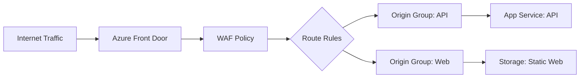

# How to Deploy Azure Front Door with WAF Policies Using Bicep Templates

Author: [nawazdhandala](https://www.github.com/nawazdhandala)

Tags: Azure, Bicep, Front Door, WAF, Infrastructure as Code, Security, DevOps

Description: Step-by-step guide to deploying Azure Front Door Standard or Premium with Web Application Firewall policies using Bicep templates.

---

Azure Front Door is Microsoft's global load balancer and CDN that sits at the edge of their network. When you pair it with Web Application Firewall (WAF) policies, you get DDoS protection, bot mitigation, and custom rule enforcement before traffic ever reaches your backend. Doing this through the Azure portal works for a quick proof of concept, but for anything production-grade, you want it codified in Bicep templates.

This post walks through deploying Azure Front Door Premium with a WAF policy using Bicep. We will cover the Front Door profile, endpoints, origin groups, origins, routes, and the WAF policy with both managed and custom rules.

## Why Bicep for Front Door

Front Door has a lot of moving parts - profiles, endpoints, origin groups, origins, routes, rule sets, security policies, and WAF policies. Clicking through the portal to set all of this up is tedious and error-prone. Bicep gives you a declarative way to define the whole stack, version it in Git, and deploy it consistently across environments.

Bicep also handles the dependency graph for you. Front Door resources have strict ordering requirements (you cannot create a route before its origin group exists), and Bicep resolves that automatically.

## The Architecture

Here is what we are building:



Traffic flows through Front Door, gets inspected by the WAF policy, matches a route, and gets forwarded to the appropriate origin group.

## Setting Up the Bicep File

Let us start with the parameters and the Front Door profile.

```bicep
// Parameters for environment-specific values
@description('Environment name used for naming resources')
param environmentName string = 'prod'

@description('Azure region for the resource group resources')
param location string = resourceGroup().location

@description('The SKU for Front Door - Premium required for WAF')
@allowed([
  'Standard_AzureFrontDoor'
  'Premium_AzureFrontDoor'
])
param frontDoorSku string = 'Premium_AzureFrontDoor'

@description('The hostname of the API backend')
param apiBackendHostname string

@description('The hostname of the web backend')
param webBackendHostname string

// Front Door Profile - the top-level resource
resource frontDoorProfile 'Microsoft.Cdn/profiles@2024-02-01' = {
  name: 'afd-${environmentName}'
  location: 'global'
  sku: {
    name: frontDoorSku
  }
  properties: {}
}
```

Note that Front Door profiles always have their location set to `global` since they are not tied to a specific Azure region.

## Creating the Endpoint

An endpoint is the public-facing hostname that your users connect to.

```bicep
// The endpoint provides the public URL for Front Door
resource frontDoorEndpoint 'Microsoft.Cdn/profiles/afdEndpoints@2024-02-01' = {
  parent: frontDoorProfile
  name: 'endpoint-${environmentName}'
  location: 'global'
  properties: {
    enabledState: 'Enabled'
  }
}
```

After deployment, your endpoint will have a hostname like `endpoint-prod.z01.azurefd.net`. You can add custom domains later.

## Defining Origin Groups and Origins

Origin groups contain the backends that Front Door routes traffic to. Each group has health probe settings and load balancing configuration.

```bicep
// Origin group for the API backend with health probing
resource apiOriginGroup 'Microsoft.Cdn/profiles/originGroups@2024-02-01' = {
  parent: frontDoorProfile
  name: 'og-api'
  properties: {
    loadBalancingSettings: {
      sampleSize: 4
      successfulSamplesRequired: 3
      additionalLatencyInMilliseconds: 50
    }
    healthProbeSettings: {
      probePath: '/health'
      probeRequestType: 'GET'
      probeProtocol: 'Https'
      probeIntervalInSeconds: 30
    }
    sessionAffinityState: 'Disabled'
  }
}

// The actual API backend origin
resource apiOrigin 'Microsoft.Cdn/profiles/originGroups/origins@2024-02-01' = {
  parent: apiOriginGroup
  name: 'origin-api'
  properties: {
    hostName: apiBackendHostname
    httpPort: 80
    httpsPort: 443
    originHostHeader: apiBackendHostname
    priority: 1
    weight: 1000
    enabledState: 'Enabled'
    enforceCertificateNameCheck: true
  }
}

// Origin group for the web frontend
resource webOriginGroup 'Microsoft.Cdn/profiles/originGroups@2024-02-01' = {
  parent: frontDoorProfile
  name: 'og-web'
  properties: {
    loadBalancingSettings: {
      sampleSize: 4
      successfulSamplesRequired: 3
      additionalLatencyInMilliseconds: 50
    }
    healthProbeSettings: {
      probePath: '/'
      probeRequestType: 'HEAD'
      probeProtocol: 'Https'
      probeIntervalInSeconds: 60
    }
    sessionAffinityState: 'Disabled'
  }
}

// The web frontend origin
resource webOrigin 'Microsoft.Cdn/profiles/originGroups/origins@2024-02-01' = {
  parent: webOriginGroup
  name: 'origin-web'
  properties: {
    hostName: webBackendHostname
    httpPort: 80
    httpsPort: 443
    originHostHeader: webBackendHostname
    priority: 1
    weight: 1000
    enabledState: 'Enabled'
    enforceCertificateNameCheck: true
  }
}
```

## Building the WAF Policy

Now for the WAF policy. We will include the OWASP managed rule set and a custom rate-limiting rule.

```bicep
// WAF policy with managed rules and a custom rate limit rule
resource wafPolicy 'Microsoft.Network/FrontDoorWebApplicationFirewallPolicies@2024-02-01' = {
  name: 'wafpol${environmentName}'
  location: 'global'
  sku: {
    name: frontDoorSku
  }
  properties: {
    policySettings: {
      mode: 'Prevention'
      requestBodyCheck: 'Enabled'
      customBlockResponseStatusCode: 403
      customBlockResponseBody: base64('Access denied by WAF policy.')
    }
    // Managed rule sets provide baseline protection
    managedRules: {
      managedRuleSets: [
        {
          ruleSetType: 'Microsoft_DefaultRuleSet'
          ruleSetVersion: '2.1'
          ruleSetAction: 'Block'
          ruleGroupOverrides: []
        }
        {
          ruleSetType: 'Microsoft_BotManagerRuleSet'
          ruleSetVersion: '1.1'
          ruleSetAction: 'Block'
          ruleGroupOverrides: []
        }
      ]
    }
    // Custom rules are evaluated before managed rules
    customRules: {
      rules: [
        {
          name: 'RateLimitRule'
          priority: 100
          ruleType: 'RateLimitRule'
          action: 'Block'
          rateLimitDurationInMinutes: 1
          rateLimitThreshold: 1000
          matchConditions: [
            {
              matchVariable: 'RequestUri'
              operator: 'RegEx'
              matchValue: [
                '/api/.*'
              ]
              transforms: [
                'Lowercase'
              ]
            }
          ]
        }
        {
          name: 'BlockSuspiciousUserAgents'
          priority: 200
          ruleType: 'MatchRule'
          action: 'Block'
          matchConditions: [
            {
              matchVariable: 'RequestHeader'
              selector: 'User-Agent'
              operator: 'Contains'
              matchValue: [
                'sqlmap'
                'nikto'
                'nmap'
              ]
              transforms: [
                'Lowercase'
              ]
            }
          ]
        }
      ]
    }
  }
}
```

The WAF policy runs in Prevention mode, meaning it actively blocks malicious requests. During initial rollout, you might want to use Detection mode to log threats without blocking them, then switch to Prevention after reviewing the logs.

## Connecting WAF to Front Door with a Security Policy

The security policy is what ties the WAF policy to the Front Door endpoint.

```bicep
// Security policy links the WAF to the Front Door endpoint
resource securityPolicy 'Microsoft.Cdn/profiles/securityPolicies@2024-02-01' = {
  parent: frontDoorProfile
  name: 'sp-waf'
  properties: {
    parameters: {
      type: 'WebApplicationFirewall'
      wafPolicy: {
        id: wafPolicy.id
      }
      associations: [
        {
          domains: [
            {
              id: frontDoorEndpoint.id
            }
          ]
          patternsToMatch: [
            '/*'
          ]
        }
      ]
    }
  }
}
```

## Setting Up Routes

Routes determine how traffic flows from the endpoint to your origin groups.

```bicep
// Route for API traffic - matches /api/* paths
resource apiRoute 'Microsoft.Cdn/profiles/afdEndpoints/routes@2024-02-01' = {
  parent: frontDoorEndpoint
  name: 'route-api'
  properties: {
    originGroup: {
      id: apiOriginGroup.id
    }
    patternsToMatch: [
      '/api/*'
    ]
    supportedProtocols: [
      'Https'
    ]
    httpsRedirect: 'Enabled'
    forwardingProtocol: 'HttpsOnly'
    linkToDefaultDomain: 'Enabled'
    cacheConfiguration: null
  }
  dependsOn: [
    apiOrigin
  ]
}

// Route for web traffic - catches everything else
resource webRoute 'Microsoft.Cdn/profiles/afdEndpoints/routes@2024-02-01' = {
  parent: frontDoorEndpoint
  name: 'route-web'
  properties: {
    originGroup: {
      id: webOriginGroup.id
    }
    patternsToMatch: [
      '/*'
    ]
    supportedProtocols: [
      'Http'
      'Https'
    ]
    httpsRedirect: 'Enabled'
    forwardingProtocol: 'HttpsOnly'
    linkToDefaultDomain: 'Enabled'
    cacheConfiguration: {
      queryStringCachingBehavior: 'IgnoreQueryString'
      compressionSettings: {
        isCompressionEnabled: true
        contentTypesToCompress: [
          'text/html'
          'text/css'
          'application/javascript'
          'application/json'
        ]
      }
    }
  }
  dependsOn: [
    webOrigin
  ]
}
```

## Outputs

Finally, add some outputs so you can reference the deployed resources.

```bicep
// Useful outputs for downstream configuration
output frontDoorId string = frontDoorProfile.id
output endpointHostname string = frontDoorEndpoint.properties.hostName
output wafPolicyId string = wafPolicy.id
```

## Deploying the Template

Deploy with the Azure CLI.

```bash
az deployment group create \
  --resource-group rg-frontdoor-prod \
  --template-file main.bicep \
  --parameters environmentName=prod \
  --parameters apiBackendHostname=api-prod.azurewebsites.net \
  --parameters webBackendHostname=stwebprod.z13.web.core.windows.net
```

## Tips for Production

Start the WAF in Detection mode. Review the logs in Log Analytics for a week or two before switching to Prevention. This avoids accidentally blocking legitimate traffic.

Use separate WAF policies per environment. Your staging environment might need different rate limits or rule exclusions than production.

Always enforce HTTPS. The route configuration above redirects HTTP to HTTPS, and origins are configured with HTTPS-only forwarding.

Monitor your Front Door metrics. Azure Monitor provides request counts, latency percentiles, and WAF block counts out of the box. Set up alerts for spikes in blocked requests.

## Wrapping Up

Deploying Azure Front Door with WAF policies in Bicep gives you a repeatable, version-controlled setup for your edge security. The template we built covers the core components - profile, endpoint, origin groups, routes, WAF policy with managed and custom rules, and the security policy that ties it all together. From here, you can extend it with custom domains, rule sets for header manipulation, and more granular WAF rule overrides as your needs evolve.
