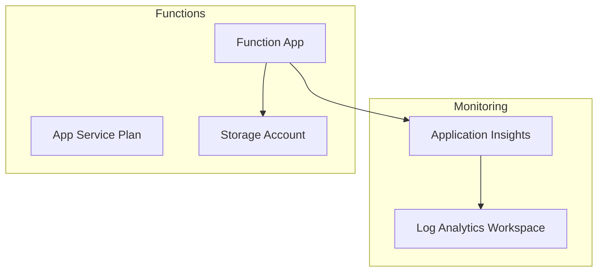

# How to Deploy Azure Functions Using Bicep Templates with Application Insights Integration

Author: [nawazdhandala](https://www.github.com/nawazdhandala)

Tags: Azure Functions, Bicep, Application Insights, Serverless, Infrastructure as Code, Monitoring, Azure

Description: Deploy Azure Functions with Bicep templates including full Application Insights integration for monitoring, logging, and performance tracking out of the box.

---

Azure Functions without Application Insights is like driving without a dashboard - you have no idea how fast you are going, whether you are about to run out of fuel, or if something is about to break. Every Azure Functions deployment should include Application Insights from day one. The telemetry it provides - invocation counts, execution times, failure rates, dependency tracking - is essential for operating serverless workloads in production.

In this post, I will build a complete Bicep template that deploys Azure Functions with full Application Insights integration, including custom metric alerts and diagnostic settings.

## What We Are Building

The deployment includes these resources:



The Function App sends telemetry to Application Insights, which stores the data in a Log Analytics workspace. The storage account is required by Azure Functions for internal state management.

## The Complete Bicep Template

Here is the full template with all components:

```bicep
// main.bicep - Deploy Azure Functions with Application Insights

@description('Base name for all resources')
param appName string

@description('Azure region for resources')
param location string = resourceGroup().location

@description('Environment identifier')
@allowed([
  'dev'
  'staging'
  'prod'
])
param environment string

@description('Function app runtime')
@allowed([
  'dotnet-isolated'
  'node'
  'python'
  'java'
])
param runtime string = 'node'

@description('Runtime version')
param runtimeVersion string = '20'

@description('App Service Plan SKU')
@allowed([
  'Y1'       // Consumption plan
  'EP1'      // Elastic Premium
  'EP2'
  'EP3'
])
param planSku string = 'Y1'

// Log Analytics Workspace for Application Insights backend
resource logAnalytics 'Microsoft.OperationalInsights/workspaces@2022-10-01' = {
  name: 'law-${appName}-${environment}'
  location: location
  properties: {
    sku: {
      name: 'PerGB2018'
    }
    retentionInDays: environment == 'prod' ? 90 : 30
    features: {
      enableLogAccessUsingOnlyResourcePermissions: true
    }
  }
}

// Application Insights connected to Log Analytics
resource appInsights 'Microsoft.Insights/components@2020-02-02' = {
  name: 'ai-${appName}-${environment}'
  location: location
  kind: 'web'
  properties: {
    Application_Type: 'web'
    WorkspaceResourceId: logAnalytics.id
    // Enable features based on environment
    DisableIpMasking: false
    DisableLocalAuth: environment == 'prod'  // Force AAD auth in production
    publicNetworkAccessForIngestion: 'Enabled'
    publicNetworkAccessForQuery: 'Enabled'
    RetentionInDays: environment == 'prod' ? 90 : 30
    SamplingPercentage: environment == 'prod' ? 100 : 50  // Full sampling in prod
  }
  tags: {
    Environment: environment
    Application: appName
  }
}

// Storage account required by Azure Functions
resource storageAccount 'Microsoft.Storage/storageAccounts@2023-01-01' = {
  name: 'st${replace(appName, '-', '')}${environment}'
  location: location
  sku: {
    name: 'Standard_LRS'
  }
  kind: 'StorageV2'
  properties: {
    minimumTlsVersion: 'TLS1_2'
    allowBlobPublicAccess: false
    supportsHttpsTrafficOnly: true
  }
}

// App Service Plan (Consumption or Premium)
resource appServicePlan 'Microsoft.Web/serverfarms@2023-01-01' = {
  name: 'asp-${appName}-${environment}'
  location: location
  kind: planSku == 'Y1' ? 'functionapp' : 'elastic'
  sku: {
    name: planSku
  }
  properties: {
    reserved: runtime != 'dotnet-isolated'  // Linux for non-.NET runtimes
    maximumElasticWorkerCount: planSku == 'Y1' ? null : 20
  }
}

// Runtime-specific settings
var runtimeSettings = {
  'dotnet-isolated': {
    FUNCTIONS_WORKER_RUNTIME: 'dotnet-isolated'
    linuxFxVersion: 'DOTNET-ISOLATED|8.0'
  }
  node: {
    FUNCTIONS_WORKER_RUNTIME: 'node'
    linuxFxVersion: 'NODE|${runtimeVersion}'
  }
  python: {
    FUNCTIONS_WORKER_RUNTIME: 'python'
    linuxFxVersion: 'PYTHON|${runtimeVersion}'
  }
  java: {
    FUNCTIONS_WORKER_RUNTIME: 'java'
    linuxFxVersion: 'JAVA|${runtimeVersion}'
  }
}

// Function App with Application Insights integration
resource functionApp 'Microsoft.Web/sites@2023-01-01' = {
  name: 'func-${appName}-${environment}'
  location: location
  kind: 'functionapp,linux'
  identity: {
    type: 'SystemAssigned'
  }
  properties: {
    serverFarmId: appServicePlan.id
    httpsOnly: true
    siteConfig: {
      linuxFxVersion: runtimeSettings[runtime].linuxFxVersion
      ftpsState: 'Disabled'
      minTlsVersion: '1.2'
      appSettings: [
        // Required Azure Functions settings
        {
          name: 'AzureWebJobsStorage'
          value: 'DefaultEndpointsProtocol=https;AccountName=${storageAccount.name};EndpointSuffix=${az.environment().suffixes.storage};AccountKey=${storageAccount.listKeys().keys[0].value}'
        }
        {
          name: 'WEBSITE_CONTENTAZUREFILECONNECTIONSTRING'
          value: 'DefaultEndpointsProtocol=https;AccountName=${storageAccount.name};EndpointSuffix=${az.environment().suffixes.storage};AccountKey=${storageAccount.listKeys().keys[0].value}'
        }
        {
          name: 'WEBSITE_CONTENTSHARE'
          value: toLower('func-${appName}-${environment}')
        }
        {
          name: 'FUNCTIONS_EXTENSION_VERSION'
          value: '~4'
        }
        {
          name: 'FUNCTIONS_WORKER_RUNTIME'
          value: runtimeSettings[runtime].FUNCTIONS_WORKER_RUNTIME
        }
        // Application Insights integration settings
        {
          name: 'APPLICATIONINSIGHTS_CONNECTION_STRING'
          value: appInsights.properties.ConnectionString
        }
        {
          name: 'APPINSIGHTS_INSTRUMENTATIONKEY'
          value: appInsights.properties.InstrumentationKey
        }
        // Performance and diagnostic settings
        {
          name: 'WEBSITE_RUN_FROM_PACKAGE'
          value: '1'
        }
        {
          name: 'ApplicationInsightsAgent_EXTENSION_VERSION'
          value: '~3'
        }
      ]
    }
  }
}

// Diagnostic settings to capture platform logs
resource functionDiagnostics 'Microsoft.Insights/diagnosticSettings@2021-05-01-preview' = {
  name: 'diag-${functionApp.name}'
  scope: functionApp
  properties: {
    workspaceId: logAnalytics.id
    logs: [
      {
        category: 'FunctionAppLogs'
        enabled: true
        retentionPolicy: {
          enabled: true
          days: environment == 'prod' ? 90 : 30
        }
      }
    ]
    metrics: [
      {
        category: 'AllMetrics'
        enabled: true
        retentionPolicy: {
          enabled: true
          days: 30
        }
      }
    ]
  }
}
```

## Adding Metric Alerts

Now add alerts that notify you when something goes wrong:

```bicep
// alerts.bicep - Metric alerts for Function App monitoring

@description('Resource ID of the Function App to monitor')
param functionAppId string

@description('Resource ID of the Application Insights instance')
param appInsightsId string

@description('Email addresses for alert notifications')
param alertEmails array

@description('Environment name')
param environment string

// Action group for alert notifications
resource actionGroup 'Microsoft.Insights/actionGroups@2023-01-01' = {
  name: 'ag-functions-${environment}'
  location: 'global'
  properties: {
    groupShortName: 'FuncAlerts'
    enabled: true
    emailReceivers: [for (email, i) in alertEmails: {
      name: 'email-${i}'
      emailAddress: email
      useCommonAlertSchema: true
    }]
  }
}

// Alert: High failure rate
resource failureAlert 'Microsoft.Insights/metricAlerts@2018-03-01' = {
  name: 'alert-func-failures-${environment}'
  location: 'global'
  properties: {
    description: 'Function App failure rate exceeds threshold'
    severity: environment == 'prod' ? 1 : 3  // Higher severity in production
    enabled: true
    scopes: [functionAppId]
    evaluationFrequency: 'PT5M'     // Check every 5 minutes
    windowSize: 'PT15M'              // Over a 15-minute window
    criteria: {
      'odata.type': 'Microsoft.Azure.Monitor.MultipleResourceMultipleMetricCriteria'
      allOf: [
        {
          name: 'HighFailureRate'
          criterionType: 'StaticThresholdCriterion'
          metricName: 'Http5xx'
          metricNamespace: 'Microsoft.Web/sites'
          operator: 'GreaterThan'
          threshold: 10     // More than 10 5xx errors in 15 minutes
          timeAggregation: 'Total'
        }
      ]
    }
    actions: [
      {
        actionGroupId: actionGroup.id
      }
    ]
  }
}

// Alert: High execution duration
resource durationAlert 'Microsoft.Insights/metricAlerts@2018-03-01' = {
  name: 'alert-func-duration-${environment}'
  location: 'global'
  properties: {
    description: 'Function execution duration exceeds threshold'
    severity: 2
    enabled: true
    scopes: [appInsightsId]
    evaluationFrequency: 'PT5M'
    windowSize: 'PT15M'
    criteria: {
      'odata.type': 'Microsoft.Azure.Monitor.MultipleResourceMultipleMetricCriteria'
      allOf: [
        {
          name: 'HighDuration'
          criterionType: 'StaticThresholdCriterion'
          metricName: 'requests/duration'
          metricNamespace: 'microsoft.insights/components'
          operator: 'GreaterThan'
          threshold: 30000  // 30 seconds average duration
          timeAggregation: 'Average'
        }
      ]
    }
    actions: [
      {
        actionGroupId: actionGroup.id
      }
    ]
  }
}

// Alert: Function App stopped responding
resource availabilityAlert 'Microsoft.Insights/metricAlerts@2018-03-01' = {
  name: 'alert-func-availability-${environment}'
  location: 'global'
  properties: {
    description: 'Function App availability dropped below threshold'
    severity: 1
    enabled: true
    scopes: [appInsightsId]
    evaluationFrequency: 'PT1M'
    windowSize: 'PT5M'
    criteria: {
      'odata.type': 'Microsoft.Azure.Monitor.MultipleResourceMultipleMetricCriteria'
      allOf: [
        {
          name: 'LowAvailability'
          criterionType: 'StaticThresholdCriterion'
          metricName: 'availabilityResults/availabilityPercentage'
          metricNamespace: 'microsoft.insights/components'
          operator: 'LessThan'
          threshold: 99
          timeAggregation: 'Average'
        }
      ]
    }
    actions: [
      {
        actionGroupId: actionGroup.id
      }
    ]
  }
}
```

## Deploying the Template

Deploy with the Azure CLI:

```bash
# Create the resource group
az group create --name rg-functions-prod --location eastus2

# Deploy the main template
az deployment group create \
  --resource-group rg-functions-prod \
  --template-file main.bicep \
  --parameters appName=orderprocessor environment=prod runtime=node runtimeVersion=20 planSku=EP1

# Deploy alerts separately
az deployment group create \
  --resource-group rg-functions-prod \
  --template-file alerts.bicep \
  --parameters \
    functionAppId=$(az functionapp show -n func-orderprocessor-prod -g rg-functions-prod --query id -o tsv) \
    appInsightsId=$(az monitor app-insights component show -a ai-orderprocessor-prod -g rg-functions-prod --query id -o tsv) \
    alertEmails='["oncall@company.com"]' \
    environment=prod
```

## Verifying the Integration

After deployment, verify that Application Insights is receiving data:

```bash
# Check that the Function App has the correct App Insights settings
az functionapp config appsettings list \
  --name func-orderprocessor-prod \
  --resource-group rg-functions-prod \
  --query "[?name=='APPLICATIONINSIGHTS_CONNECTION_STRING']" \
  --output table

# Query Application Insights for recent function executions
az monitor app-insights query \
  --app ai-orderprocessor-prod \
  --resource-group rg-functions-prod \
  --analytics-query "requests | take 10"
```

## Application Insights Configuration Best Practices

A few settings worth tuning based on your environment:

**Sampling.** For high-volume functions, Application Insights adaptive sampling kicks in automatically to control costs. You can configure the sampling rate in `host.json`:

```json
{
  "logging": {
    "applicationInsights": {
      "samplingSettings": {
        "isEnabled": true,
        "maxTelemetryItemsPerSecond": 20,
        "excludedTypes": "Request;Exception"
      }
    }
  }
}
```

Excluding Requests and Exceptions from sampling ensures you capture every invocation and every error, while sampling dependency calls and traces.

**Custom properties.** Add custom dimensions to your telemetry for better filtering:

```json
{
  "logging": {
    "applicationInsights": {
      "enableDependencyTracking": true,
      "enablePerformanceCountersCollection": true
    }
  }
}
```

**Cost management.** Application Insights charges per GB of data ingested. Use daily caps for non-production environments to prevent runaway costs. Set the daily cap in the Bicep template:

```bicep
// Set daily ingestion cap for non-production environments
resource appInsightsCap 'Microsoft.Insights/components/CurrentBillingFeatures@2015-05-01' = if (environment != 'prod') {
  name: '${appInsights.name}/CurrentBillingFeatures'
  properties: {
    CurrentBillingFeatures: ['Basic']
    DataVolumeCap: {
      Cap: 1  // 1 GB per day cap for dev/staging
      ResetTime: 0
      StopSendNotificationWhenHitCap: false
      WarningThreshold: 80
      StopSendNotificationWhenHitThreshold: false
    }
  }
}
```

## Wrapping Up

Azure Functions and Application Insights are meant to be deployed together. The Bicep template in this post gives you a production-ready setup with monitoring, alerting, and diagnostic logging from the start. Deploy it once, customize the alert thresholds for your workload, and you have full visibility into your serverless applications from day one.
