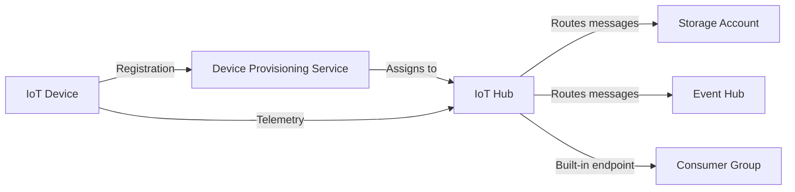

# How to Deploy Azure IoT Hub with Device Provisioning Service Using Terraform

Author: [nawazdhandala](https://www.github.com/nawazdhandala)

Tags: Azure, IoT Hub, Terraform, Device Provisioning Service, Infrastructure as Code, IoT, Cloud

Description: Step-by-step guide to deploying Azure IoT Hub and Device Provisioning Service together using Terraform for scalable IoT device management.

---

If you are building an IoT solution on Azure, two services sit at the center of the architecture: IoT Hub for device connectivity and messaging, and Device Provisioning Service (DPS) for zero-touch device onboarding. IoT Hub handles the ongoing communication between your devices and the cloud, while DPS automates the process of registering devices with the right IoT Hub without any manual intervention.

Managing these services with Terraform lets you version control the configuration, replicate the setup across environments, and tear down test environments cleanly. This post covers a complete Terraform configuration for both services, including message routing, consumer groups, and the linkage between DPS and IoT Hub.

## Architecture Overview

The deployment creates a setup where DPS acts as the front door for device registration. When a new device boots up, it contacts DPS with its credentials, and DPS assigns it to the appropriate IoT Hub based on allocation policies. The IoT Hub then handles all subsequent device-to-cloud and cloud-to-device communication.



## Provider and Variables

Start with the provider setup and variables that make the configuration flexible.

```hcl
# Configure the Azure provider
terraform {
  required_version = ">= 1.5.0"

  required_providers {
    azurerm = {
      source  = "hashicorp/azurerm"
      version = "~> 3.80"
    }
  }
}

provider "azurerm" {
  features {}
}

# Variables for the deployment
variable "location" {
  type        = string
  default     = "eastus2"
  description = "Azure region for all resources"
}

variable "environment" {
  type    = string
  default = "dev"
}

variable "iot_hub_sku" {
  type        = string
  default     = "S1"
  description = "IoT Hub SKU - S1 is the standard tier"
}

variable "iot_hub_capacity" {
  type        = number
  default     = 1
  description = "Number of IoT Hub units"
}

locals {
  name_prefix = "iot-${var.environment}"
  tags = {
    Environment = var.environment
    ManagedBy   = "terraform"
    Service     = "iot-platform"
  }
}
```

## Foundation Resources

IoT Hub needs a storage account for message routing (storing telemetry data) and a resource group to hold everything.

```hcl
# Resource group for IoT resources
resource "azurerm_resource_group" "iot" {
  name     = "rg-${local.name_prefix}"
  location = var.location
  tags     = local.tags
}

# Storage account for IoT Hub message routing
resource "azurerm_storage_account" "iot" {
  name                     = replace("st${local.name_prefix}data", "-", "")
  resource_group_name      = azurerm_resource_group.iot.name
  location                 = azurerm_resource_group.iot.location
  account_tier             = "Standard"
  account_replication_type = "LRS"
  min_tls_version          = "TLS1_2"
  tags                     = local.tags
}

# Container for storing routed telemetry messages
resource "azurerm_storage_container" "telemetry" {
  name                  = "telemetry"
  storage_account_name  = azurerm_storage_account.iot.name
  container_access_type = "private"
}

# Container for storing device lifecycle events
resource "azurerm_storage_container" "lifecycle" {
  name                  = "device-lifecycle"
  storage_account_name  = azurerm_storage_account.iot.name
  container_access_type = "private"
}
```

## IoT Hub Configuration

The IoT Hub resource has several important sections: the SKU, endpoints for message routing, routes that direct messages to those endpoints, and consumer groups for downstream processing.

```hcl
# IoT Hub - the core messaging service
resource "azurerm_iothub" "main" {
  name                = "iot-hub-${local.name_prefix}"
  resource_group_name = azurerm_resource_group.iot.name
  location            = azurerm_resource_group.iot.location

  # SKU configuration - S1 supports 400,000 messages per day per unit
  sku {
    name     = var.iot_hub_sku
    capacity = var.iot_hub_capacity
  }

  # Storage endpoint for routing telemetry to blob storage
  endpoint {
    type                       = "AzureIotHub.StorageContainer"
    name                       = "telemetry-storage"
    resource_group_name        = azurerm_resource_group.iot.name
    connection_string          = azurerm_storage_account.iot.primary_blob_connection_string
    container_name             = azurerm_storage_container.telemetry.name
    file_name_format           = "{iothub}/{partition}/{YYYY}/{MM}/{DD}/{HH}/{mm}"
    batch_frequency_in_seconds = 300     # Flush every 5 minutes
    max_chunk_size_in_bytes    = 104857600  # 100 MB max chunk
    encoding                   = "JSON"
  }

  # Route: Send all telemetry messages to storage
  route {
    name           = "telemetry-to-storage"
    source         = "DeviceMessages"
    endpoint_names = ["telemetry-storage"]
    enabled        = true
    condition      = "true"   # Route all device messages
  }

  # Route: Send device lifecycle events to the built-in endpoint
  route {
    name           = "lifecycle-events"
    source         = "DeviceLifecycleEvents"
    endpoint_names = ["events"]    # Built-in Events endpoint
    enabled        = true
    condition      = "true"
  }

  # Cloud-to-device messaging settings
  cloud_to_device {
    max_delivery_count = 10
    default_ttl        = "PT1H"    # Messages expire after 1 hour
    feedback {
      time_to_live       = "PT1H"
      max_delivery_count = 10
      lock_duration      = "PT60S"
    }
  }

  # File upload configuration
  file_upload {
    connection_string  = azurerm_storage_account.iot.primary_blob_connection_string
    container_name     = "file-uploads"
    notifications      = true
    max_delivery_count = 10
    sas_ttl            = "PT1H"
    default_ttl        = "PT1H"
    lock_duration      = "PT1M"
  }

  tags = local.tags
}

# Consumer group for a stream processing application
resource "azurerm_iothub_consumer_group" "stream_analytics" {
  name                   = "stream-analytics"
  iothub_name            = azurerm_iothub.main.name
  eventhub_endpoint_name = "events"
  resource_group_name    = azurerm_resource_group.iot.name
}

# Consumer group for a monitoring dashboard
resource "azurerm_iothub_consumer_group" "monitoring" {
  name                   = "monitoring-dashboard"
  iothub_name            = azurerm_iothub.main.name
  eventhub_endpoint_name = "events"
  resource_group_name    = azurerm_resource_group.iot.name
}
```

Each consumer group provides an independent view of the IoT Hub's event stream. This is important because each downstream application (like Stream Analytics or an Azure Function) needs its own consumer group to read messages without interfering with other readers.

## Device Provisioning Service

DPS handles the initial registration of devices. It supports multiple allocation policies and can distribute devices across multiple IoT Hubs.

```hcl
# Device Provisioning Service
resource "azurerm_iothub_dps" "main" {
  name                = "dps-${local.name_prefix}"
  resource_group_name = azurerm_resource_group.iot.name
  location            = azurerm_resource_group.iot.location

  sku {
    name     = "S1"
    capacity = 1
  }

  # Link to the IoT Hub - DPS will register devices here
  linked_hub {
    connection_string       = azurerm_iothub.main.shared_access_policy[0].primary_connection_string
    location                = azurerm_resource_group.iot.location
    allocation_weight       = 100    # Weight for balanced allocation
    apply_allocation_policy = true
  }

  # Allocation policy determines how devices are assigned to hubs
  allocation_policy = "Hashed"   # Options: Hashed, GeoLatency, Static, Custom

  tags = local.tags
}
```

The `allocation_policy` setting controls how DPS distributes devices when multiple IoT Hubs are linked:

- **Hashed** - Distributes devices evenly across linked hubs using consistent hashing
- **GeoLatency** - Assigns devices to the geographically closest hub
- **Static** - You configure a specific hub per enrollment
- **Custom** - Uses an Azure Function for custom allocation logic

## DPS Enrollment Groups

Enrollment groups define how groups of devices authenticate with DPS. The most common approach is symmetric key enrollment for development and X.509 certificates for production.

```hcl
# Symmetric key enrollment group for development and testing
resource "azurerm_iothub_dps_shared_access_policy" "enrollment" {
  name                = "enrollment-policy"
  resource_group_name = azurerm_resource_group.iot.name
  iothub_dps_name     = azurerm_iothub_dps.main.name

  enrollment_write = true
  enrollment_read  = true
  registration_read = true
  registration_write = true
}

# DPS certificate for X.509-based enrollment
resource "azurerm_iothub_dps_certificate" "root_ca" {
  name                = "root-ca-cert"
  resource_group_name = azurerm_resource_group.iot.name
  iot_dps_name        = azurerm_iothub_dps.main.name
  certificate_content = filebase64("${path.module}/certs/root-ca.cer")
  is_verified         = false    # Will need proof of possession verification
}
```

## IoT Hub Shared Access Policies

Define granular access policies for different components of your solution.

```hcl
# Policy for backend service that manages devices
resource "azurerm_iothub_shared_access_policy" "service" {
  name                = "service-policy"
  resource_group_name = azurerm_resource_group.iot.name
  iothub_name         = azurerm_iothub.main.name

  service_connect = true    # Can send cloud-to-device messages
  registry_read   = true    # Can read device registry
  registry_write  = true    # Can write to device registry
}

# Policy for devices (limited permissions)
resource "azurerm_iothub_shared_access_policy" "device" {
  name                = "device-policy"
  resource_group_name = azurerm_resource_group.iot.name
  iothub_name         = azurerm_iothub.main.name

  device_connect = true     # Can connect and send/receive messages
}
```

## Monitoring and Diagnostics

IoT Hub generates a lot of diagnostic data. Route it to Log Analytics for centralized monitoring.

```hcl
# Log Analytics workspace for IoT monitoring
resource "azurerm_log_analytics_workspace" "iot" {
  name                = "log-${local.name_prefix}"
  location            = azurerm_resource_group.iot.location
  resource_group_name = azurerm_resource_group.iot.name
  sku                 = "PerGB2018"
  retention_in_days   = 30
  tags                = local.tags
}

# Diagnostic settings for IoT Hub
resource "azurerm_monitor_diagnostic_setting" "iothub" {
  name                       = "iot-hub-diagnostics"
  target_resource_id         = azurerm_iothub.main.id
  log_analytics_workspace_id = azurerm_log_analytics_workspace.iot.id

  # Capture connection events, device telemetry, and routing metrics
  enabled_log {
    category = "Connections"
  }

  enabled_log {
    category = "DeviceTelemetry"
  }

  enabled_log {
    category = "Routes"
  }

  metric {
    category = "AllMetrics"
    enabled  = true
  }
}

# Diagnostic settings for DPS
resource "azurerm_monitor_diagnostic_setting" "dps" {
  name                       = "dps-diagnostics"
  target_resource_id         = azurerm_iothub_dps.main.id
  log_analytics_workspace_id = azurerm_log_analytics_workspace.iot.id

  enabled_log {
    category = "DeviceOperations"
  }

  metric {
    category = "AllMetrics"
    enabled  = true
  }
}
```

## Outputs

Export the connection details and endpoints that downstream applications and devices need.

```hcl
output "iot_hub_hostname" {
  value       = azurerm_iothub.main.hostname
  description = "IoT Hub hostname for device connections"
}

output "dps_id_scope" {
  value       = azurerm_iothub_dps.main.id_scope
  description = "DPS ID Scope - devices need this to register"
}

output "dps_service_endpoint" {
  value       = "https://${azurerm_iothub_dps.main.name}.azure-devices-provisioning.net"
  description = "DPS global endpoint for device registration"
}

output "iot_hub_event_hub_endpoint" {
  value       = azurerm_iothub.main.event_hub_events_endpoint
  description = "Event Hub compatible endpoint for reading device messages"
}
```

## Deployment

Deploy everything with Terraform.

```bash
# Initialize and plan
terraform init
terraform plan -var="environment=dev" -out=tfplan

# Apply the configuration
terraform apply tfplan
```

## Wrapping Up

Deploying IoT Hub and DPS together with Terraform gives you a solid, repeatable foundation for IoT solutions. The key pieces are the IoT Hub itself with proper message routing, the Device Provisioning Service linked to the hub, consumer groups for downstream processing, and diagnostic settings for monitoring. From here, you can extend the setup with additional IoT Hubs in other regions, custom allocation functions for DPS, and integration with Stream Analytics or Azure Functions for real-time processing.
