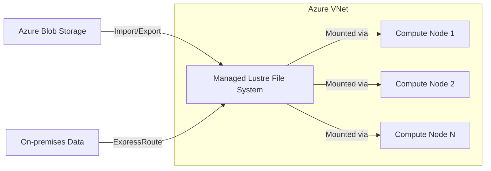

# How to Deploy Azure Managed Lustre File System with Terraform for HPC Workloads

Author: [nawazdhandala](https://www.github.com/nawazdhandala)

Tags: Azure, Managed Lustre, Terraform, HPC, High Performance Computing, Infrastructure as Code, File Storage

Description: Deploy Azure Managed Lustre File System with Terraform to provide high-throughput parallel file storage for HPC and AI training workloads on Azure.

---

High performance computing (HPC) workloads demand storage that can keep up with hundreds or thousands of compute nodes reading and writing data simultaneously. Traditional file systems buckle under this kind of parallel I/O pressure. Lustre is an open-source parallel file system designed specifically for this use case, and Azure Managed Lustre brings it to the cloud as a fully managed service.

Azure Managed Lustre provides throughput in the range of hundreds of GB/s and millions of IOPS, making it suitable for genomics processing, financial risk modeling, seismic data analysis, AI/ML training, and other workloads that need to process massive datasets in parallel. Deploying it with Terraform gives you repeatable setups for different project sizes and environments.

## When to Use Azure Managed Lustre

Managed Lustre is not the right choice for every storage need. It is designed for:

- HPC workloads where hundreds of compute nodes access the same data
- AI/ML training jobs that need to read large datasets quickly
- Scratch storage for temporary, high-throughput processing
- Workflows where data is imported from blob storage, processed, and exported back

It is not designed for general-purpose file sharing, small-scale applications, or long-term archival storage. For those, Azure Files or Blob Storage are better options.

## Architecture Overview

A typical deployment puts the Managed Lustre file system in a subnet alongside an HPC cluster (using Azure CycleCloud, Azure Batch, or standalone VMs). Clients mount the file system over the network and access it as a POSIX-compliant file system.



## Provider and Variables

```hcl
# Terraform configuration
terraform {
  required_version = ">= 1.5.0"

  required_providers {
    azurerm = {
      source  = "hashicorp/azurerm"
      version = "~> 3.80"
    }
  }
}

provider "azurerm" {
  features {}
}

variable "location" {
  type        = string
  default     = "eastus"
  description = "Azure region - Managed Lustre is available in limited regions"
}

variable "environment" {
  type    = string
  default = "hpc"
}

variable "lustre_sku" {
  type        = string
  default     = "AMLFS-Durable-Premium-250"
  description = "SKU determining throughput per TiB. Options include AMLFS-Durable-Premium-40, AMLFS-Durable-Premium-125, AMLFS-Durable-Premium-250, AMLFS-Durable-Premium-500"
}

variable "storage_capacity_tib" {
  type        = number
  default     = 48
  description = "Storage capacity in TiB. Must be a multiple specific to the SKU (e.g., 48, 96, 144 for Premium-250)"
}

variable "maintenance_day" {
  type    = string
  default = "Saturday"
}

variable "maintenance_time" {
  type    = string
  default = "02:00"
}

locals {
  name_prefix = "lustre-${var.environment}"
  tags = {
    Environment = var.environment
    ManagedBy   = "terraform"
    Workload    = "hpc"
  }
}
```

## Networking Setup

Managed Lustre requires a dedicated subnet with enough address space for the file system's internal components. The subnet size depends on the storage capacity.

```hcl
# Resource group
resource "azurerm_resource_group" "hpc" {
  name     = "rg-${local.name_prefix}"
  location = var.location
  tags     = local.tags
}

# Virtual network for HPC workloads
resource "azurerm_virtual_network" "hpc" {
  name                = "vnet-${local.name_prefix}"
  location            = azurerm_resource_group.hpc.location
  resource_group_name = azurerm_resource_group.hpc.name
  address_space       = ["10.0.0.0/16"]
  tags                = local.tags
}

# Subnet for the Managed Lustre file system
# Minimum size depends on the capacity, but /24 is a safe starting point
resource "azurerm_subnet" "lustre" {
  name                 = "snet-lustre"
  resource_group_name  = azurerm_resource_group.hpc.name
  virtual_network_name = azurerm_virtual_network.hpc.name
  address_prefixes     = ["10.0.0.0/24"]

  # No service endpoints or delegations required for Managed Lustre
  # But the subnet must have enough free IPs
}

# Subnet for compute nodes that will mount the Lustre file system
resource "azurerm_subnet" "compute" {
  name                 = "snet-compute"
  resource_group_name  = azurerm_resource_group.hpc.name
  virtual_network_name = azurerm_virtual_network.hpc.name
  address_prefixes     = ["10.0.1.0/22"]   # /22 for up to ~1000 compute nodes
}

# NSG for the compute subnet
resource "azurerm_network_security_group" "compute" {
  name                = "nsg-${local.name_prefix}-compute"
  location            = azurerm_resource_group.hpc.location
  resource_group_name = azurerm_resource_group.hpc.name
  tags                = local.tags
}

# Allow Lustre client traffic between subnets
resource "azurerm_network_security_rule" "lustre_client" {
  name                        = "AllowLustreClient"
  priority                    = 100
  direction                   = "Inbound"
  access                      = "Allow"
  protocol                    = "Tcp"
  source_port_range           = "*"
  destination_port_range      = "988"   # Lustre default port
  source_address_prefix       = "10.0.0.0/24"
  destination_address_prefix  = "10.0.1.0/22"
  resource_group_name         = azurerm_resource_group.hpc.name
  network_security_group_name = azurerm_network_security_group.compute.name
}

resource "azurerm_subnet_network_security_group_association" "compute" {
  subnet_id                 = azurerm_subnet.compute.id
  network_security_group_id = azurerm_network_security_group.compute.id
}
```

## Azure Managed Lustre File System

The Lustre file system resource itself specifies the SKU (which determines throughput per TiB), the storage capacity, and the subnet where it will be deployed.

```hcl
# Azure Managed Lustre File System
resource "azurerm_managed_lustre_file_system" "main" {
  name                = "amlfs-${local.name_prefix}"
  resource_group_name = azurerm_resource_group.hpc.name
  location            = azurerm_resource_group.hpc.location

  # SKU determines the throughput per TiB of storage
  # AMLFS-Durable-Premium-250 provides 250 MB/s per TiB
  sku_name = var.lustre_sku

  # Storage capacity in TiB - must be in valid increments for the SKU
  # For Premium-250: increments of 48 TiB (48, 96, 144, etc.)
  storage_capacity_in_tb = var.storage_capacity_tib

  # Subnet where the Lustre MGS, MDS, and OSS components will run
  subnet_id = azurerm_subnet.lustre.id

  # Availability zone for the file system
  zones = ["1"]

  # Maintenance window for system updates
  maintenance_window {
    day_of_week        = var.maintenance_day
    time_of_day_in_utc = var.maintenance_time
  }

  # Managed identity for blob integration
  identity {
    type = "SystemAssigned"
  }

  tags = local.tags
}
```

With the Premium-250 SKU and 48 TiB capacity, you get approximately 12 GB/s of aggregate throughput. That scales linearly with capacity - 96 TiB gives you 24 GB/s, and so on.

The SKU options and their throughput per TiB:

| SKU | Throughput per TiB | Use Case |
|-----|-------------------|----------|
| AMLFS-Durable-Premium-40 | 40 MB/s | Cost-sensitive workloads |
| AMLFS-Durable-Premium-125 | 125 MB/s | General HPC |
| AMLFS-Durable-Premium-250 | 250 MB/s | High-throughput HPC |
| AMLFS-Durable-Premium-500 | 500 MB/s | Maximum throughput |

## Blob Integration for Data Import/Export

One of Managed Lustre's key features is the ability to import data from Azure Blob Storage (called Hierarchical Storage Management or HSM). You configure a blob container as a data source, and Lustre lazily loads files as they are accessed or eagerly loads them on import.

```hcl
# Storage account for data staging (import/export)
resource "azurerm_storage_account" "hpc_data" {
  name                     = replace("st${local.name_prefix}data", "-", "")
  resource_group_name      = azurerm_resource_group.hpc.name
  location                 = azurerm_resource_group.hpc.location
  account_tier             = "Standard"
  account_replication_type = "LRS"
  min_tls_version          = "TLS1_2"

  # Enable hierarchical namespace for better Lustre integration
  is_hns_enabled = true

  tags = local.tags
}

# Container for HPC data
resource "azurerm_storage_container" "hpc_data" {
  name                  = "hpc-datasets"
  storage_account_name  = azurerm_storage_account.hpc_data.name
  container_access_type = "private"
}

# Grant the Lustre file system access to the blob storage
resource "azurerm_role_assignment" "lustre_blob_contributor" {
  scope                = azurerm_storage_account.hpc_data.id
  role_definition_name = "Storage Blob Data Contributor"
  principal_id         = azurerm_managed_lustre_file_system.main.identity[0].principal_id
}
```

To import data from blob storage into the Lustre file system, you use the import job API after the file system is running.

```bash
# Create an import job to load data from blob storage
az amlfs import-job create \
  --resource-group rg-lustre-hpc \
  --amlfs-name amlfs-lustre-hpc \
  --import-job-name import-dataset-v1 \
  --conflict-resolution-mode "OverwriteIfDirty" \
  --import-prefix "/" \
  --maximum-throughput 500
```

## Compute Node Configuration

For compute nodes to mount the Lustre file system, they need the Lustre client packages installed. Here is a Terraform configuration for a set of HPC compute VMs.

```hcl
# Compute VM Scale Set for HPC processing
resource "azurerm_linux_virtual_machine_scale_set" "hpc" {
  name                = "vmss-${local.name_prefix}-compute"
  resource_group_name = azurerm_resource_group.hpc.name
  location            = azurerm_resource_group.hpc.location
  sku                 = "Standard_HB120rs_v3"   # HPC-optimized VM with InfiniBand
  instances           = 4

  admin_username = "hpcadmin"
  admin_ssh_key {
    username   = "hpcadmin"
    public_key = file("~/.ssh/id_rsa.pub")
  }

  source_image_reference {
    publisher = "microsoft-dsvm"
    offer     = "ubuntu-hpc"
    sku       = "2204"
    version   = "latest"
  }

  os_disk {
    storage_account_type = "Premium_LRS"
    caching              = "ReadWrite"
    disk_size_gb         = 128
  }

  network_interface {
    name    = "nic"
    primary = true
    ip_configuration {
      name      = "ipconfig"
      primary   = true
      subnet_id = azurerm_subnet.compute.id
    }
    enable_accelerated_networking = true   # Important for HPC workloads
  }

  # Custom data to install Lustre client and mount the file system
  custom_data = base64encode(<<-SCRIPT
    #!/bin/bash
    set -e

    # Install Lustre client packages
    # Ubuntu HPC images often have these pre-installed
    apt-get update
    apt-get install -y lustre-client-modules-$(uname -r) lustre-client-utils

    # Create mount point
    mkdir -p /mnt/lustre

    # Mount the Lustre file system
    # The MGS address comes from the Managed Lustre deployment
    mount -t lustre ${azurerm_managed_lustre_file_system.main.mgs_address}@tcp:/lustrefs /mnt/lustre

    # Add to fstab for persistence across reboots
    echo "${azurerm_managed_lustre_file_system.main.mgs_address}@tcp:/lustrefs /mnt/lustre lustre defaults,noatime,flock 0 0" >> /etc/fstab

    echo "Lustre file system mounted at /mnt/lustre"
  SCRIPT
  )

  tags = local.tags
}
```

The `Standard_HB120rs_v3` VMs are HPC-optimized with InfiniBand support and 120 AMD EPYC cores each. For maximum storage throughput, accelerated networking should be enabled on the network interface.

## Monitoring

Monitor the Lustre file system's throughput and capacity usage.

```hcl
# Log Analytics workspace for HPC monitoring
resource "azurerm_log_analytics_workspace" "hpc" {
  name                = "log-${local.name_prefix}"
  location            = azurerm_resource_group.hpc.location
  resource_group_name = azurerm_resource_group.hpc.name
  sku                 = "PerGB2018"
  retention_in_days   = 30
  tags                = local.tags
}

# Diagnostic settings for the Lustre file system
resource "azurerm_monitor_diagnostic_setting" "lustre" {
  name                       = "lustre-diagnostics"
  target_resource_id         = azurerm_managed_lustre_file_system.main.id
  log_analytics_workspace_id = azurerm_log_analytics_workspace.hpc.id

  metric {
    category = "AllMetrics"
    enabled  = true
  }
}

# Alert when throughput approaches the limit
resource "azurerm_monitor_metric_alert" "lustre_throughput" {
  name                = "alert-lustre-throughput"
  resource_group_name = azurerm_resource_group.hpc.name
  scopes              = [azurerm_managed_lustre_file_system.main.id]
  description         = "Alert when Lustre throughput exceeds 80% of maximum"
  severity            = 2

  criteria {
    metric_namespace = "Microsoft.StorageCache/amlFileSystems"
    metric_name      = "WriteIOPS"
    aggregation      = "Average"
    operator         = "GreaterThan"
    threshold        = 800000   # Adjust based on your capacity and SKU
  }

  action {
    action_group_id = azurerm_monitor_action_group.hpc.id
  }
}

resource "azurerm_monitor_action_group" "hpc" {
  name                = "ag-hpc-alerts"
  resource_group_name = azurerm_resource_group.hpc.name
  short_name          = "hpcalerts"

  email_receiver {
    name          = "hpc-team"
    email_address = "hpc-team@contoso.com"
  }
}
```

## Outputs

```hcl
output "lustre_mgs_address" {
  value       = azurerm_managed_lustre_file_system.main.mgs_address
  description = "The MGS address for mounting the Lustre file system"
}

output "lustre_mount_command" {
  value       = "mount -t lustre ${azurerm_managed_lustre_file_system.main.mgs_address}@tcp:/lustrefs /mnt/lustre"
  description = "Command to mount the Lustre file system on a client"
}

output "lustre_id" {
  value       = azurerm_managed_lustre_file_system.main.id
  description = "Resource ID of the Managed Lustre file system"
}

output "estimated_throughput_gbps" {
  value       = var.storage_capacity_tib * (var.lustre_sku == "AMLFS-Durable-Premium-250" ? 0.250 : var.lustre_sku == "AMLFS-Durable-Premium-125" ? 0.125 : var.lustre_sku == "AMLFS-Durable-Premium-500" ? 0.500 : 0.040)
  description = "Estimated aggregate throughput in GB/s"
}
```

## Deployment

```bash
# Initialize and deploy
terraform init
terraform plan -var="storage_capacity_tib=48" -var="lustre_sku=AMLFS-Durable-Premium-250"
terraform apply -var="storage_capacity_tib=48" -var="lustre_sku=AMLFS-Durable-Premium-250"

# After deployment, get the mount command
terraform output lustre_mount_command
```

The Lustre file system takes about 15-30 minutes to deploy, depending on the capacity. This is normal for a distributed file system that needs to provision multiple storage targets.

## Wrapping Up

Azure Managed Lustre with Terraform provides a repeatable way to deploy high-throughput parallel file storage for HPC workloads. The key decisions are the SKU (which determines throughput per TiB), the storage capacity (which scales throughput linearly), and the network configuration (dedicated subnet with enough address space). Combined with HPC-optimized compute VMs and blob integration for data staging, you get a complete HPC storage tier that can handle the most demanding parallel I/O workloads on Azure.
