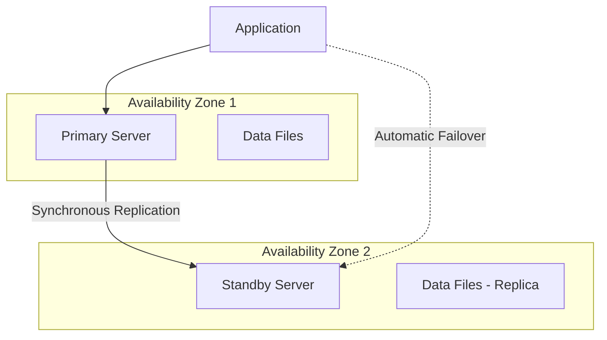

# How to Deploy Azure PostgreSQL Flexible Server with High Availability in Terraform

Author: [nawazdhandala](https://www.github.com/nawazdhandala)

Tags: Azure, PostgreSQL, Terraform, High Availability, Database, Infrastructure as Code, Flexible Server

Description: A practical guide to deploying Azure Database for PostgreSQL Flexible Server with zone-redundant high availability using Terraform.

---

Azure Database for PostgreSQL Flexible Server is the recommended deployment option for PostgreSQL on Azure. It replaced the older Single Server offering and gives you more control over compute and storage configurations, better cost optimization through the ability to stop and start the server, and built-in high availability with automatic failover. When you combine it with Terraform, you get a repeatable, version-controlled database deployment that you can spin up across multiple environments.

This post covers deploying a production-ready PostgreSQL Flexible Server with zone-redundant high availability, proper networking, and all the configuration knobs you should care about.

## High Availability Architecture

PostgreSQL Flexible Server supports two high availability modes:

- **Zone-redundant HA** - The primary and standby servers run in different availability zones. This protects against zone-level failures.
- **Same-zone HA** - Both servers run in the same zone. This protects against server-level failures but not zone outages.

For production workloads, zone-redundant is the right choice. Azure manages the replication, health monitoring, and automatic failover. The standby uses synchronous replication, so there is no data loss during failover.



## Provider and Variables

Start with the standard Terraform setup and variables for the database configuration.

```hcl
# Provider configuration
terraform {
  required_version = ">= 1.5.0"

  required_providers {
    azurerm = {
      source  = "hashicorp/azurerm"
      version = "~> 3.80"
    }
    random = {
      source  = "hashicorp/random"
      version = "~> 3.5"
    }
  }
}

provider "azurerm" {
  features {}
}

# Variables
variable "location" {
  type    = string
  default = "eastus2"
}

variable "environment" {
  type    = string
  default = "prod"
}

variable "postgresql_version" {
  type    = string
  default = "16"
  description = "PostgreSQL major version (13, 14, 15, or 16)"
}

variable "sku_name" {
  type    = string
  default = "GP_Standard_D4ds_v5"
  description = "The compute tier and size. GP = General Purpose, MO = Memory Optimized"
}

variable "storage_mb" {
  type    = number
  default = 131072   # 128 GB
  description = "Storage size in MB. Can be increased but not decreased."
}

variable "admin_username" {
  type    = string
  default = "pgadmin"
}

locals {
  name_prefix = "pg-${var.environment}"
  tags = {
    Environment = var.environment
    ManagedBy   = "terraform"
    Service     = "postgresql"
  }
}
```

## Generate a Strong Password

Use the `random` provider to generate a password that meets complexity requirements, rather than hardcoding one.

```hcl
# Generate a strong random password for the PostgreSQL admin
resource "random_password" "pg_admin" {
  length           = 32
  special          = true
  override_special = "!#$%&*()-_=+[]{}<>:?"
  min_lower        = 4
  min_upper        = 4
  min_numeric      = 4
  min_special      = 2
}
```

## Networking Setup

For production databases, you want the server inside a virtual network with no public access. PostgreSQL Flexible Server supports VNet integration through delegated subnets.

```hcl
# Resource group
resource "azurerm_resource_group" "pg" {
  name     = "rg-${local.name_prefix}"
  location = var.location
  tags     = local.tags
}

# Virtual network for the database
resource "azurerm_virtual_network" "pg" {
  name                = "vnet-${local.name_prefix}"
  location            = azurerm_resource_group.pg.location
  resource_group_name = azurerm_resource_group.pg.name
  address_space       = ["10.10.0.0/16"]
  tags                = local.tags
}

# Delegated subnet for PostgreSQL Flexible Server
resource "azurerm_subnet" "pg" {
  name                 = "snet-postgresql"
  resource_group_name  = azurerm_resource_group.pg.name
  virtual_network_name = azurerm_virtual_network.pg.name
  address_prefixes     = ["10.10.1.0/24"]

  # Delegation is required for Flexible Server VNet integration
  delegation {
    name = "postgresql-delegation"
    service_delegation {
      name = "Microsoft.DBforPostgreSQL/flexibleServers"
      actions = [
        "Microsoft.Network/virtualNetworks/subnets/join/action"
      ]
    }
  }
}

# Private DNS zone for the PostgreSQL server
resource "azurerm_private_dns_zone" "pg" {
  name                = "${local.name_prefix}.private.postgres.database.azure.com"
  resource_group_name = azurerm_resource_group.pg.name
  tags                = local.tags
}

# Link the private DNS zone to the VNet
resource "azurerm_private_dns_zone_virtual_network_link" "pg" {
  name                  = "pg-dns-link"
  private_dns_zone_name = azurerm_private_dns_zone.pg.name
  resource_group_name   = azurerm_resource_group.pg.name
  virtual_network_id    = azurerm_virtual_network.pg.id
  registration_enabled  = false
}
```

The subnet delegation tells Azure that this subnet is reserved for PostgreSQL Flexible Servers. No other resource types can be placed in it. The private DNS zone allows clients within the VNet to resolve the server's hostname without going through public DNS.

## The PostgreSQL Flexible Server

Now for the main resource. This configuration enables zone-redundant high availability, sets appropriate server parameters, and configures maintenance windows.

```hcl
# PostgreSQL Flexible Server with high availability
resource "azurerm_postgresql_flexible_server" "main" {
  name                = "psql-${local.name_prefix}-${random_password.pg_admin.id}"
  resource_group_name = azurerm_resource_group.pg.name
  location            = azurerm_resource_group.pg.location

  # Authentication
  administrator_login    = var.admin_username
  administrator_password = random_password.pg_admin.result

  # Compute and storage
  version              = var.postgresql_version
  sku_name             = var.sku_name
  storage_mb           = var.storage_mb
  storage_tier         = "P30"   # Premium SSD tier for better IOPS

  # Networking - private access only
  delegated_subnet_id = azurerm_subnet.pg.id
  private_dns_zone_id = azurerm_private_dns_zone.pg.id

  # High availability configuration
  high_availability {
    mode                      = "ZoneRedundant"   # Primary and standby in different zones
    standby_availability_zone = "2"               # Standby in zone 2
  }
  zone = "1"   # Primary in zone 1

  # Backup configuration
  backup_retention_days        = 35        # Maximum is 35 days
  geo_redundant_backup_enabled = true      # Replicate backups to paired region

  # Maintenance window - schedule updates for a low-traffic period
  maintenance_window {
    day_of_week  = 0    # Sunday
    start_hour   = 2    # 2 AM
    start_minute = 0
  }

  tags = local.tags

  depends_on = [
    azurerm_private_dns_zone_virtual_network_link.pg
  ]
}
```

A few important notes on the configuration:

- The `zone` and `standby_availability_zone` must be different numbers for zone-redundant HA to work.
- Storage can be increased after creation but never decreased, so start with what you need and plan for growth.
- Geo-redundant backups replicate your backups to the Azure paired region, providing an additional layer of disaster recovery.

## Server Parameters

PostgreSQL has hundreds of configuration parameters. Flexible Server lets you set them through Terraform. Here are the ones most commonly tuned for production.

```hcl
# Connection and memory settings
resource "azurerm_postgresql_flexible_server_configuration" "max_connections" {
  name      = "max_connections"
  server_id = azurerm_postgresql_flexible_server.main.id
  value     = "500"   # Default is typically around 100
}

resource "azurerm_postgresql_flexible_server_configuration" "shared_buffers" {
  name      = "shared_buffers"
  server_id = azurerm_postgresql_flexible_server.main.id
  value     = "1048576"   # 1 GB in 8KB pages (adjust based on RAM)
}

resource "azurerm_postgresql_flexible_server_configuration" "work_mem" {
  name      = "work_mem"
  server_id = azurerm_postgresql_flexible_server.main.id
  value     = "65536"   # 64 MB - increase for complex queries
}

# Performance settings
resource "azurerm_postgresql_flexible_server_configuration" "effective_cache_size" {
  name      = "effective_cache_size"
  server_id = azurerm_postgresql_flexible_server.main.id
  value     = "3145728"   # 3 GB in 8KB pages
}

# Logging settings for debugging
resource "azurerm_postgresql_flexible_server_configuration" "log_min_duration" {
  name      = "log_min_duration_statement"
  server_id = azurerm_postgresql_flexible_server.main.id
  value     = "1000"   # Log queries taking more than 1 second
}

# Enable pg_stat_statements for query performance analysis
resource "azurerm_postgresql_flexible_server_configuration" "pg_stat_statements" {
  name      = "shared_preload_libraries"
  server_id = azurerm_postgresql_flexible_server.main.id
  value     = "pg_stat_statements"
}
```

## Creating Databases

The Flexible Server comes with a default `postgres` database, but you will want to create application-specific databases.

```hcl
# Application database
resource "azurerm_postgresql_flexible_server_database" "app" {
  name      = "app_production"
  server_id = azurerm_postgresql_flexible_server.main.id
  charset   = "UTF8"
  collation = "en_US.utf8"
}

# Analytics database with a different collation
resource "azurerm_postgresql_flexible_server_database" "analytics" {
  name      = "analytics_production"
  server_id = azurerm_postgresql_flexible_server.main.id
  charset   = "UTF8"
  collation = "en_US.utf8"
}
```

## Firewall Rules (for Public Access Scenarios)

If you are using public access instead of VNet integration (for example, in a development environment), you need firewall rules.

```hcl
# Only create firewall rules when not using VNet integration
resource "azurerm_postgresql_flexible_server_firewall_rule" "allow_azure" {
  count            = var.environment == "dev" ? 1 : 0
  name             = "AllowAzureServices"
  server_id        = azurerm_postgresql_flexible_server.main.id
  start_ip_address = "0.0.0.0"   # Special range meaning Azure services only
  end_ip_address   = "0.0.0.0"
}
```

## Monitoring and Diagnostics

Route database metrics and logs to Log Analytics for monitoring.

```hcl
# Log Analytics workspace
resource "azurerm_log_analytics_workspace" "pg" {
  name                = "log-${local.name_prefix}"
  location            = azurerm_resource_group.pg.location
  resource_group_name = azurerm_resource_group.pg.name
  sku                 = "PerGB2018"
  retention_in_days   = 30
  tags                = local.tags
}

# Diagnostic settings for the PostgreSQL server
resource "azurerm_monitor_diagnostic_setting" "pg" {
  name                       = "pg-diagnostics"
  target_resource_id         = azurerm_postgresql_flexible_server.main.id
  log_analytics_workspace_id = azurerm_log_analytics_workspace.pg.id

  enabled_log {
    category = "PostgreSQLLogs"
  }

  enabled_log {
    category = "PostgreSQLFlexSessions"
  }

  metric {
    category = "AllMetrics"
    enabled  = true
  }
}
```

## Outputs

Expose connection information for applications and other Terraform configurations.

```hcl
# Outputs
output "server_fqdn" {
  value       = azurerm_postgresql_flexible_server.main.fqdn
  description = "The FQDN of the PostgreSQL server"
}

output "server_id" {
  value       = azurerm_postgresql_flexible_server.main.id
  description = "The resource ID of the PostgreSQL server"
}

output "admin_username" {
  value       = var.admin_username
  description = "The administrator username"
}

output "admin_password" {
  value       = random_password.pg_admin.result
  sensitive   = true
  description = "The administrator password (sensitive)"
}

output "app_database_name" {
  value       = azurerm_postgresql_flexible_server_database.app.name
  description = "The name of the application database"
}

# Connection string for applications
output "connection_string" {
  value       = "host=${azurerm_postgresql_flexible_server.main.fqdn} port=5432 dbname=${azurerm_postgresql_flexible_server_database.app.name} user=${var.admin_username} sslmode=require"
  sensitive   = true
  description = "PostgreSQL connection string"
}
```

## Deployment

Deploy with Terraform, passing any variable overrides you need.

```bash
# Initialize Terraform
terraform init

# Plan with production settings
terraform plan \
  -var="environment=prod" \
  -var="sku_name=GP_Standard_D4ds_v5" \
  -var="storage_mb=262144"

# Apply
terraform apply
```

## Wrapping Up

Deploying PostgreSQL Flexible Server with zone-redundant high availability in Terraform gives you a production-grade database setup that is repeatable and auditable. The key decisions are the HA mode (zone-redundant for production), networking (VNet integration for security), and server parameters (tuned for your workload). With the configuration in this post, you get automatic failover, geo-redundant backups, private networking, and monitoring - all managed as code.
