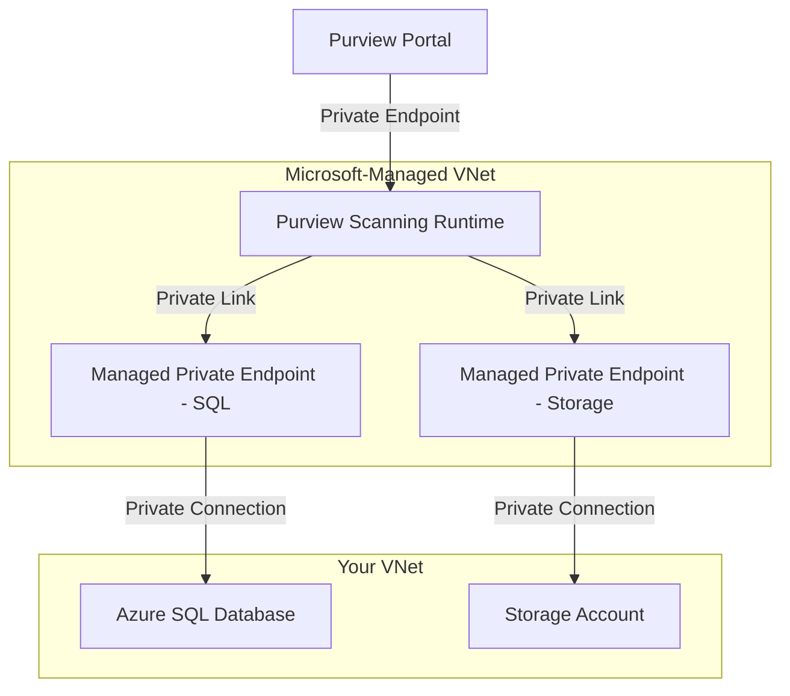

# How to Deploy Azure Purview Account with Managed Private Endpoints in Bicep

Author: [nawazdhandala](https://www.github.com/nawazdhandala)

Tags: Azure, Purview, Bicep, Data Governance, Private Endpoints, Infrastructure as Code, Security

Description: Deploy Microsoft Purview (formerly Azure Purview) with managed private endpoints using Bicep for secure, network-isolated data governance and cataloging.

---

Microsoft Purview (previously Azure Purview) provides a unified data governance service that helps you discover, classify, and manage data across your organization. It scans data sources like Azure SQL, Data Lake Storage, Synapse, and many others to build a comprehensive data catalog. In enterprise environments, network security is critical, so you need to deploy Purview with managed private endpoints to ensure scanning traffic never traverses the public internet.

This post walks through deploying a Purview account with managed private endpoints in Bicep, including the network configuration, diagnostic settings, and managed identity setup.

## Architecture Overview

When Purview uses managed private endpoints, the scanning infrastructure runs inside a Microsoft-managed virtual network. Private endpoints from this managed VNet connect to your data sources, keeping all traffic on the Azure backbone.



## Parameters and Shared Configuration

```bicep
// Parameters for the deployment
param location string = resourceGroup().location
param purviewAccountName string
param environment string = 'prod'

// Tags applied to all resources
var tags = {
  Environment: environment
  ManagedBy: 'bicep'
  Service: 'data-governance'
}

// Unique suffix for globally unique names
var uniqueSuffix = uniqueString(resourceGroup().id)
```

## The Purview Account

The main Purview account resource with managed VNet configuration.

```bicep
// Microsoft Purview Account
resource purviewAccount 'Microsoft.Purview/accounts@2021-12-01' = {
  name: purviewAccountName
  location: location
  tags: tags

  identity: {
    type: 'SystemAssigned'    // Managed identity for scanning data sources
  }

  properties: {
    // Enable the managed virtual network for private scanning
    managedResourceGroupName: 'rg-${purviewAccountName}-managed'

    // Public network access configuration
    publicNetworkAccess: 'Disabled'    // Disable public access for security

    // Managed resource configuration
    managedResources: {}
  }
}
```

Setting `publicNetworkAccess` to `Disabled` means the Purview portal and API can only be accessed through private endpoints. This is the recommended setting for production environments.

## Virtual Network and Private Endpoints for Purview Portal

To access the Purview portal when public access is disabled, you need private endpoints for the Purview account, portal, and the managed storage/Event Hub.

```bicep
// Virtual network for private endpoint connectivity
resource vnet 'Microsoft.Network/virtualNetworks@2023-09-01' = {
  name: 'vnet-${purviewAccountName}'
  location: location
  tags: tags
  properties: {
    addressSpace: {
      addressPrefixes: [
        '10.20.0.0/16'
      ]
    }
    subnets: [
      {
        name: 'snet-private-endpoints'
        properties: {
          addressPrefix: '10.20.1.0/24'
          privateEndpointNetworkPolicies: 'Disabled'
        }
      }
      {
        name: 'snet-workstations'
        properties: {
          addressPrefix: '10.20.2.0/24'
        }
      }
    ]
  }
}

// Private DNS zones for Purview services
resource purviewAccountDnsZone 'Microsoft.Network/privateDnsZones@2020-06-01' = {
  name: 'privatelink.purview.azure.com'
  location: 'global'
  tags: tags
}

resource purviewStudioDnsZone 'Microsoft.Network/privateDnsZones@2020-06-01' = {
  name: 'privatelink.purviewstudio.azure.com'
  location: 'global'
  tags: tags
}

resource blobDnsZone 'Microsoft.Network/privateDnsZones@2020-06-01' = {
  name: 'privatelink.blob.core.windows.net'
  location: 'global'
  tags: tags
}

resource queueDnsZone 'Microsoft.Network/privateDnsZones@2020-06-01' = {
  name: 'privatelink.queue.core.windows.net'
  location: 'global'
  tags: tags
}

resource eventHubDnsZone 'Microsoft.Network/privateDnsZones@2020-06-01' = {
  name: 'privatelink.servicebus.windows.net'
  location: 'global'
  tags: tags
}

// Link DNS zones to the VNet
resource purviewAccountDnsLink 'Microsoft.Network/privateDnsZones/virtualNetworkLinks@2020-06-01' = {
  parent: purviewAccountDnsZone
  name: 'purview-account-link'
  location: 'global'
  properties: {
    virtualNetwork: { id: vnet.id }
    registrationEnabled: false
  }
}

resource purviewStudioDnsLink 'Microsoft.Network/privateDnsZones/virtualNetworkLinks@2020-06-01' = {
  parent: purviewStudioDnsZone
  name: 'purview-studio-link'
  location: 'global'
  properties: {
    virtualNetwork: { id: vnet.id }
    registrationEnabled: false
  }
}

resource blobDnsLink 'Microsoft.Network/privateDnsZones/virtualNetworkLinks@2020-06-01' = {
  parent: blobDnsZone
  name: 'blob-link'
  location: 'global'
  properties: {
    virtualNetwork: { id: vnet.id }
    registrationEnabled: false
  }
}

resource queueDnsLink 'Microsoft.Network/privateDnsZones/virtualNetworkLinks@2020-06-01' = {
  parent: queueDnsZone
  name: 'queue-link'
  location: 'global'
  properties: {
    virtualNetwork: { id: vnet.id }
    registrationEnabled: false
  }
}

resource eventHubDnsLink 'Microsoft.Network/privateDnsZones/virtualNetworkLinks@2020-06-01' = {
  parent: eventHubDnsZone
  name: 'eventhub-link'
  location: 'global'
  properties: {
    virtualNetwork: { id: vnet.id }
    registrationEnabled: false
  }
}
```

## Private Endpoints for Purview

Purview requires three private endpoints: one for the account, one for the portal (studio), and typically additional ones for the managed storage and Event Hub.

```bicep
// Private endpoint for Purview account (API access)
resource purviewAccountPe 'Microsoft.Network/privateEndpoints@2023-09-01' = {
  name: 'pe-${purviewAccountName}-account'
  location: location
  tags: tags
  properties: {
    subnet: {
      id: vnet.properties.subnets[0].id    // snet-private-endpoints
    }
    privateLinkServiceConnections: [
      {
        name: 'purview-account-connection'
        properties: {
          privateLinkServiceId: purviewAccount.id
          groupIds: ['account']
        }
      }
    ]
  }
}

// Private endpoint for Purview portal (studio access)
resource purviewPortalPe 'Microsoft.Network/privateEndpoints@2023-09-01' = {
  name: 'pe-${purviewAccountName}-portal'
  location: location
  tags: tags
  properties: {
    subnet: {
      id: vnet.properties.subnets[0].id
    }
    privateLinkServiceConnections: [
      {
        name: 'purview-portal-connection'
        properties: {
          privateLinkServiceId: purviewAccount.id
          groupIds: ['portal']
        }
      }
    ]
  }
}

// DNS zone group for account private endpoint
resource accountDnsGroup 'Microsoft.Network/privateEndpoints/privateDnsZoneGroups@2023-09-01' = {
  parent: purviewAccountPe
  name: 'account-dns-group'
  properties: {
    privateDnsZoneConfigs: [
      {
        name: 'purview-account'
        properties: {
          privateDnsZoneId: purviewAccountDnsZone.id
        }
      }
    ]
  }
}

// DNS zone group for portal private endpoint
resource portalDnsGroup 'Microsoft.Network/privateEndpoints/privateDnsZoneGroups@2023-09-01' = {
  parent: purviewPortalPe
  name: 'portal-dns-group'
  properties: {
    privateDnsZoneConfigs: [
      {
        name: 'purview-studio'
        properties: {
          privateDnsZoneId: purviewStudioDnsZone.id
        }
      }
    ]
  }
}
```

## Creating Managed Private Endpoints for Data Sources

Managed private endpoints are created within Purview's managed VNet to connect to your data sources. These are configured through the Purview API after the account is deployed.

```bicep
// Deployment script to create managed private endpoints for data sources
// Managed private endpoints cannot be created directly as Bicep resources
// because they are managed by Purview's internal infrastructure

// Example: Storage account that Purview will scan
resource dataLakeStorage 'Microsoft.Storage/storageAccounts@2023-01-01' = {
  name: 'st${uniqueSuffix}datalake'
  location: location
  tags: tags
  sku: { name: 'Standard_LRS' }
  kind: 'StorageV2'
  properties: {
    isHnsEnabled: true
    minimumTlsVersion: 'TLS1_2'
    publicNetworkAccess: 'Disabled'   // Only accessible via private endpoints
  }
}

// Grant Purview managed identity access to the data source
resource purviewStorageReader 'Microsoft.Authorization/roleAssignments@2022-04-01' = {
  scope: dataLakeStorage
  name: guid(dataLakeStorage.id, purviewAccount.id, 'Storage Blob Data Reader')
  properties: {
    roleDefinitionId: subscriptionResourceId('Microsoft.Authorization/roleDefinitions', '2a2b9908-6ea1-4ae2-8e65-a410df84e7d1')
    principalId: purviewAccount.identity.principalId
    principalType: 'ServicePrincipal'
  }
}
```

To create the actual managed private endpoints within Purview, use a post-deployment script.

```bicep
// Post-deployment script to create managed private endpoints in Purview
resource createManagedPe 'Microsoft.Resources/deploymentScripts@2023-08-01' = {
  name: 'create-purview-managed-pe'
  location: location
  kind: 'AzureCLI'
  identity: {
    type: 'UserAssigned'
    userAssignedIdentities: {
      // Reference a user-assigned identity with Purview admin access
    }
  }
  properties: {
    azCliVersion: '2.50.0'
    retentionInterval: 'PT1H'
    scriptContent: '''
      # Create a managed private endpoint for the storage account
      az rest --method PUT \
        --url "https://${PURVIEW_ACCOUNT}.purview.azure.com/managedVirtualNetworks/default/managedPrivateEndpoints/pe-datalake?api-version=2021-12-01" \
        --body '{
          "properties": {
            "privateLinkResourceId": "${STORAGE_ACCOUNT_ID}",
            "groupId": "blob",
            "requestMessage": "Purview scanning access"
          }
        }'

      echo "Managed private endpoint created. Manual approval may be required."
    '''
    environmentVariables: [
      {
        name: 'PURVIEW_ACCOUNT'
        value: purviewAccount.name
      }
      {
        name: 'STORAGE_ACCOUNT_ID'
        value: dataLakeStorage.id
      }
    ]
  }
  dependsOn: [
    purviewAccount
    dataLakeStorage
  ]
}
```

## Monitoring

Add diagnostic settings to track Purview operations.

```bicep
// Log Analytics workspace
resource logAnalytics 'Microsoft.OperationalInsights/workspaces@2022-10-01' = {
  name: 'log-${purviewAccountName}'
  location: location
  tags: tags
  properties: {
    sku: { name: 'PerGB2018' }
    retentionInDays: 30
  }
}

// Diagnostic settings for Purview
resource diagnostics 'Microsoft.Insights/diagnosticSettings@2021-05-01-preview' = {
  scope: purviewAccount
  name: 'purview-diagnostics'
  properties: {
    workspaceId: logAnalytics.id
    logs: [
      {
        category: 'ScanStatusLogEvent'
        enabled: true
      }
      {
        category: 'DataSensitivityLogEvent'
        enabled: true
      }
    ]
    metrics: [
      {
        category: 'AllMetrics'
        enabled: true
      }
    ]
  }
}
```

## Outputs

```bicep
// Deployment outputs
output purviewAccountId string = purviewAccount.id
output purviewAccountName string = purviewAccount.name
output purviewEndpoint string = purviewAccount.properties.endpoints.catalog
output purviewManagedIdentityId string = purviewAccount.identity.principalId
output purviewScanEndpoint string = purviewAccount.properties.endpoints.scan
```

## Deployment

```bash
# Create the resource group
az group create --name rg-purview-prod --location eastus2

# Deploy the Bicep template
az deployment group create \
  --resource-group rg-purview-prod \
  --template-file main.bicep \
  --parameters purviewAccountName='purview-contoso-prod' environment='prod'
```

## Post-Deployment Steps

After the Bicep deployment completes, there are a few manual or scripted steps:

1. **Approve managed private endpoints** - The private endpoint connections on your data sources will be in a "Pending" state. You need to approve them before Purview can scan.
2. **Configure data source collections** - Organize your data sources into collections within the Purview portal.
3. **Set up scan schedules** - Configure how often Purview scans each data source.

```bash
# Approve the managed private endpoint on the storage account
az network private-endpoint-connection approve \
  --resource-name stxxxxdatalake \
  --resource-group rg-purview-prod \
  --type Microsoft.Storage/storageAccounts \
  --name pe-datalake \
  --description "Approved for Purview scanning"
```

## Wrapping Up

Deploying Microsoft Purview with managed private endpoints in Bicep gives you a network-isolated data governance platform. The setup involves the Purview account itself, private endpoints for portal and API access, DNS zones for name resolution, and managed private endpoints within Purview's infrastructure for connecting to data sources. While the initial deployment is more involved than a public-access setup, the security benefits are significant for enterprise environments where data sources contain sensitive information.
