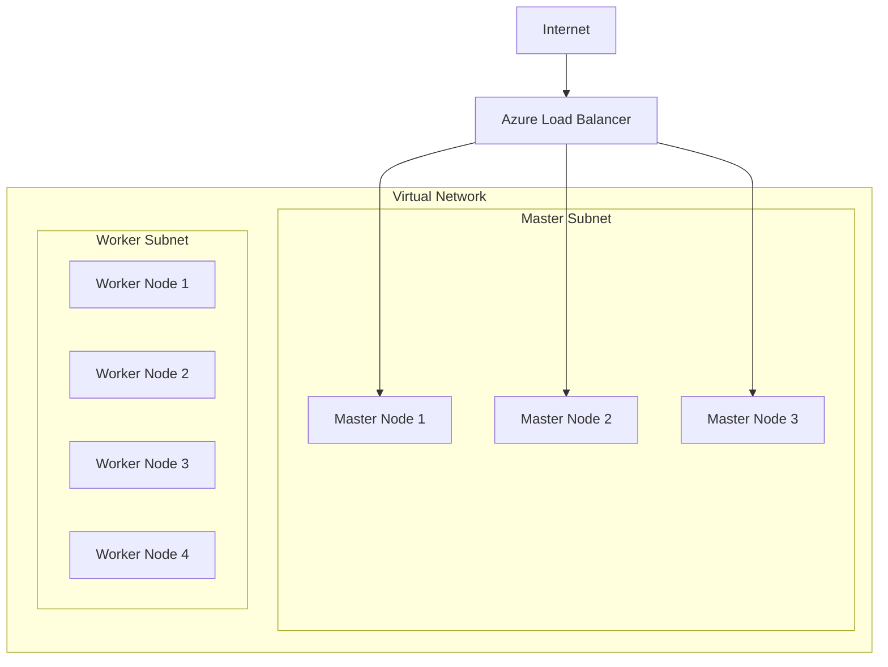

# How to Deploy Azure Red Hat OpenShift Clusters with Terraform and Custom Node Pools

Author: [nawazdhandala](https://www.github.com/nawazdhandala)

Tags: Terraform, Azure, OpenShift, ARO, Kubernetes, IaC, Red Hat

Description: Deploy Azure Red Hat OpenShift clusters with custom master and worker node pools using Terraform, including networking and identity configuration.

---

Azure Red Hat OpenShift (ARO) is a fully managed OpenShift service jointly operated by Microsoft and Red Hat. It gives you enterprise Kubernetes with OpenShift's developer tools, built-in CI/CD, and the operator framework, all running on Azure infrastructure. Unlike AKS, ARO includes a support agreement that covers both the platform and the underlying infrastructure.

Deploying ARO involves more networking prerequisites than AKS. You need a VNet with two dedicated subnets, a service principal or managed identity, and specific network configurations. Terraform handles all of this, and lets you customize the master and worker node pools to match your workload requirements.

## Architecture Overview



ARO requires a minimum of three master nodes (for the control plane) and three worker nodes. The master nodes are managed by Red Hat SRE and are not directly customizable after deployment, but you can choose their VM size. Worker nodes are where your applications run, and you have full control over their size, count, and disk configuration.

## Prerequisites

ARO requires a Red Hat pull secret for accessing container images from the Red Hat registry. Get one from https://console.redhat.com/openshift/install/pull-secret.

You also need the Azure Red Hat OpenShift resource provider registered in your subscription.

```bash
# Register the resource provider
az provider register --namespace Microsoft.RedHatOpenShift

# Verify registration
az provider show --namespace Microsoft.RedHatOpenShift --query "registrationState" -o tsv
```

## Terraform Configuration

### Provider and Variables

```hcl
# versions.tf
terraform {
  required_version = ">= 1.5.0"

  required_providers {
    azurerm = {
      source  = "hashicorp/azurerm"
      version = "~> 3.85"
    }
    azuread = {
      source  = "hashicorp/azuread"
      version = "~> 2.47"
    }
  }
}

provider "azurerm" {
  features {}
}

provider "azuread" {}
```

```hcl
# variables.tf
variable "location" {
  description = "Azure region for the ARO cluster"
  type        = string
  default     = "eastus"
}

variable "cluster_name" {
  description = "Name of the ARO cluster"
  type        = string
  default     = "aro-production"
}

variable "domain" {
  description = "Custom domain for the cluster"
  type        = string
  default     = "aro-prod"
}

variable "pull_secret" {
  description = "Red Hat pull secret JSON"
  type        = string
  sensitive   = true
}

variable "master_vm_size" {
  description = "VM size for master nodes"
  type        = string
  default     = "Standard_D8s_v3"
}

variable "worker_vm_size" {
  description = "VM size for worker nodes"
  type        = string
  default     = "Standard_D4s_v3"
}

variable "worker_count" {
  description = "Number of worker nodes"
  type        = number
  default     = 4
}

variable "worker_disk_size_gb" {
  description = "OS disk size for worker nodes in GB"
  type        = number
  default     = 128
}

variable "pod_cidr" {
  description = "CIDR for pod network"
  type        = string
  default     = "10.128.0.0/14"
}

variable "service_cidr" {
  description = "CIDR for service network"
  type        = string
  default     = "172.30.0.0/16"
}
```

### Service Principal for ARO

ARO needs a service principal to manage cluster resources.

```hcl
# Create the Azure AD application for ARO
resource "azuread_application" "aro" {
  display_name = "aro-${var.cluster_name}"
}

# Create the service principal
resource "azuread_service_principal" "aro" {
  client_id = azuread_application.aro.client_id
}

# Create a password for the service principal
resource "azuread_service_principal_password" "aro" {
  service_principal_id = azuread_service_principal.aro.id
  end_date_relative    = "8760h" # 1 year
}

# Get the ARO resource provider service principal
data "azuread_service_principal" "aro_rp" {
  display_name = "Azure Red Hat OpenShift RP"
}
```

### Networking

ARO requires specific networking. The VNet needs two subnets - one for master nodes and one for worker nodes. Both subnets must have `privateLinkServiceNetworkPolicies` disabled on the master subnet.

```hcl
# Resource group
resource "azurerm_resource_group" "main" {
  name     = "rg-${var.cluster_name}"
  location = var.location
}

# Virtual network for the ARO cluster
resource "azurerm_virtual_network" "aro" {
  name                = "vnet-${var.cluster_name}"
  location            = azurerm_resource_group.main.location
  resource_group_name = azurerm_resource_group.main.name
  address_space       = ["10.0.0.0/16"]
}

# Subnet for master nodes - needs private link service policies disabled
resource "azurerm_subnet" "master" {
  name                                          = "snet-master"
  resource_group_name                           = azurerm_resource_group.main.name
  virtual_network_name                          = azurerm_virtual_network.aro.name
  address_prefixes                              = ["10.0.1.0/24"]
  private_link_service_network_policies_enabled = false
  service_endpoints                             = ["Microsoft.ContainerRegistry"]
}

# Subnet for worker nodes
resource "azurerm_subnet" "worker" {
  name                 = "snet-worker"
  resource_group_name  = azurerm_resource_group.main.name
  virtual_network_name = azurerm_virtual_network.aro.name
  address_prefixes     = ["10.0.2.0/24"]
  service_endpoints    = ["Microsoft.ContainerRegistry"]
}
```

### Role Assignments

The ARO service principal and the ARO resource provider both need specific permissions on the VNet.

```hcl
# Grant the ARO service principal Network Contributor on the VNet
resource "azurerm_role_assignment" "aro_vnet" {
  scope                = azurerm_virtual_network.aro.id
  role_definition_name = "Network Contributor"
  principal_id         = azuread_service_principal.aro.object_id
}

# Grant the ARO RP service principal Network Contributor on the VNet
resource "azurerm_role_assignment" "aro_rp_vnet" {
  scope                = azurerm_virtual_network.aro.id
  role_definition_name = "Network Contributor"
  principal_id         = data.azuread_service_principal.aro_rp.object_id
}

# Grant the ARO service principal Contributor on the resource group
resource "azurerm_role_assignment" "aro_rg" {
  scope                = azurerm_resource_group.main.id
  role_definition_name = "Contributor"
  principal_id         = azuread_service_principal.aro.object_id
}
```

### The ARO Cluster

Now for the main cluster resource.

```hcl
# Azure Red Hat OpenShift cluster
resource "azurerm_redhat_openshift_cluster" "main" {
  name                = var.cluster_name
  location            = azurerm_resource_group.main.location
  resource_group_name = azurerm_resource_group.main.name

  cluster_profile {
    domain       = var.domain
    version      = "4.14"
    pull_secret  = var.pull_secret
  }

  network_profile {
    pod_cidr     = var.pod_cidr
    service_cidr = var.service_cidr
  }

  # Master node pool configuration
  main_profile {
    vm_size            = var.master_vm_size
    subnet_id          = azurerm_subnet.master.id
    encryption_at_host = "Enabled"
  }

  # Worker node pool configuration
  worker_profile {
    vm_size            = var.worker_vm_size
    disk_size_gb       = var.worker_disk_size_gb
    node_count         = var.worker_count
    subnet_id          = azurerm_subnet.worker.id
    encryption_at_host = "Enabled"
  }

  api_server_profile {
    visibility = "Public"
  }

  ingress_profile {
    visibility = "Public"
  }

  service_principal {
    client_id     = azuread_application.aro.client_id
    client_secret = azuread_service_principal_password.aro.value
  }

  depends_on = [
    azurerm_role_assignment.aro_vnet,
    azurerm_role_assignment.aro_rp_vnet,
    azurerm_role_assignment.aro_rg,
  ]

  # ARO cluster creation takes 30-45 minutes
  timeouts {
    create = "90m"
    delete = "60m"
  }
}
```

### Outputs

```hcl
output "console_url" {
  value       = azurerm_redhat_openshift_cluster.main.console_url
  description = "URL for the OpenShift web console"
}

output "api_server_url" {
  value       = "https://api.${var.domain}.${var.location}.aroapp.io:6443"
  description = "URL for the Kubernetes API server"
}

output "cluster_id" {
  value = azurerm_redhat_openshift_cluster.main.id
}
```

## Choosing Node Sizes

The master node size affects cluster performance for API operations, etcd, and controller operations. Here are common choices:

| Workload | Master VM Size | Worker VM Size | Worker Count |
|----------|---------------|---------------|--------------|
| Dev/Test | Standard_D8s_v3 | Standard_D4s_v3 | 3 |
| Small Production | Standard_D8s_v3 | Standard_D8s_v3 | 4-6 |
| Large Production | Standard_D16s_v3 | Standard_D16s_v3 | 8-20 |
| GPU Workloads | Standard_D8s_v3 | Standard_NC6s_v3 | 3-10 |

## Private Clusters

For production environments that should not be accessible from the internet, configure private API server and ingress.

```hcl
  api_server_profile {
    visibility = "Private"
  }

  ingress_profile {
    visibility = "Private"
  }
```

With a private cluster, you need a jump box or VPN connection to access the OpenShift console and API server. Make sure your CI/CD pipeline can reach the private endpoint.

## Getting Cluster Credentials

After deployment, retrieve the kubeadmin credentials.

```bash
# Get the kubeadmin password
az aro list-credentials \
  --name aro-production \
  --resource-group rg-aro-production \
  --query kubeadminPassword -o tsv

# Get the API server URL
az aro show \
  --name aro-production \
  --resource-group rg-aro-production \
  --query apiserverProfile.url -o tsv

# Login with oc CLI
oc login $(az aro show --name aro-production --resource-group rg-aro-production --query apiserverProfile.url -o tsv) \
  --username kubeadmin \
  --password $(az aro list-credentials --name aro-production --resource-group rg-aro-production --query kubeadminPassword -o tsv)
```

## Post-Deployment Configuration

After the cluster is running, you will typically want to configure Azure AD integration for authentication, set up persistent storage with Azure Disk or Azure Files CSI drivers, and configure cluster logging with Azure Monitor or the EFK stack.

These post-deployment tasks can be handled with the OpenShift provider for Terraform, or through GitOps with ArgoCD which comes built into newer OpenShift versions.

## Cost Considerations

ARO pricing includes the base Azure infrastructure cost plus an OpenShift license fee per worker node. The license fee covers Red Hat support and the OpenShift platform. Master nodes are included in the base ARO service cost.

For development clusters, use smaller VM sizes and minimum node counts to keep costs manageable. The cluster can be resized later by updating the worker profile.

## Conclusion

Deploying Azure Red Hat OpenShift with Terraform gives you a reproducible, version-controlled cluster setup. The networking prerequisites - dedicated subnets, service principal permissions, and private link configuration - are handled cleanly in Terraform's dependency graph. While ARO takes longer to deploy than AKS (30-45 minutes vs. 5-10 minutes), you get a fully managed OpenShift platform with enterprise support from both Microsoft and Red Hat, all codified in Terraform for consistent deployments across environments.
