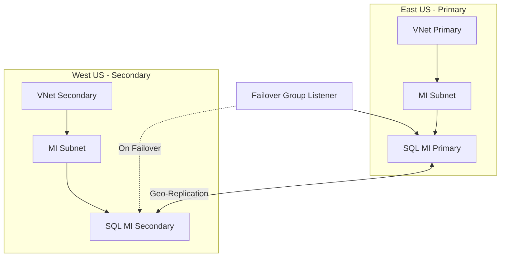

# How to Deploy Azure SQL Managed Instance with Failover Groups in Terraform

Author: [nawazdhandala](https://www.github.com/nawazdhandala)

Tags: Terraform, Azure, SQL Managed Instance, Failover Groups, High Availability, IaC, Database

Description: Deploy Azure SQL Managed Instance with auto-failover groups across two regions using Terraform for business continuity and disaster recovery.

---

Azure SQL Managed Instance is the PaaS version of SQL Server that gives you near-complete compatibility with on-premises SQL Server. When you need business continuity, you pair it with a failover group that replicates your databases to a secondary instance in another region. If the primary region goes down, the failover group automatically redirects connections to the secondary.

Deploying this setup through the portal is a multi-hour clicking exercise. With Terraform, you can codify the whole thing - the networking, the managed instances, and the failover group - and deploy it consistently every time.

## What You Are Building

The architecture involves two Azure regions. Each region has a VNet with a dedicated subnet for the Managed Instance. The primary instance hosts your databases and replicates them asynchronously to the secondary instance. A failover group provides a listener endpoint that automatically routes connections to whichever instance is currently primary.



## Networking Setup

SQL Managed Instance requires a dedicated subnet with specific configurations. The subnet must be delegated to `Microsoft.Sql/managedInstances`, and it needs a route table and NSG associated with it.

```hcl
# Primary region resources
resource "azurerm_resource_group" "primary" {
  name     = "rg-sqlmi-primary"
  location = "eastus"
}

resource "azurerm_virtual_network" "primary" {
  name                = "vnet-sqlmi-primary"
  location            = azurerm_resource_group.primary.location
  resource_group_name = azurerm_resource_group.primary.name
  address_space       = ["10.0.0.0/16"]
}

# NSG required for the MI subnet
resource "azurerm_network_security_group" "primary" {
  name                = "nsg-sqlmi-primary"
  location            = azurerm_resource_group.primary.location
  resource_group_name = azurerm_resource_group.primary.name
}

# Route table for MI subnet traffic management
resource "azurerm_route_table" "primary" {
  name                = "rt-sqlmi-primary"
  location            = azurerm_resource_group.primary.location
  resource_group_name = azurerm_resource_group.primary.name
}

# Dedicated subnet with MI delegation
resource "azurerm_subnet" "primary_mi" {
  name                 = "snet-sqlmi"
  resource_group_name  = azurerm_resource_group.primary.name
  virtual_network_name = azurerm_virtual_network.primary.name
  address_prefixes     = ["10.0.0.0/24"]

  delegation {
    name = "sqlmi-delegation"
    service_delegation {
      name = "Microsoft.Sql/managedInstances"
      actions = [
        "Microsoft.Network/virtualNetworks/subnets/join/action",
        "Microsoft.Network/virtualNetworks/subnets/prepareNetworkPolicies/action",
        "Microsoft.Network/virtualNetworks/subnets/unprepareNetworkPolicies/action",
      ]
    }
  }
}

# Associate NSG with the MI subnet
resource "azurerm_subnet_network_security_group_association" "primary" {
  subnet_id                 = azurerm_subnet.primary_mi.id
  network_security_group_id = azurerm_network_security_group.primary.id
}

# Associate route table with the MI subnet
resource "azurerm_subnet_route_table_association" "primary" {
  subnet_id      = azurerm_subnet.primary_mi.id
  route_table_id = azurerm_route_table.primary.id
}
```

Now repeat the same for the secondary region.

```hcl
# Secondary region resources
resource "azurerm_resource_group" "secondary" {
  name     = "rg-sqlmi-secondary"
  location = "westus"
}

resource "azurerm_virtual_network" "secondary" {
  name                = "vnet-sqlmi-secondary"
  location            = azurerm_resource_group.secondary.location
  resource_group_name = azurerm_resource_group.secondary.name
  address_space       = ["10.1.0.0/16"]
}

resource "azurerm_network_security_group" "secondary" {
  name                = "nsg-sqlmi-secondary"
  location            = azurerm_resource_group.secondary.location
  resource_group_name = azurerm_resource_group.secondary.name
}

resource "azurerm_route_table" "secondary" {
  name                = "rt-sqlmi-secondary"
  location            = azurerm_resource_group.secondary.location
  resource_group_name = azurerm_resource_group.secondary.name
}

resource "azurerm_subnet" "secondary_mi" {
  name                 = "snet-sqlmi"
  resource_group_name  = azurerm_resource_group.secondary.name
  virtual_network_name = azurerm_virtual_network.secondary.name
  address_prefixes     = ["10.1.0.0/24"]

  delegation {
    name = "sqlmi-delegation"
    service_delegation {
      name = "Microsoft.Sql/managedInstances"
      actions = [
        "Microsoft.Network/virtualNetworks/subnets/join/action",
        "Microsoft.Network/virtualNetworks/subnets/prepareNetworkPolicies/action",
        "Microsoft.Network/virtualNetworks/subnets/unprepareNetworkPolicies/action",
      ]
    }
  }
}

resource "azurerm_subnet_network_security_group_association" "secondary" {
  subnet_id                 = azurerm_subnet.secondary_mi.id
  network_security_group_id = azurerm_network_security_group.secondary.id
}

resource "azurerm_subnet_route_table_association" "secondary" {
  subnet_id      = azurerm_subnet.secondary_mi.id
  route_table_id = azurerm_route_table.secondary.id
}
```

## VNet Peering

The two VNets must be peered so the managed instances can communicate for geo-replication.

```hcl
# Peering from primary to secondary
resource "azurerm_virtual_network_peering" "primary_to_secondary" {
  name                      = "peer-primary-to-secondary"
  resource_group_name       = azurerm_resource_group.primary.name
  virtual_network_name      = azurerm_virtual_network.primary.name
  remote_virtual_network_id = azurerm_virtual_network.secondary.id
  allow_forwarded_traffic   = true
  allow_gateway_transit     = false
}

# Peering from secondary to primary
resource "azurerm_virtual_network_peering" "secondary_to_primary" {
  name                      = "peer-secondary-to-primary"
  resource_group_name       = azurerm_resource_group.secondary.name
  virtual_network_name      = azurerm_virtual_network.secondary.name
  remote_virtual_network_id = azurerm_virtual_network.primary.id
  allow_forwarded_traffic   = true
  allow_gateway_transit     = false
}
```

## Deploying the Managed Instances

Now for the main resources. SQL Managed Instance deployments are notoriously slow - expect 4 to 6 hours for each instance.

```hcl
# Primary SQL Managed Instance
resource "azurerm_mssql_managed_instance" "primary" {
  name                         = "sqlmi-primary-prod"
  resource_group_name          = azurerm_resource_group.primary.name
  location                     = azurerm_resource_group.primary.location
  administrator_login          = "miadmin"
  administrator_login_password = var.sql_admin_password
  license_type                 = "BasePrice"
  sku_name                     = "GP_Gen5"
  storage_size_in_gb           = 256
  subnet_id                    = azurerm_subnet.primary_mi.id
  vcores                       = 8
  timezone_id                  = "UTC"

  identity {
    type = "SystemAssigned"
  }

  depends_on = [
    azurerm_subnet_network_security_group_association.primary,
    azurerm_subnet_route_table_association.primary,
  ]
}

# Secondary SQL Managed Instance
resource "azurerm_mssql_managed_instance" "secondary" {
  name                         = "sqlmi-secondary-prod"
  resource_group_name          = azurerm_resource_group.secondary.name
  location                     = azurerm_resource_group.secondary.location
  administrator_login          = "miadmin"
  administrator_login_password = var.sql_admin_password
  license_type                 = "BasePrice"
  sku_name                     = "GP_Gen5"
  storage_size_in_gb           = 256
  subnet_id                    = azurerm_subnet.secondary_mi.id
  vcores                       = 8
  timezone_id                  = "UTC"

  identity {
    type = "SystemAssigned"
  }

  depends_on = [
    azurerm_subnet_network_security_group_association.secondary,
    azurerm_subnet_route_table_association.secondary,
  ]
}
```

Both instances should have the same SKU, vCores, and storage configuration. The failover group requires matching configurations.

## Creating the Failover Group

The failover group ties the two instances together and provides the listener endpoint.

```hcl
# Failover group for automatic geo-failover
resource "azurerm_mssql_managed_instance_failover_group" "main" {
  name                        = "fog-sqlmi-prod"
  location                    = azurerm_mssql_managed_instance.primary.location
  managed_instance_id         = azurerm_mssql_managed_instance.primary.id
  partner_managed_instance_id = azurerm_mssql_managed_instance.secondary.id

  read_write_endpoint_failover_policy {
    mode          = "Automatic"
    grace_minutes = 60
  }

  depends_on = [
    azurerm_virtual_network_peering.primary_to_secondary,
    azurerm_virtual_network_peering.secondary_to_primary,
  ]
}
```

The `grace_minutes` parameter is the grace period before automatic failover kicks in. Setting it to 60 means the system will wait up to 60 minutes for the primary to recover before failing over. Adjust this based on your RTO requirements.

## Connection Strings

After deployment, your application should connect through the failover group listener, not directly to either managed instance.

```hcl
# Output the failover group listener endpoints
output "failover_group_read_write_endpoint" {
  value       = "fog-sqlmi-prod.database.windows.net"
  description = "Read-write listener endpoint - always points to primary"
}

output "failover_group_read_only_endpoint" {
  value       = "fog-sqlmi-prod.secondary.database.windows.net"
  description = "Read-only listener endpoint - always points to secondary"
}
```

The read-write endpoint always resolves to whichever instance is currently the primary. The read-only endpoint always resolves to the secondary, which is useful for offloading read queries.

## Important Considerations

Deployment time is the biggest factor with SQL Managed Instance. Each instance takes 4-6 hours to create, and the failover group takes additional time. Plan your pipeline accordingly - you do not want a CI/CD timeout killing a multi-hour deployment.

Set appropriate Terraform timeouts to accommodate the long provisioning times:

```hcl
resource "azurerm_mssql_managed_instance" "primary" {
  # ... configuration ...

  timeouts {
    create = "8h"
    update = "8h"
    delete = "8h"
  }
}
```

Cost is another consideration. SQL Managed Instance is one of the more expensive Azure services. A General Purpose instance with 8 vCores runs about $700-800 per month, and you need two of them for geo-replication.

Testing failover is something you should do before going to production. You can trigger a manual failover through the Azure CLI or the portal to verify that your application handles the switch gracefully.

## Conclusion

Deploying SQL Managed Instance with failover groups in Terraform is straightforward once you understand the networking requirements and the resource dependencies. The key pieces are dedicated subnets with proper delegation, VNet peering between regions, matching instance configurations, and the failover group that ties it all together. Despite the long deployment times, having this codified in Terraform means you can reproduce the entire setup reliably whenever you need it.
