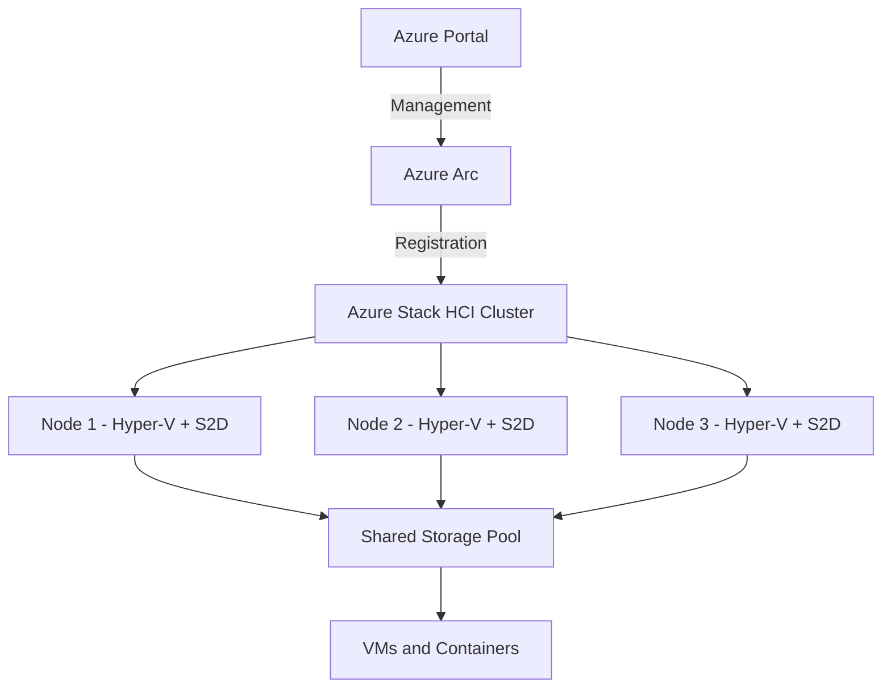

# How to Deploy Azure Stack HCI Cluster and Register It with Azure

Author: [nawazdhandala](https://www.github.com/nawazdhandala)

Tags: Azure, Azure Stack HCI, Hybrid Cloud, Cluster, Infrastructure, On-Premises, Windows Server

Description: A complete guide to deploying an Azure Stack HCI cluster on your own hardware and registering it with Azure for hybrid cloud management.

---

Azure Stack HCI is Microsoft's hyperconverged infrastructure operating system. It runs on your own hardware in your own data center but connects to Azure for management, billing, updates, and hybrid services. Think of it as bringing Azure capabilities to hardware you control, which is useful when workloads need to stay on-premises for latency, data sovereignty, or regulatory reasons.

This guide covers deploying a two-node or multi-node Azure Stack HCI cluster and registering it with Azure to unlock hybrid capabilities.

## What Azure Stack HCI Provides

Azure Stack HCI combines:

- **Hyper-V** for virtualization.
- **Storage Spaces Direct (S2D)** for software-defined storage.
- **Software-defined networking** with SDN or traditional VLAN networking.
- **Azure Arc integration** for cloud-based management, monitoring, and services.

After registration, you can manage the cluster through the Azure portal, deploy Azure services like AKS and Azure Arc-enabled SQL Server, and use Azure Backup and Azure Site Recovery.



## Prerequisites

### Hardware Requirements

- At least 2 physical servers (2-16 nodes supported per cluster).
- Each server needs:
  - 64-bit processor with Second Level Address Translation (SLAT).
  - Minimum 32 GB RAM (64 GB+ recommended).
  - At least 2 NVMe or SSD drives for the storage pool.
  - At least 2 network adapters (10 GbE or higher for production).
- Network switches supporting VLAN tagging and optionally RDMA.

### Software and Access Requirements

- Azure Stack HCI OS ISO (downloadable from the Azure portal).
- An Azure subscription.
- Azure AD Global Administrator or Contributor role.
- Internet connectivity from the cluster nodes to Azure endpoints.

## Step 1: Install the Azure Stack HCI OS

Download the Azure Stack HCI OS ISO from the Azure portal under Azure Stack HCI > Get started.

Install the OS on each node:

1. Boot from the ISO.
2. Select the installation drive (preferably a separate boot drive, not the drives intended for Storage Spaces Direct).
3. Complete the installation - the OS boots to a command prompt (Server Core, no GUI).
4. Set the administrator password.
5. Configure basic networking using `sconfig`:
   - Set a static IP address on the management NIC.
   - Configure DNS servers.
   - Set the hostname.
   - Join the Active Directory domain.

Repeat this process for every node in the cluster.

```powershell
# On each node after OS installation, configure networking via PowerShell
# Set a static IP on the management adapter
New-NetIPAddress -InterfaceAlias "Management" -IPAddress 10.0.0.11 -PrefixLength 24 -DefaultGateway 10.0.0.1

# Set DNS servers
Set-DnsClientServerAddress -InterfaceAlias "Management" -ServerAddresses 10.0.0.53, 10.0.0.54

# Rename the computer
Rename-Computer -NewName "HCI-Node01" -Restart

# After restart, join the domain
Add-Computer -DomainName "corp.example.com" -Restart
```

## Step 2: Prepare Networking for the Cluster

Each node needs network adapters configured for different traffic types. A common setup uses two physical NICs in a SET (Switch Embedded Teaming) team.

```powershell
# Run on each node: Create a SET team with both 25GbE adapters
New-VMSwitch -Name "ConvergedSwitch" `
  -NetAdapterName "NIC1", "NIC2" `
  -EnableEmbeddedTeaming $true `
  -AllowManagementOS $true

# Create virtual NICs for different traffic types
Add-VMNetworkAdapter -ManagementOS -Name "Management" -SwitchName "ConvergedSwitch"
Add-VMNetworkAdapter -ManagementOS -Name "Storage1" -SwitchName "ConvergedSwitch"
Add-VMNetworkAdapter -ManagementOS -Name "Storage2" -SwitchName "ConvergedSwitch"

# Assign VLANs to separate traffic
Set-VMNetworkAdapterVlan -ManagementOS -VMNetworkAdapterName "Management" -Access -VlanId 10
Set-VMNetworkAdapterVlan -ManagementOS -VMNetworkAdapterName "Storage1" -Access -VlanId 20
Set-VMNetworkAdapterVlan -ManagementOS -VMNetworkAdapterName "Storage2" -Access -VlanId 21

# Configure storage NICs with dedicated subnets
New-NetIPAddress -InterfaceAlias "vEthernet (Storage1)" -IPAddress 10.10.20.11 -PrefixLength 24
New-NetIPAddress -InterfaceAlias "vEthernet (Storage2)" -IPAddress 10.10.21.11 -PrefixLength 24

# Enable RDMA on storage adapters for high-performance storage traffic
Enable-NetAdapterRDMA -Name "vEthernet (Storage1)", "vEthernet (Storage2)"
```

## Step 3: Validate and Create the Cluster

Run the cluster validation tests to check that hardware and networking are properly configured.

```powershell
# Install the failover clustering feature on all nodes
Install-WindowsFeature -Name Failover-Clustering -IncludeManagementTools

# Run cluster validation tests from one node
Test-Cluster -Node "HCI-Node01", "HCI-Node02" -Include "Storage Spaces Direct", "Inventory", "Network", "System Configuration"
```

Review the validation report. All tests should pass (warnings are acceptable, failures need to be resolved).

Create the cluster.

```powershell
# Create the failover cluster
New-Cluster -Name "HCI-Cluster" `
  -Node "HCI-Node01", "HCI-Node02" `
  -StaticAddress 10.0.0.15 `
  -NoStorage
```

The `-NoStorage` flag is important because you will configure Storage Spaces Direct separately.

## Step 4: Enable Storage Spaces Direct

Storage Spaces Direct pools the local drives from all nodes into a shared storage layer.

```powershell
# Enable Storage Spaces Direct on the cluster
Enable-ClusterStorageSpacesDirect -PoolFriendlyName "S2DPool"

# Check the storage pool status
Get-StoragePool -FriendlyName "S2DPool" | Format-List *

# View the physical disks and their allocation
Get-PhysicalDisk | Sort-Object DeviceId | Format-Table DeviceId, FriendlyName, MediaType, Size, HealthStatus
```

After enabling S2D, create a volume for VMs.

```powershell
# Create a mirrored volume for VM storage (two-way mirror for 2-node clusters)
New-Volume -FriendlyName "VMStorage" `
  -StoragePoolFriendlyName "S2DPool" `
  -FileSystem CSVFS_ReFS `
  -Size 2TB `
  -ResiliencySettingName Mirror

# For clusters with 4+ nodes, you can use parity for capacity efficiency
# New-Volume -FriendlyName "ArchiveStorage" -StoragePoolFriendlyName "S2DPool" -FileSystem CSVFS_ReFS -Size 4TB -ResiliencySettingName Parity
```

## Step 5: Register the Cluster with Azure

This is the step that turns your on-premises cluster into an Azure-connected resource.

```powershell
# Install the Azure Stack HCI registration module
Install-Module -Name Az.StackHCI -Force

# Connect to Azure (opens a browser for interactive login)
Connect-AzAccount

# Register the cluster with Azure
Register-AzStackHCI `
  -SubscriptionId "your-azure-subscription-id" `
  -ResourceGroupName "myResourceGroup" `
  -Region "eastus" `
  -ResourceName "HCI-Cluster"
```

The registration process:

1. Connects each cluster node to Azure Arc.
2. Enables Azure billing for Azure Stack HCI (billed per physical core per month).
3. Enables the Azure portal to manage the cluster.
4. Allows Azure services to be deployed on the cluster.

Verify the registration.

```powershell
# Check registration status
Get-AzStackHCI

# Expected output shows:
# ClusterStatus: Connected
# RegistrationStatus: Registered
```

You can also verify in the Azure portal. Navigate to Azure Stack HCI > your cluster. It should show as Connected with all nodes reporting.

## Step 6: Set Up Windows Admin Center

Windows Admin Center provides a web-based management interface for your cluster.

```powershell
# Install Windows Admin Center on a management server (not on the cluster nodes)
# Download from the Microsoft website and install

# After installation, connect to the cluster
# Open https://management-server:6516 in your browser
# Add the cluster by name: HCI-Cluster.corp.example.com
```

Windows Admin Center can also be accessed through the Azure portal for remote management of your on-premises cluster.

## Step 7: Configure Azure Arc Integration

With registration complete, enable additional Azure services.

```powershell
# Enable Azure Monitoring Agent on all cluster nodes
Install-Module -Name Az.ConnectedMachine -Force

# Install the Azure Monitor agent extension
az connectedmachine extension create \
  --machine-name "HCI-Node01" \
  --resource-group myResourceGroup \
  --name "AzureMonitorWindowsAgent" \
  --type "AzureMonitorWindowsAgent" \
  --publisher "Microsoft.Azure.Monitor" \
  --location "eastus"
```

Enable Azure Update Management for keeping the cluster nodes patched.

```bash
# Enable update management through Azure CLI
az stack-hci update run \
  --resource-group myResourceGroup \
  --cluster-name HCI-Cluster
```

## Maintaining the Cluster

**Updates**: Azure Stack HCI receives monthly quality updates and annual feature updates. Use Windows Admin Center or Azure Update Management to install them.

**Scaling**: Add nodes to the cluster by installing the OS, joining the domain, and adding to the cluster.

```powershell
# Add a new node to the existing cluster
Add-ClusterNode -Cluster "HCI-Cluster" -Name "HCI-Node03"

# After adding, repair the storage pool to include the new node's drives
Repair-ClusterStorageSpacesDirect
```

**Monitoring**: Use Azure Monitor to track cluster health, VM performance, and storage capacity from the Azure portal.

## Summary

Deploying Azure Stack HCI involves installing the OS on bare-metal servers, configuring networking and storage, creating a failover cluster, and registering it with Azure. The registration step is what transforms a standard Windows cluster into an Azure-connected hybrid resource. After registration, you manage the cluster through the Azure portal alongside your other cloud resources, while the workloads run on your own hardware in your own data center. The setup takes effort compared to a pure cloud deployment, but it gives you local performance with cloud management capabilities.
