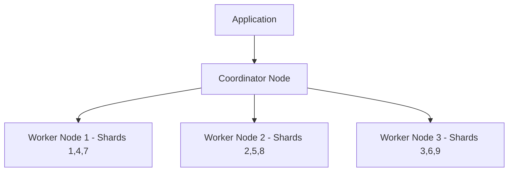

# How to Deploy Citus on Azure Database for PostgreSQL for Distributed Queries

Author: [nawazdhandala](https://www.github.com/nawazdhandala)

Tags: Azure, PostgreSQL, Citus, Distributed Database, Sharding, Scalability, Flexible Server

Description: Learn how to enable and use the Citus extension on Azure Database for PostgreSQL Flexible Server for horizontally scalable distributed queries.

---

When your PostgreSQL database grows beyond what a single server can handle, you have two choices: scale up (bigger server) or scale out (more servers). Scaling up has a ceiling - there is only so much RAM and CPU you can put in one machine. Scaling out with Citus lets you distribute your data across multiple PostgreSQL nodes while keeping the familiar SQL interface. Azure Database for PostgreSQL Flexible Server supports Citus as an extension, giving you horizontal scalability without leaving the managed service.

This post covers how to enable Citus, distribute your tables, and write queries that take advantage of the distributed architecture.

## What Is Citus?

Citus is a PostgreSQL extension that transforms a single-node database into a distributed database. It works by:

- **Sharding tables** across multiple worker nodes based on a distribution column.
- **Routing queries** to the appropriate nodes based on the distribution column.
- **Parallelizing queries** across nodes for aggregations and joins.



The coordinator node receives queries, plans the distributed execution, and combines results from worker nodes. Your application connects only to the coordinator - it looks like a regular PostgreSQL database from the outside.

## Enabling Citus on Flexible Server

Citus is available as an extension on Azure Database for PostgreSQL Flexible Server. You do not need the old Hyperscale (Citus) deployment option anymore.

First, allowlist the extension:

```bash
# Add citus to the allowed extensions
az postgres flexible-server parameter set \
  --resource-group myResourceGroup \
  --server-name my-pg-server \
  --name azure.extensions \
  --value "citus"

# Add citus to shared_preload_libraries
az postgres flexible-server parameter set \
  --resource-group myResourceGroup \
  --server-name my-pg-server \
  --name shared_preload_libraries \
  --value "citus"

# Restart the server to load the library
az postgres flexible-server restart \
  --resource-group myResourceGroup \
  --name my-pg-server
```

Then create the extension in your database:

```sql
-- Enable the Citus extension
CREATE EXTENSION IF NOT EXISTS citus;

-- Verify it is installed
SELECT * FROM citus_version();
```

## Setting Up Worker Nodes

For a true distributed setup, you need multiple Flexible Server instances acting as worker nodes. Create additional servers:

```bash
# Create worker nodes
az postgres flexible-server create \
  --resource-group myResourceGroup \
  --name my-pg-worker-1 \
  --location eastus \
  --admin-user pgadmin \
  --admin-password 'StrongPassword123!' \
  --sku-name Standard_D4ds_v4 \
  --tier GeneralPurpose \
  --version 16

az postgres flexible-server create \
  --resource-group myResourceGroup \
  --name my-pg-worker-2 \
  --location eastus \
  --admin-user pgadmin \
  --admin-password 'StrongPassword123!' \
  --sku-name Standard_D4ds_v4 \
  --tier GeneralPurpose \
  --version 16
```

Enable Citus on each worker and then register them with the coordinator:

```sql
-- On the coordinator, add worker nodes
SELECT citus_add_node('my-pg-worker-1.postgres.database.azure.com', 5432);
SELECT citus_add_node('my-pg-worker-2.postgres.database.azure.com', 5432);

-- Verify the cluster topology
SELECT * FROM citus_get_active_worker_nodes();
```

## Distributing Tables

The key decision in Citus is choosing the distribution column. This column determines how data is sharded across nodes. Pick a column that:

- Is present in most queries (especially in WHERE clauses and JOIN conditions).
- Has high cardinality (many distinct values).
- Is the natural tenant or partition key for your data.

### Example: Multi-Tenant SaaS Application

For a SaaS application, the tenant ID is the natural distribution column:

```sql
-- Create tables (same DDL as regular PostgreSQL)
CREATE TABLE companies (
    id BIGSERIAL PRIMARY KEY,
    name VARCHAR(255),
    plan VARCHAR(50),
    created_at TIMESTAMP DEFAULT NOW()
);

CREATE TABLE users (
    id BIGSERIAL,
    company_id BIGINT REFERENCES companies(id),
    email VARCHAR(255),
    name VARCHAR(255),
    created_at TIMESTAMP DEFAULT NOW(),
    PRIMARY KEY (company_id, id)
);

CREATE TABLE events (
    id BIGSERIAL,
    company_id BIGINT,
    user_id BIGINT,
    event_type VARCHAR(50),
    payload JSONB,
    created_at TIMESTAMP DEFAULT NOW(),
    PRIMARY KEY (company_id, id)
);

-- Distribute tables by company_id
-- Citus will shard data so all data for one company lives on the same node
SELECT create_distributed_table('companies', 'id');
SELECT create_distributed_table('users', 'company_id');
SELECT create_distributed_table('events', 'company_id');
```

When all related tables are distributed by the same column (company_id), Citus can perform joins locally on each node without shuffling data across the network. This is called co-location and it is critical for performance.

### Reference Tables

Some tables are small and need to be joined with distributed tables from any node. These should be reference tables, which are replicated to all nodes:

```sql
-- Create a reference table (replicated to all nodes)
CREATE TABLE plans (
    id SERIAL PRIMARY KEY,
    name VARCHAR(50),
    price DECIMAL(10, 2),
    features JSONB
);

-- Distribute as a reference table
SELECT create_reference_table('plans');
```

Reference tables are ideal for lookup tables, configuration tables, and any small table that needs to be available for joins on every node.

## Writing Distributed Queries

Most SQL works unchanged with Citus. The key is to include the distribution column in your queries whenever possible.

### Queries That Run on a Single Node

When your query filters by the distribution column, Citus routes it to a single node:

```sql
-- This query runs on just one node (fast and efficient)
SELECT u.name, u.email, COUNT(e.id) AS event_count
FROM users u
LEFT JOIN events e ON u.company_id = e.company_id AND u.id = e.user_id
WHERE u.company_id = 42
GROUP BY u.name, u.email;
```

### Queries That Run Across All Nodes

Aggregations that span all tenants run in parallel across all nodes:

```sql
-- This runs on all nodes in parallel and combines results
SELECT
    DATE_TRUNC('day', created_at) AS day,
    COUNT(*) AS total_events,
    COUNT(DISTINCT company_id) AS active_companies
FROM events
WHERE created_at > NOW() - INTERVAL '7 days'
GROUP BY day
ORDER BY day;
```

### Joins Between Co-Located Tables

Joins on the distribution column are efficient because data is co-located:

```sql
-- Efficient join since both tables are distributed by company_id
SELECT
    c.name AS company_name,
    COUNT(DISTINCT u.id) AS user_count,
    COUNT(e.id) AS event_count
FROM companies c
JOIN users u ON c.id = u.company_id
JOIN events e ON u.company_id = e.company_id AND u.id = e.user_id
WHERE e.created_at > NOW() - INTERVAL '30 days'
GROUP BY c.name
ORDER BY event_count DESC
LIMIT 20;
```

## Schema Changes on Distributed Tables

DDL operations on distributed tables are automatically propagated to all nodes:

```sql
-- Add a column to a distributed table (runs on all shards)
ALTER TABLE events ADD COLUMN session_id UUID;

-- Create an index (created on all shards)
CREATE INDEX idx_events_type ON events (company_id, event_type);

-- Add a new distributed table to the cluster
CREATE TABLE notifications (
    id BIGSERIAL,
    company_id BIGINT,
    user_id BIGINT,
    message TEXT,
    read BOOLEAN DEFAULT FALSE,
    created_at TIMESTAMP DEFAULT NOW(),
    PRIMARY KEY (company_id, id)
);
SELECT create_distributed_table('notifications', 'company_id');
```

## Rebalancing Shards

When you add new worker nodes, you need to rebalance shards to distribute data evenly:

```sql
-- Add a new worker node
SELECT citus_add_node('my-pg-worker-3.postgres.database.azure.com', 5432);

-- Rebalance shards across all nodes
SELECT citus_rebalance_start();

-- Monitor rebalance progress
SELECT * FROM citus_rebalance_status();
```

Rebalancing moves shard data between nodes. It runs in the background and does not require downtime, but it does generate I/O load.

## Monitoring the Distributed Cluster

### Check Shard Distribution

```sql
-- See how shards are distributed across nodes
SELECT
    nodename,
    count(*) AS shard_count,
    pg_size_pretty(sum(shard_size)) AS total_size
FROM citus_shards
GROUP BY nodename
ORDER BY nodename;
```

### Check Distributed Query Execution

```sql
-- See how a query would be distributed (without running it)
EXPLAIN (VERBOSE)
SELECT COUNT(*) FROM events WHERE company_id = 42;

-- Full execution plan with distributed details
EXPLAIN (ANALYZE, VERBOSE, BUFFERS)
SELECT event_type, COUNT(*)
FROM events
WHERE created_at > NOW() - INTERVAL '1 day'
GROUP BY event_type;
```

### Monitor Active Distributed Queries

```sql
-- View currently running distributed queries
SELECT * FROM citus_dist_stat_activity
WHERE state = 'active'
ORDER BY query_start;
```

## Performance Tips

1. **Always filter by the distribution column**: This routes queries to a single node instead of fanning out to all nodes.
2. **Co-locate related tables**: Distribute related tables by the same column so joins happen locally.
3. **Use reference tables for small lookup tables**: Avoids cross-node joins for dimension tables.
4. **Choose shard count wisely**: The default is 32 shards. For large clusters, increase to 64 or 128 for better distribution.
5. **Monitor shard sizes**: Uneven shards lead to hot spots. Rebalance when skew exceeds 20%.

## Limitations

- Cross-shard transactions have higher latency than single-shard transactions.
- Some PostgreSQL features have limitations in distributed mode (e.g., certain window function patterns).
- Foreign keys across distributed tables must include the distribution column.
- Not all extensions are compatible with distributed tables.

## Summary

Citus on Azure Database for PostgreSQL Flexible Server gives you horizontal scalability with a familiar PostgreSQL interface. The key to success is choosing the right distribution column, co-locating related tables, and writing queries that include the distribution column. For multi-tenant SaaS applications, Citus is a natural fit since tenant_id serves as both the business partition key and the database distribution key. Start with a single coordinator and add worker nodes as your data grows.
