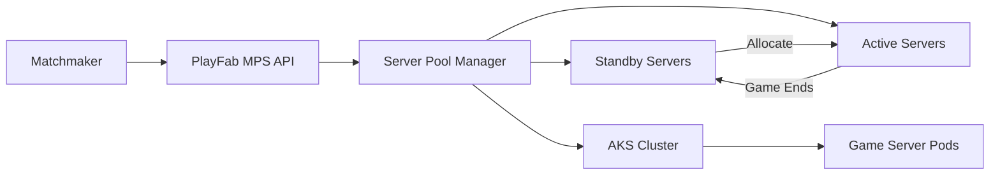

# How to Deploy Dedicated Game Servers on Azure Kubernetes Service with PlayFab Multiplayer

Author: [nawazdhandala](https://www.github.com/nawazdhandala)

Tags: Azure Kubernetes Service, PlayFab, Game Servers, Multiplayer Gaming, AKS, Dedicated Servers, Game Development

Description: Deploy dedicated game servers on Azure Kubernetes Service using PlayFab Multiplayer Servers for scalable multiplayer gaming experiences.

---

Multiplayer games need dedicated servers. Peer-to-peer networking works for some genres, but for competitive games where fairness matters, you need an authoritative server running the game simulation. The server validates all player actions, prevents cheating, and ensures everyone sees the same game state.

The challenge is that multiplayer game server demand is wildly unpredictable. A popular streamer plays your game and suddenly you need 500 servers instead of 50. An hour later, they stop and demand drops back. PlayFab Multiplayer Servers, backed by Azure infrastructure, handles this elastic scaling. In this guide, I will show you how to containerize your game server, deploy it through PlayFab, and manage the fleet on AKS.

## How PlayFab Multiplayer Servers Work

PlayFab Multiplayer Servers (MPS) manages a pool of game server instances. When a matchmaker needs a server for a new game session, it requests one from PlayFab. PlayFab allocates a server from the standby pool and returns the connection details to the clients. When the game ends, the server goes back to the pool.



PlayFab manages the lifecycle: spinning up containers, monitoring health, recycling crashed servers, and scaling the pool based on demand. You just provide the container image.

## Step 1 - Containerize Your Game Server

Your game server needs to run as a Linux container. PlayFab MPS uses the Game Server SDK (GSDK) to communicate lifecycle events between the platform and your server.

Here is a Dockerfile for a typical game server.

```dockerfile
# Use a base image appropriate for your game engine
FROM ubuntu:22.04

# Install dependencies your game server needs
RUN apt-get update && apt-get install -y \
    libssl3 \
    libcurl4 \
    libc6 \
    && rm -rf /var/lib/apt/lists/*

# Create the game server directory
WORKDIR /gameserver

# Copy the game server binary and assets
COPY build/linux-server/ ./
COPY assets/ ./assets/

# Copy the PlayFab GSDK configuration
COPY gsdk/PlayFabMultiplayerAgent.json /gameserver/

# The GSDK expects the server to listen on specific ports
# PlayFab will configure these via environment variables
EXPOSE 7777/udp
EXPOSE 7778/tcp

# Make the server executable
RUN chmod +x ./GameServer

# Start the game server
ENTRYPOINT ["./GameServer", "-batchmode", "-nographics"]
```

## Step 2 - Integrate the PlayFab GSDK

The Game Server SDK handles communication between your server and the PlayFab platform. It reports health, signals when the server is ready, and handles shutdown requests.

Here is the GSDK integration for a C# game server (Unreal and custom engines have C++ equivalents).

```csharp
using Microsoft.Playfab.Gaming.GSDK.CSharp;
using System;
using System.Collections.Generic;

public class GameServerManager
{
    private bool isShuttingDown = false;

    public void Initialize()
    {
        // Register GSDK callbacks
        GameserverSDK.RegisterShutdownCallback(OnShutdown);
        GameserverSDK.RegisterHealthCallback(OnHealthCheck);
        GameserverSDK.RegisterMaintenanceCallback(OnMaintenance);

        // Get the server configuration from PlayFab
        IDictionary<string, string> config = GameserverSDK.getConfigSettings();

        // Read assigned ports
        GameServerConnectionInfo connectionInfo = GameserverSDK.GetGameServerConnectionInfo();
        foreach (var port in connectionInfo.GamePortsConfiguration)
        {
            Console.WriteLine($"Port {port.Name}: {port.ServerListeningPort} (external: {port.ClientConnectionPort})");
        }

        // Start your game server logic here
        StartGameServer(connectionInfo);

        // Signal to PlayFab that the server is ready to accept players
        GameserverSDK.ReadyForPlayers();
        Console.WriteLine("Server is ready for players");
    }

    private bool OnHealthCheck()
    {
        // Return true if the server is healthy and can accept players
        // Return false if the server needs to be recycled
        bool isHealthy = CheckServerHealth();
        return isHealthy;
    }

    private void OnShutdown()
    {
        // PlayFab is telling us to shut down gracefully
        Console.WriteLine("Shutdown requested by PlayFab");
        isShuttingDown = true;

        // Save any game state, disconnect players gracefully
        SaveGameState();
        DisconnectAllPlayers("Server shutting down for maintenance");

        // Clean up resources
        CleanupAndExit();
    }

    private void OnMaintenance(DateTimeOffset maintenanceTime)
    {
        // PlayFab is warning about upcoming maintenance
        Console.WriteLine($"Maintenance scheduled at: {maintenanceTime}");

        // Notify connected players
        BroadcastToPlayers($"Server maintenance in {(maintenanceTime - DateTimeOffset.UtcNow).TotalMinutes:F0} minutes");
    }

    private void StartGameServer(GameServerConnectionInfo connInfo)
    {
        // Initialize your network listener on the assigned ports
        Console.WriteLine("Starting game server networking...");
    }

    private bool CheckServerHealth() => !isShuttingDown;
    private void SaveGameState() { /* Save to persistent storage */ }
    private void DisconnectAllPlayers(string reason) { /* Graceful disconnect */ }
    private void BroadcastToPlayers(string message) { /* Send to all connected */ }
    private void CleanupAndExit() { Environment.Exit(0); }
}
```

The key lifecycle events are:
- `ReadyForPlayers()` - call this once your server is initialized and ready to accept connections
- Health callback - PlayFab polls this regularly; return false to mark the server unhealthy
- Shutdown callback - called when PlayFab needs to reclaim the server

## Step 3 - Upload and Configure the Build in PlayFab

Push your container image to a registry and create a build in PlayFab.

```bash
# Push the game server image to Azure Container Registry
az acr login --name mygameregistry
docker build -t mygameregistry.azurecr.io/game-server:v1.0 .
docker push mygameregistry.azurecr.io/game-server:v1.0
```

Then create the build through the PlayFab API or portal. Using the PlayFab Admin API in Python:

```python
import requests
import json

PLAYFAB_TITLE_ID = "YOUR_TITLE_ID"
PLAYFAB_SECRET_KEY = "YOUR_SECRET_KEY"

def create_build():
    """Create a new game server build in PlayFab MPS."""
    url = f"https://{PLAYFAB_TITLE_ID}.playfabapi.com/MultiplayerServer/CreateBuildWithCustomContainer"

    headers = {
        "Content-Type": "application/json",
        "X-SecretKey": PLAYFAB_SECRET_KEY
    }

    payload = {
        "BuildName": "GameServer-v1.0",
        "ContainerFlavor": "CustomLinux",
        "ContainerImageReference": {
            "ImageName": "mygameregistry.azurecr.io/game-server",
            "Tag": "v1.0"
        },
        "ContainerRegistryCredentials": {
            "Url": "mygameregistry.azurecr.io",
            "Username": "mygameregistry",
            "Password": "<acr-password>"
        },
        "MultiplayerServerCountPerVm": 4,  # Run 4 server instances per VM
        "Ports": [
            {
                "Name": "game_port",
                "Num": 7777,
                "Protocol": "UDP"
            },
            {
                "Name": "query_port",
                "Num": 7778,
                "Protocol": "TCP"
            }
        ],
        "RegionConfigurations": [
            {
                "Region": "EastUs",
                "MaxServers": 100,
                "StandbyServers": 10,
                "DynamicStandbySettings": {
                    "IsEnabled": True,
                    "RampDownSeconds": 600
                }
            },
            {
                "Region": "WestEurope",
                "MaxServers": 80,
                "StandbyServers": 8,
                "DynamicStandbySettings": {
                    "IsEnabled": True,
                    "RampDownSeconds": 600
                }
            }
        ],
        "VmSize": "Standard_D2as_v4"
    }

    response = requests.post(url, headers=headers, json=payload)
    result = response.json()
    print(f"Build created: {result['data']['BuildId']}")
    return result

create_build()
```

Key configuration decisions here:

- `MultiplayerServerCountPerVm`: How many game server instances run on each VM. More instances means better resource utilization but less resources per server.
- `StandbyServers`: How many idle servers sit ready for instant allocation. Too few and players wait during spikes. Too many and you waste money.
- `DynamicStandbySettings`: Automatically adjusts the standby pool based on allocation patterns. Enable this to handle demand spikes without over-provisioning.

## Step 4 - Request a Server for a Game Session

When your matchmaker finds a group of players ready to play, request a server from PlayFab.

```python
def request_game_server(session_id: str, region: str, player_ids: list) -> dict:
    """Request an allocated game server for a matched group of players."""
    url = f"https://{PLAYFAB_TITLE_ID}.playfabapi.com/MultiplayerServer/RequestMultiplayerServer"

    headers = {
        "Content-Type": "application/json",
        "X-SecretKey": PLAYFAB_SECRET_KEY
    }

    payload = {
        "BuildId": "<your-build-id>",
        "SessionId": session_id,
        "PreferredRegions": [region],
        "SessionCookie": json.dumps({
            "gameMode": "ranked",
            "mapName": "arena_01",
            "maxPlayers": 10
        }),
        "InitialPlayers": player_ids
    }

    response = requests.post(url, headers=headers, json=payload)
    result = response.json()

    if "data" in result:
        server_info = result["data"]
        return {
            "ipAddress": server_info["IPV4Address"],
            "ports": server_info["Ports"],
            "region": server_info["Region"],
            "serverId": server_info["ServerId"]
        }
    else:
        print(f"Server request failed: {result}")
        return None
```

The `SessionCookie` is a string that gets passed to your game server. Use it to configure the game mode, map, player count, or any other per-session settings.

## Step 5 - Monitor Your Server Fleet

PlayFab provides metrics on server utilization, allocation times, and regional distribution. Monitor these to optimize your fleet configuration.

Key metrics to track:
- Standby server count vs allocation rate
- Average allocation time (should be under 2 seconds)
- Server crash rate
- Regional utilization imbalance

If allocation times spike above 5 seconds, your standby pool is too small. If most standby servers are idle, you are over-provisioned and wasting money.

```python
def get_fleet_metrics():
    """Retrieve server fleet utilization metrics from PlayFab."""
    url = f"https://{PLAYFAB_TITLE_ID}.playfabapi.com/MultiplayerServer/ListBuildSummariesV2"

    headers = {
        "Content-Type": "application/json",
        "X-SecretKey": PLAYFAB_SECRET_KEY
    }

    response = requests.post(url, headers=headers, json={})
    builds = response.json()["data"]["BuildSummaries"]

    for build in builds:
        print(f"Build: {build['BuildName']}")
        for region in build.get("RegionConfigurations", []):
            print(f"  {region['Region']}: "
                  f"Active={region.get('CurrentServerStats', {}).get('Active', 0)}, "
                  f"Standby={region.get('CurrentServerStats', {}).get('StandBy', 0)}")

get_fleet_metrics()
```

## Wrapping Up

PlayFab Multiplayer Servers takes the infrastructure management out of running game servers. You package your server as a container, configure the fleet size and regions, and PlayFab handles allocation, scaling, and lifecycle management. The GSDK integration is straightforward - a few callbacks to handle health checks and shutdown signals. Combined with AKS as the underlying compute, you get elastic scaling that handles anything from a quiet Tuesday night to a viral launch day. Focus on making a great multiplayer experience and let the platform handle the servers.
