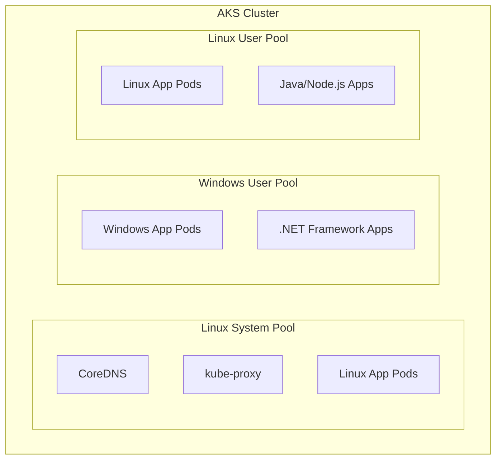

# How to Deploy Windows Containers Alongside Linux Containers on AKS with Mixed Node Pools

Author: [nawazdhandala](https://www.github.com/nawazdhandala)

Tags: AKS, Windows Containers, Linux Containers, Mixed Node Pools, Kubernetes, Azure, Container Orchestration

Description: Guide to running Windows and Linux containers side by side on AKS using mixed node pools with proper scheduling and node selectors.

---

Not every application runs on Linux. Legacy .NET Framework applications, Windows-specific services, and applications dependent on Windows APIs need Windows containers. AKS supports running Windows and Linux containers in the same cluster through mixed node pools, letting you consolidate workloads that would otherwise need separate infrastructure.

## How Mixed Node Pools Work

An AKS cluster always requires at least one Linux node pool (the system node pool) because Kubernetes control plane components and system pods like CoreDNS run on Linux. You add Windows node pools as user node pools for running Windows containers. The scheduler uses node selectors and tolerations to place pods on the right node type.



## Prerequisites

- Azure CLI 2.40+
- An existing AKS cluster or the permissions to create one
- Windows container images in your container registry
- Basic understanding of node selectors and tolerations

## Step 1: Create an AKS Cluster with a Linux System Pool

If you do not already have a cluster, create one with a Linux system node pool.

```bash
# Create the AKS cluster with a Linux system node pool
# The system pool runs Kubernetes system components
az aks create \
  --resource-group myResourceGroup \
  --name myAKSCluster \
  --node-count 2 \
  --node-vm-size Standard_DS3_v2 \
  --network-plugin azure \
  --generate-ssh-keys
```

## Step 2: Add a Windows Node Pool

Add a Windows Server node pool to the cluster. Windows node pools must be user node pools - they cannot be system pools.

```bash
# Add a Windows node pool
# --os-type Windows specifies this pool runs Windows Server nodes
# --node-vm-size should be at least Standard_D4s_v3 for Windows
az aks nodepool add \
  --resource-group myResourceGroup \
  --cluster-name myAKSCluster \
  --name winpool \
  --os-type Windows \
  --os-sku Windows2022 \
  --node-count 2 \
  --node-vm-size Standard_D4s_v3
```

Windows node pool names are limited to 6 characters. The `--os-sku` option supports `Windows2019` and `Windows2022`. Windows Server 2022 is recommended for new deployments as it has better container support and security features.

Verify the node pools.

```bash
# List all node pools and their OS types
az aks nodepool list \
  --resource-group myResourceGroup \
  --cluster-name myAKSCluster \
  --query "[].{name:name, osType:osType, vmSize:vmSize, count:count}" \
  --output table
```

## Step 3: Verify Windows Nodes Are Ready

Check that the Windows nodes joined the cluster successfully.

```bash
# List nodes with their OS information
kubectl get nodes -o wide

# Check that Windows nodes have the correct labels
kubectl get nodes -l kubernetes.io/os=windows
```

Windows nodes get the label `kubernetes.io/os=windows` automatically, and Linux nodes get `kubernetes.io/os=linux`. These labels are essential for scheduling pods to the correct node type.

## Step 4: Deploy a Windows Container

Windows containers must be scheduled on Windows nodes. Use a `nodeSelector` to ensure correct placement.

```yaml
# windows-app.yaml
# .NET Framework application running in a Windows container
apiVersion: apps/v1
kind: Deployment
metadata:
  name: dotnet-app
  namespace: default
spec:
  replicas: 2
  selector:
    matchLabels:
      app: dotnet-app
  template:
    metadata:
      labels:
        app: dotnet-app
    spec:
      # Schedule this pod on Windows nodes only
      nodeSelector:
        kubernetes.io/os: windows
      containers:
      - name: dotnet-app
        image: mcr.microsoft.com/dotnet/samples:aspnetapp
        ports:
        - containerPort: 8080
        resources:
          requests:
            cpu: 500m
            memory: 512Mi
          limits:
            cpu: 1000m
            memory: 1Gi
---
apiVersion: v1
kind: Service
metadata:
  name: dotnet-app
spec:
  type: LoadBalancer
  ports:
  - port: 80
    targetPort: 8080
  selector:
    app: dotnet-app
```

Apply and check the deployment.

```bash
kubectl apply -f windows-app.yaml

# Verify pods are scheduled on Windows nodes
kubectl get pods -o wide -l app=dotnet-app
```

The NODE column should show the Windows node names.

## Step 5: Deploy a Linux Container Alongside

Deploy a Linux application with its own node selector to make sure it stays on Linux nodes.

```yaml
# linux-app.yaml
# Node.js application running on Linux nodes
apiVersion: apps/v1
kind: Deployment
metadata:
  name: node-api
  namespace: default
spec:
  replicas: 3
  selector:
    matchLabels:
      app: node-api
  template:
    metadata:
      labels:
        app: node-api
    spec:
      # Schedule this pod on Linux nodes only
      nodeSelector:
        kubernetes.io/os: linux
      containers:
      - name: node-api
        image: myacr.azurecr.io/node-api:1.0.0
        ports:
        - containerPort: 3000
        resources:
          requests:
            cpu: 100m
            memory: 128Mi
          limits:
            cpu: 500m
            memory: 256Mi
---
apiVersion: v1
kind: Service
metadata:
  name: node-api
spec:
  type: ClusterIP
  ports:
  - port: 80
    targetPort: 3000
  selector:
    app: node-api
```

## Step 6: Use Taints and Tolerations for Stronger Isolation

Node selectors are opt-in: a pod without a node selector can still be scheduled on a Windows node if resources are available. Taints prevent this by marking Windows nodes as off-limits unless a pod explicitly tolerates the taint.

```bash
# Taint the Windows node pool so only pods with matching tolerations can be scheduled
az aks nodepool update \
  --resource-group myResourceGroup \
  --cluster-name myAKSCluster \
  --name winpool \
  --node-taints "os=windows:NoSchedule"
```

Now update the Windows deployment to include the toleration.

```yaml
# Updated Windows deployment with toleration
spec:
  template:
    spec:
      nodeSelector:
        kubernetes.io/os: windows
      # Tolerate the taint on Windows nodes
      tolerations:
      - key: "os"
        operator: "Equal"
        value: "windows"
        effect: "NoSchedule"
      containers:
      - name: dotnet-app
        image: mcr.microsoft.com/dotnet/samples:aspnetapp
```

With this combination, Windows pods are directed to Windows nodes (nodeSelector) and non-Windows pods are prevented from landing on Windows nodes (taint).

## Step 7: Communication Between Windows and Linux Pods

Pods on different node types can communicate with each other through Kubernetes services. The networking layer (Azure CNI) handles cross-node routing transparently.

```yaml
# The Windows app can call the Linux API via its service name
# From inside the Windows container:
# Invoke-WebRequest http://node-api.default.svc.cluster.local/api/data

# The Linux app can call the Windows app:
# curl http://dotnet-app.default.svc.cluster.local/api/data
```

There are no special network configurations needed. Standard Kubernetes service discovery works across node pool types.

## Step 8: Configure an Ingress for Both Applications

Use a single ingress controller to route traffic to both Windows and Linux services. The ingress controller itself runs on Linux nodes.

```yaml
# mixed-ingress.yaml
# Single ingress routing to both Windows and Linux backends
apiVersion: networking.k8s.io/v1
kind: Ingress
metadata:
  name: mixed-ingress
  namespace: default
  annotations:
    nginx.ingress.kubernetes.io/ssl-redirect: "true"
spec:
  ingressClassName: nginx
  rules:
  - host: myapp.example.com
    http:
      paths:
      # Route /api to the Linux Node.js service
      - path: /api
        pathType: Prefix
        backend:
          service:
            name: node-api
            port:
              number: 80
      # Route /legacy to the Windows .NET service
      - path: /legacy
        pathType: Prefix
        backend:
          service:
            name: dotnet-app
            port:
              number: 80
```

## Windows Container Considerations

### Image Size

Windows container images are significantly larger than Linux images. A base Windows Server Core image is about 3-5 GB compared to 50-100 MB for an Alpine Linux image. This affects:

- **Pull times**: First pulls take several minutes on fresh nodes.
- **Registry storage**: Budget for higher ACR storage costs.
- **Node disk**: Use nodes with sufficient OS disk size (128 GB minimum recommended).

### Startup Time

Windows containers take longer to start than Linux containers. Account for this in your:

- **Readiness probe initial delay**: Set it to at least 30-60 seconds.
- **HPA scaling**: Expect slower scale-up for Windows workloads.
- **Deployment timeouts**: Use longer timeouts for Helm deploys.

### Resource Requests

Windows nodes have higher base resource consumption for the OS. A Windows node with 4 vCPUs and 16 GB RAM has roughly 2.5 vCPUs and 10 GB available for pods after the OS and Kubernetes overhead.

```bash
# Check allocatable resources on Windows nodes
kubectl describe node <windows-node-name> | grep -A5 "Allocatable"
```

### Supported Features

Not all Kubernetes features work with Windows containers:

- HostNetwork is not supported.
- Privileged containers are not available.
- Some volume types (hostPath sub-paths) have limitations.
- Linux capabilities (securityContext.capabilities) do not apply.

## Scaling Windows Node Pools

Configure autoscaling for the Windows node pool independently.

```bash
# Enable autoscaling on the Windows node pool
az aks nodepool update \
  --resource-group myResourceGroup \
  --cluster-name myAKSCluster \
  --name winpool \
  --enable-cluster-autoscaler \
  --min-count 1 \
  --max-count 5
```

Keep in mind that Windows nodes take longer to provision (5-10 minutes) compared to Linux nodes (2-3 minutes). Factor this into your scale-up response time expectations.

## Troubleshooting

**Pod stuck in ContainerCreating**: Windows image pulls are slow. Check the node events with `kubectl describe pod` to see if the image is being pulled. Give it 5-10 minutes for the first pull.

**Pod scheduled on wrong node type**: Verify the nodeSelector is set correctly. Check for typos in the `kubernetes.io/os` label value.

**Networking issues between Windows and Linux pods**: Ensure you are using Azure CNI (not kubenet). Windows containers require Azure CNI for full networking functionality.

**Windows node not joining the cluster**: Check that the node VM size supports Windows containers. Not all VM sizes are compatible. Standard_D4s_v3 or larger is recommended.

## Summary

Mixed node pools on AKS let you run Windows and Linux containers in a single cluster, simplifying operations and reducing infrastructure overhead. The key is proper scheduling with node selectors and taints to ensure pods land on compatible nodes. While Windows containers have larger images, slower startup, and some feature limitations compared to Linux, they are the right choice for .NET Framework applications and other Windows-dependent workloads that need to coexist with your Linux services.
