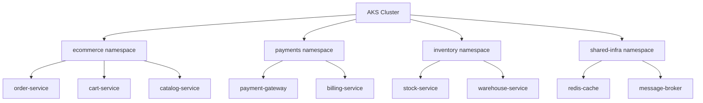

# How to Design a Microservices Architecture on Azure Kubernetes Service (AKS)

Author: [nawazdhandala](https://www.github.com/nawazdhandala)

Tags: Azure, Kubernetes, AKS, Microservices, Architecture, Containers, Cloud Native

Description: A practical guide to designing and deploying a microservices architecture on Azure Kubernetes Service with real-world patterns and configurations.

---

Building a microservices architecture on Azure Kubernetes Service (AKS) is a popular choice for teams that need scalability, independent deployments, and technology flexibility. But designing it properly requires thinking carefully about service boundaries, communication patterns, data management, and operational concerns from day one.

In this post, I will walk through the key design decisions and configurations you need to get right when building microservices on AKS.

## Cluster Design and Node Pools

Start with your cluster topology. AKS supports multiple node pools, which let you run different types of workloads on appropriate hardware.

```bash
# Create an AKS cluster with a system node pool
# System pool runs Kubernetes system components
az aks create \
  --resource-group myResourceGroup \
  --name myAKSCluster \
  --node-count 3 \
  --node-vm-size Standard_D4s_v3 \
  --nodepool-name systempool \
  --network-plugin azure \
  --network-policy calico \
  --enable-managed-identity \
  --generate-ssh-keys

# Add a user node pool for application workloads
# This separates your apps from system components
az aks nodepool add \
  --resource-group myResourceGroup \
  --cluster-name myAKSCluster \
  --name apppool \
  --node-count 5 \
  --node-vm-size Standard_D8s_v3 \
  --mode User \
  --labels workload=app

# Add a spot node pool for batch or non-critical workloads
# Spot instances cost up to 90% less but can be evicted
az aks nodepool add \
  --resource-group myResourceGroup \
  --cluster-name myAKSCluster \
  --name spotpool \
  --node-count 3 \
  --node-vm-size Standard_D4s_v3 \
  --mode User \
  --priority Spot \
  --spot-max-price -1 \
  --eviction-policy Delete \
  --labels workload=batch
```

Use node selectors or taints and tolerations to schedule pods on the appropriate node pool:

```yaml
# Pod spec that targets the app node pool
apiVersion: apps/v1
kind: Deployment
metadata:
  name: order-service
  namespace: ecommerce
spec:
  replicas: 3
  selector:
    matchLabels:
      app: order-service
  template:
    metadata:
      labels:
        app: order-service
    spec:
      # Schedule on the app node pool
      nodeSelector:
        workload: app
      containers:
        - name: order-service
          image: myacr.azurecr.io/order-service:v1.2.3
          ports:
            - containerPort: 8080
          resources:
            # Always set resource requests and limits
            requests:
              cpu: "250m"
              memory: "256Mi"
            limits:
              cpu: "1000m"
              memory: "512Mi"
```

## Namespace Organization

Namespaces provide logical isolation between services. I recommend organizing by domain rather than by team:



Apply network policies to control traffic between namespaces:

```yaml
# Network policy that allows only specific ingress traffic
# Order service can only be accessed by the cart service and the ingress controller
apiVersion: networking.k8s.io/v1
kind: NetworkPolicy
metadata:
  name: order-service-policy
  namespace: ecommerce
spec:
  podSelector:
    matchLabels:
      app: order-service
  policyTypes:
    - Ingress
  ingress:
    - from:
        - podSelector:
            matchLabels:
              app: cart-service
        - namespaceSelector:
            matchLabels:
              name: ingress
      ports:
        - protocol: TCP
          port: 8080
```

## Service-to-Service Communication

Microservices need to communicate with each other. You have two main approaches.

### Synchronous Communication (HTTP/gRPC)

For request-response style interactions where the caller needs an immediate answer, use HTTP or gRPC. Kubernetes Services provide built-in service discovery:

```yaml
# Kubernetes Service for the order-service
# Other services can reach it at http://order-service.ecommerce.svc.cluster.local
apiVersion: v1
kind: Service
metadata:
  name: order-service
  namespace: ecommerce
spec:
  selector:
    app: order-service
  ports:
    - port: 80
      targetPort: 8080
  type: ClusterIP
```

For gRPC services, which are more efficient for internal communication, configure the service accordingly:

```yaml
# gRPC service configuration
apiVersion: v1
kind: Service
metadata:
  name: catalog-service
  namespace: ecommerce
  annotations:
    # Enable HTTP/2 for gRPC
    service.beta.kubernetes.io/azure-load-balancer-health-probe-protocol: "TCP"
spec:
  selector:
    app: catalog-service
  ports:
    - port: 50051
      targetPort: 50051
      protocol: TCP
      name: grpc
  type: ClusterIP
```

### Asynchronous Communication (Message Queues)

For operations that do not need immediate responses, use Azure Service Bus or Azure Event Hubs for asynchronous messaging:

```csharp
// Order service publishes an event when an order is placed
// Other services subscribe to this event independently
public class OrderService
{
    private readonly ServiceBusSender _sender;

    public async Task PlaceOrder(Order order)
    {
        // Save to database
        await _orderRepository.SaveAsync(order);

        // Publish event for other services to consume
        var orderEvent = new OrderPlacedEvent
        {
            OrderId = order.Id,
            CustomerId = order.CustomerId,
            Items = order.Items,
            Timestamp = DateTime.UtcNow
        };

        var message = new ServiceBusMessage(
            JsonSerializer.Serialize(orderEvent))
        {
            Subject = "OrderPlaced",
            ContentType = "application/json",
            // Correlate related messages for tracing
            CorrelationId = Activity.Current?.Id ?? Guid.NewGuid().ToString()
        };

        await _sender.SendMessageAsync(message);
    }
}
```

## Service Mesh with Istio or Linkerd

For larger deployments, a service mesh adds observability, traffic management, and security features without changing your application code. AKS supports Istio as a managed addon:

```bash
# Enable Istio service mesh addon on AKS
az aks mesh enable \
  --resource-group myResourceGroup \
  --name myAKSCluster

# Enable sidecar injection for the ecommerce namespace
kubectl label namespace ecommerce istio.io/rev=asm-1-17
```

With Istio enabled, you get automatic mTLS between services, request-level metrics, distributed tracing, and powerful traffic management rules like canary deployments and traffic splitting.

## Data Management

Each microservice should own its data. Do not share databases between services. This is the single most important rule in microservices architecture.

For Azure, this typically means:

- **Azure SQL Database** or **Azure Cosmos DB** per service
- Each service has its own connection string and credentials
- Cross-service data access happens through APIs, not shared databases

Store database credentials in Azure Key Vault and inject them using the CSI driver:

```yaml
# SecretProviderClass to mount Key Vault secrets
apiVersion: secrets-store.csi.x-k8s.io/v1
kind: SecretProviderClass
metadata:
  name: order-service-secrets
  namespace: ecommerce
spec:
  provider: azure
  parameters:
    keyvaultName: "myKeyVault"
    objects: |
      array:
        - |
          objectName: order-db-connection-string
          objectType: secret
    tenantId: "your-tenant-id"
  secretObjects:
    - secretName: order-db-secret
      type: Opaque
      data:
        - objectName: order-db-connection-string
          key: connectionString
```

## Horizontal Pod Autoscaling

Configure autoscaling for each service based on its specific metrics:

```yaml
# HPA that scales based on CPU and custom metrics
apiVersion: autoscaling/v2
kind: HorizontalPodAutoscaler
metadata:
  name: order-service-hpa
  namespace: ecommerce
spec:
  scaleTargetRef:
    apiVersion: apps/v1
    kind: Deployment
    name: order-service
  minReplicas: 3
  maxReplicas: 20
  metrics:
    # Scale based on CPU utilization
    - type: Resource
      resource:
        name: cpu
        target:
          type: Utilization
          averageUtilization: 70
    # Scale based on memory usage
    - type: Resource
      resource:
        name: memory
        target:
          type: Utilization
          averageUtilization: 80
  behavior:
    # Scale up quickly but scale down slowly
    scaleUp:
      stabilizationWindowSeconds: 30
      policies:
        - type: Pods
          value: 4
          periodSeconds: 60
    scaleDown:
      stabilizationWindowSeconds: 300
      policies:
        - type: Percent
          value: 10
          periodSeconds: 60
```

## Ingress and API Gateway

Expose your services externally through an ingress controller. NGINX Ingress Controller or Azure Application Gateway Ingress Controller (AGIC) are popular choices:

```yaml
# Ingress rules for external traffic routing
apiVersion: networking.k8s.io/v1
kind: Ingress
metadata:
  name: ecommerce-ingress
  namespace: ecommerce
  annotations:
    nginx.ingress.kubernetes.io/ssl-redirect: "true"
    nginx.ingress.kubernetes.io/rate-limit: "100"
spec:
  ingressClassName: nginx
  tls:
    - hosts:
        - api.example.com
      secretName: tls-secret
  rules:
    - host: api.example.com
      http:
        paths:
          - path: /api/orders
            pathType: Prefix
            backend:
              service:
                name: order-service
                port:
                  number: 80
          - path: /api/catalog
            pathType: Prefix
            backend:
              service:
                name: catalog-service
                port:
                  number: 80
```

## Summary

Designing microservices on AKS requires attention to cluster topology, service isolation, communication patterns, data ownership, and operational automation. Get the fundamentals right - separate node pools, network policies, proper autoscaling, and independent data stores - and you will have a solid foundation that scales with your team and traffic. Start simple, add complexity only when needed, and always prioritize observability so you can debug issues quickly when they arise.
