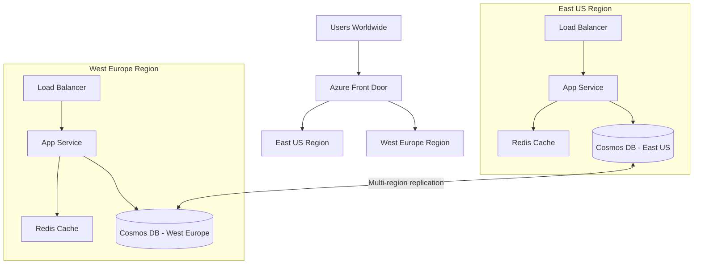

# How to Design a Multi-Region Active-Active Architecture in Azure for High Availability

Author: [nawazdhandala](https://www.github.com/nawazdhandala)

Tags: Azure, Multi-Region, High Availability, Active-Active, Architecture, Disaster Recovery, Traffic Manager

Description: Design a multi-region active-active architecture in Azure that serves traffic from multiple regions simultaneously for maximum availability and performance.

---

An active-active multi-region architecture means your application runs in two or more Azure regions at the same time, and all regions serve live traffic. If one region goes down completely, the other regions absorb the traffic without any manual intervention. This is the gold standard for applications that need the highest possible availability.

Compared to active-passive (where the secondary region sits idle until needed), active-active gives you better performance through geographic load distribution, no cold-start delays during failover, and continuous validation that all regions are actually working.

## Architecture Overview

Here is what a typical active-active setup looks like:



## Global Load Balancing with Azure Front Door

Azure Front Door is the entry point for all traffic. It routes users to the nearest healthy region based on latency:

```bash
# Create an Azure Front Door profile
az afd profile create \
  --resource-group global-rg \
  --profile-name my-global-app \
  --sku Premium_AzureFrontDoor

# Add an endpoint
az afd endpoint create \
  --resource-group global-rg \
  --profile-name my-global-app \
  --endpoint-name myapp \
  --enabled-state Enabled

# Create origin group with health probes
az afd origin-group create \
  --resource-group global-rg \
  --profile-name my-global-app \
  --origin-group-name app-origins \
  --probe-request-type GET \
  --probe-protocol Https \
  --probe-path /health/ready \
  --probe-interval-in-seconds 10 \
  --sample-size 4 \
  --successful-samples-required 3 \
  --additional-latency-in-milliseconds 50

# Add East US origin
az afd origin create \
  --resource-group global-rg \
  --profile-name my-global-app \
  --origin-group-name app-origins \
  --origin-name eastus-origin \
  --host-name myapp-eastus.azurewebsites.net \
  --origin-host-header myapp-eastus.azurewebsites.net \
  --http-port 80 \
  --https-port 443 \
  --priority 1 \
  --weight 1000 \
  --enabled-state Enabled

# Add West Europe origin
az afd origin create \
  --resource-group global-rg \
  --profile-name my-global-app \
  --origin-group-name app-origins \
  --origin-name westeurope-origin \
  --host-name myapp-westeurope.azurewebsites.net \
  --origin-host-header myapp-westeurope.azurewebsites.net \
  --http-port 80 \
  --https-port 443 \
  --priority 1 \
  --weight 1000 \
  --enabled-state Enabled
```

Notice that both origins have priority 1 and equal weight. This means Front Door distributes traffic to both regions based on latency - users in North America hit East US, users in Europe hit West Europe.

## Data Layer: Multi-Region Cosmos DB

The hardest part of active-active is the data layer. You need data available for reads and writes in every region. Azure Cosmos DB supports multi-region writes natively:

```bash
# Create a Cosmos DB account with multi-region writes
az cosmosdb create \
  --resource-group global-rg \
  --name my-global-db \
  --locations regionName=eastus failoverPriority=0 isZoneRedundant=true \
  --locations regionName=westeurope failoverPriority=1 isZoneRedundant=true \
  --enable-multiple-write-locations true \
  --default-consistency-level Session \
  --kind GlobalDocumentDB
```

With multi-region writes enabled, both regions can accept writes simultaneously. Cosmos DB handles replication and conflict resolution automatically.

### Handling Write Conflicts

When two regions write to the same document at the same time, you need a conflict resolution strategy. Cosmos DB offers three options:

```csharp
// Option 1: Last Writer Wins (default) - highest _ts value wins
var containerProperties = new ContainerProperties("orders", "/customerId")
{
    ConflictResolutionPolicy = new ConflictResolutionPolicy
    {
        Mode = ConflictResolutionMode.LastWriterWins,
        ResolutionPath = "/_ts"  // use timestamp to determine winner
    }
};

// Option 2: Custom resolution path - use a version number you control
var containerProperties2 = new ContainerProperties("inventory", "/productId")
{
    ConflictResolutionPolicy = new ConflictResolutionPolicy
    {
        Mode = ConflictResolutionMode.LastWriterWins,
        ResolutionPath = "/version"  // higher version number wins
    }
};

// Option 3: Custom stored procedure for complex merge logic
var containerProperties3 = new ContainerProperties("accounts", "/accountId")
{
    ConflictResolutionPolicy = new ConflictResolutionPolicy
    {
        Mode = ConflictResolutionMode.Custom,
        ResolutionProcedure = "dbs/mydb/colls/accounts/sprocs/resolveConflict"
    }
};
```

For most applications, Last Writer Wins is sufficient. For inventory or financial data where you cannot lose writes, use a custom merge strategy.

## Application Configuration for Multi-Region

Configure your application to connect to the local Cosmos DB region for minimal latency:

```csharp
// Configure Cosmos DB client for multi-region
var cosmosClient = new CosmosClient(
    connectionString,
    new CosmosClientOptions
    {
        // Set the preferred region based on the app's deployment location
        // This ensures reads and writes go to the local region
        ApplicationRegion = Environment.GetEnvironmentVariable("AZURE_REGION"),

        // Enable content response on writes - needed for conflict detection
        EnableContentResponseOnWrite = true,

        // Connection settings for production
        ConnectionMode = ConnectionMode.Direct,
        MaxRetryAttemptsOnRateLimitedRequests = 10,
        MaxRetryWaitTimeOnRateLimitedRequests = TimeSpan.FromSeconds(30)
    }
);
```

Set the `AZURE_REGION` environment variable differently in each region's deployment:

```bash
# East US App Service configuration
az webapp config appsettings set \
  --resource-group eastus-rg \
  --name myapp-eastus \
  --settings AZURE_REGION="East US"

# West Europe App Service configuration
az webapp config appsettings set \
  --resource-group westeurope-rg \
  --name myapp-westeurope \
  --settings AZURE_REGION="West Europe"
```

## Caching Layer

Each region needs its own cache to avoid cross-region latency for cached reads:

```bash
# Create Redis cache in each region
az redis create \
  --resource-group eastus-rg \
  --name myapp-cache-eastus \
  --location eastus \
  --sku Premium \
  --vm-size P1 \
  --zones 1 2 3

az redis create \
  --resource-group westeurope-rg \
  --name myapp-cache-westeurope \
  --location westeurope \
  --sku Premium \
  --vm-size P1 \
  --zones 1 2 3
```

Cache invalidation in a multi-region setup requires care. When data changes in one region, the cache in the other region becomes stale. Options include:

1. **Short TTLs** - set cache expiration to 1-5 minutes. Simple but means stale reads are possible within the TTL window.
2. **Event-driven invalidation** - use Cosmos DB change feed to trigger cache invalidation across regions.
3. **Read-through caching** - always check the database and cache the result, with short TTLs as a safety net.

## Session Management

For active-active to work, user sessions must be accessible from any region. Do not use in-memory sessions or sticky sessions tied to a specific server.

```csharp
// Use Azure Cosmos DB for distributed session storage
builder.Services.AddSession(options =>
{
    options.IdleTimeout = TimeSpan.FromMinutes(30);
    options.Cookie.HttpOnly = true;
    options.Cookie.IsEssential = true;
});

// Or use Redis for session storage (region-local)
builder.Services.AddStackExchangeRedisCache(options =>
{
    options.Configuration = builder.Configuration
        .GetConnectionString("RedisCache");
    options.InstanceName = "session:";
});
```

## Deployment Strategy

Deploy to all regions simultaneously to keep versions consistent:

```yaml
# Azure DevOps pipeline that deploys to all regions in parallel
stages:
  - stage: Deploy
    jobs:
      - deployment: DeployEastUS
        environment: production-eastus
        strategy:
          runOnce:
            deploy:
              steps:
                - task: AzureWebApp@1
                  inputs:
                    azureSubscription: 'Production'
                    appName: 'myapp-eastus'
                    package: '$(Pipeline.Workspace)/app/*.zip'

      - deployment: DeployWestEurope
        environment: production-westeurope
        strategy:
          runOnce:
            deploy:
              steps:
                - task: AzureWebApp@1
                  inputs:
                    azureSubscription: 'Production'
                    appName: 'myapp-westeurope'
                    package: '$(Pipeline.Workspace)/app/*.zip'
```

## Testing Failover

Regularly test that failover works by taking a region offline:

```bash
# Disable the East US origin to simulate a regional outage
az afd origin update \
  --resource-group global-rg \
  --profile-name my-global-app \
  --origin-group-name app-origins \
  --origin-name eastus-origin \
  --enabled-state Disabled

# Monitor that all traffic shifts to West Europe
# Check Front Door metrics for traffic distribution

# Re-enable after testing
az afd origin update \
  --resource-group global-rg \
  --profile-name my-global-app \
  --origin-group-name app-origins \
  --origin-name eastus-origin \
  --enabled-state Enabled
```

## Cost Considerations

Running active-active roughly doubles your infrastructure cost compared to a single region. To manage costs:

- Use autoscaling in each region so you are not over-provisioned
- Consider running a smaller footprint in the secondary region and scaling up during failover
- Use reserved instances for the base capacity in both regions
- Cosmos DB multi-region writes cost more RU/s - plan your throughput accordingly

## Summary

Multi-region active-active on Azure requires coordination across the global load balancer (Front Door), the application tier (deployed identically in each region), the data tier (Cosmos DB with multi-region writes), and the caching layer (region-local Redis). The biggest challenges are data consistency during concurrent writes and cache invalidation across regions. Start with two regions, test failover regularly, and make sure your deployment pipeline treats all regions equally. The operational complexity is real, but for applications that need 99.99% or higher availability, it is the only architecture that delivers.
