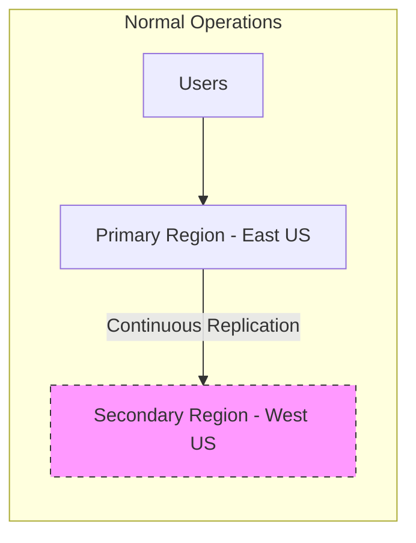
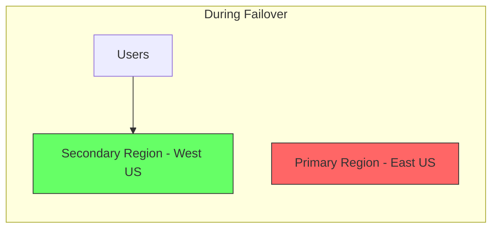

# How to Design an Active-Passive Disaster Recovery Strategy Using Azure Site Recovery

Author: [nawazdhandala](https://www.github.com/nawazdhandala)

Tags: Azure, Disaster Recovery, Site Recovery, Active-Passive, Business Continuity, Replication, High Availability

Description: Design and implement an active-passive disaster recovery strategy using Azure Site Recovery to protect your workloads from regional outages.

---

Not every application needs the complexity and cost of an active-active multi-region deployment. For many workloads, an active-passive disaster recovery (DR) strategy provides the right balance between cost and resilience. In this model, your primary region handles all traffic during normal operations, while a secondary region stays ready to take over if the primary fails.

Azure Site Recovery (ASR) is the core service that makes this work. It continuously replicates your virtual machines, disks, and configurations to the secondary region, and orchestrates the failover process when disaster strikes.

## Understanding RPO and RTO

Before designing your DR strategy, you need to define two key metrics with your business:

**Recovery Point Objective (RPO)** - how much data loss is acceptable. An RPO of 1 hour means you can tolerate losing up to 1 hour of data. Azure Site Recovery typically provides an RPO of a few minutes for VM replication.

**Recovery Time Objective (RTO)** - how long the application can be down. An RTO of 30 minutes means the application must be back online within 30 minutes of a failure. ASR can achieve RTOs of 15-30 minutes for properly configured workloads.





## Setting Up Azure Site Recovery

### Create the Recovery Services Vault

The vault is the management container for your DR configuration:

```bash
# Create a Recovery Services vault in the secondary region
az backup vault create \
  --resource-group dr-rg \
  --name my-recovery-vault \
  --location westus

# Alternatively, use the Site Recovery specific creation
az resource create \
  --resource-group dr-rg \
  --resource-type Microsoft.RecoveryServices/vaults \
  --name my-recovery-vault \
  --location westus \
  --properties '{"sku": {"name": "RS0", "tier": "Standard"}}'
```

### Enable Replication for Virtual Machines

Configure replication for each VM that needs DR protection:

```bash
# Enable replication for a VM from East US to West US
az site-recovery vmware-site create \
  --resource-group dr-rg \
  --vault-name my-recovery-vault \
  --site-name primary-site

# Enable replication using the portal is often easier for the initial setup
# But here is the CLI approach for Azure VMs
az site-recovery protected-item create \
  --resource-group dr-rg \
  --vault-name my-recovery-vault \
  --fabric-name "azure-eastus" \
  --protection-container "azure-eastus-container" \
  --name "web-server-01-replication" \
  --policy-id "/subscriptions/{sub}/resourceGroups/dr-rg/providers/Microsoft.RecoveryServices/vaults/my-recovery-vault/replicationPolicies/24-hour-retention" \
  --provider-specific-details '{
    "instanceType": "A2A",
    "fabricObjectId": "/subscriptions/{sub}/resourceGroups/prod-rg/providers/Microsoft.Compute/virtualMachines/web-server-01",
    "recoveryResourceGroupId": "/subscriptions/{sub}/resourceGroups/dr-prod-rg",
    "recoveryAvailabilityZone": "1",
    "recoveryContainerId": "/subscriptions/{sub}/resourceGroups/dr-rg/providers/Microsoft.RecoveryServices/vaults/my-recovery-vault/replicationFabrics/azure-westus/replicationProtectionContainers/azure-westus-container"
  }'
```

### Configure Replication Policy

The replication policy defines how frequently snapshots are taken and how long recovery points are retained:

```bash
# Create a replication policy
az site-recovery policy create \
  --resource-group dr-rg \
  --vault-name my-recovery-vault \
  --name "standard-dr-policy" \
  --provider-specific-input '{
    "instanceType": "A2A",
    "appConsistentFrequencyInMinutes": 60,
    "crashConsistentFrequencyInMinutes": 5,
    "recoveryPointHistory": 1440,
    "multiVmSyncStatus": "Enable"
  }'
```

This policy takes crash-consistent snapshots every 5 minutes (giving you an RPO of about 5 minutes), application-consistent snapshots every hour, and retains recovery points for 24 hours.

## Recovery Plans

A recovery plan defines the order in which VMs start during failover. This is critical because database servers need to start before application servers, and application servers need to start before web servers.

```json
{
  "properties": {
    "primaryFabricId": "/subscriptions/{sub}/resourceGroups/dr-rg/providers/Microsoft.RecoveryServices/vaults/my-recovery-vault/replicationFabrics/azure-eastus",
    "recoveryFabricId": "/subscriptions/{sub}/resourceGroups/dr-rg/providers/Microsoft.RecoveryServices/vaults/my-recovery-vault/replicationFabrics/azure-westus",
    "groups": [
      {
        "groupType": "Boot",
        "replicationProtectedItems": [
          {"id": "sql-server-01-replication"},
          {"id": "sql-server-02-replication"}
        ],
        "startGroupActions": [],
        "endGroupActions": [
          {
            "actionName": "WaitForSQLReady",
            "failoverTypes": ["PlannedFailover", "UnplannedFailover"],
            "failoverDirections": ["PrimaryToRecovery"],
            "customDetails": {
              "instanceType": "ScriptActionDetails",
              "fabricLocation": "Recovery",
              "scriptPath": "scripts/wait-for-sql.ps1",
              "timeout": "PT10M"
            }
          }
        ]
      },
      {
        "groupType": "Boot",
        "replicationProtectedItems": [
          {"id": "app-server-01-replication"},
          {"id": "app-server-02-replication"}
        ],
        "startGroupActions": [],
        "endGroupActions": [
          {
            "actionName": "UpdateAppConfig",
            "failoverTypes": ["PlannedFailover", "UnplannedFailover"],
            "failoverDirections": ["PrimaryToRecovery"],
            "customDetails": {
              "instanceType": "ScriptActionDetails",
              "fabricLocation": "Recovery",
              "scriptPath": "scripts/update-config.ps1",
              "timeout": "PT5M"
            }
          }
        ]
      },
      {
        "groupType": "Boot",
        "replicationProtectedItems": [
          {"id": "web-server-01-replication"},
          {"id": "web-server-02-replication"}
        ]
      }
    ]
  }
}
```

## DNS Failover

When you failover to the secondary region, DNS needs to point to the new region. Azure Traffic Manager or Azure Front Door handles this automatically:

```bash
# Create a Traffic Manager profile for DNS-based failover
az network traffic-manager profile create \
  --resource-group global-rg \
  --name myapp-traffic-manager \
  --routing-method Priority \
  --unique-dns-name myapp \
  --monitor-protocol HTTPS \
  --monitor-path /health/ready \
  --monitor-port 443 \
  --ttl 30

# Add the primary endpoint (priority 1 = preferred)
az network traffic-manager endpoint create \
  --resource-group global-rg \
  --profile-name myapp-traffic-manager \
  --name eastus-primary \
  --type externalEndpoints \
  --target myapp-eastus.azurewebsites.net \
  --priority 1

# Add the secondary endpoint (priority 2 = failover target)
az network traffic-manager endpoint create \
  --resource-group global-rg \
  --profile-name myapp-traffic-manager \
  --name westus-secondary \
  --type externalEndpoints \
  --target myapp-westus.azurewebsites.net \
  --priority 2
```

Traffic Manager continuously probes both endpoints. When the primary fails health checks, it automatically directs DNS queries to the secondary.

## Database DR Strategies

VMs are just one piece. Your data tier needs its own DR strategy:

### Azure SQL Database

```bash
# Create a failover group for Azure SQL
az sql failover-group create \
  --resource-group prod-rg \
  --server my-sql-server-eastus \
  --name my-failover-group \
  --partner-server my-sql-server-westus \
  --partner-resource-group dr-prod-rg \
  --failover-policy Automatic \
  --grace-period 1
```

The failover group provides a listener endpoint that automatically redirects connections to whichever server is primary. Your application connects to `my-failover-group.database.windows.net` and the failover is transparent.

### Azure Cosmos DB

Cosmos DB handles failover natively with automatic failover configuration:

```bash
# Enable automatic failover for Cosmos DB
az cosmosdb update \
  --resource-group prod-rg \
  --name my-cosmos-account \
  --enable-automatic-failover true

# The failover priority determines which region becomes primary
# East US (priority 0) is primary, West US (priority 1) is secondary
az cosmosdb failover-priority-change \
  --resource-group prod-rg \
  --name my-cosmos-account \
  --failover-policies "eastus=0" "westus=1"
```

## Testing Your DR Plan

A disaster recovery plan that has never been tested is just a hope. Azure Site Recovery supports test failovers that do not affect your production environment:

```bash
# Run a test failover
# This creates the VMs in an isolated network so it does not affect production
az site-recovery recovery-plan planned-failover \
  --resource-group dr-rg \
  --vault-name my-recovery-vault \
  --name my-recovery-plan \
  --failover-direction PrimaryToRecovery \
  --properties '{
    "instanceType": "RecoveryPlanPlannedFailoverInput",
    "failoverDirection": "PrimaryToRecovery",
    "providerSpecificDetails": [{
      "instanceType": "A2A"
    }]
  }'
```

Schedule DR tests quarterly. Document the results, including how long the failover took, any issues encountered, and the actual RPO achieved.

## Automation with Azure Automation Runbooks

Automate post-failover tasks with Azure Automation runbooks that run as part of the recovery plan:

```powershell
# PowerShell runbook that updates DNS and verifies the failover
param(
    [string]$RecoveryPlanContext
)

$context = ConvertFrom-Json $RecoveryPlanContext

# Update application settings to point to DR resources
$webApp = Get-AzWebApp -ResourceGroupName "dr-prod-rg" -Name "myapp-westus"

$settings = @{
    "DatabaseConnectionString" = "Server=my-sql-server-westus.database.windows.net;..."
    "RedisConnectionString" = "myapp-cache-westus.redis.cache.windows.net:6380,..."
    "IsFailoverMode" = "true"
}

Set-AzWebApp -ResourceGroupName "dr-prod-rg" -Name "myapp-westus" -AppSettings $settings

# Verify the application is healthy
$healthCheck = Invoke-WebRequest -Uri "https://myapp-westus.azurewebsites.net/health/ready"
if ($healthCheck.StatusCode -ne 200) {
    throw "Application health check failed after failover"
}

Write-Output "Failover completed successfully. Application is healthy."
```

## Failback After Recovery

Once the primary region is back online, you need to failback. This involves reversing the replication direction and doing a planned failover back to the primary:

1. Ensure the primary region is healthy
2. Re-protect the VMs (reverse replication from secondary to primary)
3. Wait for initial replication to complete
4. Perform a planned failover back to primary
5. Update DNS to point back to primary
6. Re-protect again to resume normal DR replication

## Summary

An active-passive DR strategy with Azure Site Recovery provides reliable protection against regional outages at a fraction of the cost of active-active. The key components are continuous VM replication with ASR, database failover groups, a recovery plan that orchestrates the startup sequence, DNS failover with Traffic Manager, and automation scripts for post-failover tasks. Test your DR plan regularly - the worst time to discover it does not work is during an actual disaster.
