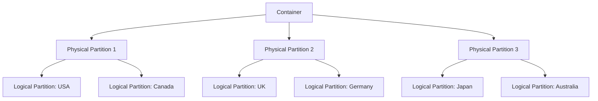

# How to Design an Effective Partition Key Strategy in Azure Cosmos DB

Author: [nawazdhandala](https://www.github.com/nawazdhandala)

Tags: Azure, Cosmos DB, Partition Key, Data Modeling, NoSQL, Performance, Scalability

Description: Learn how to choose and design partition keys in Azure Cosmos DB that distribute data evenly, enable efficient queries, and scale without bottlenecks.

---

Choosing the right partition key is the single most important design decision you will make when working with Azure Cosmos DB. Get it right, and your database scales smoothly to any size. Get it wrong, and you end up with hot partitions, throttled requests, and a painful redesign. This guide covers how to think about partition keys, common patterns, and mistakes to avoid.

## How Partitioning Works

Cosmos DB stores data in logical partitions, and each logical partition is mapped to a physical partition. A logical partition is defined by the value of the partition key. All items with the same partition key value live in the same logical partition.



Key constraints to understand:

- Each logical partition has a maximum size of 20 GB
- Throughput (RU/s) is distributed evenly across physical partitions
- Queries within a single partition are efficient; cross-partition queries are expensive
- Once you choose a partition key, you cannot change it without migrating data

## Criteria for a Good Partition Key

A good partition key should satisfy three requirements:

### 1. High Cardinality

The partition key should have many distinct values. More distinct values means more logical partitions, which means better distribution across physical partitions.

Bad example: Using a boolean field like `isActive` gives you only two logical partitions. All your data is split into just two buckets.

Good example: Using `userId` in a system with millions of users gives you millions of logical partitions.

### 2. Even Distribution

The data should be roughly evenly distributed across partition key values. If 80% of your data has the same partition key value, that partition becomes a hot spot.

Bad example: Using `country` when 90% of your users are in the United States. The USA partition holds most of the data and takes most of the request traffic.

Good example: Using `userId` where each user has roughly the same amount of data.

### 3. Alignment with Query Patterns

Your most frequent queries should include the partition key in the WHERE clause. This enables single-partition queries, which are much cheaper and faster than cross-partition queries.

Bad example: Partitioning by `userId` but most queries filter by `category`. Every query becomes a cross-partition fan-out.

Good example: Partitioning by `userId` when your application primarily loads data for a specific user.

## Common Partition Key Patterns

### Pattern 1: Natural Key

Use a field that naturally identifies the entity and aligns with queries:

```json
// E-commerce orders partitioned by customerId
// Most queries are "show me orders for customer X"
{
    "id": "order-1234",
    "customerId": "cust-5678",
    "orderDate": "2026-02-16",
    "total": 149.99,
    "items": [...]
}
// Partition key: /customerId
```

### Pattern 2: Synthetic Key

When no single field meets all three criteria, create a synthetic partition key by combining fields:

```json
// IoT telemetry data
// Partitioning by deviceId alone might create hot partitions
// if some devices send much more data than others
{
    "id": "reading-abc123",
    "deviceId": "device-42",
    "date": "2026-02-16",
    "partitionKey": "device-42_2026-02-16",
    "temperature": 72.5,
    "humidity": 45.2
}
// Partition key: /partitionKey (combines device and date)
```

This gives you both good distribution and alignment with queries that filter by device and date range.

### Pattern 3: Hash-Based Key

For workloads where you need to write data very quickly and query patterns are flexible, use a hash suffix to spread writes:

```json
// High-throughput event logging
// Adding a hash suffix spreads writes across more partitions
{
    "id": "event-xyz",
    "tenantId": "tenant-100",
    "partitionKey": "tenant-100_3",
    "eventType": "page_view",
    "timestamp": "2026-02-16T10:30:00Z"
}
// partitionKey is tenantId + "_" + hash(id) % 10
// This creates 10 logical partitions per tenant
```

The tradeoff is that reads for a single tenant now require querying up to 10 partitions. But for write-heavy workloads, this can be worth it.

### Pattern 4: Hierarchical Key

Cosmos DB supports hierarchical partition keys (up to 3 levels), which can solve problems that a single key cannot:

```json
// Multi-tenant SaaS application
// Hierarchical partition key: /tenantId, /userId, /sessionId
{
    "id": "action-001",
    "tenantId": "tenant-A",
    "userId": "user-42",
    "sessionId": "sess-789",
    "action": "click",
    "page": "/dashboard"
}
```

```csharp
// Create a container with hierarchical partition key
// This allows efficient queries at any level of the hierarchy
ContainerProperties properties = new ContainerProperties(
    id: "events",
    partitionKeyPaths: new List<string> { "/tenantId", "/userId", "/sessionId" }
);

Container container = await database.CreateContainerAsync(properties, throughput: 10000);
```

With hierarchical keys, you can query efficiently at any level:
- All data for a tenant (first level)
- All data for a specific user within a tenant (first + second level)
- A specific session (all three levels)

## Analyzing Your Data Distribution

Before committing to a partition key, analyze your actual data to check distribution:

```python
# Analyze candidate partition key distribution
# Run this against your existing data to see how it would distribute
import json
from collections import Counter

# Simulate loading your data
data = load_your_data()

# Count items per partition key value
partition_counts = Counter()
partition_sizes = {}

for item in data:
    pk_value = item["customerId"]  # candidate partition key
    partition_counts[pk_value] += 1
    # Estimate size (rough approximation)
    item_size = len(json.dumps(item))
    partition_sizes[pk_value] = partition_sizes.get(pk_value, 0) + item_size

# Show the top 10 largest partitions
print("Top 10 partitions by item count:")
for pk, count in partition_counts.most_common(10):
    size_mb = partition_sizes[pk] / (1024 * 1024)
    print(f"  {pk}: {count} items, {size_mb:.2f} MB")

# Check if any partition exceeds 20 GB
print("\nPartitions approaching 20 GB limit:")
for pk, size in partition_sizes.items():
    size_gb = size / (1024 * 1024 * 1024)
    if size_gb > 15:  # warn at 15 GB
        print(f"  WARNING: {pk} is at {size_gb:.2f} GB")
```

## Common Mistakes

### Mistake 1: Using a Timestamp

Partitioning by timestamp creates hot partitions because all current writes go to the same partition (the current time period). Old partitions become cold and waste provisioned throughput.

### Mistake 2: Using a Low-Cardinality Field

Fields like `status`, `type`, or `category` typically have very few distinct values. This creates large, uneven partitions.

### Mistake 3: Ignoring the 20 GB Limit

Each logical partition can hold at most 20 GB. If your partition key causes any single value to accumulate more than 20 GB of data, writes to that partition will fail.

### Mistake 4: Choosing Based on Write Patterns Only

You also need to consider how data is read. A partition key that distributes writes perfectly but forces every read to be a cross-partition query is a bad choice.

## Measuring Partition Key Effectiveness

After deploying your container, monitor partition metrics to verify your key is working well:

```bash
# Check partition key statistics using Azure CLI
az cosmosdb sql container show \
    --account-name myCosmosAccount \
    --database-name mydb \
    --name mycontainer \
    --resource-group myResourceGroup \
    --query "resource.partitionKey"
```

In the Azure Portal, go to Metrics and check:

- **Normalized RU Consumption by PartitionKeyRangeId**: If some partitions consistently show higher consumption than others, you have a hot partition problem
- **Data Storage by physical partition**: Should be roughly even
- **Throttled requests by partition**: If throttling is concentrated on specific partitions, your key is not distributing well

## Changing a Partition Key

If you realize your partition key was a mistake, you cannot change it in place. You have to create a new container with the new partition key and migrate data:

```csharp
// Migrate data from old container to new container with different partition key
// This example uses the bulk execution library for efficiency
CosmosClient client = new CosmosClient(endpoint, key, new CosmosClientOptions
{
    AllowBulkExecution = true
});

Container source = client.GetContainer("mydb", "old-container");
Container target = client.GetContainer("mydb", "new-container");

// Read from source and write to target with new partition key
FeedIterator<dynamic> iterator = source.GetItemQueryIterator<dynamic>("SELECT * FROM c");
List<Task> tasks = new List<Task>();

while (iterator.HasMoreResults)
{
    FeedResponse<dynamic> batch = await iterator.ReadNextAsync();
    foreach (dynamic item in batch)
    {
        // Write to new container - the new partition key is read from the item
        tasks.Add(target.CreateItemAsync(item, new PartitionKey((string)item.newPartitionKey)));
    }
}

await Task.WhenAll(tasks);
```

Taking the time to design your partition key properly up front saves you from this kind of migration later. Think about your access patterns, analyze your data distribution, and test with realistic workloads before going to production.
