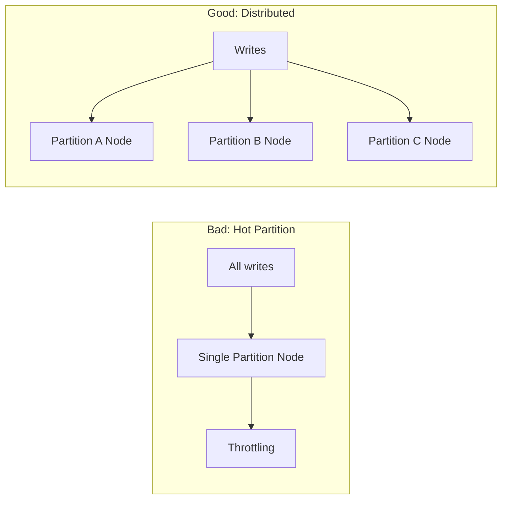

# How to Design an Efficient Partition Key Strategy for Azure Table Storage

Author: [nawazdhandala](https://www.github.com/nawazdhandala)

Tags: Azure, Table Storage, Partition Key, Data Modeling, NoSQL, Performance Optimization, Scalability

Description: Learn how to design partition key strategies for Azure Table Storage that balance query performance, scalability, and data distribution.

---

The partition key is the single most important design decision you will make when using Azure Table Storage. Get it right, and your application scales smoothly with fast queries. Get it wrong, and you end up with hot partitions, slow scans, and throughput bottlenecks. In this post, I will cover the principles behind good partition key design and walk through concrete strategies for common scenarios.

## Why the Partition Key Matters So Much

Azure Table Storage distributes data across storage nodes based on the partition key. All entities with the same partition key live on the same storage node. This means:

- Queries that filter on a specific partition key only hit one node, making them fast.
- All entities in a partition can participate in entity group transactions (batch operations).
- A single partition has a throughput limit of about 2,000 entities per second.

That last point is crucial. If you put all your data into one partition, you are capping your throughput at 2,000 operations per second regardless of how much Azure scales behind the scenes. If you spread data across many partitions, Azure can distribute the load across multiple nodes.

The challenge is finding the sweet spot - enough partitions for scalability, but not so many that your queries become expensive table scans.

## Strategy 1: Natural Grouping

The simplest approach is to use a natural grouping from your domain. If you are storing employee records, the department makes a logical partition key. If you are storing IoT telemetry, the device ID works well.

```python
from azure.data.tables import TableClient

# Using department as partition key groups employees naturally
# Queries like "all employees in Engineering" are fast partition scans
employee = {
    "PartitionKey": "Engineering",
    "RowKey": "emp-001",
    "Name": "Alex Rivera",
    "Role": "Backend Developer"
}

table_client.create_entity(entity=employee)
```

This works well when your queries naturally align with the grouping and the data is relatively evenly distributed across groups. But watch out for uneven distributions - if 80% of your employees are in Engineering, that partition becomes a hot spot.

## Strategy 2: Time-Based Partitioning

For time-series data like logs or events, partitioning by time period is common. The granularity depends on your write rate and query patterns.

```python
from datetime import datetime

# Partition by date for log entries
# Each day gets its own partition, keeping partition sizes manageable
log_entry = {
    "PartitionKey": "2026-02-16",
    "RowKey": f"{datetime.utcnow().isoformat()}_{generate_id()}",
    "Level": "ERROR",
    "Message": "Connection timeout to database server",
    "Service": "payment-api"
}

table_client.create_entity(entity=log_entry)
```

For high-throughput scenarios, daily partitions might still be too large. You can partition by hour or even by minute.

```python
# Hourly partitioning for high-throughput scenarios
# Format: YYYY-MM-DD-HH
partition_key = datetime.utcnow().strftime("%Y-%m-%d-%H")

event = {
    "PartitionKey": partition_key,
    "RowKey": f"{datetime.utcnow().timestamp()}_{uuid4()}",
    "EventType": "page_view",
    "UserId": "user-12345"
}
```

## Strategy 3: Composite Partition Keys

Sometimes a single attribute does not provide enough granularity. Combining two attributes gives you better distribution.

```python
# Combine tenant and date for a multi-tenant logging system
# This keeps each tenant's daily logs in one partition
# and prevents any single partition from getting too large
partition_key = f"tenant-42_2026-02-16"

log = {
    "PartitionKey": partition_key,
    "RowKey": f"{datetime.utcnow().isoformat()}",
    "Level": "INFO",
    "Message": "User login successful"
}
```

This pattern is especially useful in multi-tenant applications where you need to query by tenant and time range.

## Strategy 4: Hash-Based Distribution

When you need maximum write throughput and your queries do not need to group by any natural key, you can use a hash to distribute entities evenly across a fixed number of partitions.

```python
import hashlib

def get_hash_partition(entity_id, num_partitions=16):
    """
    Distribute entities across a fixed number of partitions using a hash.
    This ensures even distribution regardless of the entity ID pattern.
    """
    hash_value = hashlib.md5(entity_id.encode()).hexdigest()
    partition_index = int(hash_value, 16) % num_partitions
    return f"partition-{partition_index:03d}"

# Entity gets assigned to a partition based on its ID hash
entity = {
    "PartitionKey": get_hash_partition("order-98765"),
    "RowKey": "order-98765",
    "Amount": 49.99,
    "Status": "pending"
}
```

The downside is that querying for a specific order requires knowing which partition it is in (or scanning all partitions). This works best for point queries where you can recalculate the hash.

## Strategy 5: Append-Only with Inverted Timestamps

For scenarios where you frequently query the most recent data, you can use an inverted timestamp pattern. This puts the newest entries at the top of the partition, making recent-data queries fast.

```python
import time

def inverted_timestamp():
    """
    Create an inverted timestamp that sorts newest entries first.
    Using max ticks minus current ticks ensures reverse chronological order.
    """
    max_ticks = 9999999999
    return str(max_ticks - int(time.time()))

event = {
    "PartitionKey": "device-sensor-42",
    "RowKey": inverted_timestamp(),
    "Temperature": 72.5,
    "Humidity": 45.2
}
```

## Anti-Patterns to Avoid

Here is what not to do.

**Single partition for everything.** Using a constant partition key like "default" puts all data on one node. You will hit the 2,000 ops/sec limit quickly.

**Too many small partitions.** If every entity has a unique partition key, you lose the ability to do efficient range queries within a partition, and batch operations become impossible.

**Sequential partition keys.** Using auto-incrementing numbers as partition keys causes all new writes to go to the same storage node (the one handling the current range). Azure might not rebalance fast enough under load.



## Decision Framework

Use this framework to pick your strategy.

First, identify your primary query pattern. What is the most common question you ask the data? If it is "give me all records for customer X," then customer ID is probably your partition key.

Second, estimate your write throughput per partition. If a single partition would receive more than 2,000 writes per second, you need to break it up further (add a time component, hash suffix, or bucket number).

Third, consider your batch operation needs. Batch operations only work within a single partition. If you need to insert 100 related entities atomically, they must share a partition key.

Fourth, think about data lifecycle. If you regularly delete old data, time-based partition keys make cleanup easy - you can delete entire partitions instead of scanning for old entities.

## Real-World Example: Multi-Tenant SaaS Application

Let me tie this together with a realistic example. Say you are building a SaaS application that stores audit logs for multiple tenants.

```python
def design_audit_log_key(tenant_id, event_time):
    """
    Partition by tenant and month for audit logs.
    - Queries are typically per-tenant for a date range
    - Monthly partitions keep sizes manageable
    - Inverted timestamp in RowKey for newest-first ordering
    """
    month = event_time.strftime("%Y-%m")
    partition_key = f"{tenant_id}_{month}"

    # Inverted timestamp ensures newest entries sort first
    max_ts = 9999999999
    row_key = f"{max_ts - int(event_time.timestamp())}_{uuid4()}"

    return partition_key, row_key

pk, rk = design_audit_log_key("tenant-42", datetime.utcnow())

audit_entry = {
    "PartitionKey": pk,
    "RowKey": rk,
    "Action": "user.login",
    "ActorEmail": "admin@tenant42.com",
    "IpAddress": "203.0.113.42",
    "Details": "Successful login from new device"
}
```

This design gives you fast per-tenant queries, manageable partition sizes, and easy cleanup of old data by deleting monthly partitions.

## Testing Your Strategy

Before going to production, test your partition key strategy with realistic data volumes. Create a million test entities, run your expected query patterns, and measure the latency. Azure Storage Explorer and the storage emulator (Azurite) are your friends here.

The partition key is not something you can easily change later. Migrating data to a different partition scheme means reading every entity and rewriting it with a new key. Spend the time up front to get it right, and your Table Storage will serve you well for years.
