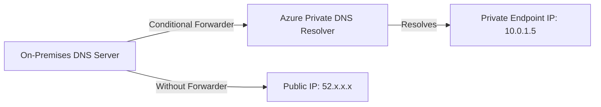
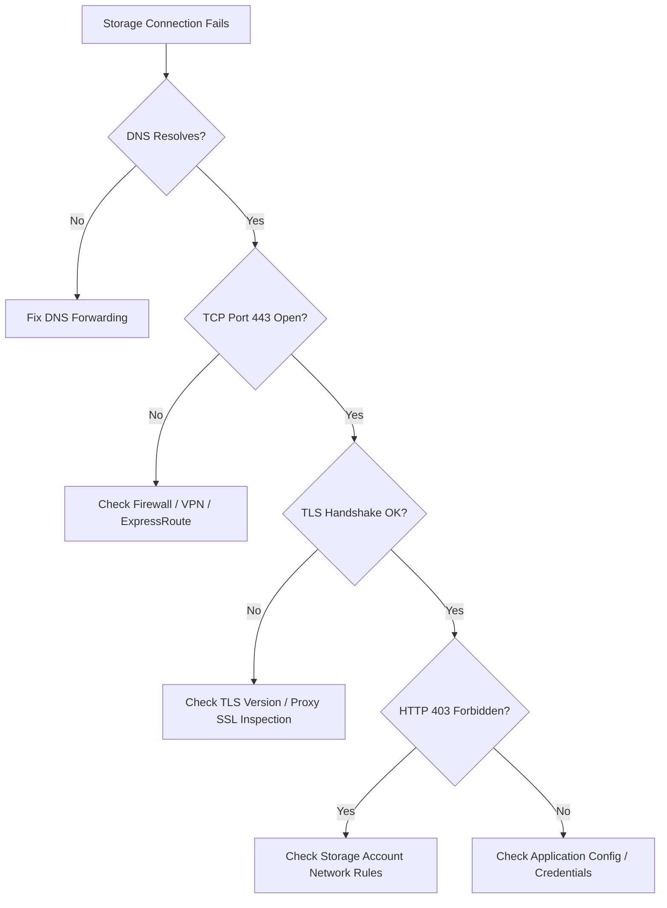

# How to Diagnose Azure Storage Connectivity Issues from On-Premises Networks

Author: [nawazdhandala](https://www.github.com/nawazdhandala)

Tags: Azure, Azure Storage, Networking, On-Premises, Connectivity, Troubleshooting, Hybrid Cloud

Description: A practical guide to diagnosing and resolving connectivity problems between on-premises networks and Azure Storage accounts.

---

Connecting to Azure Storage from an on-premises network seems straightforward until it does not work. When your applications suddenly cannot reach their storage accounts, the problem could be anywhere - DNS resolution, firewall rules, proxy servers, VPN tunnels, or even Azure-side network restrictions. This guide walks through a systematic approach to finding and fixing these connectivity issues.

## The Common Symptoms

Before diving into diagnostics, let's be clear about what connectivity issues look like. You might see:

- Connection timeouts when trying to access blobs, tables, queues, or files
- SSL/TLS handshake failures
- DNS resolution errors for `*.blob.core.windows.net` or other storage endpoints
- Intermittent connectivity that works sometimes but fails at peak hours
- Connections that work from some machines but not others on the same network

Each of these symptoms points to a different root cause, so identifying the symptom accurately is the first step.

## Step 1: Verify DNS Resolution

Azure Storage endpoints follow the pattern `<accountname>.<service>.core.windows.net`. The first thing to check is whether your on-premises DNS servers can resolve these names correctly.

Run a DNS lookup from an affected machine:

```bash
# Check if DNS resolves the storage account endpoint
# You should get back an IP address or a CNAME chain
nslookup mystorageaccount.blob.core.windows.net

# For more detail, use dig to see the full resolution chain
dig mystorageaccount.blob.core.windows.net +trace
```

If you are using Azure Private Endpoints, the DNS resolution is more complex. The public DNS name should resolve to a private IP address in your virtual network, which means your on-premises DNS servers need to forward Azure-related queries to a DNS resolver that knows about the private endpoint.

A typical Private Endpoint DNS setup looks like this:



If DNS returns the wrong IP - for example, a public IP when you expect a private one - the issue is in your DNS forwarding configuration.

## Step 2: Test Basic Connectivity

Once DNS is resolving correctly, test whether you can actually reach the storage endpoint on the network level.

```bash
# Test TCP connectivity to the storage endpoint on port 443
# A successful connection means the network path is clear
Test-NetConnection -ComputerName mystorageaccount.blob.core.windows.net -Port 443

# On Linux/Mac, use netcat or telnet
nc -zv mystorageaccount.blob.core.windows.net 443 -w 5
```

If TCP connection fails, the issue is a network-level block. Common causes include:

- **Firewall blocking outbound HTTPS**: Your corporate firewall might block traffic to Azure IP ranges. Azure publishes its IP ranges in a JSON file that gets updated weekly. Your network team needs to allow outbound traffic to the Azure Storage IP ranges for your region.

- **VPN tunnel down**: If you are using a site-to-site VPN to reach private endpoints, the VPN tunnel itself might be down. Check your VPN gateway status in the Azure Portal.

- **ExpressRoute circuit issues**: For ExpressRoute connections, check the circuit status, BGP session state, and route advertisements.

## Step 3: Check for TLS Issues

Azure Storage requires TLS 1.2 as the minimum version. Older clients or systems running outdated TLS libraries will fail to connect.

```powershell
# Check the TLS version used in a connection attempt
# This PowerShell snippet tests TLS connectivity
[Net.ServicePointManager]::SecurityProtocol = [Net.SecurityProtocolType]::Tls12
try {
    $response = Invoke-WebRequest -Uri "https://mystorageaccount.blob.core.windows.net/?comp=list" -Method Head
    Write-Output "Connection successful. Status: $($response.StatusCode)"
} catch {
    Write-Output "Connection failed: $($_.Exception.Message)"
}
```

If you see errors about SSL/TLS handshake failures, check these items:

- The client machine has TLS 1.2 enabled (some older Windows Server versions have it disabled by default)
- The client trusts the certificate chain (Azure Storage uses DigiCert certificates)
- No proxy or firewall is performing SSL inspection that breaks the certificate chain

## Step 4: Investigate Azure-Side Network Restrictions

Azure Storage accounts can be locked down with network rules that restrict access to specific networks. If your storage account has network restrictions enabled, your on-premises network might be blocked.

Check the current network rules on the storage account:

```bash
# List the network rules for a storage account
# Default action of "Deny" means only explicitly allowed networks can connect
az storage account show \
  --name mystorageaccount \
  --resource-group myResourceGroup \
  --query "networkRuleSet" \
  --output json
```

The output tells you the default action (Allow or Deny) and which IP ranges or virtual networks are whitelisted. If the default action is Deny and your on-premises public IP is not listed, you need to add it.

```bash
# Add your on-premises public IP to the storage account firewall
az storage account network-rule add \
  --account-name mystorageaccount \
  --resource-group myResourceGroup \
  --ip-address 203.0.113.50
```

Keep in mind that if your organization uses multiple public IP addresses (for example, different egress points for different offices), you need to add all of them.

## Step 5: Diagnose Proxy and Inspection Issues

Many corporate networks route all HTTPS traffic through a proxy server or SSL inspection appliance. These can interfere with Azure Storage connections in subtle ways.

Signs that a proxy is causing issues:

- Connections work when you bypass the proxy (for example, from a VPN-connected laptop)
- You see certificate errors mentioning your organization's internal CA instead of DigiCert
- Large file uploads or downloads fail with timeout errors even though small requests succeed

To test whether a proxy is interfering:

```bash
# Check if an HTTP proxy environment variable is set
echo $HTTP_PROXY
echo $HTTPS_PROXY

# Try connecting directly, bypassing the proxy
curl -v --noproxy '*' https://mystorageaccount.blob.core.windows.net/?restype=account&comp=properties
```

If bypassing the proxy fixes the issue, you need to work with your network team to either whitelist Azure Storage endpoints in the proxy or exempt them from SSL inspection.

## Step 6: Use Azure Network Watcher for Deeper Analysis

If you are using a VPN or ExpressRoute connection and routing traffic through Azure Virtual Networks, Azure Network Watcher can help diagnose issues within the Azure side of the network.

The Connection Troubleshoot tool tests connectivity from an Azure VM to the storage endpoint:

```bash
# Run a connectivity check from an Azure VM to the storage endpoint
az network watcher test-connectivity \
  --resource-group myResourceGroup \
  --source-resource myTestVM \
  --dest-address mystorageaccount.blob.core.windows.net \
  --dest-port 443
```

This shows you exactly where in the network path the connection fails, including any NSG (Network Security Group) rules that might be blocking traffic.

## Step 7: Capture and Analyze Network Traces

When all else fails, a network packet capture gives you the ground truth. Capture traffic on the affected machine and look for what is happening at the TCP and TLS level.

```bash
# Capture packets to/from the storage endpoint
# Run this during a failed connection attempt, then analyze in Wireshark
tcpdump -i any -w storage-trace.pcap host mystorageaccount.blob.core.windows.net
```

In the packet capture, look for:

- **SYN packets without SYN-ACK responses**: Indicates a firewall is dropping the traffic silently
- **RST packets**: Something is actively rejecting the connection
- **TLS handshake failures**: Certificate or protocol version mismatches
- **Retransmissions**: Network congestion or packet loss on the path

## Putting It All Together

Here is the diagnostic flowchart to follow when you hit connectivity issues:



Most connectivity issues fall into one of these buckets. Start at the top and work your way down. In my experience, the most common culprits are storage account firewall rules that are missing the on-premises IP address and DNS forwarding misconfigurations for private endpoints. Both are quick fixes once you identify them, but they can waste hours if you are looking in the wrong place. A systematic approach saves time every single time.
