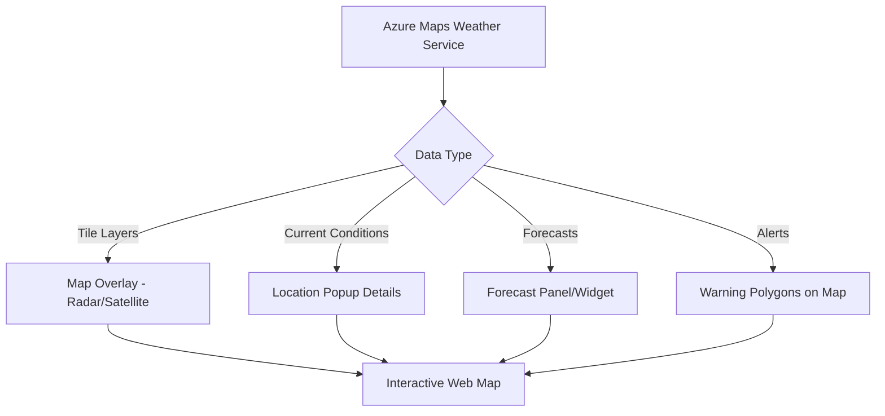

# How to Display Real-Time Weather Overlays on Maps Using Azure Maps Weather Service

Author: [nawazdhandala](https://www.github.com/nawazdhandala)

Tags: Azure Maps, Weather Service, Map Overlays, Real-Time Weather, Tile Layers, JavaScript, Geospatial Visualization

Description: Learn how to display real-time weather overlays including radar, satellite, and temperature data on Azure Maps using the Weather Service tile layers.

---

Weather data on a map is one of those features that seems like a nice-to-have until you are building logistics software, agriculture monitoring, event planning tools, or outdoor activity platforms. Then it becomes essential. Azure Maps provides a Weather Service that delivers real-time weather conditions, forecasts, radar imagery, and weather alerts, all accessible through REST APIs and renderable as tile layers directly on your Azure Maps instance.

This guide shows you how to overlay weather tiles on an Azure Maps web application, query weather conditions for specific locations, and display severe weather alerts.

## What the Weather Service Provides

The Azure Maps Weather Service includes several categories of data:

- **Current conditions** - Temperature, humidity, wind, precipitation, UV index for a specific location
- **Forecasts** - Hourly, daily, and quarter-day forecasts up to 15 days ahead
- **Weather tile layers** - Radar, infrared satellite, cloud cover, temperature, and precipitation map tiles
- **Severe weather alerts** - Active warnings and advisories for a geographic area
- **Historical weather** - Past weather data for trend analysis
- **Air quality** - Air quality index and pollutant levels

The tile layers are particularly useful because they integrate directly with the Azure Maps Web SDK as overlay layers.

## Step 1: Set Up the Base Map

Start with a basic Azure Maps instance. If you have followed our interactive map guide, you already have this foundation.

```html
<!DOCTYPE html>
<html>
<head>
    <title>Weather Overlays - Azure Maps</title>
    <meta charset="utf-8" />
    <meta name="viewport" content="width=device-width, initial-scale=1" />
    <link rel="stylesheet"
          href="https://atlas.microsoft.com/sdk/javascript/mapcontrol/3/atlas.min.css"
          type="text/css" />
    <script src="https://atlas.microsoft.com/sdk/javascript/mapcontrol/3/atlas.min.js"></script>
    <style>
        html, body { margin: 0; padding: 0; height: 100%; }
        #myMap { width: 100%; height: 100%; }

        /* Weather control panel */
        #weatherPanel {
            position: absolute;
            top: 10px;
            right: 60px;
            background: white;
            padding: 12px;
            border-radius: 8px;
            box-shadow: 0 2px 8px rgba(0,0,0,0.2);
            z-index: 100;
            font-family: Arial, sans-serif;
            font-size: 13px;
        }
        #weatherPanel label {
            display: block;
            margin: 4px 0;
            cursor: pointer;
        }
    </style>
</head>
<body>
    <div id="myMap"></div>
    <div id="weatherPanel">
        <strong>Weather Layers</strong>
        <label><input type="checkbox" id="radar" /> Radar</label>
        <label><input type="checkbox" id="infrared" /> Infrared Satellite</label>
        <label><input type="checkbox" id="temperature" /> Temperature</label>
        <label><input type="checkbox" id="precipitation" /> Precipitation</label>
        <label><input type="checkbox" id="cloud" /> Cloud Cover</label>
    </div>
    <script src="weather-map.js"></script>
</body>
</html>
```

## Step 2: Add Weather Tile Layers

Weather tiles are standard map tiles that overlay on top of the base map. Azure Maps serves them from a tile URL template that you plug into a `TileLayer`.

```javascript
// weather-map.js - Azure Maps with weather overlay layers

const AZURE_MAPS_KEY = 'your-subscription-key';

// Store references to weather layers so we can toggle them
const weatherLayers = {};

document.addEventListener('DOMContentLoaded', function () {
    const map = new atlas.Map('myMap', {
        center: [-95.7, 37.0],  // Center on the US
        zoom: 4,
        style: 'road',
        authOptions: {
            authType: 'subscriptionKey',
            subscriptionKey: AZURE_MAPS_KEY
        }
    });

    map.events.add('ready', function () {
        // Create weather tile layers (initially hidden)
        createWeatherLayers(map);

        // Set up toggle controls
        setupLayerControls(map);

        // Add a click handler to show weather details at a clicked location
        map.events.add('click', function (e) {
            showWeatherAtLocation(map, e.position);
        });
    });
});

function createWeatherLayers(map) {
    // Radar layer - shows precipitation intensity
    weatherLayers.radar = new atlas.layer.TileLayer({
        tileUrl: `https://atlas.microsoft.com/map/tile?api-version=2024-04-01&tilesetId=microsoft.weather.radar.main&zoom={z}&x={x}&y={y}&subscription-key=${AZURE_MAPS_KEY}`,
        opacity: 0.7,
        tileSize: 256,
        visible: false
    }, 'radar-layer');

    // Infrared satellite layer - shows cloud temperatures
    weatherLayers.infrared = new atlas.layer.TileLayer({
        tileUrl: `https://atlas.microsoft.com/map/tile?api-version=2024-04-01&tilesetId=microsoft.weather.infraredSatellite.main&zoom={z}&x={x}&y={y}&subscription-key=${AZURE_MAPS_KEY}`,
        opacity: 0.6,
        tileSize: 256,
        visible: false
    }, 'infrared-layer');

    // Temperature layer - shows surface temperatures
    weatherLayers.temperature = new atlas.layer.TileLayer({
        tileUrl: `https://atlas.microsoft.com/map/tile?api-version=2024-04-01&tilesetId=microsoft.weather.temperature.main&zoom={z}&x={x}&y={y}&subscription-key=${AZURE_MAPS_KEY}`,
        opacity: 0.5,
        tileSize: 256,
        visible: false
    }, 'temperature-layer');

    // Precipitation layer - shows forecasted precipitation
    weatherLayers.precipitation = new atlas.layer.TileLayer({
        tileUrl: `https://atlas.microsoft.com/map/tile?api-version=2024-04-01&tilesetId=microsoft.weather.precipitation.main&zoom={z}&x={x}&y={y}&subscription-key=${AZURE_MAPS_KEY}`,
        opacity: 0.6,
        tileSize: 256,
        visible: false
    }, 'precipitation-layer');

    // Cloud cover layer
    weatherLayers.cloud = new atlas.layer.TileLayer({
        tileUrl: `https://atlas.microsoft.com/map/tile?api-version=2024-04-01&tilesetId=microsoft.weather.cloud.main&zoom={z}&x={x}&y={y}&subscription-key=${AZURE_MAPS_KEY}`,
        opacity: 0.5,
        tileSize: 256,
        visible: false
    }, 'cloud-layer');

    // Add all layers to the map
    Object.values(weatherLayers).forEach(function (layer) {
        map.layers.add(layer);
    });
}
```

## Step 3: Toggle Layer Visibility

Wire up the checkbox controls to show and hide weather layers.

```javascript
function setupLayerControls(map) {
    // Map checkbox IDs to layer keys
    const layerMap = {
        'radar': 'radar',
        'infrared': 'infrared',
        'temperature': 'temperature',
        'precipitation': 'precipitation',
        'cloud': 'cloud'
    };

    Object.entries(layerMap).forEach(function ([checkboxId, layerKey]) {
        const checkbox = document.getElementById(checkboxId);
        checkbox.addEventListener('change', function () {
            const layer = weatherLayers[layerKey];
            if (layer) {
                layer.setOptions({ visible: checkbox.checked });
            }
        });
    });
}
```

## Step 4: Show Current Weather Conditions on Click

When a user clicks on the map, fetch the current weather conditions for that location and display them in a popup.

```javascript
// Reusable popup for weather information
const weatherPopup = new atlas.Popup({
    pixelOffset: [0, -10],
    closeButton: true
});

async function showWeatherAtLocation(map, position) {
    // Fetch current conditions from the Weather API
    const lon = position[0];
    const lat = position[1];

    const url = new URL('https://atlas.microsoft.com/weather/currentConditions/json');
    url.searchParams.set('api-version', '1.1');
    url.searchParams.set('subscription-key', AZURE_MAPS_KEY);
    url.searchParams.set('query', `${lat},${lon}`);
    url.searchParams.set('unit', 'imperial');

    try {
        const response = await fetch(url);
        const data = await response.json();

        if (data.results && data.results.length > 0) {
            const weather = data.results[0];

            // Build the popup content
            const content = `
                <div style="padding: 12px; min-width: 200px; font-family: Arial, sans-serif;">
                    <h3 style="margin: 0 0 8px 0;">Current Weather</h3>
                    <div style="display: flex; align-items: center; margin-bottom: 8px;">
                        
                        <div>
                            <div style="font-size: 24px; font-weight: bold;">
                                ${weather.temperature.value}&deg;${weather.temperature.unit}
                            </div>
                            <div style="color: #666;">${weather.phrase}</div>
                        </div>
                    </div>
                    <table style="width: 100%; font-size: 12px; color: #555;">
                        <tr>
                            <td>Feels Like</td>
                            <td style="text-align: right;">${weather.realFeelTemperature.value}&deg;${weather.realFeelTemperature.unit}</td>
                        </tr>
                        <tr>
                            <td>Humidity</td>
                            <td style="text-align: right;">${weather.relativeHumidity}%</td>
                        </tr>
                        <tr>
                            <td>Wind</td>
                            <td style="text-align: right;">${weather.wind.speed.value} ${weather.wind.speed.unit} ${weather.wind.direction.localizedDescription}</td>
                        </tr>
                        <tr>
                            <td>UV Index</td>
                            <td style="text-align: right;">${weather.uvIndex} (${weather.uvIndexPhrase})</td>
                        </tr>
                        <tr>
                            <td>Visibility</td>
                            <td style="text-align: right;">${weather.visibility.value} ${weather.visibility.unit}</td>
                        </tr>
                    </table>
                </div>
            `;

            weatherPopup.setOptions({
                position: position,
                content: content
            });
            weatherPopup.open(map);
        }
    } catch (err) {
        console.error('Failed to fetch weather data:', err);
    }
}
```

## Step 5: Display Severe Weather Alerts

Severe weather alerts are critical for safety-sensitive applications. Query the alerts API and display warnings on the map.

```javascript
async function loadSevereWeatherAlerts(map, lat, lon) {
    // Fetch severe weather alerts for a location
    const url = new URL('https://atlas.microsoft.com/weather/severe/alerts/json');
    url.searchParams.set('api-version', '1.1');
    url.searchParams.set('subscription-key', AZURE_MAPS_KEY);
    url.searchParams.set('query', `${lat},${lon}`);

    const response = await fetch(url);
    const data = await response.json();

    if (data.results && data.results.length > 0) {
        // Create a data source for alert areas
        const alertSource = new atlas.source.DataSource();
        map.sources.add(alertSource);

        data.results.forEach(function (alert) {
            console.log(`Alert: ${alert.description.localized}`);
            console.log(`Category: ${alert.category}`);
            console.log(`Level: ${alert.level}`);
            console.log(`Source: ${alert.source}`);

            // If the alert includes a polygon area, add it to the map
            if (alert.alertAreas) {
                alert.alertAreas.forEach(function (area) {
                    if (area.latLon) {
                        // Parse the polygon coordinates
                        const coords = parseAlertPolygon(area.latLon);
                        if (coords.length > 0) {
                            alertSource.add(new atlas.data.Feature(
                                new atlas.data.Polygon([coords]),
                                {
                                    alertName: alert.description.localized,
                                    severity: alert.level,
                                    category: alert.category
                                }
                            ));
                        }
                    }
                });
            }
        });

        // Add a polygon layer for alert areas with color based on severity
        map.layers.add(new atlas.layer.PolygonLayer(alertSource, null, {
            fillColor: [
                'match',
                ['get', 'severity'],
                'Minor', 'rgba(255, 255, 0, 0.3)',     // Yellow
                'Moderate', 'rgba(255, 165, 0, 0.3)',   // Orange
                'Severe', 'rgba(255, 0, 0, 0.3)',       // Red
                'Extreme', 'rgba(128, 0, 128, 0.3)',    // Purple
                'rgba(128, 128, 128, 0.3)'              // Gray default
            ]
        }));

        // Add an outline for the alert polygons
        map.layers.add(new atlas.layer.LineLayer(alertSource, null, {
            strokeColor: [
                'match',
                ['get', 'severity'],
                'Minor', '#FFD700',
                'Moderate', '#FF8C00',
                'Severe', '#FF0000',
                'Extreme', '#800080',
                '#808080'
            ],
            strokeWidth: 2
        }));
    }
}

function parseAlertPolygon(latLonString) {
    // Parse the lat/lon string format from the API into coordinate pairs
    // Format: "lat1,lon1 lat2,lon2 ..."
    const pairs = latLonString.split(' ');
    return pairs.map(function (pair) {
        const parts = pair.split(',');
        return [parseFloat(parts[1]), parseFloat(parts[0])]; // [lon, lat]
    });
}
```

## Step 6: Fetch Weather Forecasts

For planning applications, display forecast data alongside the map.

```python
# weather_forecast.py - Fetch multi-day forecasts
import requests

AZURE_MAPS_KEY = "your-subscription-key"

def get_daily_forecast(lat: float, lon: float, days: int = 5) -> list:
    """Get a multi-day weather forecast for a location."""
    url = "https://atlas.microsoft.com/weather/forecast/daily/json"
    params = {
        "api-version": "1.1",
        "subscription-key": AZURE_MAPS_KEY,
        "query": f"{lat},{lon}",
        "duration": days,
        "unit": "imperial"
    }

    response = requests.get(url, params=params)
    response.raise_for_status()
    data = response.json()

    forecasts = []
    for day in data.get("forecasts", []):
        forecasts.append({
            "date": day["date"],
            "minTemp": day["temperature"]["minimum"]["value"],
            "maxTemp": day["temperature"]["maximum"]["value"],
            "dayPhrase": day["day"]["iconPhrase"],
            "nightPhrase": day["night"]["iconPhrase"],
            "precipitationProbability": day["day"].get("precipitationProbability", 0),
            "rainProbability": day["day"].get("rainProbability", 0),
            "snowProbability": day["day"].get("snowProbability", 0),
            "windSpeed": day["day"].get("wind", {}).get("speed", {}).get("value", 0),
            "hoursOfSun": day.get("hoursOfSun", 0)
        })

    return forecasts

def get_hourly_forecast(lat: float, lon: float, hours: int = 12) -> list:
    """Get an hourly weather forecast for a location."""
    url = "https://atlas.microsoft.com/weather/forecast/hourly/json"
    params = {
        "api-version": "1.1",
        "subscription-key": AZURE_MAPS_KEY,
        "query": f"{lat},{lon}",
        "duration": hours,
        "unit": "imperial"
    }

    response = requests.get(url, params=params)
    response.raise_for_status()
    data = response.json()

    forecasts = []
    for hour in data.get("forecasts", []):
        forecasts.append({
            "dateTime": hour["date"],
            "temperature": hour["temperature"]["value"],
            "phrase": hour["iconPhrase"],
            "precipitationProbability": hour.get("precipitationProbability", 0),
            "humidity": hour.get("relativeHumidity", 0),
            "windSpeed": hour.get("wind", {}).get("speed", {}).get("value", 0)
        })

    return forecasts

# Example: Get forecast for Seattle
forecast = get_daily_forecast(47.6062, -122.3321, days=5)
for day in forecast:
    print(f"{day['date']}: {day['minTemp']}-{day['maxTemp']}F, {day['dayPhrase']}, "
          f"Precip: {day['precipitationProbability']}%")
```

## Performance Tips

Weather tile layers can impact map performance, especially on slower connections. Here are some optimization strategies:

**Limit simultaneous layers.** Each visible tile layer doubles the number of tile requests. Showing radar plus satellite plus temperature means three times the tile downloads. Give users control over which layers are active.

**Set appropriate opacity.** Weather layers at 100% opacity completely obscure the base map. Use 50-70% opacity so users can still see roads and landmarks underneath.

**Cache tile requests.** The browser automatically caches tile images, but if you are building a dashboard that refreshes frequently, consider a service worker cache with a short TTL (5-10 minutes for radar data).

**Use tile size wisely.** 256x256 tiles are standard. Larger tiles (512x512) reduce the number of requests but increase individual file sizes. For most applications, 256 is fine.

## Weather Data Architecture

Here is how weather data flows through a typical application.



## Cost Considerations

Weather API calls are billed per transaction. Tile layer requests count as transactions too - each map tile is one transaction. When a user pans or zooms the map with a weather layer active, it triggers multiple tile requests. On a typical zoom level showing a metropolitan area, you might load 12-20 tiles per view. Pan to a new area and that is another 12-20 tiles.

For high-traffic applications, monitor your transaction volume and consider caching strategies to reduce costs. The S1 pricing tier includes a generous free tier for development.

## Wrapping Up

The Azure Maps Weather Service turns your map into a live weather dashboard. Tile layers give you visual radar and satellite imagery without any backend processing. The conditions and forecast APIs provide detailed data for building location-specific weather panels. And the severe weather alerts API lets you highlight danger zones on the map in real time. The combination of visual overlays and data APIs means you can build weather-aware applications that both look informative and provide actionable data to users.
