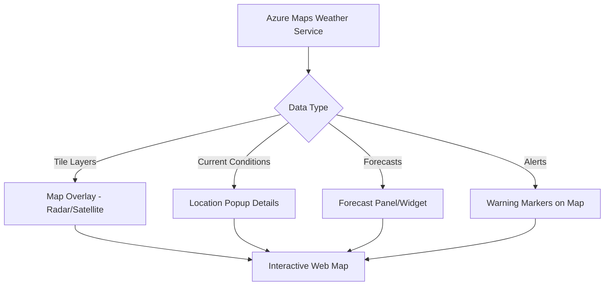

# How to Display Real-Time Weather Overlays on Maps

Author: [nawazdhandala](https://www.github.com/nawazdhandala)

Tags: Azure Maps, Weather Service, Map Overlays, Real-Time Weather, Tile Layers, JavaScript, Geospatial Visualization

Description: Learn how to display real-time weather overlays including radar, satellite, and temperature data on Azure Maps using the Weather Service tile layers.

---

Weather data on a map is one of those features that seems like a nice-to-have until you are building logistics software, agriculture monitoring, event planning tools, or outdoor activity platforms. Then it becomes essential. Azure Maps provides a Weather Service that delivers real-time weather conditions, forecasts, radar imagery, infrared satellite imagery, and weather alerts, all accessible through REST APIs. Radar and infrared satellite imagery can be rendered as tile layers directly on your Azure Maps instance.

This guide shows you how to overlay weather tiles on an Azure Maps web application, query weather conditions for specific locations, and display severe weather alerts.

## What the Weather Service Provides

The Azure Maps Weather Service includes several categories of data:

- **Current conditions** - Temperature, humidity, wind, precipitation, UV index for a specific location
- **Forecasts** - Hourly forecasts up to 10 days ahead, daily forecasts up to 45 days ahead, and quarter-day forecasts up to 15 days ahead
- **Weather tile layers** - Radar and infrared satellite map tiles
- **Severe weather alerts** - Active warnings and advisories for a geographic area
- **Historical weather** - Past weather data for trend analysis
- **Air quality** - Air quality index and pollutant levels

The tile layers are particularly useful because they integrate directly with the Azure Maps Web SDK as overlay layers.

## Step 1: Set Up the Base Map

Start with a basic Azure Maps instance. If you have followed our interactive map guide, you already have this foundation.

```html
<!DOCTYPE html>
<html>
<head>
    <title>Weather Overlays - Azure Maps</title>
    <meta charset="utf-8" />
    <meta name="viewport" content="width=device-width, initial-scale=1" />
    <link rel="stylesheet"
          href="https://atlas.microsoft.com/sdk/javascript/mapcontrol/3/atlas.min.css"
          type="text/css" />
    <script src="https://atlas.microsoft.com/sdk/javascript/mapcontrol/3/atlas.min.js"></script>
    <style>
        html, body { margin: 0; padding: 0; height: 100%; }
        #myMap { width: 100%; height: 100%; }

        /* Weather control panel */
        #weatherPanel {
            position: absolute;
            top: 10px;
            right: 60px;
            background: white;
            padding: 12px;
            border-radius: 8px;
            box-shadow: 0 2px 8px rgba(0,0,0,0.2);
            z-index: 100;
            font-family: Arial, sans-serif;
            font-size: 13px;
        }
        #weatherPanel label {
            display: block;
            margin: 4px 0;
            cursor: pointer;
        }
    </style>
</head>
<body>
    <div id="myMap"></div>
    <div id="weatherPanel">
        <strong>Weather Layers</strong>
        <label><input type="checkbox" id="radar" /> Radar</label>
        <label><input type="checkbox" id="infrared" /> Infrared Satellite</label>
    </div>
    <script src="weather-map.js"></script>
</body>
</html>
```

## Step 2: Add Weather Tile Layers

Weather tiles are standard map tiles that overlay on top of the base map. Azure Maps serves them from a tile URL template that you plug into a `TileLayer`.

```javascript
// weather-map.js - Azure Maps with weather overlay layers

const AZURE_MAPS_KEY = 'your-subscription-key';

// Store references to weather layers so we can toggle them
const weatherLayers = {};

document.addEventListener('DOMContentLoaded', function () {
    const map = new atlas.Map('myMap', {
        center: [-95.7, 37.0],  // Center on the US
        zoom: 4,
        style: 'road',
        authOptions: {
            authType: 'subscriptionKey',
            subscriptionKey: AZURE_MAPS_KEY
        }
    });

    map.events.add('ready', function () {
        // Create weather tile layers (initially hidden)
        createWeatherLayers(map);

        // Set up toggle controls
        setupLayerControls(map);

        // Add a click handler to show weather details at a clicked location
        map.events.add('click', function (e) {
            showWeatherAtLocation(map, e.position);
        });
    });
});

function createWeatherLayers(map) {
    // Radar layer - shows precipitation intensity
    weatherLayers.radar = new atlas.layer.TileLayer({
        tileUrl: `https://atlas.microsoft.com/map/tile?api-version=2024-04-01&tilesetId=microsoft.weather.radar.main&zoom={z}&x={x}&y={y}&tileSize=256&subscription-key=${AZURE_MAPS_KEY}`,
        opacity: 0.7,
        tileSize: 256,
        maxSourceZoom: 15,
        visible: false
    }, 'radar-layer');

    // Infrared satellite layer - shows cloud temperatures
    weatherLayers.infrared = new atlas.layer.TileLayer({
        tileUrl: `https://atlas.microsoft.com/map/tile?api-version=2024-04-01&tilesetId=microsoft.weather.infrared.main&zoom={z}&x={x}&y={y}&tileSize=256&subscription-key=${AZURE_MAPS_KEY}`,
        opacity: 0.6,
        tileSize: 256,
        maxSourceZoom: 15,
        visible: false
    }, 'infrared-layer');

    // Add all layers to the map
    Object.values(weatherLayers).forEach(function (layer) {
        map.layers.add(layer);
    });
}
```

## Step 3: Toggle Layer Visibility

Wire up the checkbox controls to show and hide weather layers.

```javascript
function setupLayerControls(map) {
    // Map checkbox IDs to layer keys
    const layerMap = {
        'radar': 'radar',
        'infrared': 'infrared'
    };

    Object.entries(layerMap).forEach(function ([checkboxId, layerKey]) {
        const checkbox = document.getElementById(checkboxId);
        checkbox.addEventListener('change', function () {
            const layer = weatherLayers[layerKey];
            if (layer) {
                layer.setOptions({ visible: checkbox.checked });
            }
        });
    });
}
```

## Step 4: Show Current Weather Conditions on Click

When a user clicks on the map, fetch the current weather conditions for that location and display them in a popup.

```javascript
// Reusable popup for weather information
const weatherPopup = new atlas.Popup({
    pixelOffset: [0, -10],
    closeButton: true
});

async function showWeatherAtLocation(map, position) {
    // Fetch current conditions from the Weather API
    const lon = position[0];
    const lat = position[1];

    const url = new URL('https://atlas.microsoft.com/weather/currentConditions/json');
    url.searchParams.set('api-version', '1.1');
    url.searchParams.set('subscription-key', AZURE_MAPS_KEY);
    url.searchParams.set('query', `${lat},${lon}`);
    url.searchParams.set('unit', 'imperial');

    try {
        const response = await fetch(url);
        const data = await response.json();

        if (data.results && data.results.length > 0) {
            const weather = data.results[0];

            // Build the popup content
            const content = `
                <div style="padding: 12px; min-width: 200px; font-family: Arial, sans-serif;">
                    <h3 style="margin: 0 0 8px 0;">Current Weather</h3>
                    <div style="display: flex; align-items: center; margin-bottom: 8px;">
                        
                        <div>
                            <div style="font-size: 24px; font-weight: bold;">
                                ${weather.temperature.value}&deg;${weather.temperature.unit}
                            </div>
                            <div style="color: #666;">${weather.phrase}</div>
                        </div>
                    </div>
                    <table style="width: 100%; font-size: 12px; color: #555;">
                        <tr>
                            <td>Feels Like</td>
                            <td style="text-align: right;">${weather.realFeelTemperature.value}&deg;${weather.realFeelTemperature.unit}</td>
                        </tr>
                        <tr>
                            <td>Humidity</td>
                            <td style="text-align: right;">${weather.relativeHumidity}%</td>
                        </tr>
                        <tr>
                            <td>Wind</td>
                            <td style="text-align: right;">${weather.wind.speed.value} ${weather.wind.speed.unit} ${weather.wind.direction.localizedDescription}</td>
                        </tr>
                        <tr>
                            <td>UV Index</td>
                            <td style="text-align: right;">${weather.uvIndex} (${weather.uvIndexPhrase})</td>
                        </tr>
                        <tr>
                            <td>Visibility</td>
                            <td style="text-align: right;">${weather.visibility.value} ${weather.visibility.unit}</td>
                        </tr>
                    </table>
                </div>
            `;

            weatherPopup.setOptions({
                position: position,
                content: content
            });
            weatherPopup.open(map);
        }
    } catch (err) {
        console.error('Failed to fetch weather data:', err);
    }
}
```

## Step 5: Display Severe Weather Alerts

Severe weather alerts are critical for safety-sensitive applications. Query the alerts API and display warnings for the selected location.

```javascript
async function loadSevereWeatherAlerts(map, lat, lon) {
    // Fetch severe weather alerts for a location
    const url = new URL('https://atlas.microsoft.com/weather/severe/alerts/json');
    url.searchParams.set('api-version', '1.1');
    url.searchParams.set('subscription-key', AZURE_MAPS_KEY);
    url.searchParams.set('query', `${lat},${lon}`);

    const response = await fetch(url);
    const data = await response.json();

    if (data.results && data.results.length > 0) {
        // Create a data source for the queried alert location
        const alertSource = new atlas.source.DataSource();
        map.sources.add(alertSource);

        data.results.forEach(function (alert) {
            console.log(`Alert: ${alert.description.localized}`);
            console.log(`Category: ${alert.category}`);
            console.log(`Level: ${alert.level}`);
            console.log(`Source: ${alert.source}`);

            alertSource.add(new atlas.data.Feature(
                new atlas.data.Point([lon, lat]),
                {
                    alertName: alert.description.localized,
                    severity: alert.level,
                    category: alert.category,
                    source: alert.source,
                    areaSummary: alert.alertAreas && alert.alertAreas.length > 0
                        ? alert.alertAreas[0].summary
                        : ''
                }
            ));
        });

        // Add a bubble layer for active alerts with color based on severity
        map.layers.add(new atlas.layer.BubbleLayer(alertSource, null, {
            color: [
                'match',
                ['get', 'severity'],
                'Minor', 'rgba(255, 215, 0, 0.7)',
                'Moderate', 'rgba(255, 140, 0, 0.7)',
                'Severe', 'rgba(255, 0, 0, 0.7)',
                'Extreme', 'rgba(128, 0, 128, 0.7)',
                'rgba(128, 128, 128, 0.7)'
            ],
            radius: 14,
            strokeColor: '#fff',
            strokeWidth: 2
        }));
    }
}
```

## Step 6: Fetch Weather Forecasts

For planning applications, display forecast data alongside the map.

```python
# weather_forecast.py - Fetch multi-day forecasts

import requests

AZURE_MAPS_KEY = "your-subscription-key"

def get_daily_forecast(lat: float, lon: float, days: int = 5) -> list:
    """Get a multi-day weather forecast for a location."""
    url = "https://atlas.microsoft.com/weather/forecast/daily/json"
    params = {
        "api-version": "1.1",
        "subscription-key": AZURE_MAPS_KEY,
        "query": f"{lat},{lon}",
        "duration": days,
        "unit": "imperial"
    }

    response = requests.get(url, params=params)
    response.raise_for_status()
    data = response.json()

    forecasts = []
    for day in data.get("forecasts", []):
        forecasts.append({
            "date": day["date"],
            "minTemp": day["temperature"]["minimum"]["value"],
            "maxTemp": day["temperature"]["maximum"]["value"],
            "dayPhrase": day["day"]["iconPhrase"],
            "nightPhrase": day["night"]["iconPhrase"],
            "precipitationProbability": day["day"].get("precipitationProbability", 0),
            "rainProbability": day["day"].get("rainProbability", 0),
            "snowProbability": day["day"].get("snowProbability", 0),
            "windSpeed": day["day"].get("wind", {}).get("speed", {}).get("value", 0),
            "hoursOfSun": day.get("hoursOfSun", 0)
        })

    return forecasts

def get_hourly_forecast(lat: float, lon: float, hours: int = 12) -> list:
    """Get an hourly weather forecast for a location."""
    url = "https://atlas.microsoft.com/weather/forecast/hourly/json"
    params = {
        "api-version": "1.1",
        "subscription-key": AZURE_MAPS_KEY,
        "query": f"{lat},{lon}",
        "duration": hours,
        "unit": "imperial"
    }

    response = requests.get(url, params=params)
    response.raise_for_status()
    data = response.json()

    forecasts = []
    for hour in data.get("forecasts", []):
        forecasts.append({
            "dateTime": hour["date"],
            "temperature": hour["temperature"]["value"],
            "phrase": hour["iconPhrase"],
            "precipitationProbability": hour.get("precipitationProbability", 0),
            "humidity": hour.get("relativeHumidity", 0),
            "windSpeed": hour.get("wind", {}).get("speed", {}).get("value", 0)
        })

    return forecasts

# Example: Get forecast for Seattle
forecast = get_daily_forecast(47.6062, -122.3321, days=5)
for day in forecast:
    print(f"{day['date']}: {day['minTemp']}-{day['maxTemp']}F, {day['dayPhrase']}, "
          f"Precip: {day['precipitationProbability']}%")
```

## Performance Tips

Weather tile layers can impact map performance, especially on slower connections. Here are some optimization strategies:

**Limit simultaneous layers.** Each visible tile layer adds another set of tile requests. Showing radar plus satellite means two weather tile layers are being downloaded. Give users control over which layers are active.

**Set appropriate opacity.** Weather layers at 100% opacity completely obscure the base map. Use 50-70% opacity so users can still see roads and landmarks underneath.

**Cache tile requests.** The browser automatically caches tile images, but if you are building a dashboard that refreshes frequently, consider a service worker cache with a short TTL (5-10 minutes for radar data).

**Use tile size wisely.** Azure Maps weather tiles support 256x256 and 512x512 tile sizes. Larger tiles reduce the number of requests but increase individual file sizes. For most applications, 256 is fine.

## Weather Data Architecture

Here is how weather data flows through a typical application.


```mermaid
graph TD
    A[Azure Maps Weather Service] --> B{Data Type}
    B -->|Tile Layers| C[Map Overlay - Radar/Satellite]
    B -->|Current Conditions| D[Location Popup Details]
    B -->|Forecasts| E[Forecast Panel/Widget]
    B -->|Alerts| F[Warning Markers on Map]
    C --> G[Interactive Web Map]
    D --> G
    E --> G
    F --> G
```

## Cost Considerations

Weather API calls are billed per transaction. Render tile requests count as transactions too, with Azure Maps billing render tiles in groups of 15 tiles per transaction. When a user pans or zooms the map with a weather layer active, it triggers multiple tile requests. On a typical zoom level showing a metropolitan area, you might load 12-20 tiles per view. Pan to a new area and that is another 12-20 tiles.

For high-traffic applications, monitor your transaction volume and consider caching strategies to reduce costs. Azure Maps Gen2 pricing includes a free monthly tier for testing and development, and Gen1 S0/S1 pricing tiers are deprecated and scheduled for retirement on September 15, 2026.

## Wrapping Up

The Azure Maps Weather Service turns your map into a live weather dashboard. Tile layers give you visual radar and satellite imagery without any backend processing. The conditions and forecast APIs provide detailed data for building location-specific weather panels. And the severe weather alerts API lets you highlight active warnings for selected locations in real time. The combination of visual overlays and data APIs means you can build weather-aware applications that both look informative and provide actionable data to users.
