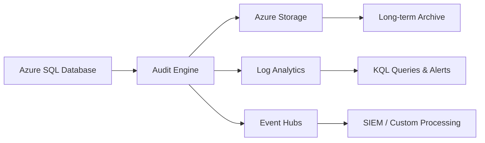

# How to Enable and Configure Auditing in Azure SQL Database

Author: [nawazdhandala](https://www.github.com/nawazdhandala)

Tags: Azure SQL, Auditing, Security, Compliance, Azure, Database, Monitoring

Description: A practical guide to enabling and configuring auditing in Azure SQL Database to track database activities and meet compliance requirements.

---

Database auditing is one of those things that seems optional until you need it. Whether you are dealing with regulatory compliance, investigating a security incident, or just trying to understand who did what and when, having an audit trail is invaluable. Azure SQL Database has a built-in auditing feature that logs database events to Azure Storage, Log Analytics, or Event Hubs.

In this post, I will show you how to enable auditing, configure where audit logs go, choose what events to capture, and query the logs effectively.

## What Does Azure SQL Database Auditing Capture?

The auditing feature tracks database-level and server-level events, including:

- Successful and failed login attempts
- SQL statements executed (SELECT, INSERT, UPDATE, DELETE)
- Stored procedure calls
- Security-related changes (permissions, user creation)
- Schema changes (CREATE, ALTER, DROP)
- Data access patterns

Each audit record includes the timestamp, the principal (user) who performed the action, the SQL statement, the affected object, and the result (success or failure).

## Auditing Architecture

Azure SQL Database auditing can send logs to three destinations:

1. **Azure Storage account**: Audit logs are written as blobs in a container. Good for long-term retention and compliance archives.
2. **Log Analytics workspace**: Audit logs are sent to Azure Monitor Logs where you can query them with KQL (Kusto Query Language). Good for active monitoring and alerting.
3. **Event Hubs**: Audit events are streamed to Azure Event Hubs for real-time processing. Good for SIEM integration and custom event processing pipelines.

You can configure one, two, or all three destinations simultaneously.



## Server-Level vs Database-Level Auditing

You can configure auditing at two levels:

**Server-level auditing**: Applies to all databases on the logical SQL server. This is the recommended approach because it ensures consistent auditing across all databases, including new ones created in the future.

**Database-level auditing**: Applies to a specific database only. Useful when you need different audit configurations for different databases.

If both are enabled, they operate independently. Events are logged to both destinations. This can create duplicate logs, so plan accordingly.

## Enabling Server-Level Auditing via Azure Portal

### Step 1: Navigate to Your SQL Server

Go to the Azure Portal and open your logical SQL server.

### Step 2: Open Auditing Settings

In the left menu, under "Security", click "Auditing".

### Step 3: Enable Auditing

Toggle "Enable Azure SQL Auditing" to ON.

### Step 4: Choose Audit Log Destinations

Select one or more destinations:

**Storage**: Click the Storage checkbox, then click "Configure". Select an existing storage account or create a new one. Configure the retention period (0 for unlimited, or specify days). Choose the storage access key to use for authentication, or use managed identity.

**Log Analytics**: Click the Log Analytics checkbox, then select your workspace. If you do not have one, create a Log Analytics workspace first.

**Event Hub**: Click the Event Hub checkbox, then configure your Event Hub namespace and hub name.

### Step 5: Save

Click "Save" to apply the configuration. Auditing begins immediately for all databases on the server.

## Enabling Auditing via Azure CLI

Here is how to enable server-level auditing to a storage account:

```bash
# Enable server-level auditing to a storage account
az sql server audit-policy update \
    --resource-group myResourceGroup \
    --server myserver \
    --state Enabled \
    --storage-account mystorageaccount \
    --retention-days 90
```

To enable auditing to Log Analytics:

```bash
# Enable server-level auditing to Log Analytics
az sql server audit-policy update \
    --resource-group myResourceGroup \
    --server myserver \
    --state Enabled \
    --log-analytics-target-state Enabled \
    --log-analytics-workspace-resource-id "/subscriptions/{sub-id}/resourceGroups/{rg}/providers/Microsoft.OperationalInsights/workspaces/{workspace-name}"
```

## Enabling Auditing via PowerShell

The PowerShell approach provides the same functionality:

```powershell
# Enable server-level auditing with storage and Log Analytics
Set-AzSqlServerAudit `
    -ResourceGroupName "myResourceGroup" `
    -ServerName "myserver" `
    -StorageAccountResourceId "/subscriptions/{sub-id}/resourceGroups/{rg}/providers/Microsoft.Storage/storageAccounts/{account}" `
    -LogAnalyticsTargetState Enabled `
    -WorkspaceResourceId "/subscriptions/{sub-id}/resourceGroups/{rg}/providers/Microsoft.OperationalInsights/workspaces/{workspace}" `
    -RetentionInDays 90
```

## Configuring Audit Action Groups

By default, Azure SQL Database audits a predefined set of action groups. You can customize which groups to audit based on your requirements.

The most commonly used action groups include:

- **BATCH_COMPLETED_GROUP**: Audits all SQL batches that complete execution
- **SUCCESSFUL_DATABASE_AUTHENTICATION_GROUP**: Logs successful logins
- **FAILED_DATABASE_AUTHENTICATION_GROUP**: Logs failed login attempts
- **DATABASE_PERMISSION_CHANGE_GROUP**: Tracks permission changes
- **DATABASE_OBJECT_CHANGE_GROUP**: Tracks schema changes (CREATE, ALTER, DROP)
- **DATABASE_PRINCIPAL_CHANGE_GROUP**: Tracks user and role changes
- **SCHEMA_OBJECT_ACCESS_GROUP**: Tracks data access (SELECT, INSERT, UPDATE, DELETE)

To configure specific action groups via T-SQL:

```sql
-- Create a database-level audit specification
-- First, create the server audit (if using database-level auditing)
CREATE DATABASE AUDIT SPECIFICATION [AuditDataAccess]
FOR SERVER AUDIT [ServerAuditName]
ADD (SELECT ON SCHEMA::[dbo] BY [public]),
ADD (INSERT ON SCHEMA::[dbo] BY [public]),
ADD (UPDATE ON SCHEMA::[dbo] BY [public]),
ADD (DELETE ON SCHEMA::[dbo] BY [public])
WITH (STATE = ON);
```

## Querying Audit Logs in Log Analytics

If you send audit logs to Log Analytics, you can query them using KQL. Here are some practical queries.

Find all failed login attempts in the last 24 hours:

```
AzureDiagnostics
| where ResourceProvider == "MICROSOFT.SQL"
| where Category == "SQLSecurityAuditEvents"
| where action_name_s == "DATABASE AUTHENTICATION FAILED"
| where TimeGenerated > ago(24h)
| project TimeGenerated, server_principal_name_s, client_ip_s, database_name_s
| order by TimeGenerated desc
```

Find all schema changes:

```
AzureDiagnostics
| where ResourceProvider == "MICROSOFT.SQL"
| where Category == "SQLSecurityAuditEvents"
| where action_name_s in ("CREATE", "ALTER", "DROP")
| where TimeGenerated > ago(7d)
| project TimeGenerated, server_principal_name_s, action_name_s, object_name_s, statement_s
| order by TimeGenerated desc
```

Find the most active users:

```
AzureDiagnostics
| where ResourceProvider == "MICROSOFT.SQL"
| where Category == "SQLSecurityAuditEvents"
| where TimeGenerated > ago(24h)
| summarize EventCount = count() by server_principal_name_s
| order by EventCount desc
| take 10
```

## Querying Audit Logs in Storage

If you use Azure Storage as the destination, audit logs are stored as extended events files (.xel). You can download and view them using SQL Server Management Studio (SSMS) or read them programmatically.

In the Azure Portal, navigate to your database, click "Auditing" in the left menu, and then click "View audit logs". This opens a viewer where you can filter by date range, user, statement type, and more.

## Audit Log Retention

Retention settings differ by destination:

- **Storage**: You configure retention in days. Logs older than the retention period are automatically deleted. Set to 0 for unlimited retention.
- **Log Analytics**: Retention is configured at the workspace level. Default is 30 days, configurable up to 730 days. For longer retention, export logs to Storage.
- **Event Hubs**: Retention depends on your Event Hub configuration.

For compliance purposes, I recommend storing audit logs for at least 1 year. Many regulations require longer periods (e.g., PCI DSS requires 1 year, SOX requires 7 years).

## Performance Impact

Auditing has a small performance overhead, typically less than 5%. The impact depends on the volume of events being audited and the destination:

- Storage has minimal latency impact since writes are asynchronous
- Log Analytics adds slightly more overhead due to the ingestion pipeline
- Event Hubs is designed for high throughput and adds minimal latency

For most production workloads, the performance impact is negligible and well worth the security benefits.

## Best Practices

**Enable server-level auditing.** This ensures all databases are audited consistently, including databases created in the future.

**Use Log Analytics for active monitoring.** Send logs to Log Analytics so you can query them in near real-time and set up alerts for suspicious activity.

**Use Storage for long-term retention.** Storage is the cheapest option for retaining audit logs over extended periods.

**Focus on failed authentication.** Failed login attempts are one of the most important things to monitor. A spike in failures could indicate a brute-force attack.

**Audit schema changes.** Track CREATE, ALTER, and DROP statements to maintain a record of how your database structure evolves.

**Set up alerts.** Configure Azure Monitor alerts for critical events like multiple failed logins, permission changes, or after-hours data access.

**Review logs regularly.** An audit trail is only useful if someone actually looks at it. Schedule regular reviews, at least monthly, to look for anomalies.

## Summary

Azure SQL Database auditing gives you visibility into who is accessing your data and what they are doing with it. Enable it at the server level, send logs to Log Analytics for querying and alerting, and archive them in Storage for long-term compliance. The setup takes just a few minutes and the performance impact is minimal, making it one of the easiest security improvements you can make.
